# **Obiettivi del modulo 2**

## **Lezione 1: Liste**

---

### **1. Introduzione**

Con questa lezione inizia il nostro viaggio nel primo tipo di dato concreto del corso: **la lista**.  
Dopo aver studiato nel Modulo 1 i formalismi astratti e le basi logiche, ora passiamo a una struttura che **mette in pratica quei concetti**.

Le liste rappresentano sequenze di elementi dello stesso tipo, nelle quali è sempre possibile **aggiungere o togliere elementi**.  
Sono fondamentali perché:

- permettono di memorizzare dati in modo **dinamico**;
    
- consentono **inserimenti e cancellazioni** ovunque nella sequenza;
    
- rendono esplicita la relazione di **successione** tra elementi.
    

#### **Caratteristiche principali**

- Accesso diretto solo al **primo** o **ultimo** elemento
    
- Accesso agli altri elementi solo tramite **scansione sequenziale**
    

In altre parole, la lista è come una **catena**: per raggiungere un nodo, bisogna percorrere quelli precedenti.

---

### **2. Specifica sintattica del tipo di dato lista**

Definiamo ora formalmente le operazioni fondamentali della lista in linguaggio astratto.

```text
crealista:           () → lista

listavuota:          (lista) → booleano


Operatori di Navigazione:

primolista:          (lista) → posizione
ultimolista:         (lista) → posizione
succlista:           (posizione, lista) → posizione
predlista:           (posizione, lista) → posizione


finelista:           (posizione, lista) → booleano

leggilista:          (posizione, lista) → tipoelem

scrivilista:         (tipoelem, posizione, lista) → lista

inslista:            (tipoelem, posizione, lista) → lista

canclista:           (posizione, lista) → lista
```

**Notazione:**

- `L` = lista di elementi $a_i$ di tipo `tipoelem`
    
- `p`, `q` = posizioni relative agli elementi $a_i$ e $a_j$
    
- `b` = valore booleano
    
- `Λ` = lista vuota
    

---

### **3. Specifica semantica**

La semantica definisce cosa fa ogni operazione, indicando **precondizioni** e **postcondizioni**.

```text
crealista() = L'
post: L' = Λ
```

```text
listavuota(L) = b
post: b è vero sse L = Λ
```

```text
primolista(L) = p
post: p = pos₁
```

```text
ultimolista(L) = p
post: p = posₙ
```

```text
succlista(p, L) = q
pre: L = a₁, …, aₙ; p = posᵢ, 1 ≤ i ≤ n
post: q = posᵢ₊₁
```

```text
predlista(p, L) = q
pre: L = a₁, …, aₙ; p = posᵢ, 1 ≤ i ≤ n
post: q = posᵢ₋₁
```

```text
finelista(p, L) = b
pre: L = a₁, …, aₙ; p = posᵢ, 0 ≤ i ≤ n + 1
post: b è vero sse p = pos₀ o posₙ₊₁
```

```text
leggilista(p, L) = a
pre: L = a₁, …, aₙ; p = posᵢ, 1 ≤ i ≤ n
post: a = aᵢ
```

```text
scrivilista(a, p, L) = L'
pre: L = a₁, …, aₙ; p = posᵢ, 1 ≤ i ≤ n
post: L' = a₁, …, aᵢ₋₁, a, aᵢ₊₁, …, aₙ
```


Concentriamoci su questo:

```text

inslista(a, p, L) = L'

pre: L = a₁, …, aₙ; 
	p = posᵢ, 1 ≤ i ≤ n + 1

```

post:

$$\begin{cases}
    se \ 1 ≤ i ≤ n    \ \ \  → L' = a₁, …, aᵢ₋₁, a, aᵢ, …, aₙ \\\\
    se \ i = 0        \ \ \ \ \ \ \ \ \ \ \  →  L' = a, a₁, …, aₙ \\\\
    se \ i = n + 1    \ \ \ \  → L' = a₁, …, aₙ, a
\end{cases}
$$

Tradotto:
- Nel primo caso in cui l'elemento si vuole inserire internamente, prenderà il posto dell'i-esimo elemento che verrà "shiftato" a destra di 1;
- Nel secondo caso viene messo in testa ergo gli altri sono tutti shiftati di una posizione a destra;
- Analogamente se viene inserito in coda shiftano tutti a sinistra;

```text
canclista(p, L) = L'
pre: L = a₁, …, aₙ; p = posᵢ, 1 ≤ i ≤ n
post: L' = a₁, …, aᵢ₋₁, aᵢ₊₁, …, aₙ
```

> In sintesi, la specifica formale ci dice **cosa deve accadere** logicamente ogni volta che la lista viene modificata.

---

### **4. Realizzazione con puntatori**

#### **Idea di base**

Ogni elemento della lista è memorizzato in una **cella** (record) che contiene:

1. il **valore** dell’elemento;
    
2. l’**indirizzo (puntatore)** della cella successiva.
    

La prima cella è puntata da una variabile `L` di tipo puntatore, mentre l’ultima contiene un valore speciale `NULL`.

#### **Estensioni possibili**

- **Sentinella:** una cella aggiuntiva che delimita gli estremi.
    
- **Bidirezionalità:** ogni cella punta sia alla successiva che alla precedente.
    
- **Circolarità:** l’ultima cella punta direttamente alla prima.
    

---

#### **Esempi grafici**

##### **Lista monodirezionale**


$$  
L \longrightarrow a_1 \longrightarrow a_2 \longrightarrow \dots \longrightarrow a_n \longrightarrow \text{NULL}  
$$

---

##### **Lista bidirezionale**


$$  
a_1 \longleftrightarrow a_2 \longleftrightarrow \dots \longleftrightarrow a_n  
$$

---

##### **Lista bidirezionale circolare**

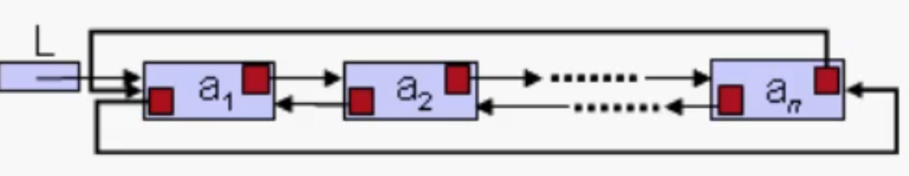

$$  
a_1 \longleftrightarrow a_2 \longleftrightarrow \dots \longleftrightarrow a_n \circlearrowleft  
$$

---

##### **Lista monodirezionale con sentinella**

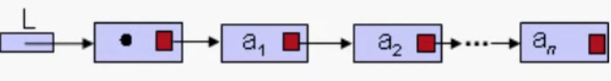

Viene essenzialmente aggiunta una cella vuota che ci permette di utilizzarla come sentinella per capire quando una lista, ad esempio, è vuota;

Nel seguito, a meno che non sia specificato diversamente, useremo sempre la cosiddetta:

#### **Lista bidirezionale con sentinella**

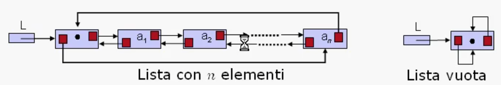

- Complessità degli operatori: $O(1)$
    
- La sentinella semplifica il codice, al costo di un piccolo spreco di memoria (una cella in più).
    
- Le posizioni speciali `pos₀` e `posₙ₊₁` coincidono con l’indirizzo della sentinella:
		$pos_0 = pos_{n+1} = indirizzo\_sentinella$
    

---

**Definizione in C:**

```c
typedef struct _cella {
  tipoelem elemento;
  struct _cella *next, *prev;
} cella;

typedef cella posizione, lista;
typedef short boolean;
```

---

##### **Esempio: inserimento**

```c
void inslista(tipoelem a, posizione *p) {
  
  posizione *q;
  q = malloc(sizeof(cella));
  q->elemento = a; // popolo la cella col dato passato
  
  q->prev = p->prev; // step 1
  
  q->next = p; // step 2
  
  p->prev->next = q; // step 3
  
  p->prev = q; // step 4
}
```


Prima dello step 1 siamo nella situazione sopra illustrata.

Ora, per concretizzare l'inserimento della cella così inizializzata, dobbiamo fare collimare (Coincidere, corrispondere, combaciare esattamente) tutti i puntatori che risentono dell'inserimento.
Tali puntatori sono, in ordine da sx a dx:

a) Il puntatore a next della cella precedente;
b) Entrambi quelli della cella da inserire;
c) Il puntatore a prev della cella in posizione i/p che dir si voglia che a fine inserimento diventa "la successiva";

Innanzitutto facciamo collimare i due puntatori della nuova cella, ovvero Step 1 e 2:

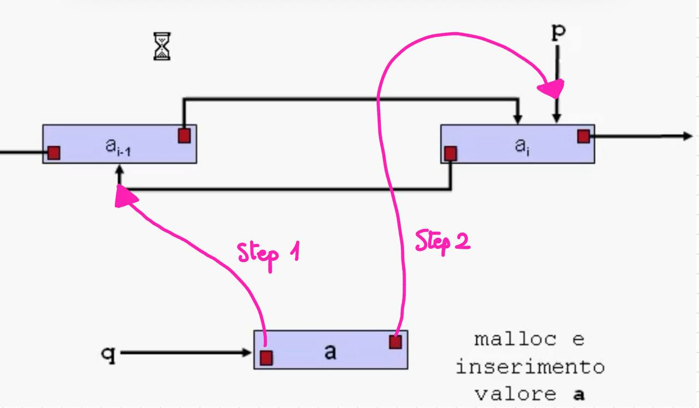

Dopodiché aggiorniamo il next del precedente, ovvero Step 3, e il precedente del nodo puntato da p, ovvero Step 4:

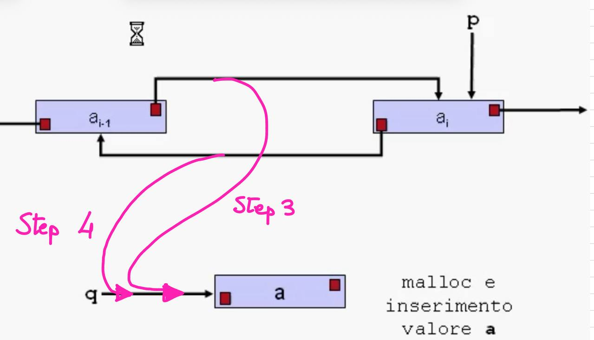

IN SINTESI:
Questo frammento mostra l’inserimento di un nuovo nodo _prima_ della posizione `p`.  
L’uso della sentinella elimina la necessità di gestire casi speciali per l’inizio e la fine della lista.

---

##### **Esempio: cancellazione**

Per poter cancellare con successo un nodo della lista, bisogna prendere delle accortezze, in quanto la nostra specifica semantica vuole che dopo la cancellazione la posizione p vada a puntare verso la nuova posizione relativa i-esima. Tale posizione è dunque la ex i+1-esima.
**Vogliamo modificare il puntatore che ci è stato passato** (non solo il contenuto che punta).
Quindi serve un doppio puntatore.
In C:

- se passiamo un puntatore semplice (`posizione *p`), possiamo modificare il **nodo a cui punta**,  
    ma **non possiamo cambiare dove punta `p`** stesso nel chiamante.
    
- se passiamo un **puntatore a puntatore (`posizione **p`)**, possiamo anche cambiare _il valore di `p` nel chiamante_, cioè farlo puntare altrove.

Allora in questo caso, dereferenziamo p, ovvero vi accediamo e tutte le info di quella cella vengono memorizzate in q, così che p possa essere aggiornata post-cancellazione e q possa venire rimossa in quanto ausiliaria.

```c
void canclista(posizione **p) {
  posizione *q;
  q = *p;                   // 0: q diventa il nodo da cancellare
  q->prev->next = q->next;  // 1: collega il precedente col successivo
  q->next->prev = q->prev;  // 2: collega il successivo col precedente
  *p = q->next;             // 3: sposta *p (nel chiamante!) al nodo successivo
  free(q);                  // libera la memoria
}
```


La figura soprastante è la situazione iniziale.
Lo Step 1 e 2 comportano la modifica dei collegamenti:

 1) Facciamo puntare il successivo del nodo precedente al nodo successivo:
 
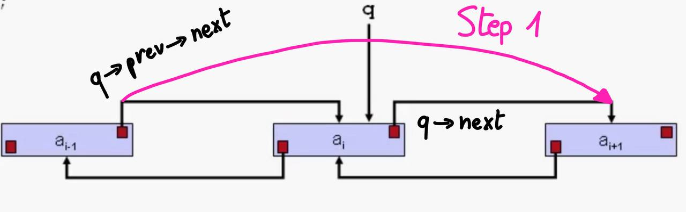

2) E poi facciamo puntare il precedente del nodo successivo al nodo precedente:

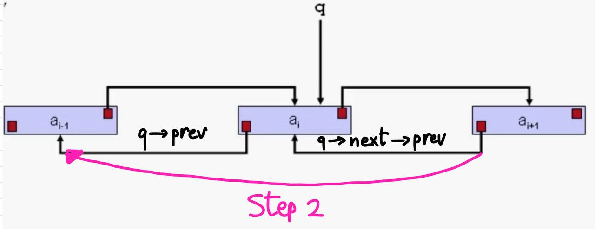

Con lo Step 3 aggiorniamo il nodo puntato da p, che non è più quello centrale ma quello a dx, ovvero il next di q.
Infine possiamo liberare la memoria con una free...

Fatto sta, che alla fine:
L’elemento puntato viene eliminato e i collegamenti aggiornati in modo costante ($O(1)$).

---

### **5. Realizzazione con cursori**

#### **Motivazione**

Quando il linguaggio di programmazione **non fornisce il tipo puntatore**, possiamo simularlo tramite **cursori**, ossia indici interi che rappresentano la posizione in un vettore.

Tale vettore assolve il ruolo di simulatore della memoria disponibile per i puntatori.
Ergo, un cursore emula un puntatore.

Il vettore, chiamato spazio, è tale che: 
– contiene tutte le liste, ciascuna individuata da un proprio cursore iniziale;
– contiene tutte le celle libere, organizzate anch’esse in una lista, detta $listalibera$.

---

Supponiamo ad esempio che il vettore contenga una prima lista, come indicata in figura, che ha origine nel cursore 1, e che quindi funge da sentinella non contenente alcun elemento:


Guardiamo poi la "cella" successiva, ovvero quella con cursore 7:


E procediamo guardando al cursore in posizione 4:

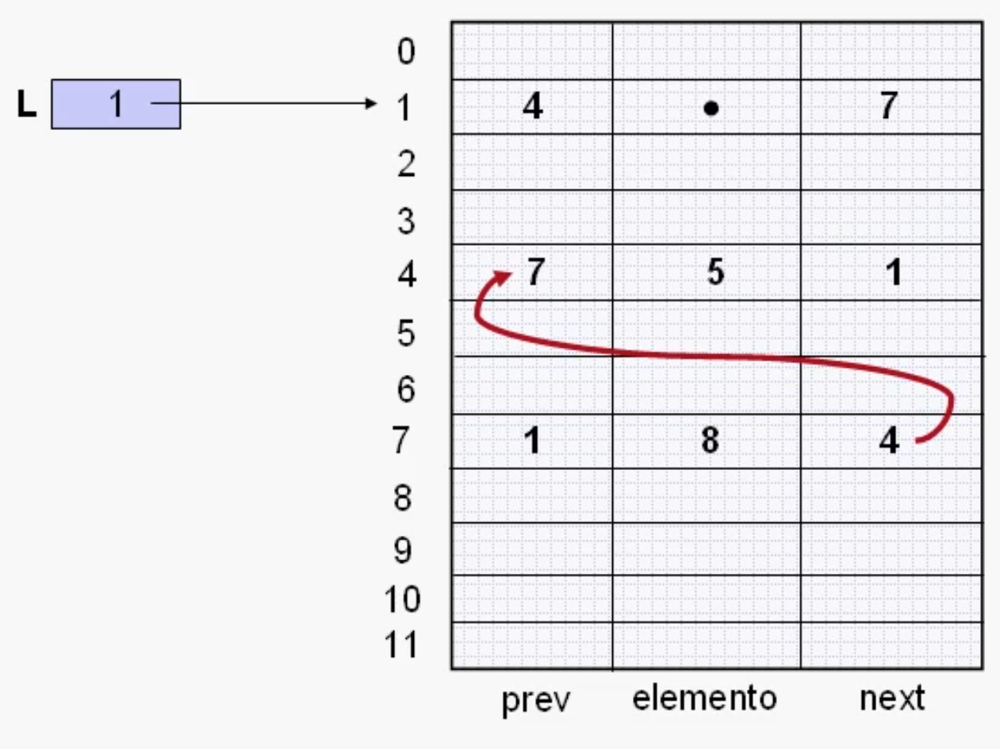

Se procediamo, torniamo all'inizio della lista.
Da qui si evince che la lista L è così composta:

$L = 8, 5$

Andiamo oltre, vedendo un'altra lista di nome $M$ contenuta nel vettore $spazio$ e che è indicata/ha sentinella nel $cursore \ 3$.


Infine possiamo osservare che le celle libere del vettore sono organizzabili nella già anticipata lista libera:

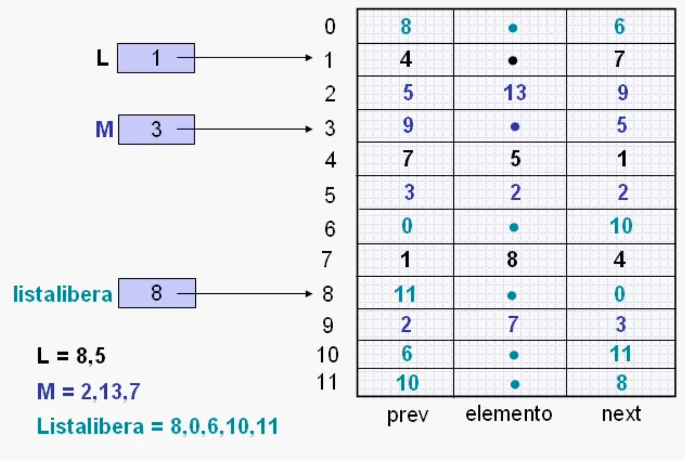

Detto ciò, è buona prassi tentare di implementare in C quanto detto...

---

#### **Implementazione in linguaggio C**

Partiamo col definire il $vettore \ spazio$:

Si noti che la struttura rimane invariata: a cambiare è il tipo di prev e next, che essendo cursori saranno alias di int.

```c
#define MAXL 10
typedef int lista, posizione;

typedef struct _cella {
  posizione prev, next;
  tipoelem elemento;
} cella;

lista listalibera;
cella spazio[MAXL];
```

#### **Funzione di inizializzazione**

```c
void inizializza() {
  int i; // indice di scorrimento
  listalibera = 0; // la lista libera inizia dalla cella 0
  spazio[0].next = 1; // il successivo di 0 è 1
  spazio[0].prev = MAXL - 1; // il precedente di 0 è l'ultimo elemento
  
  for (i = 1; i < MAXL; i++) { // per ogni cella dello spazio
    // che non sia la prima o l'ultima, otteniamo:
    spazio[i].next = (i + 1) % MAXL; // il successivo è (i+1) mod MAXL. Il modulo      serve per far sì che l'ultimo elemento punti a 0 e che dunque non ci siano né      buchi né sforamenti dell'array.
    spazio[i].prev = (i - 1) % MAXL; // Viceversa per il precedente
  }
}
```

---

Dopo l'inizializzazione, supponiamo di riempire i vari campi elemento a piacimento. Otterremo qualcosa di simile come in figura, e siamo pronti a procedere con la prossima funzione implementativa:


#### **Procedura di spostamento**

Obiettivo: **togliere la cella `*p` dalla sua posizione** e **reinserirla subito prima di `*q`**, aggiornando anche i due cursori nel chiamante.
Ci aspettiamo, come situazione finale dunque:


```c

void sposta(posizione *p, posizione *q) {
  posizione t;
  t = spazio[*p].next;


  spazio[spazio[*p].prev].next = spazio[*p].next;
  spazio[spazio[*p].next].prev = spazio[*p].prev;
  spazio[*p].prev = spazio[*q].prev;
  spazio[spazio[*q].prev].next = *p;
  spazio[*p].next = *q;
  spazio[*q].prev = *p;

  *q = *p;
  *p = t;
}
```

Di seguito una spiegazione dettagliata riga per riga:

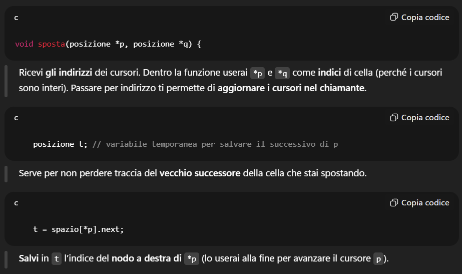


---


---

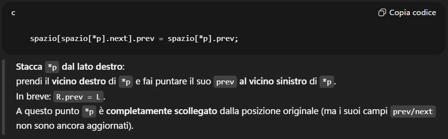

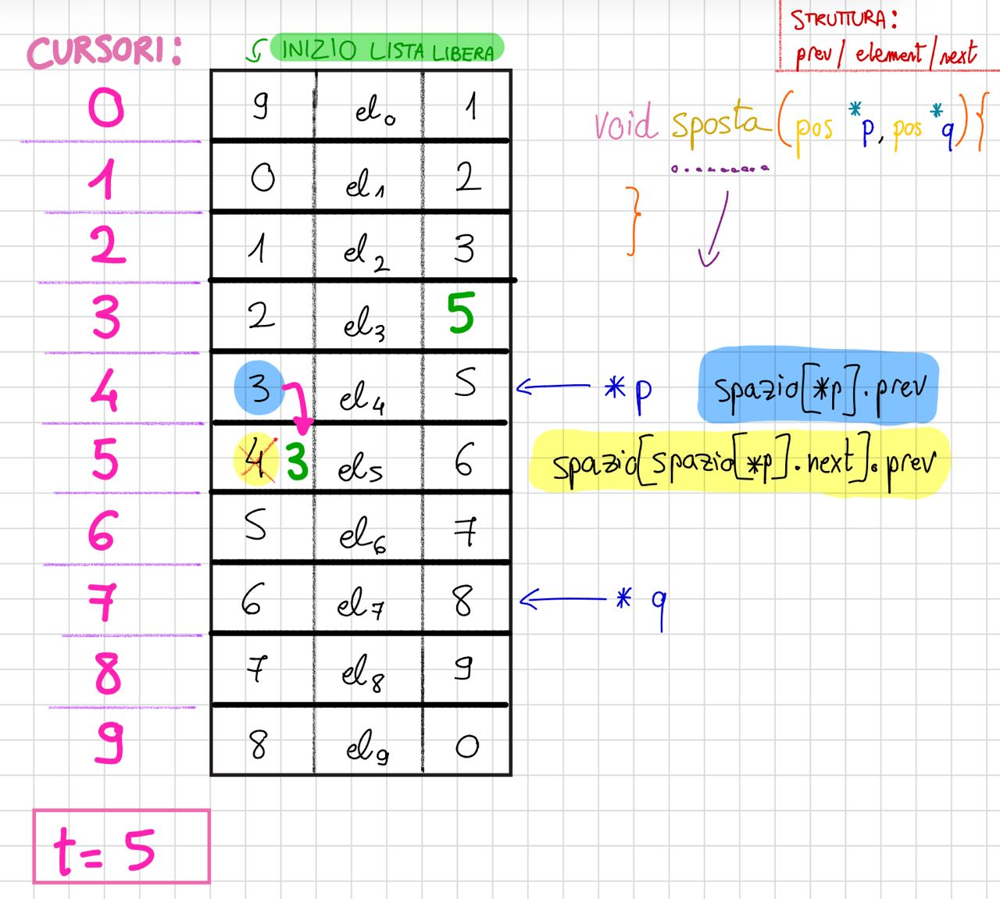

---

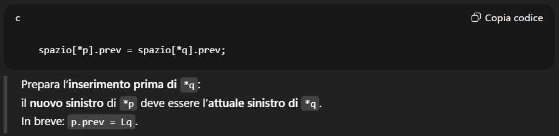


---


---


---

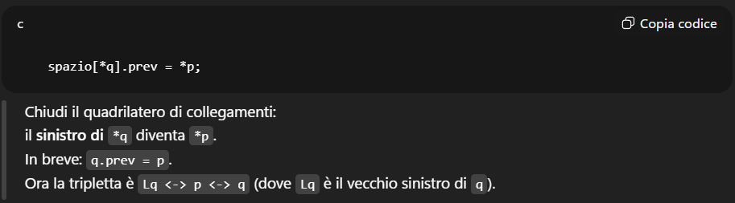

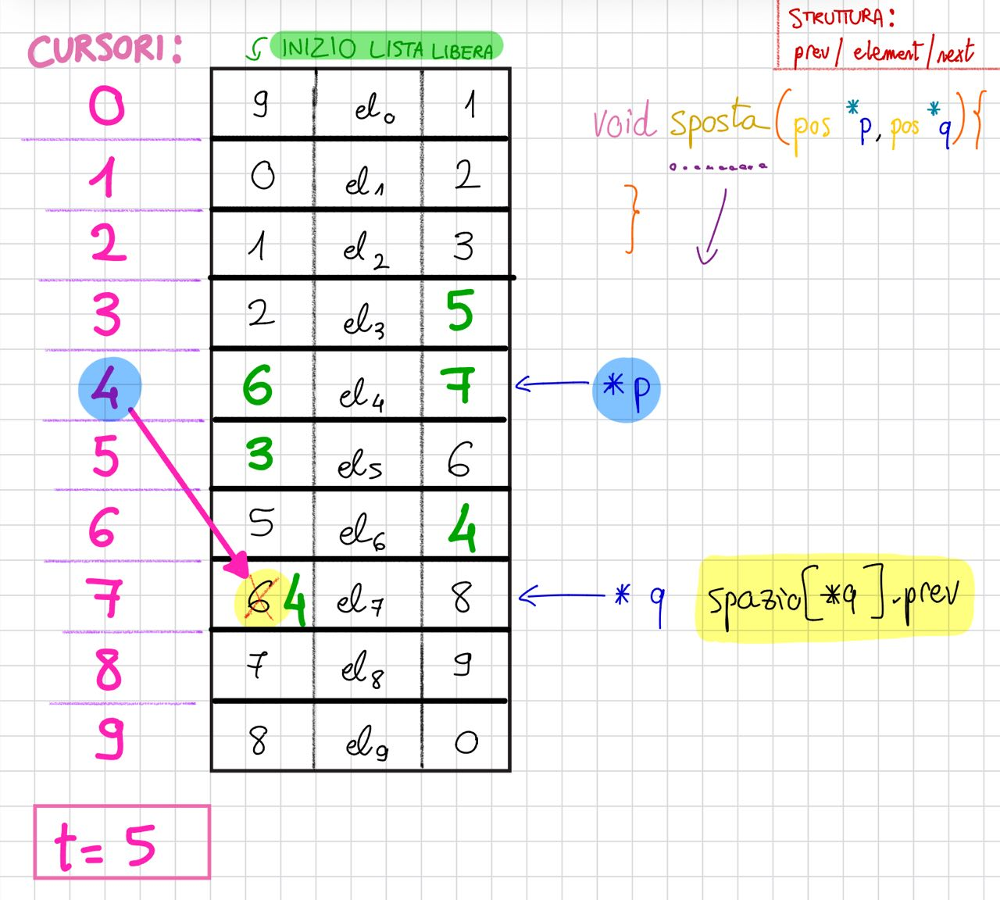

---

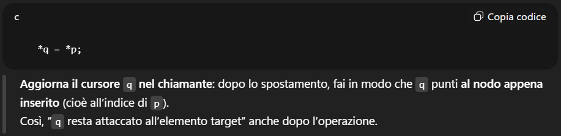

Ergo non punta più al nodo 7 bensì al 4:


---


---

Quindi la situazione finale è la seguente:

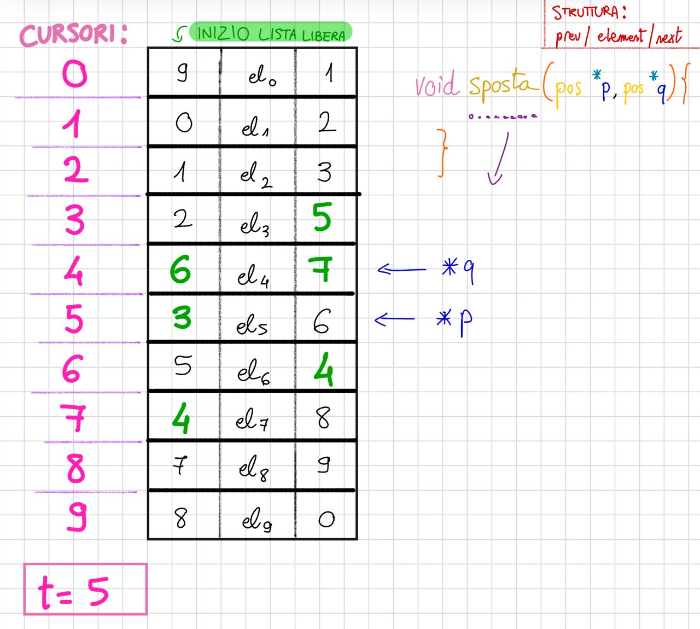

---

##### **Attenzione: 

Aggiornare `*p` e `*q` è una _scelta di policy_**, non un vincolo tecnico.  
La funzione può essere progettata in modi diversi a seconda di come vuoi controllare il flusso.

---

##### **3 modi equivalenti (scegli quello che ti serve)**

1. **“Pura” (nessun aggiornamento di cursori)**
2. La funzione fa **solo i relink** `prev/next` in `O(1)` e basta.
3. Decidi tu, **fuori**, come muovere `p` e `q`.

```c
void sposta_idx(posizione p, posizione q) {
    // sposta la cella p prima della cella q (entrambi indici, by-value)
    posizione L = spazio[p].prev, R = spazio[p].next;
    // stacca p
    spazio[L].next = R;
    spazio[R].prev = L;
    // inserisci p prima di q
    posizione Lq = spazio[q].prev;
    spazio[p].prev = Lq;
    spazio[p].next = q;
    spazio[Lq].next = p;
    spazio[q].prev = p;
}
// uso:
sposta_idx(p, q);
// poi decidi tu: p = next_salvato; q = p; oppure altro…
```

---

2. **“Con esito” (ritorna cosa _potresti_ voler fare)**
    
- La funzione fa i relink e **ti restituisce** valori utili per cursori; tu **puoi** usarli o ignorarli.
    
```c
typedef struct { posizione next_p; posizione new_q; } EsitoSposta;

EsitoSposta sposta_esito(posizione p, posizione q) {
    posizione t = spazio[p].next;
    sposta_idx(p, q);
    return (EsitoSposta){ .next_p = t, .new_q = p };
}
// uso:
EsitoSposta e = sposta_esito(p, q);
// se vuoi iterare in avanti:
p = e.next_p;  // opzionale
q = e.new_q;   // opzionale
```

---

3. **“Parametrizzata” (decidi con flag)**
    
- Stesso prototipo originale, ma **decidi tu** se aggiornare `p` e/o `q`.
    
```c
#include <stdbool.h>

void sposta_ctrl(posizione *p, posizione *q, bool upd_p, bool upd_q) {
    posizione t = spazio[*p].next;
    sposta_idx(*p, *q);
    if (upd_q) *q = *p;   // fai seguire q al nodo spostato
    if (upd_p) *p = t;    // fai avanzare p al vecchio successore
}
```

---
##### **Quando ha senso aggiornare (pattern tipici)

- **Rimozione → lista libera:** `upd_p = true` (per continuare a scorrere la lista sorgente), `upd_q = true` (q “segue” l’ultimo inserito in free-list).
    
- **Inserzione da free-list → lista dati:** spesso `upd_p = true` (p scorre la free-list), `upd_q = true` (q resta vicino al punto di inserzione).
    
- **Spostamento singolo/isolato:** **nessun aggiornamento**; gestisci tu dopo la chiamata.
    
##### **Morale**

- Gli aggiornamenti di `*p` e `*q` **non sono necessari** alla correttezza dei link; servono solo a **comodità di chi itera**.
    
- Se “non vuoi mantenere quel controllo logico”, **non aggiornarli** in `sposta()` e muovi i cursori **esplicitamente** nel chiamante come preferisci.

---

### **6. Osservazioni finali**

#### **Equivalenza cursori ↔ puntatori**

|Operazione con puntatori|Equivalente con cursori|
|---|---|
|`p->next`|`spazio[p].next`|
|`p->next->prev`|`spazio[spazio[p].next].prev`|

#### **Vantaggi e svantaggi**

- I **cursori** permettono di simulare puntatori in linguaggi che non li supportano (Fortran).
    
##### ⚙️ **Perché gli operatori restano efficienti ($O(1)$)**

Gli **operatori di base** — come:

- inserire un nodo tra due altri nodi,
- cancellare un nodo,
- spostare un nodo da una lista a un’altra —

agiscono **solo modificando pochi numeri interi (`prev` e `next`)**.

Esempio:

```c
spazio[a].next = b;
spazio[b].prev = a;
```

Queste operazioni:

- non richiedono cicli,
- non fanno scansioni,
- non dipendono dalla lunghezza della lista.
    
➡️ Quindi hanno **costo costante $O(1)$**,  
esattamente come se avessi usato puntatori veri (`p->next = q; q->prev = p;`).

---

##### 🧠 **Ma attenzione: l’accesso e la ricerca sono lineari ($O(n)$)**

Questo è il punto chiave.

Anche se le operazioni locali (`insert`, `delete`, `sposta`) sono costanti,  
**trovare un elemento** o **raggiungere la sua posizione** richiede di **scorrere la lista**.

Esempio:  
Vuoi cercare l’elemento che vale `42`.

```c
posizione p = inizio;
while (p != fine && spazio[p].elemento != 42) {
    p = spazio[p].next;
}
```

Questo ciclo passa da una cella all’altra:

- nel caso migliore → lo trova subito ($O(1)$),
    
- nel caso medio/peggiore → deve attraversare tutta la lista ($O(n)$).
    

💬 In altre parole:

> anche se puoi “tagliare e incollare” nodi in $O(1)$,  
> per _trovare_ dove tagliare o incollare devi comunque camminare uno per uno.

---

##### 📉 **Perché non puoi accedere direttamente a un elemento**

Nel C con **puntatori veri**, puoi avere un riferimento diretto:

```c
p = malloc(sizeof(cella));   // hai l’indirizzo reale
```

Nel modello con **cursori**, invece, l’unica cosa che hai è **l’indice numerico** di una cella nel vettore `spazio[]`.  
E se non sai già quale sia, non puoi “saltarci” con un indirizzo: devi **scorrere tutta la lista** per trovarlo.

---

## ⚖️ **5. Riassunto concettuale**

|Aspetto|Con cursori|Con puntatori|
|:--|:--|:--|
|Struttura dati|Vettore di celle con indici `prev/next`|Celle allocate dinamicamente con `next/prev` come indirizzi|
|Inserimento / cancellazione|$O(1)$|$O(1)$|
|Spostamento di nodi|$O(1)$|$O(1)$|
|Accesso a un elemento per posizione|$O(n)$|$O(n)$|
|Allocazione dinamica|Simulata (tramite lista libera)|Vera (malloc / free)|
|Vantaggio|Funziona anche in linguaggi senza puntatori, evita problemi di memoria|Accesso diretto alla memoria|
|Svantaggio|Devi gestire a mano la lista libera; ricerca lenta|Maggior complessità nella gestione di allocazioni|

> I **cursori** sono un trucco per fare finta di avere puntatori.  
> Tutto quello che riguarda la **topologia** della lista (chi è vicino a chi) funziona in tempo costante.  
> Ma tutto quello che riguarda **il contenuto o la posizione** (chi contiene cosa o dove si trova un valore) richiede comunque di scorrere uno a uno: ed è lì che paghi $O(n)$.

---

### **7. Sintesi concettuale**

- Le **liste** sono la prima vera struttura dati del corso.
    
- Sono la base per pile, code e molte altre organizzazioni più complesse.
    
- Abbiamo visto come possono essere implementate **con puntatori** o **con cursori**.
    
- Gli operatori principali operano in **tempo costante** $O(1)$.
    
- L’accesso sequenziale resta la loro principale limitazione.
    

---

> Le liste incarnano l’idea stessa di “ordine dinamico”: dati che vivono, si muovono e si collegano.  
> Da qui in poi, ogni nuova struttura sarà solo un’evoluzione di questa semplice ma geniale intuizione.