## **Lezione 2: Programmare con le liste**

---

### **1. Obiettivo della lezione**

Questa lezione mostra come **utilizzare gli operatori fondamentali delle liste** per risolvere un problema computazionale concreto.  
Riprendendo lo schema introdotto nel Modulo 1, ora applichiamo i concetti teorici al tipo di dato **lista**.

---

### **2. Differenze tra specifica sintattica/semantica

Di seguito allego gli screenshots della scorsa lezione riguardanti l'idea implementativa e di specifica che avevamo suggerito per la lista:

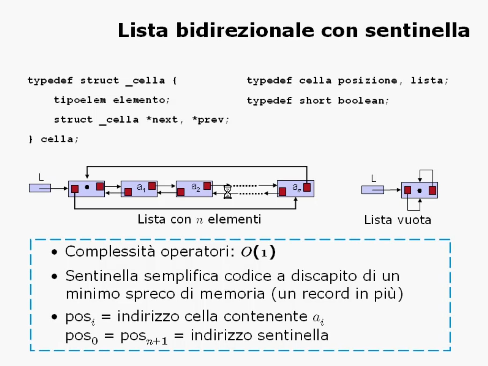

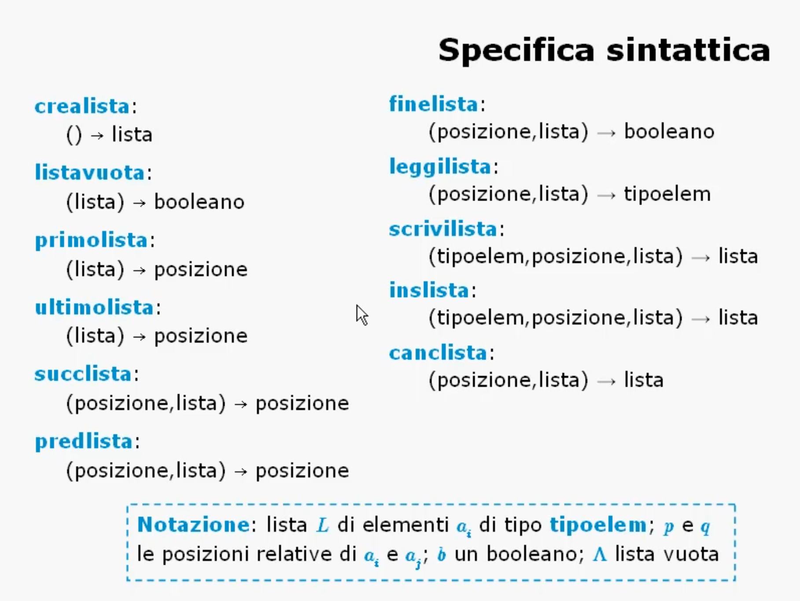

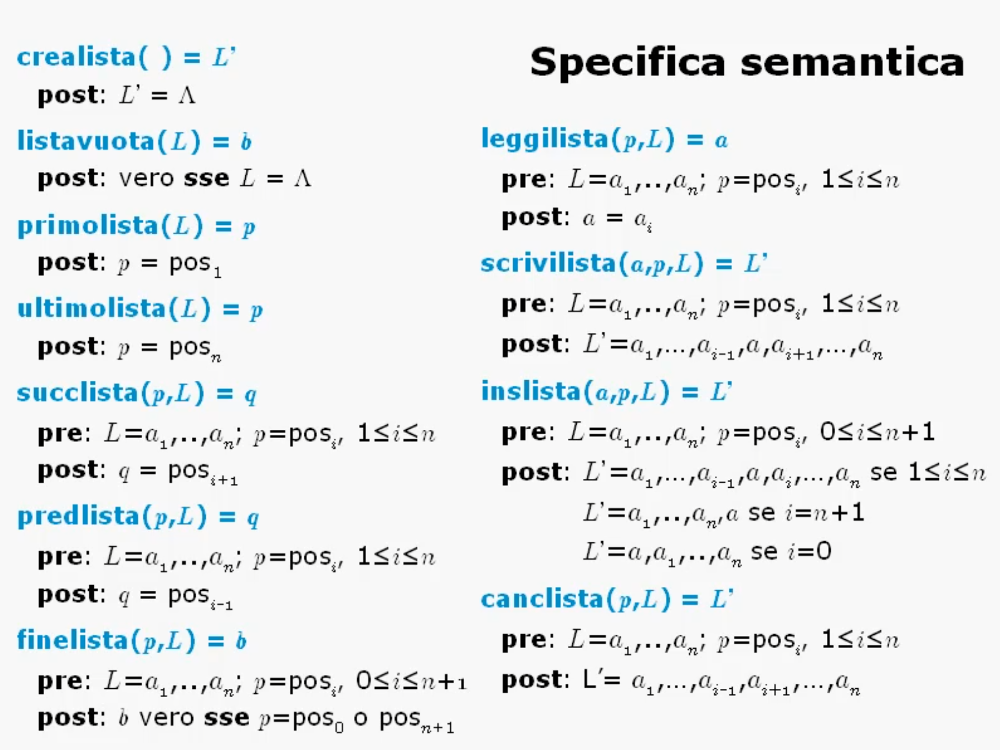

Nella **specifica sintattica**, a livello accademico si utilizzano simboli come:

```c
typedef cella posizione, lista;
```

per indicare _astrattamente_ che **una lista** e una **posizione** sono “oggetti del tipo cella”, ossia strutture composte da:

- un valore (`tipoelem elemento`);
    
- due collegamenti (`next`, `prev`).
    
Ma attenzione:  
in **logica algoritmica** questa è solo un’**astrazione matematica**.  
Non si sta ancora parlando di _come_ quei valori vengono gestiti in memoria.

---

#### 🧠 **Perché questo è un problema in C**

In C, il `typedef` delle slide significa letteralmente:

```c
typedef struct _cella {
    tipoelem elemento;
    struct _cella *next, *prev;
} cella;

typedef cella posizione;   // <-- alias diretto, non puntatore!
typedef cella lista;       // <-- alias diretto, non puntatore!
```

Quindi quando poi scrivi:

```c
void creaLista(lista L) { ... }
```

tu stai passando **una copia della struct** `cella`, **non un riferimento** alla lista vera.  
➡️ Tutte le modifiche fatte dentro la funzione **non escono** dalla funzione.  

---

#### ✅**Soluzione corretta: alias di puntatore**

La forma corretta, implementativamente coerente, è:

```c
typedef struct _cella {
    tipoelem elem;
    struct _cella *next, *prev;
} cella;

typedef cella* posizione;
typedef cella* lista;
```

Ora `posizione` e `lista` **non sono più copie**, ma **indirizzi**:  
modificando `*L` dentro una funzione, **modifichi la lista reale in memoria**.

**MOTIVO IN PIU' PER CONSULTARE IL RIPASSO SUI PUNTATORI!!!**

---

#### 🧩 **Perché la specifica del prof resta utile

La parte di teoria non vuole spiegare come implementare in C, ma **astrazione dei tipi di dato**.  
Quando si scrive nella specifica:

```text
crealista : → lista
inslista : (tipoelem, posizione, lista) → lista
canclista : (posizione, lista) → lista
```

sta solo dicendo **“che forma logica ha la funzione”** (input → output).  
È un linguaggio formale di tipo _ADT (Abstract Data Type)_, non C.

In un linguaggio come C, però, devi concretizzarlo usando **puntatori** perché:

- il linguaggio non ha il concetto di _riferimento_ come in C++ o Java;
    
- ogni passaggio è _by value_;
    
- per condividere strutture complesse, devi sempre lavorare sugli indirizzi.
    

---

### **3. Implementazione passo passo

Dunque, con l'ausilio di VSCode, in vista dell'esercizio che sta per venire, iniziamo a mettere in atto il tutto. Come anticipato, serve innanzitutto:

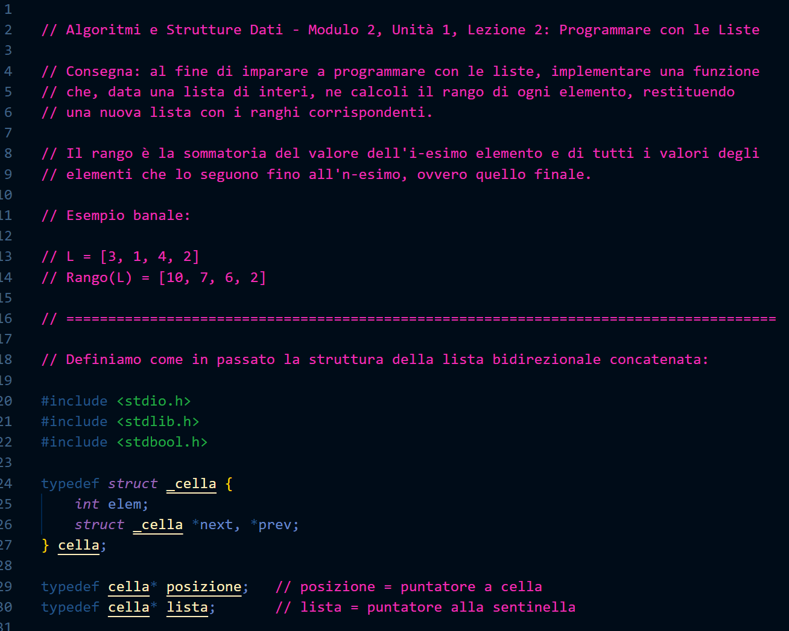

Ed ecco pronta la struttura minima: ora è tempo di scribacchiare tutte le funzioni che ci serviranno:

Riprendiamo la lista delle varie "utilities"

```text
a) crealista:           () → lista

b) listavuota:          (lista) → booleano


Operatori di Navigazione:

c) primolista:          (lista) → posizione
d) ultimolista:         (lista) → posizione
e) succlista:           (posizione, lista) → posizione
f) predlista:           (posizione, lista) → posizione


g) finelista:           (posizione, lista) → booleano

h) leggilista:          (posizione, lista) → tipoelem

i) scrivilista:         (tipoelem, posizione, lista) → lista

j) inslista:            (tipoelem, posizione, lista) → lista

k) canclista:           (posizione, lista) → lista
```

Andiamo con ordine.

---

#### **a. creaListaVuota**
La prima funzione, per semplicità, ci risparmia tre righe di codice che diventano ripetitive ogni volta che dobbiamo creare una lista.
Quindi nel main ci basterà dichiarare il nome della lista e poi chiamare la funzione per settarla in maniera del tutto minimale, ergo vuota ma linkata:

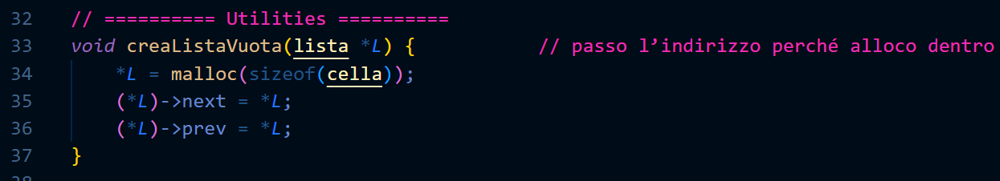

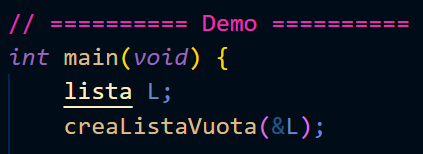

- `lista` è un **alias di `cella*`**, cioè un **puntatore a nodo**.
- Di conseguenza, `lista *L` è un **puntatore a un puntatore** (`cella **`).

**In altre parole:**

> “La funzione riceve l’indirizzo della variabile che, nel main, conterrà il puntatore alla sentinella.”

Questo è **call by reference**: vogliamo che la funzione possa **modificare la variabile `L` del main**, non una sua copia.

Vediamo cosa accade **passo per passo**:

1. `malloc(sizeof(cella))`  
    → chiede al sistema operativo un blocco di memoria **grande quanto una `struct cella`**.  
    Supponiamo che venga allocato all’indirizzo `0x7ffc1234`.
    
2. `*L = malloc(...);`
    
    - `L` è un **puntatore a puntatore**, quindi `*L` è la **variabile originale** del main (il “vero” `lista L`).
        
    - Assegniamo a quella variabile l’indirizzo appena creato (`0x7ffc1234`).
        

📍 **Effetto:**  
nel `main`, ora `L` (cioè la lista) **punta a una nuova cella allocata dinamicamente**, che fungerà da sentinella.

Successivamente, impostiamo i campi dei puntatori interni della sentinella:

- `(*L)` = la **sentinella stessa** (cioè la cella allocata);
    
- `(*L)->next = *L;` → il campo `next` punta alla sentinella stessa;
    
- `(*L)->prev = *L;` → idem per `prev`.
    

📍 **Effetto finale:**  
La lista forma un **anello circolare** di un solo nodo.  
Questo rappresenta perfettamente una **lista vuota.

---
##### **Cosa accade nel `main`**
```c
lista L;
```

- Poiché `lista` è un alias di `cella*`, questa riga dichiara una **variabile puntatore**.  
    In memoria, `L` è una **cella di stack** che può contenere un **indirizzo** (ma al momento è **non inizializzata**).

|Variabile|Tipo|Contenuto iniziale|Significato|
|---|---|---|---|
|`L`|`cella*`|indefinito (spazzatura)|non punta ancora a nulla|

```c
creaListaVuota(&L);
```

Ecco il punto cruciale:

- Passiamo **l’indirizzo di `L`** (`&L`), non `L` stesso.  
    Questo significa che dentro la funzione `creaListaVuota`, il parametro `L` **punta alla cella di stack** dove vive la variabile `L` del main.
    
|Funzione|Parametro|Tipo effettivo|Contenuto|
|---|---|---|---|
|`creaListaVuota`|`L`|`cella **`|indirizzo di `L` (in stack)|

Quando la funzione fa:

```c
*L = malloc(sizeof(cella));
```

- `*L` significa “la variabile `L` del main”.
    
- Le assegniamo l’indirizzo della nuova cella allocata.
    
|Variabile|Tipo|Contenuto dopo la chiamata|Significato|
|---|---|---|---|
|`L` (main)|`cella*`|indirizzo della sentinella (heap)|la lista ora esiste|

---
Recap...
Immagina tre livelli di memoria:

| Livello    | Cosa contiene                                                    | Descrizione                                               |
| ---------- | ---------------------------------------------------------------- | --------------------------------------------------------- |
| **Stack**  | `L` → `0x7ffc1234`                                               | variabile del main, contiene l’indirizzo della sentinella |
| **Heap**   | cella `0x7ffc1234`: `next` → `0x7ffc1234`, `prev` → `0x7ffc1234` | la sentinella                                             |
| **Codice** | `creaListaVuota`                                                 | funzione che ha allocato e inizializzato la struttura     |

La lista è ora pronta: **esiste in memoria**, anche se **non contiene ancora elementi**.

Si noti che questa tecnica verrà riproposta praticamente in maniera identica ovunque serva MODIFICARE qualcosa nel main...

---

#### **b. isListaVuota**
Chiaramente non sempre però vorremo modificare la lista creata: supponiamo di volere una funzione di utility che ci conferma se la lista è vuota o meno.
E' semplice, controlliamo il campo next della sentinella che gli passiamo. Va bene una copia, in quanto il controllo "se ne infischia che sia l'originale o meno"! Ergo si può benissimo passare by value!

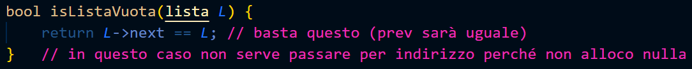

---

#### **c/d. primoNodo e ultimoNodo**
Valgono considerazioni del tutto analoghe per le prossime due funzioni: 

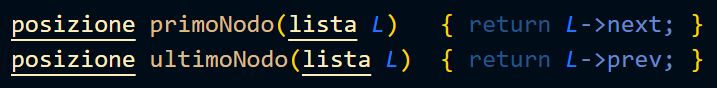

---
#### **e/f. successivoDi e precedenteDi**
Idem con queste due

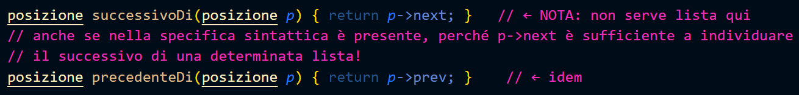

---

#### **g. fineLista**
Ricordiamo che sia posizione che lista sono puntatori. Se li confrontiamo, stiamo chiedendo:
"L’indirizzo di memoria del nodo richiesto è lo stesso indirizzo della sentinella?"
In altre parole:

- Se **il puntatore `p` e il puntatore `L` contengono lo stesso indirizzo**,  
    allora stiamo puntando **allo stesso nodo in memoria**;
- Quindi siamo **tornati alla sentinella**, ossia **alla fine della lista**.

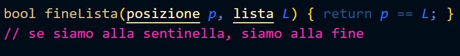

---

#### **h. leggiElemLista

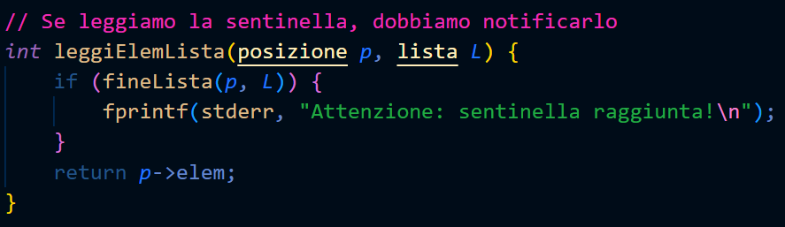

---

#### **i. sovrascriviElemLista

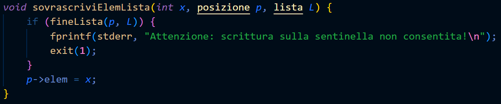

---

#### **j. insElemInLista

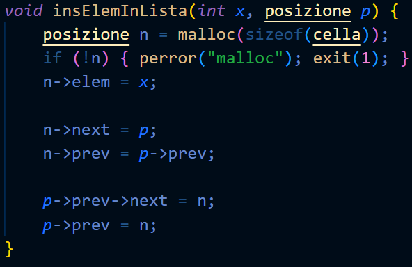

---

#### **k. cancElemLista

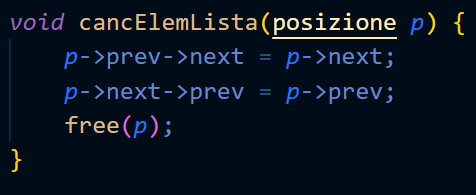

---

Ora che abbiamo correttamente implementato tutte le varie funzioni che ci torneranno utili per lavorare con le liste in maniera abbastanza minimale, possiamo procedere e iniziare a formulare l'esercizio...

### **4. Il problema del rango**

#### **Definizione**

Il **rango di un elemento** di una lista è la **somma del suo valore** e dei **valori degli elementi che lo seguono**.

Se la lista $L$ è composta da $n$ elementi $a_1, a_2, \dots, a_n$, il rango dell’elemento $a_i$ è:

$$  
r_i = a_i + a_{i+1} + a_{i+2} + \dots + a_n  
$$

Da cui deduciamo che:

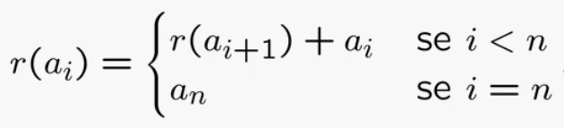

#### **Obiettivo**

Scrivere una procedura che, data la lista iniziale $L$ di interi, produca una nuova lista $R$ in cui ogni cella contiene il rango corrispondente dell’elemento in $L$.

**Esempio:**

|Lista L|5|3|2|1|
|---|---|---|---|---|
|Lista R|11|6|3|1|

---

### **3. Formalizzazione e idea risolutiva**

#### **Rappresentazione matematica**

$$  
r_i = \sum_{j=i}^{n} a_j  
$$

Per calcolare tutti i ranghi, è sufficiente **scandire la lista dall’ultimo elemento verso il primo**, mantenendo in una variabile la somma progressiva degli elementi già visitati.

#### **Idea operativa**

1. Si parte dall’ultimo elemento della lista $L$
    
2. Si tiene una variabile accumulatrice `a` con la somma dei valori letti
    
3. A ogni passo:
    
    - si aggiorna `a` sommando il valore corrente
        
    - si inserisce il risultato **in testa** alla nuova lista $R$
        
4. Al termine, $R$ conterrà tutti i ranghi in ordine corretto
    

> È un approccio _bottom-up_: risaliamo la lista partendo dalla fine e costruendo in parallelo la nuova.

---

### **4. Complessità del problema**

- La lista di input $L$ ha dimensione $n$: è necessario scandire tutti gli elementi almeno una volta

    $$\Omega(n)$$
    
- Ogni passo richiede una somma e un’inserzione 

    $$O(1)$$

**Complessità complessiva:**

$$  
O(n)  
$$

---

Prima di entrare nel vivo della lezione, è bene però capire come fare effettivamente a popolare la lista vuota creata dalla nostra funzione per poi poter andare a lavorarci.

$$ Vogliamo \ la  \ lista\  L = \{ \ 9, 8, 7, 6, 5, 4, 3, 2, 1 \ \}$$

Cosicché risulti la lista di rango:

$$R = \{ \ 45, 36, 28, 21, 15, 10, 6, 3, 1 \ \}$$

---

Graficamente, dopo la chiamata di 

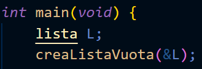

per ora abbiamo questo:

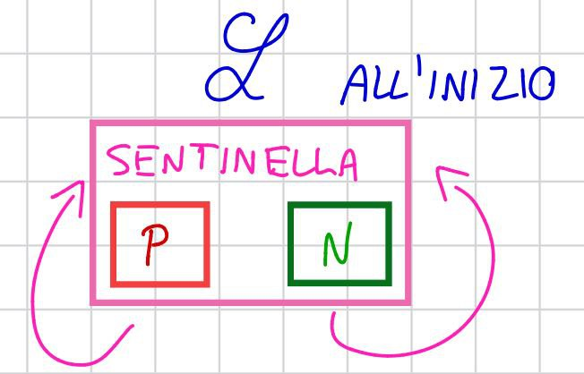

Ci servirà una variabile ausiliaria di coda (tail), che indichi l'ultimo elemento attuale della lista e che all'occorrenza aggiorneremo per procedere con l'algoritmo:

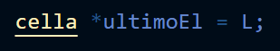
Visivamente è come se:


Ora è tutto pronto: abbiamo una sentinella e un riferimento di "coda", ergo dobbiamo iniziare a ciclare per creare le effettive dieci celle che vogliamo.

Per ogni cella che creeremo ad ogni iterazione nell'heap, vogliamo poterci riferire attraverso una variabile puntatore che comodamente chiamiamo new.

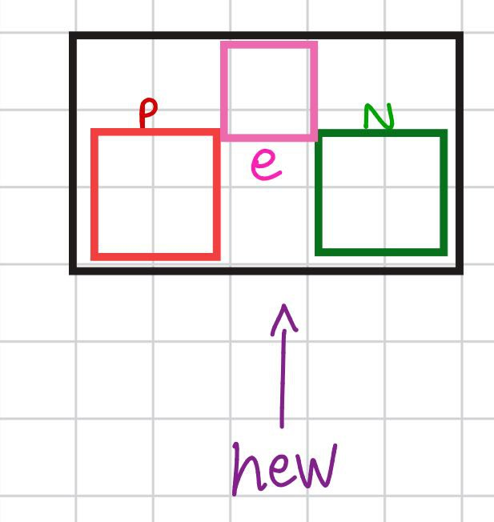

Inseriremo le celle a partire dalla prima fino all'ultima, il che è una buona prassi.
In altre parole, le inseriamo in coda: la prima inserita si pone dopo la sentinella, la seconda dopo la prima... 
Vediamo la prima iterazione, ovvero quella con $i = 9$:

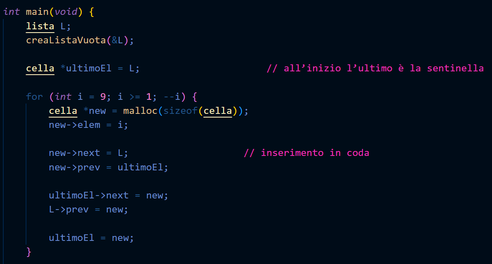

Dopo aver salvato il dato i nel campo elem, dobbiamo ricordare che:

1) Essendo che aggiungiamo le celle sempre una dopo l'altra, la successiva della nuova aggiunta è sempre la sentinella perché è quella che viene dopo l'ultima
2) La nuova cella aggiunta diventa la nuova ultima, quindi la sua precedente non è altro che l'ex ultima, che finora è salvata in tail, e per ora è sempre la sentinella

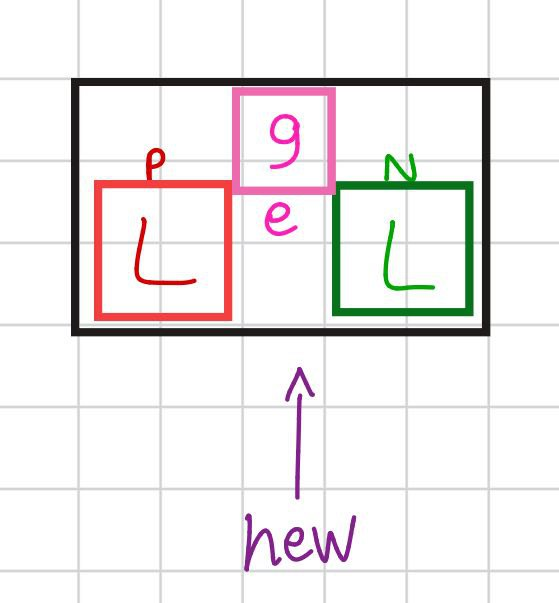

Però attenzione: questo non basta, infatti la sentinella e il riferimento dell'ultimo elemento tail sono ancora così:

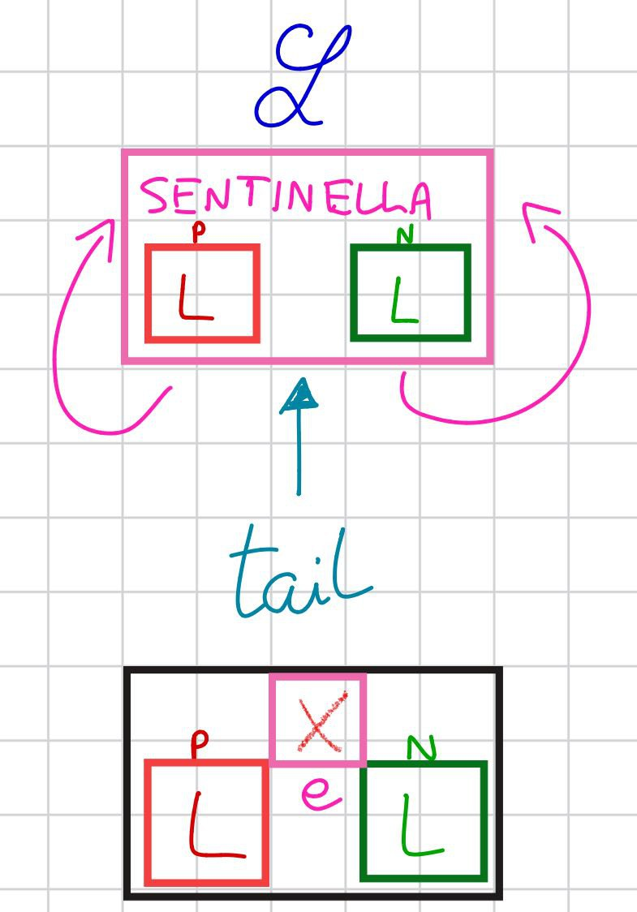

Dobbiamo tenere in conto che l'ultimo elemento è cambiato, da sentinella a new.
Dobbiamo aggiornare la sentinella: dopo di lei c'è la nuova cella, e anche prima di lei;
Idem per la tail, che ora non è più la sentinella bensì la new;

Quindi: ad ogni iterazione si aggiornano l'ex ultimo elemento e il riferimento all'ultimo elemento.

Partiamo con l'aggiornare chi segue l'ultimo elemento
per ora l'ultimo elemento è ancora tecnicamente la sentinella, e il suo successivo diventa new

Dopodiché consideriamo che l'ultimo aggiunto sarà il nuovo precedente della sentinella
Ci ritroviamo dunque con una situazione del genere

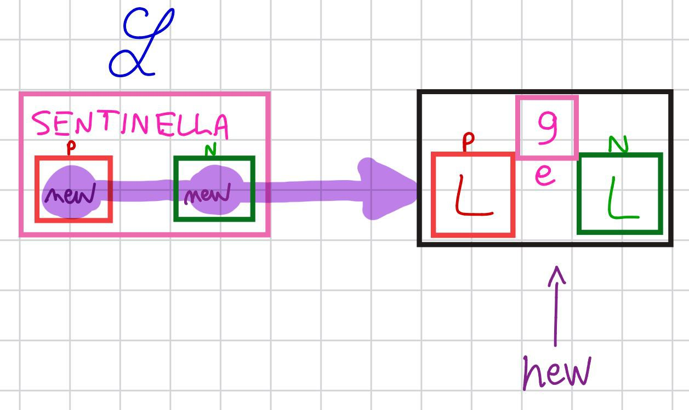

Infine aggiorniamo la coda affinché punti al nuovo nodo;

---
Vediamo ora la seconda iterazione, quella con $i = 8$:

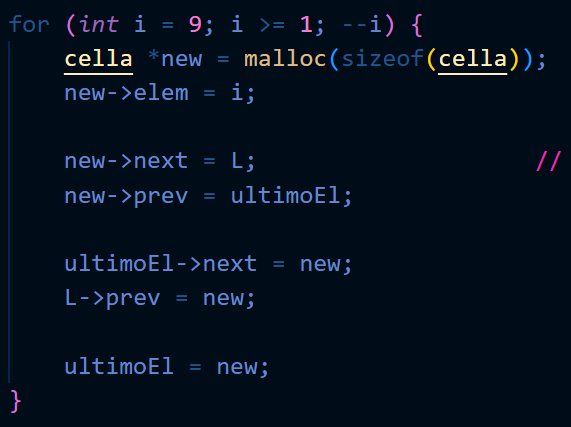

E' facile convincersi che dopo aver aggiornato i campi del new siamo in questa situazione, abbiamo fillato correttamente la nuova cella e dobbiamo aggiornare il resto:

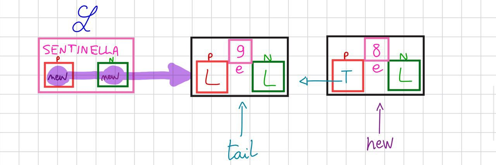

Come prima: ora che l'ultimo nodo è cambiato, bisogna aggiornare il successivo dell'ex ultimo:
In questo caso ultimoEl next non è più L, ma deve andare su new:

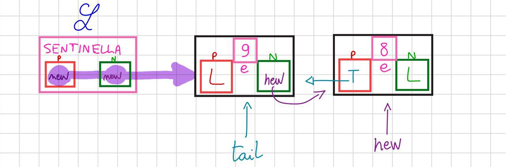

Aggiorniamo anche chi precede la sentinella, ergo sempre il nuovo nodo:

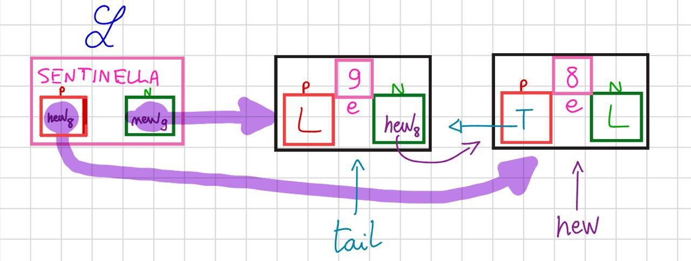

Infine aggiorniamo ultimoEl/tail:

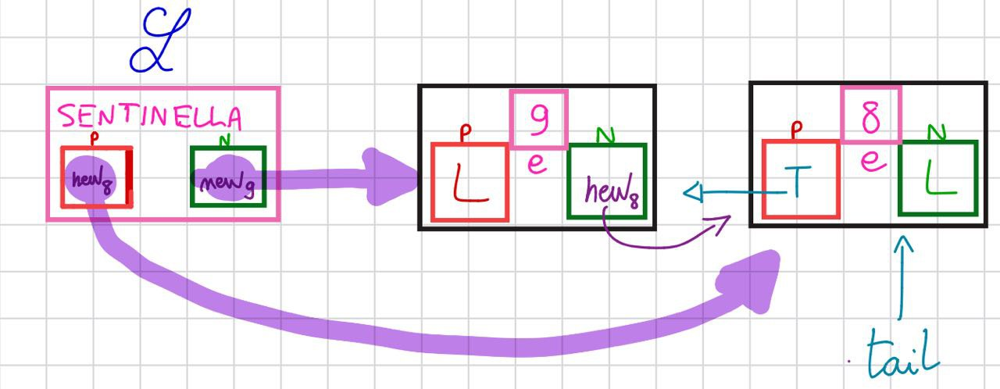

Possiamo dunque capire che tutti i riferimenti sono coerenti in ogni iterazione (graficamente diventa molto difficile da seguire ma basti comprendere che il ciclo funziona sia con la sola sentinella che al crescere dei nodi inseriti).

Attenzione: nel ciclo inseriamo in coda, quindi si aggiorna tail->next e non L->next, quello si farebbe se inserissimo in testa.

---

Ricapitolando: per ora, siamo riusciti a costruire e popolare la lista con le sottostanti righe di codice:

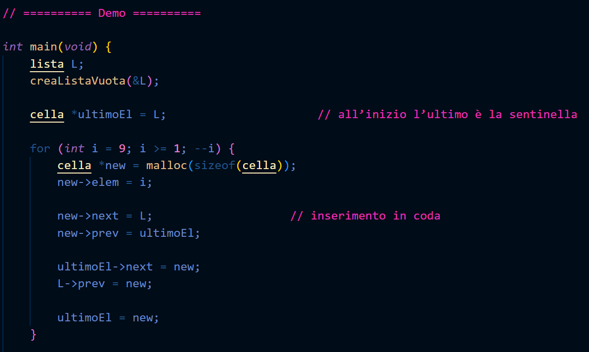

Per sincerarci del successo, facciamo un po' di debug e stampiamo a schermo il risultato:
già qui ci rendiamo conto che le funzioni permettono di ciclare molto più comodamente la lista inizializzata!!!

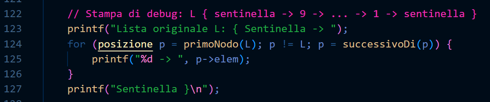

Otteniamo:

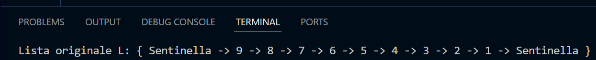

Ok, tutto perfetto!
Ora passiamo a capire come manipolare i dati che abbiamo in questa struttura per ricavare ciò che la consegna richiede.

### **5. Algoritmo iterativo**

#### **Implementazione**

```c
lista rangoIterativo(lista L) {
    lista R;
    creaListaVuota(&R);
  
    posizione p = ultimoNodo(L);
    int acc = leggiElemLista(p, L);
    insElemInLista(acc, primoNodo(R));  // inserisco il rango dell'ultimo elemento
    
    p = precedenteDi(p);
    while (!fineLista(p, L)) {
        acc += leggiElemLista(p, L);
        insElemInLista(acc, primoNodo(R));  // inserisco il rango corrente
        p = precedenteDi(p);
    }
  
    return R;
}
```

#### **Spiegazione passo passo**

1. Si inizializza la variabile `accumulatrice acc` con l’ultimo valore della lista $L$
    
2. Si crea una lista vuota $R$ e si inserisce il primo rango
    
3. Si risale la lista: per ogni elemento precedente, si aggiorna `a` e si inserisce in testa a $R$
    

---

#### **Complessità dell'algoritmo**

Come stabiliamo quale sia la parte predominante dell'algoritmo intero?

$\rightarrow$ La lista va scandita tutta, per come abbiamo stabilito che l'algoritmo debba agire. La scansione vera e propria avviene attraverso il while loop!

Il corpo del ciclo `while` contiene **5 operatori di lista**, ciascuno con costo $O(1)$.  
Dato che il ciclo viene eseguito $n$ volte:

$$  
T(n) = 5n = O(n)  
$$

> L’algoritmo `rangoIterativo` è **lineare** e **ottimo**, perché raggiunge il limite inferiore teorico del problema.

---

### **6. Algoritmo ricorsivo**

#### **Implementazione**

```c
int rangoRicorsivo(posizione p, lista L) {
    int acc = 0;

    if (fineLista(p, L)) {
        return 0;
    } else if (fineLista(successivoDi(p), L)) {
        acc = leggiElemLista(p, L);
    } else {
        acc = leggiElemLista(p, L) + rangoRicorsivo(successivoDi(p), L);
    }
    return acc;
}
```


#### **Esempio di chiamata**

```c
lista R;
creaListaVuota(&R);

// Calcolo i ranghi e li inserisco in R
for (posizione p = primoNodo(L); !fineLista(p, L); p = successivoDi(p)) {
	int rango = rangoRicorsivo(p, L);
	insElemInLista(rango, R);  // inserisco in coda
}
```

#### **Spiegazione logica**

- **Caso base:** quando si arriva all’ultimo elemento, il rango coincide con il suo valore
    
- **Caso ricorsivo:** per ogni elemento precedente, si richiama la funzione sul successore e poi si aggiunge il proprio valore
    

> La funzione non costruisce direttamente la lista $R$, ma calcola il rango di ciascun elemento.

---

#### **Complessità**

Ogni chiamata ricorsiva elabora un solo elemento e genera una nuova chiamata fino alla fine della lista.

$$  
T(n) = T(n - 1) + O(1) \Rightarrow O(n)  
$$

---

### **7. Ottimalità e confronto**

|Algoritmo|Tipo|Complessità|Descrizione|
|---|---|---|---|
|`rango_i`|Iterativo|O(n)|costruisce la lista R con un ciclo|
|`rango_r`|Ricorsivo|O(n)|calcola i ranghi tramite chiamate ricorsive|
|Problema del rango|—|Ω(n)|richiede di scandire tutta la lista|

> Entrambi gli algoritmi sono **ottimi**, poiché raggiungono la complessità minima teorica $\Omega(n)$.

---

### **8. Osservazioni conclusive**

- Questa è la **prima applicazione pratica** del tipo di dato lista
    
- Tutte le operazioni usano **solo operatori formali** (`crealista`, `leggilista`, `predlista`, ecc.)
    
- Si segue lo **schema di soluzione computazionale** visto nel Modulo 1
    
- Iterazione e ricorsione hanno stessa complessità $O(n)$, ma diversa gestione della memoria (stack vs loop)
    

---

> Con questa lezione, la lista passa da struttura a **strumento di calcolo dinamico**:  
> i dati non sono più solo memorizzati, ma **riprocessati in movimento**, come in un vero algoritmo.

---