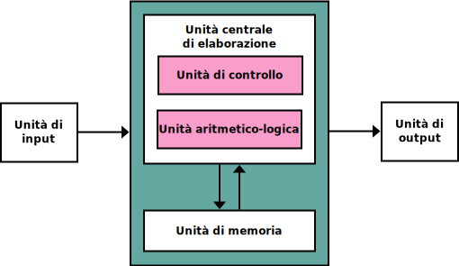
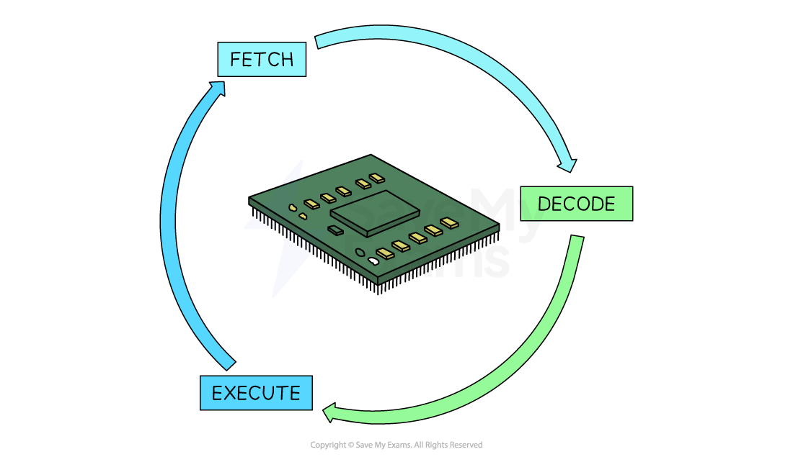

# M1 UD1 Lezione 1 - Macchina di von Neumann – Architettura e funzionamento

Iniziamo subito ripercorrendo le nozioni di base...

### **1. Architettura del calcolatore**

#### **1.1. Il concetto di architettura**

L’architettura di un calcolatore definisce **come sono organizzati e interconnessi i suoi componenti fondamentali** e **come essi collaborano per eseguire programmi**.  
Un computer non è un’entità monolitica: è composto da varie unità che cooperano sotto il controllo di un sistema operativo, coordinandosi per elaborare dati e produrre risultati.

Il sistema operativo si basa su una conoscenza profonda dell’architettura del calcolatore, perché deve **interagire direttamente con l’hardware**, controllando:

- la **CPU** (unità centrale di elaborazione),
    
- la **memoria centrale**,
    
- e i **dispositivi di input/output (I/O)**.

#### **1.2. Architettura di von Neumann**

La **macchina di von Neumann**, proposta negli anni ’40 da John von Neumann, rappresenta il **modello logico di riferimento** per quasi tutti i sistemi di elaborazione moderni.  
La sua idea rivoluzionaria consiste nel fatto che **dati e istruzioni sono memorizzati nello stesso spazio di memoria**, e vengono trattati in modo uniforme dal processore.

L’architettura di von Neumann è composta da tre componenti principali:

- **Processore (CPU)** – esegue le istruzioni.
    
- **Memoria centrale** – contiene sia i dati sia i programmi.
    
- **Interfacce di I/O** – collegano il processore con l’ambiente esterno (tastiere, dischi, reti, ecc.).

Il **principio fondamentale** è che la CPU preleva le istruzioni dalla memoria in sequenza, le decodifica e le esegue, realizzando così un comportamento automatico e deterministico.

---
### **2. Architettura dell’unità centrale**

#### **2.1. Componenti principali della CPU**

La **CPU (Central Processing Unit)** è l’unità che gestisce e coordina tutte le operazioni del calcolatore.  
È formata da tre sezioni logiche principali:

1. **Unità di controllo (CU)** – governa il flusso delle operazioni, legge le istruzioni, le decodifica e genera i segnali di comando.
    
2. **Unità aritmetico-logica (ALU)** – esegue le operazioni matematiche e logiche (somma, confronto, AND, OR, ecc.).
    
3. **Registri** – memorie velocissime interne alla CPU che conservano temporaneamente indirizzi, dati o risultati parziali.

---
### **3. Principio di funzionamento del processore**

#### **3.1. Il ciclo di esecuzione delle istruzioni**

Il processore segue un ciclo costante, noto come **ciclo di istruzione**, che si ripete per ogni operazione del programma.  
È composto da tre fasi principali:

$$  
\begin{cases}  
\text{FETCH:} & \text{acquisizione dell’istruzione dalla memoria} \\\\  
\text{DECODE:} & \text{decodifica dell’istruzione e individuazione dell’operazione da eseguire} \\\\  
\text{EXECUTE:} & \text{esecuzione dell’operazione e aggiornamento dei registri/memoria}  
\end{cases}  
$$

Durante la fase di **fetch**, l’indirizzo dell’istruzione corrente è memorizzato in un registro speciale chiamato **Program Counter (PC)**.  
Dopo ogni istruzione, il **PC** viene incrementato, così che la CPU possa passare automaticamente all’istruzione successiva.

#### **3.2. Flusso sequenziale**

In condizioni normali, le istruzioni vengono eseguite in **ordine sequenziale**, ossia una dopo l’altra, seguendo l’ordine in cui sono memorizzate.  
Questo flusso lineare è la base dei linguaggi di programmazione imperativi.

---
### **4. Espressività dei linguaggi di programmazione**

#### **4.1. Strutture di controllo**

I linguaggi di programmazione permettono di descrivere comportamenti complessi del processore attraverso **figure strutturali**, ovvero costrutti logici che controllano il flusso di esecuzione.  
I principali costrutti sono:

- **Sequenza:** esecuzione lineare di istruzioni.
    
- **Frase condizionale semplice:** `if (condizione)`.
    
- **Frase condizionale doppia:** `if (condizione) else`.
    
- **Ciclo a condizione iniziale:** `while (condizione)`.
    
- **Ciclo a condizione finale:** `do...while`.
    
- **Ciclo a conteggio:** `for (i = 0; i < n; i++)`.

Questi costrutti corrispondono, a livello macchina, a combinazioni di **istruzioni di salto e confronto** che alterano l’ordine naturale di esecuzione.

#### **4.2. Istruzioni di salto**

Un’**istruzione di salto (branch instruction)** consente di modificare il flusso del programma, trasferendo il controllo a un’altra parte del codice.  
Può essere:

- **incondizionata**, se il salto avviene sempre;
    
- **condizionata**, se il salto dipende dal risultato di una verifica logica (ad esempio, se un registro è zero o se due valori sono uguali).

In linguaggio macchina, queste istruzioni sono fondamentali per implementare tutte le strutture di controllo viste sopra.

---
### **5. Attività non sequenziali**

#### **5.1. Interruzioni del flusso lineare**

Oltre ai salti espliciti nel codice, esistono eventi che **interrompono il normale flusso di esecuzione** senza che il programma li abbia richiesti.  
Queste situazioni prendono il nome di **attività non sequenziali** o **asincrone**.

Due esempi principali sono:

- l’esecuzione di **istruzioni di salto** (non sequenziali ma previste nel programma);
    
- la gestione delle **interruzioni (interrupt)**, eventi esterni o interni che obbligano il processore a reagire immediatamente.

---
### **6. Attività asincrone: il meccanismo delle interruzioni**

#### **6.1. Cos’è un’interruzione**

Un’**interruzione (interrupt)** è un segnale che informa la CPU che è avvenuto un evento che richiede attenzione immediata.  
Quando un interrupt si verifica, il processore:

1. sospende temporaneamente l’esecuzione del programma in corso;
    
2. salva lo stato corrente (valori dei registri, del PC, ecc.);
    
3. esegue una routine di servizio dedicata (**Interrupt Service Routine**, ISR);
    
4. al termine, ripristina lo stato salvato e riprende l’esecuzione del programma interrotto.

#### **6.2. Tipologie di interruzioni**

Le interruzioni possono essere di diversi tipi:

- **Hardware interrupt:** generato da dispositivi esterni (es. tastiera, disco, timer).
    
- **Software interrupt (trap):** generato da errori o da richieste esplicite (es. system call).
    
- **Timer interrupt:** utilizzato dal sistema operativo per gestire il multitasking, permettendo la commutazione periodica tra processi.

#### **6.3. Ruolo nel sistema operativo**

Il sistema operativo utilizza gli interrupt per **sincronizzare l’attività del processore con gli eventi esterni**.  
Grazie a essi può:

- interrompere un processo per eseguirne un altro (context switch),
    
- reagire a input dell’utente o del disco,
    
- mantenere il controllo della CPU.

Senza meccanismi di interruzione, il sistema sarebbe **rigidamente sincrono e inefficiente**, poiché la CPU dovrebbe attendere continuamente la conclusione di ogni operazione di I/O.

---
### **7. Sintesi finale**

#### **7.1. Riepilogo dei concetti chiave**

$$  
\begin{cases}  
\textbf{Architettura dei calcolatori:} & \text{CPU + memoria + dispositivi di I/O} \\\\  
\textbf{Architettura di von Neumann:} & \text{processore, memoria condivisa, interfacce I/O} \\\\  
\textbf{Principio di funzionamento:} & \text{fetch → decode → execute} \\\\  
\textbf{Azioni non sequenziali:} & \text{istruzioni di salto e interruzioni}  
\end{cases}  
$$

#### **7.2. Collegamento con i sistemi operativi**

Il sistema operativo si appoggia interamente a questa struttura:  
controlla il ciclo `fetch–decode–execute`, gestisce gli interrupt, coordina le istruzioni di salto logico e sfrutta la CPU per creare l’illusione di più processi che si eseguono in parallelo.

Comprendere a fondo la macchina di von Neumann significa **capire la base fisica e logica** su cui ogni sistema operativo costruisce le proprie astrazioni: **processi, thread, gestione della CPU e scheduling**.