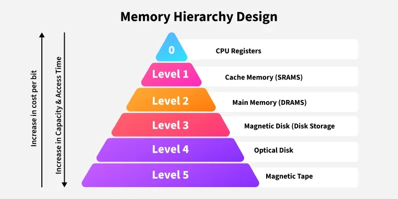

# **M1 UD1 Lezione 3 - Memoria**

### **1. Introduzione**

#### **1.1. Il ruolo della memoria nel sistema di elaborazione**

La **memoria** è l’elemento fondamentale che consente a un sistema di elaborazione di **immagazzinare dati e istruzioni**.  
Senza memoria, un processore non potrebbe mantenere né i programmi da eseguire né i risultati intermedi delle operazioni.

Nel modello della **macchina di von Neumann**, la memoria è concepita come un’area unica in cui convivono **codice** e **dati**, accessibili attraverso indirizzi numerici.  
Tuttavia, nella realtà fisica, le memorie sono organizzate in **una gerarchia di livelli**, ognuno con caratteristiche diverse in termini di **velocità, capacità e costo**.

---
### **2. Tipologie di memoria**

#### **2.1. Registri del processore**

I **registri** sono le memorie più piccole e più veloci dell’intero sistema.  
Si trovano **all’interno della CPU** e consentono un accesso **diretto e immediato**.  
Servono per conservare:

- risultati temporanei delle operazioni,
    
- indirizzi di memoria,
    
- contatori di programma,
    
- e variabili di stato (flag, puntatori, ecc.).

La loro capacità è **estremamente ridotta** (pochi byte o word), ma il **tempo di accesso** è dell’ordine di pochi **nanosecondi** o meno.

---
#### **2.2. Memoria cache**

La **memoria cache** è un livello intermedio tra i registri e la memoria centrale.  
È costituita da celle ad altissima velocità che **conservano copie dei dati più frequentemente usati** dalla CPU, in modo da ridurre il tempo medio di accesso.

Quando la CPU cerca un dato:

- se questo è già presente nella cache (**cache hit**), il recupero è rapidissimo;
    
- se non è presente (**cache miss**), il sistema lo recupera dalla memoria centrale e lo copia nella cache.

Il principio su cui si basa è quello di **località**, che può essere:

- **temporale:** un dato usato di recente sarà probabilmente riutilizzato presto;
    
- **spaziale:** i dati vicini a un indirizzo usato tendono anch’essi a essere richiesti.

La cache, quindi, migliora drasticamente le prestazioni globali del sistema.

---
#### **2.3. Memoria centrale**

La **memoria centrale** (o **RAM**) è la principale area di lavoro del calcolatore.  
Contiene i **programmi in esecuzione** e i **dati attivi** elaborati dal processore.

Le sue caratteristiche principali sono:

- **Accesso diretto:** ogni cella è identificabile tramite un indirizzo.
    
- **Tempo di accesso rapido**, ma inferiore a quello della cache.
    
- **Capacità maggiore** rispetto ai registri o alla cache.
    
- **Volatilità:** i dati si perdono quando il sistema viene spento.

È la memoria su cui opera direttamente il sistema operativo per gestire i **processi in esecuzione**, le **pagine di memoria virtuale** e gli **spazi di indirizzamento dei programmi**.

---
#### **2.4. Memorie di massa**

Le **memorie di massa** sono dispositivi permanenti che consentono di memorizzare grandi quantità di dati anche dopo lo spegnimento del sistema.  
Pur avendo tempi di accesso molto più lunghi, sono indispensabili per la persistenza dell’informazione.

##### **a) Dischi magnetici**

- Accesso **diretto o sequenziale**.
    
- Tempo di accesso **medio** (millisecondi).
    
- Capacità **molto ampia**.
    
- Usati per la **memoria secondaria** e per i **file system**.

##### **b) Dischi ottici (CD-ROM, DVD, Blu-Ray)**

- Accesso **lento**, ma capacità **molto elevata**.
    
- Lettura tramite laser.
    
- Utilizzati per **distribuzione di software** o **archiviazione di dati statici**.

##### **c) Nastri magnetici**

- Accesso **sequenziale**, molto più lento rispetto ai dischi.
    
- Capacità **enorme**, ma adatti solo a **backup** o **archiviazione massiva**.

---
### **3. Gerarchia di memoria**

#### **3.1. Il principio della gerarchia**

Poiché nessuna memoria singola può contemporaneamente essere **veloce, capiente ed economica**, i sistemi reali combinano più livelli in una **gerarchia**.  
Ogni livello è **più lento ma più grande** di quello che lo precede.

$$  
\begin{cases}  
\text{1.}~ \text{Registri}~ \rightarrow~ \text{velocissimi, capacità minima, integrati nella CPU} \\\\  
\text{2.}~ \text{Cache}~ \rightarrow~ \text{molto veloce, capacità ridotta, costosa} \\\\  
\text{3.}~ \text{Memoria centrale (RAM)}~ \rightarrow~ \text{rapida, capacità media, volatile} \\\\  
\text{4.}~ \text{Dischi magnetici/SSD}~ \rightarrow~ \text{lenti, molto capienti, persistenti} \\\\  
\text{5.}~ \text{Nastri magnetici o archiviazione remota}~ \rightarrow~ \text{lentissimi, ma di enorme capacità}  
\end{cases}  
$$

Il sistema operativo deve **ottimizzare i trasferimenti tra i livelli** di questa gerarchia per ottenere il miglior compromesso tra **velocità e capacità disponibile**.

---
### **4. Caching**

#### **4.1. Il meccanismo di caching**

Il **caching** è la tecnica di **memorizzare temporaneamente copie dei dati** provenienti da un livello più lento in un livello più rapido.  
Quando il processore richiede un’informazione:

1. si controlla se essa è già presente nella cache (cache hit);
    
2. se non lo è (cache miss), il dato viene copiato dalla memoria inferiore;
    
3. se necessario, vecchi dati vengono **scaricati** per far spazio a quelli nuovi.

Il caching si basa su tre operazioni fondamentali:

$$  
\begin{cases}  
\text{Caricamento}~ (\text{loading})~ &\text{: trasferimento di dati dal livello inferiore al superiore;} \\\\  
\text{Scaricamento}~ (\text{write-back})~ &\text{: aggiornamento dei dati modificati dal livello superiore;} \\\\  
\text{Coerenza}~ (\text{consistency})~ &\text{: mantenimento della sincronizzazione tra le copie.}  
\end{cases}  
$$

Una **cache coerente** assicura che ogni dato modificato in un livello superiore sia correttamente aggiornato anche in quello inferiore.

---
### **5. Protezione della memoria**

#### **5.1. Necessità di protezione**

Quando più programmi vengono eseguiti in contemporanea (**multiprogrammazione**), è essenziale garantire che **ognuno operi solo nello spazio di memoria assegnato**.  
Senza protezione, un processo potrebbe sovrascrivere aree di memoria di altri processi o del sistema operativo, compromettendo la stabilità dell’intero sistema.

#### **5.2. Meccanismi di protezione per livello**

Ogni livello di memoria dispone di specifiche modalità di protezione:

$$  
\begin{cases}  
\textbf{Registri:}~ & \text{Protezione implicita. Cambiano automaticamente con il processo attivo.} \\\\  
\textbf{Cache:}~ & \text{Protezione implicita grazie ai meccanismi hardware di gestione.} \\\\  
\textbf{Memoria centrale:}~ & \text{Gestita tramite la MMU (Memory Management Unit), che traduce e controlla gli indirizzi.} \\\\  
\textbf{Memorie di massa:}~ & \text{Gestite dal file system, che stabilisce permessi e privilegi di accesso.}  
\end{cases}  
$$

La **MMU** (Memory Management Unit) è il componente hardware che converte gli **indirizzi logici** prodotti dai programmi in **indirizzi fisici** di memoria reale, applicando controlli di validità e permessi.

---
### **6. Ruolo del sistema operativo**

Il sistema operativo coordina l’intera gerarchia di memoria, gestendo:

- l’**allocazione dinamica** della memoria ai processi;
    
- la **paginazione e segmentazione**;
    
- la **gestione della cache**;
    
- e la **protezione degli spazi di indirizzamento**.

In questo modo, l’utente percepisce una **memoria uniforme e virtualmente illimitata**, anche se fisicamente limitata e multilivello.

---
### **7. Sintesi finale**

$$  
\begin{cases}  
\textbf{Memorie:}~ & \text{registri, cache, RAM, dischi, nastri;} \\\\  
\textbf{Gerarchia:}~ & \text{più il livello è alto, più è veloce ma costoso;} \\\\  
\textbf{Caching:}~ & \text{replica temporanea dei dati per ridurre i tempi di accesso;} \\\\  
\textbf{Protezione:}~ & \text{isolamento dei processi e controllo degli indirizzi tramite MMU.}  
\end{cases}  
$$

---
### **8. Collegamento con i sistemi operativi**

Tutti i concetti introdotti in questa lezione costituiscono la base della **gestione della memoria virtuale**, che affronteremo in _Sistemi Operativi 2_.  
Lì vedremo come il sistema operativo:

- sfrutta la gerarchia fisica per creare **uno spazio di indirizzamento virtuale per processo**,
    
- applica politiche di **caching e swapping**,
    
- e utilizza la **MMU** per garantire **protezione e isolamento**.