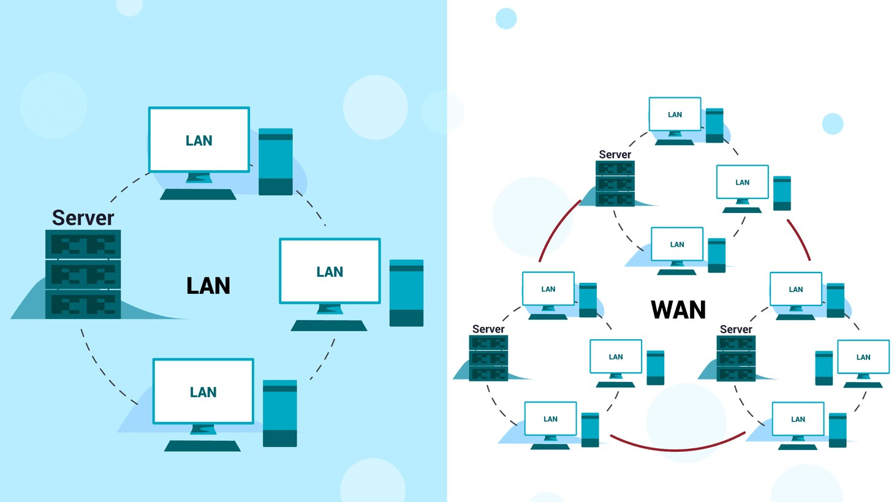
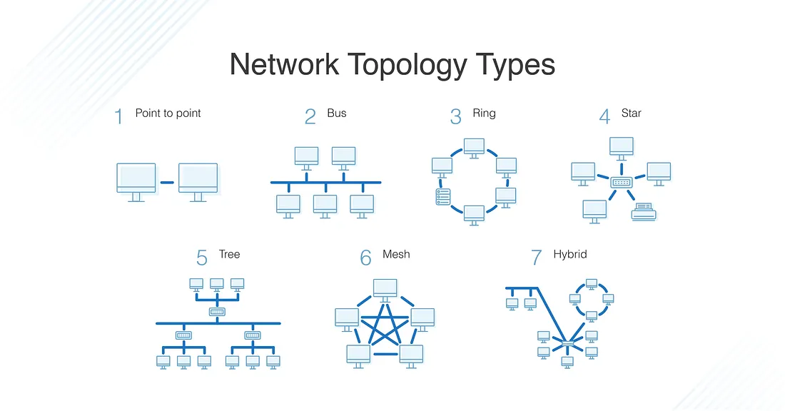

# **M1 UD1 Lezione 5 - Reti informatiche – Architetture e funzionamento**

### **1. Introduzione**

#### **1.1. Dal calcolatore isolato al sistema connesso**

Un tempo, i calcolatori operavano in modo **isolato**, senza possibilità di scambiare informazioni tra loro.  
Oggi, invece, quasi ogni sistema informatico è **parte di una rete**, ossia di un insieme di calcolatori interconnessi che **cooperano e condividono risorse**.

Le reti informatiche sono quindi un’estensione naturale dell’architettura del calcolatore:  
consentono di **collegare elaboratori, dispositivi e sistemi operativi diversi** in un’unica infrastruttura logica.

Il sistema operativo deve quindi saper **gestire la comunicazione di rete** come se fosse una **periferica complessa**, garantendo:

- scambio affidabile dei dati,
    
- controllo degli accessi,
    
- sincronizzazione,
    
- e sicurezza delle informazioni trasmesse.

---
### **2. Architetture delle reti informatiche**

#### **2.1. Reti locali (LAN) e reti geografiche (WAN)**

Le reti possono essere classificate in base alla **loro estensione geografica**:

$$  
\begin{cases}  
\textbf{LAN (Local Area Network)}~ & \text{Rete locale che collega dispositivi in un’area limitata, come un edificio o un campus.} \\\\  
\textbf{WAN (Wide Area Network)}~ & \text{Rete geografica che collega più LAN distanti, anche a livello nazionale o mondiale.}  
\end{cases}  
$$

Le **LAN** si basano spesso su connessioni cablate Ethernet o wireless (WiFi), mentre le **WAN** utilizzano tecnologie di trasmissione più complesse, come collegamenti ottici o satellitari.

---
#### **2.2. Topologie di rete**

La **topologia** di una rete descrive la **struttura fisica o logica** delle sue connessioni.  
Esistono varie topologie, ciascuna con vantaggi e svantaggi:

$$  
\begin{cases}  
\textbf{A bus:}~ & \text{tutti i nodi condividono un unico canale di comunicazione. Semplice ma poco scalabile.} \\\\  
\textbf{Ad anello:}~ & \text{i nodi sono disposti in cerchio; i dati viaggiano in un solo verso (Token Ring).} \\\\  
\textbf{A stella:}~ & \text{tutti i nodi sono collegati a un centro (hub o switch); molto diffusa in Ethernet.} \\\\  
\textbf{A maglia (mesh):}~ & \text{ogni nodo può collegarsi a più altri; alta affidabilità e ridondanza.}  
\end{cases}  
$$

La scelta della topologia influisce su:

- efficienza e latenza della comunicazione,
    
- facilità di manutenzione,
    
- e resilienza agli errori di collegamento.

---
### **3. Tecnologie e standard di rete**

#### **3.1. Ethernet e reti cablate**

L’**Ethernet** è lo standard più diffuso per le reti cablate locali.  
Nel tempo si sono evolute varie versioni:

$$  
\begin{cases}  
\text{Ethernet 10BaseT}~ & \text{: 10 Mbps, cavo a doppino intrecciato, topologia a stella.} \\\\  
\text{Fast Ethernet (100BaseT)}~ & \text{: 100 Mbps, compatibilità con lo stesso cablaggio.} \\\\  
\text{Gigabit Ethernet (1000BaseT)}~ & \text{: fino a 1 Gbps, oggi standard per reti aziendali.} \\\\  
\text{10 Gigabit Ethernet}~ & \text{: utilizzata nei data center e reti backbone.}  
\end{cases}  
$$

Tutte le varianti Ethernet condividono una logica di **accesso multiplo controllato**: solo un nodo alla volta può trasmettere, per evitare collisioni.

---
#### **3.2. Reti ad anello**

Le reti ad anello, come **Token Ring** o **FDDI (Fiber Distributed Data Interface)**, utilizzano un **token**:  
un piccolo pacchetto che circola continuamente e concede il diritto di trasmissione a un solo nodo per volta.  
Questo elimina le collisioni, ma introduce una maggiore latenza e complessità di gestione.

---
#### **3.3. Reti a stella**

Le reti **a stella** sono oggi lo standard grazie alla loro robustezza:  
ogni dispositivo è collegato a uno **switch centrale**, che instrada i pacchetti verso la destinazione corretta.  
Il guasto di un cavo o di un nodo non compromette l’intera rete, ma solo il collegamento coinvolto.

---
#### **3.4. Reti wireless**

Le reti senza fili (wireless) eliminano la necessità di cablaggi fisici, offrendo grande flessibilità.  
Le principali tecnologie sono:

$$  
\begin{cases}  
\textbf{Bluetooth}~ & \text{: connessioni personali a corto raggio (fino a 10 metri).} \\\\  
\textbf{WiFi (IEEE 802.11)}~ & \text{: reti locali ad alta velocità, fino a centinaia di Mbps.} \\\\  
\textbf{LTE/5G}~ & \text{: reti geografiche per comunicazioni mobili a lunga distanza.}  
\end{cases}  
$$

Il sistema operativo deve gestire anche le connessioni wireless come **periferiche dinamiche**, in grado di connettersi o disconnettersi durante l’esecuzione.

---
### **4. Interfaccia di connessione alla rete**

#### **4.1. Il ruolo della scheda di rete (NIC)**

Ogni calcolatore è connesso alla rete tramite una **scheda di rete** o **Network Interface Card (NIC)**.  
La scheda di rete è un **controller hardware specializzato** che:

- gestisce la trasmissione e la ricezione dei pacchetti,
    
- implementa i protocolli di livello fisico e di collegamento (Ethernet, WiFi, ecc.),
    
- comunica con il sistema operativo attraverso **driver di rete**.

#### **4.2. Funzionamento dell’interfaccia**

Il flusso operativo della comunicazione di rete può essere rappresentato così:

$$  
\begin{cases}  
\text{1.}~ \text{La CPU invia un pacchetto alla scheda di rete tramite il bus di sistema.} \\\\  
\text{2.}~ \text{La NIC elabora il pacchetto (indirizzamento, checksum, buffering).} \\\\  
\text{3.}~ \text{La scheda trasmette i dati sul mezzo fisico (rame, fibra, aria).} \\\\  
\text{4.}~ \text{Quando arriva un nuovo pacchetto, la NIC genera un interrupt per notificare la CPU.} \\\\  
\text{5.}~ \text{Il sistema operativo elabora il pacchetto ricevuto e lo consegna al processo destinatario.}  
\end{cases}  
$$

Questo meccanismo è analogo a quello visto per le **periferiche di I/O**, ma con maggiore complessità, poiché la rete deve:

- gestire latenze e ritrasmissioni,
    
- garantire la correttezza dei pacchetti,
    
- e coordinare protocolli multilivello.

---
### **5. La rete come periferica complessa**

#### **5.1. Complessità funzionale**

La rete non è una semplice periferica, ma un **sistema distribuito** a sé stante.  
Dal punto di vista del sistema operativo, essa appare come un dispositivo che:

- può generare eventi asincroni (arrivo di pacchetti),
    
- necessita di buffer e code di gestione,
    
- e richiede protocolli software (stack TCP/IP) per organizzare la comunicazione.

Ogni pacchetto che entra o esce dal calcolatore attraversa diversi **livelli di astrazione**:

1. hardware (scheda di rete),
    
2. driver (interfaccia software),
    
3. kernel (gestione protocolli),
    
4. processo utente (applicazione).

#### **5.2. Ruolo del sistema operativo**

Il sistema operativo deve:

- controllare e configurare le interfacce di rete,
    
- allocare buffer e strutture di dati per i pacchetti,
    
- gestire le interruzioni di rete,
    
- e fornire ai processi API standard per comunicare (es. socket).

---
### **6. Sintesi finale**

$$  
\begin{cases}  
\textbf{Tipologie di rete:}~ & \text{LAN e WAN, differenziate per estensione e tecnologia.} \\\\  
\textbf{Topologie:}~ & \text{bus, anello, stella, mesh.} \\\\  
\textbf{Tecnologie:}~ & \text{Ethernet, Token Ring, FDDI, WiFi, Bluetooth.} \\\\  
\textbf{Connessione:}~ & \text{tramite scheda di rete (NIC) e driver dedicati.} \\\\  
\textbf{Ruolo del SO:}~ & \text{gestione della rete come periferica complessa e asincrona.}  
\end{cases}  
$$

---
### **7. Conclusione**

Le **reti informatiche** estendono l’architettura del calcolatore verso una **dimensione distribuita**, in cui più sistemi cooperano come parti di un unico insieme logico.  
Il sistema operativo è il **punto di contatto** tra hardware, rete e applicazioni, e garantisce che la comunicazione avvenga in modo **sicuro, efficiente e controllato**.

Con questa lezione si conclude l’Unità 1 del Modulo 1, dedicata all’**Architettura e funzionamento dei sistemi di elaborazione** — il fondamento su cui poggeranno i meccanismi avanzati di **virtualizzazione, concorrenza e gestione delle risorse** che studieremo nei moduli successivi.