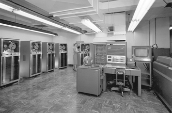
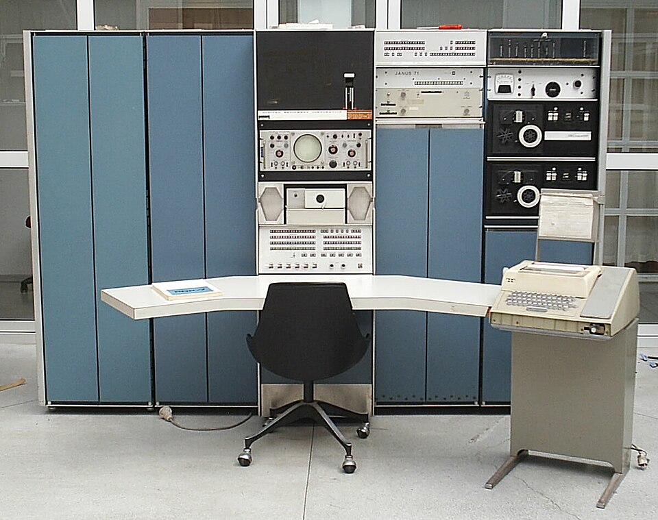

# **M1 UD1 Lezione 6 - Classificazione dei sistemi di elaborazione**

### **1. Introduzione**

#### **1.1. Perché classificare i sistemi di elaborazione**

Nel corso dell’evoluzione dell’informatica, i sistemi di elaborazione si sono differenziati per **dimensioni, potenza, destinazione d’uso e numero di utenti**.  
Capire questa classificazione è essenziale per comprendere **le scelte progettuali dei sistemi operativi**, poiché ogni tipologia di macchina richiede politiche differenti di gestione delle risorse, scheduling e sicurezza.

In questa lezione concludiamo il Modulo 1 esplorando i **principali tipi di sistemi di elaborazione**, dalle grandi macchine centralizzate ai moderni sistemi distribuiti e embedded.

---
### **2. Mainframe**

#### **2.1. Origini e funzioni**

I **mainframe** sono i discendenti diretti dei primi calcolatori elettronici di larga scala.

Progettati per elaborare enormi quantità di dati in modo **affidabile e continuativo**, potevano servire **centinaia o migliaia di utenti simultaneamente**.

$$  
\begin{cases}  
\text{CPU:}~ & \text{un singolo processore di grandi dimensioni;} \\\\  
\text{Memoria:}~ & \text{ripartita tra più job in multiprogrammazione;} \\\\  
\text{Dispositivi I/O:}~ & \text{nastri, dischi magnetici, stampanti;} \\\\  
\text{Gestione CPU:}~ & \text{in condivisione di tempo (time sharing).}  
\end{cases}  
$$

Con l’introduzione del time-sharing, i mainframe divennero **sistemi multiutente interattivi**, con schedulazione multilivello, controllo accessi e sicurezza avanzata.

---
#### **2.2. 💾 Easter Egg storico e videoludico**

I fan di _Call of Duty: Black Ops Cold War_ ricorderanno la missione **“Echoes of a Cold War”**, ambientata in una **base sovietica sotterranea abbandonata tra le montagne**.  
In quell’episodio, **Mason e Woods** si infiltrano per recuperare un **mainframe segreto**, rimasto operativo dagli anni della Guerra Fredda: un gigantesco calcolatore a nastro, simbolo dell’**informatica centralizzata militare** dell’epoca.

Il riferimento è un chiaro omaggio ai **mainframe reali** usati negli anni ’60-’80 per calcolo scientifico, crittografia e controllo radar.

Nella missione finale **“Ashes to Ashes”**, ambientata presso la **vera antenna radar sovietica Duga**, situata vicino a **Černobyl’**, si nota che all'epoca piaceva già fare le cose in grande, in quanto a reti di telecomunicazioni.  
Quella struttura, realmente esistente, era un gigantesco **radar Over-the-Horizon** (detto _Russian Woodpecker_) capace di captare lanci missilistici intercontinentali.  
Nel contesto del corso, rappresenta l’evoluzione estrema dei mainframe: enormi infrastrutture di elaborazione e sorveglianza, antenate dei moderni **data center**.

---
### **3. Minicomputer**

I **minicomputer** nascono come versione più compatta dei mainframe, destinata a **laboratori e università**.  
Meno costosi ma ancora multiutente, adottano architetture a time sharing e multiprogrammazione limitata.  
Esempi storici: **PDP-11** e **VAX** della DEC.

---
### **4. Workstation**

Le **workstation** offrono potenza di calcolo elevata a un singolo utente tecnico (ingegneri, ricercatori, grafici).  
Dotate di CPU multi-core e GPU dedicate, supportano sistemi operativi multitasking con interfaccia grafica (UNIX, Linux, Solaris).

---
### **5. Personal Computer (PC)**

Con i **personal computer** l’elaborazione diventa **individuale e interattiva**.  
Il PC è un sistema multi-processo progettato per applicazioni locali ma connesso in rete.

$$  
\begin{cases}  
\text{Interfaccia:}~ & \text{grafica, basata su finestre e dispositivi di puntamento;} \\\\  
\text{Gestione CPU:}~ & \text{multitasking e time sharing;} \\\\  
\text{Esempi:}~ & \text{Windows, macOS, Linux desktop.}  
\end{cases}  
$$

---
### **6. Computer palmari e dispositivi mobili**

Con la miniaturizzazione, la potenza dei computer si concentra in **smartphone e tablet**, dotati di CPU ARM, memoria ridotta e sistemi Android o iOS.  
Sono multi-processo ma ottimizzati per basso consumo e gestione dinamica delle connessioni wireless.

.jpg)

---
### **7. Sistemi in tempo reale e dedicati**

I **sistemi real-time** devono reagire entro tempi massimi garantiti.  
Si distinguono in:

- **hard real-time** (scadenza obbligatoria),
    
- **soft real-time** (tolleranza al ritardo).

I **sistemi embedded** sono dedicati a un compito specifico (auto, robot, dispositivi biomedicali) e usano firmware o RTOS minimalisti.

---
### **8. Sistemi multimediali**

Integrano suoni, immagini e video in tempo reale, richiedendo CPU multi-core e GPU dedicate.  
Esempi: computer creativi, console di gioco, piattaforme di editing e streaming.

---
### **9. Sistemi multiprocessore, cluster e distribuiti**

$$  
\begin{cases}  
\textbf{Multiprocessore:}~ & \text{più CPU condividono la memoria principale (SMP / AMP).} \\\\  
\textbf{Cluster:}~ & \text{insieme di nodi cooperanti fortemente connessi.} \\\\  
\textbf{Distribuito:}~ & \text{nodi autonomi collegati via rete, tipici di cloud e grid computing.}  
\end{cases}  
$$

---
### **10. Sintesi finale**

$$  
\begin{cases}  
\textbf{Mainframe:}~ & \text{grandi sistemi centralizzati multiutente.} \\\\  
\textbf{Minicomputer:}~ & \text{versione ridotta per gruppi di lavoro.} \\\\  
\textbf{Workstation:}~ & \text{sistema personale ad alte prestazioni.} \\\\  
\textbf{PC:}~ & \text{uso individuale e general-purpose.} \\\\  
\textbf{Palmare:}~ & \text{mobile e a basso consumo.} \\\\  
\textbf{Tempo reale:}~ & \text{risposta entro limiti deterministici.} \\\\  
\textbf{Dedicato:}~ & \text{embedded per funzioni specifiche.} \\\\  
\textbf{Multimediale:}~ & \text{gestione simultanea di flussi audio-video.} \\\\  
\textbf{Multiprocessore:}~ & \text{elaborazione parallela.} \\\\  
\textbf{Cluster/Distribuito:}~ & \text{cooperazione di nodi interconnessi.}  
\end{cases}  
$$

---
### **11. Conclusione del Modulo 1**

Abbiamo percorso l’intera evoluzione dei sistemi di elaborazione:

- dalla **macchina di von Neumann** ai **modelli multi-CPU**,
    
- dalla **memoria gerarchica** alle **reti interconnesse**,
    
- fino alle **famiglie di calcolatori** che definiscono le scelte architetturali dei sistemi operativi.

Il passo successivo sarà capire **come il sistema operativo gestisce queste architetture**: processi, risorse e comunicazioni.  
Dal mainframe della Guerra Fredda alle CPU multi-core di oggi, il principio rimane lo stesso: **controllare la complessità attraverso l’astrazione**.