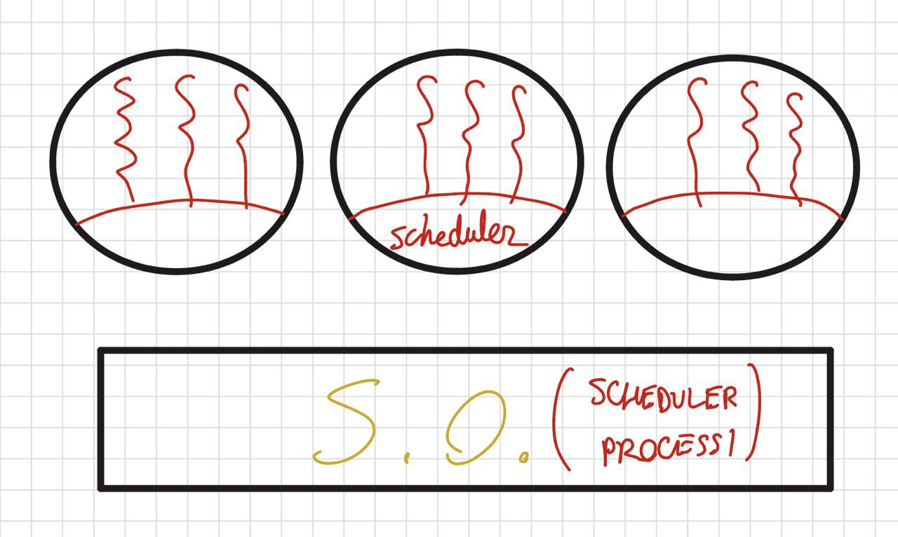
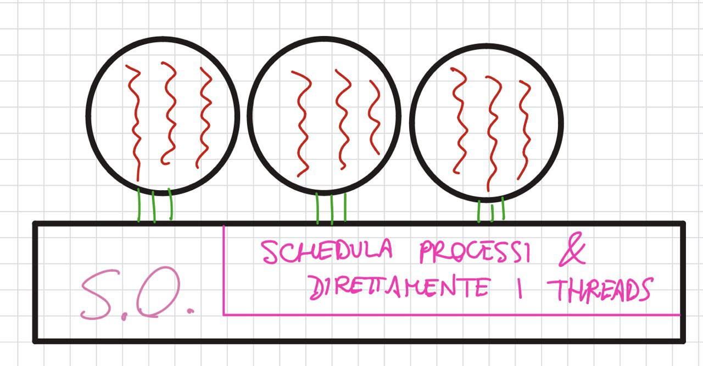

# **M3 UD3 Lezione 5 - Schedulazione dei thread**

### **1. Introduzione**

Finora abbiamo studiato la schedulazione dei **processi**, ma nei sistemi moderni — dove un singolo processo può contenere **più thread di esecuzione** — diventa necessario gestire anche la **schedulazione dei thread**.

Ogni thread rappresenta un **flusso indipendente di esecuzione** che condivide le risorse del processo principale (memoria, file aperti, codice, ecc.), ma ha un proprio **stato di CPU**.  
Questo comporta che la schedulazione possa avvenire **a diversi livelli**:

$$  
\begin{cases}  
\textbf{1.}~ & \text{a livello di processo (user-level);} \\\\  
\textbf{2.}~ & \text{a livello di sistema (kernel-level).}  
\end{cases}  
$$

---
### **2. Livelli di schedulazione**

L’esecuzione dei thread può essere gestita secondo due approcci principali:

- **Schedulazione nel processo**, effettuata dal _thread library scheduler_ nello spazio utente.
    
- **Schedulazione nel sistema operativo**, eseguita dal _kernel scheduler_.

---
### **3. Schedulazione a livello di processo (user-level)**

Questa modalità si applica ai **thread gestiti interamente nello spazio utente**, chiamati anche **thread user-level**.  
Non coinvolgono direttamente il kernel, e la loro gestione è affidata a una **libreria dei thread** (ad esempio POSIX Threads, _pthreads_).

---
#### **3.1. Nome tecnico**

Il meccanismo prende il nome di **Process-Contention Scope (PCS)** — cioè “ambito di contesa a livello di processo”.  
Significa che **i thread competono tra loro all’interno dello stesso processo**, e non con i thread di altri processi.

---
#### **3.2. Gestione**

La libreria dei thread implementa un piccolo **schedulatore locale**, che decide quale thread utente eseguire in base a politiche interne.

$$  
\begin{cases}  
\textbf{1.}~ & \text{Schedulazione a priorità fisse o modificabili.} \\\\  
\textbf{2.}~ & \text{Politiche comuni: FCFS o Round Robin.} \\\\  
\textbf{3.}~ & \text{Possibilità di pre-emption, se supportata dalla libreria.}  
\end{cases}  
$$

Questo tipo di schedulazione è **leggera e veloce**, ma presenta una limitazione importante:  
poiché il kernel non è consapevole dei singoli thread utente, **se un thread effettua una system call bloccante, l’intero processo resta sospeso**.

---
### **4. Schedulazione a livello di sistema (kernel-level)**

In questo caso i thread sono **conosciuti e gestiti direttamente dal sistema operativo**.  
Ogni thread ha una **struttura di controllo nel kernel (TCB)** e può essere schedulato **indipendentemente** dagli altri thread del processo.

---
#### **4.1. Nome tecnico**

Questa modalità prende il nome di **System-Contention Scope (SCS)** — “ambito di contesa a livello di sistema”.  
Significa che **tutti i thread del sistema**, appartenenti a processi diversi, competono **direttamente per l’uso della CPU**.

---
#### **4.2. Gestione**

La schedulazione è effettuata dallo **scheduler del kernel**, che assegna la CPU in base alle priorità e alle politiche globali del sistema.

$$  
\begin{cases}  
\textbf{1.}~ & \text{Ogni thread è una vera entità di schedulazione del SO.} \\\\  
\textbf{2.}~ & \text{Le system call bloccanti sospendono solo il thread, non tutto il processo.} \\\\  
\textbf{3.}~ & \text{Il kernel può distribuire i thread su più CPU o core (multithreading hardware).}  
\end{cases}  
$$

---
### **5. Thread ibridi (user-level + kernel-level)**

Alcuni sistemi adottano un modello ibrido, in cui i **thread utente sono mappati su thread kernel** attraverso entità intermedie chiamate **LWP (Lightweight Processes)**.  
Ogni LWP rappresenta una connessione tra uno o più thread utente e il kernel.

$$  
\begin{cases}  
\textbf{Vantaggi:}~ &  
\begin{cases}  
\text{flessibilità nella gestione;} \\\\  
\text{possibilità di concorrenza multipla su più CPU;} \\\\  
\text{evita il blocco totale del processo.}  
\end{cases} \\\\  
\textbf{Svantaggi:}~ &  
\begin{cases}  
\text{complessità maggiore;} \\\\  
\text{overhead nella sincronizzazione tra i due livelli.}  
\end{cases}  
\end{cases}  
$$

Questo modello è detto anche **many-to-many**, poiché più thread utente possono essere associati a più thread kernel dinamicamente.

---
### **6. Sintesi finale**

$$  
\begin{cases}  
\textbf{Livello di processo (PCS):}~ & \text{schedulazione locale; veloce ma invisibile al kernel.} \\\\  
\textbf{Livello di sistema (SCS):}~ & \text{schedulazione globale; visibile al kernel e indipendente.} \\\\  
\textbf{Modello ibrido (LWP):}~ & \text{compromesso tra efficienza e flessibilità.}  
\end{cases}  
$$

---
### **7. Conclusione**

La schedulazione dei thread rappresenta l’evoluzione naturale della gestione dei processi nei sistemi operativi moderni.  
Essa consente una **maggiore concorrenza** e un **miglior sfruttamento delle CPU multicore**, ma richiede anche **meccanismi più complessi di coordinamento** tra lo spazio utente e il kernel.

In sintesi:

- nei thread user-level prevale la **leggerezza**;
    
- nei thread kernel-level prevale la **potenza e l’indipendenza**;
    
- nei modelli ibridi si ottiene un equilibrio tra **efficienza e controllo**.