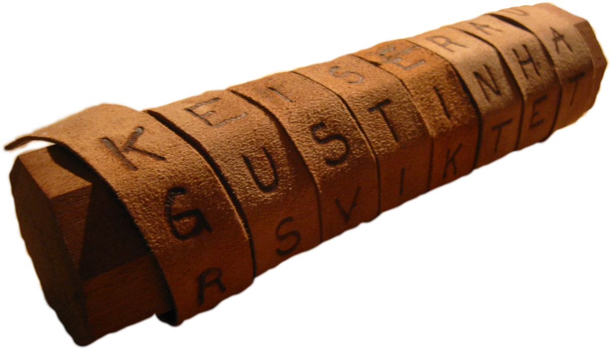

# **Lezione 2: Metodi di cifratura simmetrica**

---

### **1. Crittografia simmetrica: definizione generale**

La **crittografia simmetrica** è un sistema di cifratura in cui **la stessa chiave segreta** viene utilizzata sia per **cifrare** che per **decifrare** il messaggio.

$$  
\begin{cases}  
c = E_k(m) \\\\  
m = D_k(c)  
\end{cases}  
$$

dove:

- $m$ è il messaggio in chiaro,
    
- $c$ è il testo cifrato,
    
- $k$ è la **chiave segreta condivisa** tra mittente e destinatario.
    

Entrambe le parti devono quindi **possedere e proteggere la stessa chiave**, mantenendola **riservata**.

---

### **2. Tipologie di cifrari simmetrici**

A seconda di **come** l’algoritmo elabora i dati, distinguiamo due grandi categorie:

#### **a) Cifrari a blocchi**

- Operano su **blocchi di bit o caratteri** (ad esempio 64 o 128 bit).
    
- Ogni blocco viene cifrato come un’unità indipendente.
    
- Esempi moderni: **DES, AES, Blowfish**.
    

#### **b) Cifrari a flusso**

- Operano **bit per bit** o **byte per byte**.
    
- Il cifrario genera un **flusso di chiavi (keystream)** che viene combinato con il flusso dei dati in chiaro.
    
- Esempi: **RC4, Salsa20**.
    

---

### **3. Schema generale di un cifrario simmetrico**

In un tipico schema simmetrico, **Alice** vuole inviare un messaggio segreto a **Bob** attraverso un **canale insicuro**.

```
 Testo in chiaro (m) ──► [Algoritmo di cifratura E_k] ──► Testo cifrato (c)
                                         ↓
                                     Chiave segreta (k)
```

Bob, ricevendo il messaggio cifrato, applica lo stesso algoritmo in senso inverso:

```
 Testo cifrato (c) ──► [Algoritmo di decifratura D_k] ──► Testo in chiaro (m)
                                         ↓
                                     Chiave segreta (k)
```

Entrambe le parti devono quindi **concordare preventivamente la chiave** e tenerla al sicuro.  
Se un avversario la scopre, **l’intero sistema viene compromesso**.

---

### **4. Formalizzazione matematica**

Definiamo:

- Messaggio in chiaro: $X = [X_1, X_2, X_3, \dots, X_M]$
    
- Chiave segreta: $K = [K_1, K_2, K_3, \dots, K_j]$
    
- Messaggio cifrato: $Y = E_K(X) = [Y_1, Y_2, Y_3, \dots, Y_N]$
    

e la **relazione fondamentale**:

$$  
X = D_K(E_K(X))  
$$

ossia, **decifrare il messaggio cifrato con la chiave giusta restituisce l’originale**.

Il valore della chiave $K$ appartiene a un determinato **spazio delle chiavi**, e deve essere scelto in modo **imprevedibile** per evitare attacchi a forza bruta.

---

### **5. Operazioni di trasformazione**

Ogni algoritmo di cifratura si basa su due **operazioni fondamentali**:

#### **a) Sostituzione**

Ogni simbolo del testo in chiaro viene **sostituito** con un altro simbolo, secondo una regola o una chiave.  
Esempio: nel cifrario di Cesare, ogni lettera è spostata di tre posizioni.

#### **b) Trasposizione**

Gli elementi del testo in chiaro vengono **scambiati di posizione**, senza essere modificati.  
In questo modo si **mescola l’ordine** dei simboli, rendendo il testo non leggibile.

🧩 **Requisito essenziale:**  
Le operazioni devono essere **reversibili**, cioè permettere di recuperare esattamente il messaggio originario.

---

### **6. Esempio storico – La scitala spartana**

Uno dei primi esempi di **cifrario per trasposizione** è la **scitala spartana**, citata da **Plutarco** (500 a.C.).



- Era un’**asta di legno** di diametro noto solo ai due interlocutori.
    
- Il messaggio veniva scritto su una **striscia di pergamena** avvolta intorno all’asta.
    
- Tolta l’asta, il testo appariva come un insieme caotico di lettere.
    
- Solo chi possedeva una scitala dello stesso diametro poteva **riavvolgere la striscia** e leggere il messaggio.
    

Esempio simbolico:

```
M  A  I
D  A  I
M D K S J A J D I A A K J D
```

---

### **7. Cifrario a trasposizione – Rail Fence (staccionata)**

Nel **cifrario a staccionata (Rail Fence)**, il messaggio viene scritto **alternando le lettere su due o più righe**, come se seguissero un tracciato “a zig-zag”.

#### **Esempio**

Testo in chiaro:  
`Un segreto è il tuo prigioniero`

```
U S G E O I T O R G O I R
N E R T E L U P I I N E O
```

**Testo cifrato:**  
`USGEOITORGOIRNERTELUPIINEO`

Il messaggio è ricostruibile solo sapendo **su quante righe** (o “binari”) è stato disposto il testo.


---

## **8. Cifrario a trasposizione per colonne (corretto)**

Nel **cifrario a trasposizione per colonne**, il messaggio in chiaro viene scritto all’interno di una tabella, **riga per riga**, sotto una **chiave numerica**.  
La lettura avviene **colonna per colonna**, nell’ordine crescente dei numeri della chiave.


Chiave numerica: **4 3 1 2 5 6 7**

Testo in chiaro:  
`ATTACK POSTPONED UNTIL TWO AM`

---

#### **Fase 1 – Inserimento del testo nella matrice**

|4|3|1|2|5|6|7|
|---|---|---|---|---|---|---|
|A|T|T|A|C|K|P|
|O|S|T|P|O|N|E|
|D|U|N|T|I|L|T|
|W|O|A|M|X|X|X|

_(Le X servono per riempire la matrice e completare le colonne.)_

---

#### **Fase 2 – Lettura per colonne secondo la chiave**

Ordine di lettura: **1 → 2 → 3 → 4 → 5 → 6 → 7**

- 1ª colonna (posizione 3) → `T T N A`
    
- 2ª colonna (posizione 4) → `A P T M`
    
- 3ª colonna (posizione 2) → `T S U O`
    
- 4ª colonna (posizione 1) → `A O D W`
    
- 5ª colonna (posizione 5) → `C O I X`
    
- 6ª colonna (posizione 6) → `K N L X`
    
- 7ª colonna (posizione 7) → `P E T X`
    

---

#### **Fase 3 – Ricomposizione del testo cifrato**

Unendo le colonne nell’ordine corretto, otteniamo:

> **`TTNAAPTMTSUOAODWCOIXKNLYPETZ`**

---

### **Fase 4 – Decifratura**

Per decifrare, si ricostruisce la matrice sapendo:

- la **chiave numerica**,
    
- la **lunghezza del messaggio cifrato**,
    
- e l’**ordine delle colonne**.
    

Il testo originale si ottiene leggendo la matrice **riga per riga**, ricostruendo la frase:

> **“ATTACK POSTPONED UNTIL TWO AM”**

---

### **Osservazioni**

- La sicurezza del cifrario cresce con la **lunghezza della chiave** e la **dimensione della matrice**.
    
- Tuttavia, è vulnerabile a un attacco di **anagrammazione sistematica** se la lunghezza del messaggio è breve.
    
- È una delle basi della **crittografia classica** su cui si svilupperanno in seguito i sistemi meccanici come **Enigma**.
    
---

### **9. Sicurezza dei cifrari a trasposizione**

La forza di un cifrario di questo tipo dipende dal **numero di possibili permutazioni** delle lettere del messaggio.  
Più lunga è la frase, **più cresce la complessità** dell’attacco per tentativi.

#### **Esempio**

- Messaggio di 3 lettere → 3! = 6 anagrammi possibili
    
- Messaggio di 4 lettere → 4! = 24 anagrammi
    
    - Es. “CIAO” → possibili permutazioni:  
        `CAIO, AIOC, COIA, CIOA, CAOI, OACI...`
        

Un messaggio di 35 lettere avrebbe un numero di combinazioni pari a circa:

$$  
6 \times 10^{33}  
$$

ossia **seimila miliardi di miliardi di miliardi** di permutazioni — praticamente impossibile da analizzare manualmente.

---

### **10. In sintesi**

In questa lezione abbiamo visto:

- il funzionamento dei **cifrari simmetrici**,
    
- le **due operazioni fondamentali**: sostituzione e trasposizione,
    
- e alcuni **esempi storici**, come la scitala spartana, il **Rail Fence** e il **cifrario a colonne**.
    

Un cifrario simmetrico si fonda su **cinque elementi essenziali**:

1. Testo in chiaro
    
2. Chiave segreta
    
3. Testo cifrato
    
4. Algoritmo di crittografia
    
5. Algoritmo di decrittografia
    

La combinazione di **sostituzione e trasposizione** costituisce la base della **crittografia classica**, da cui evolveranno tutti i cifrari moderni.