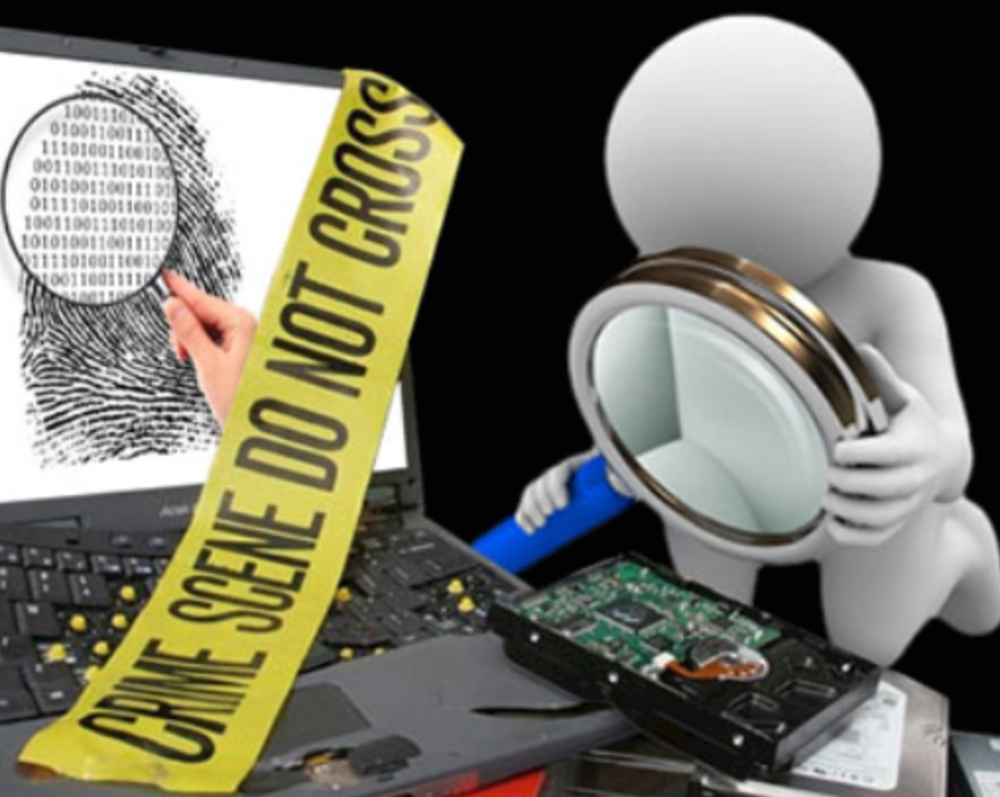
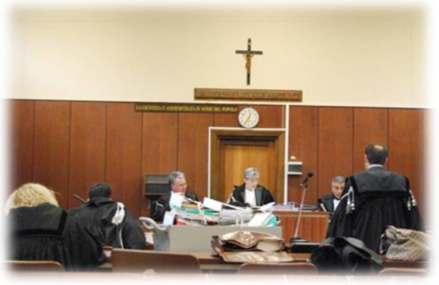
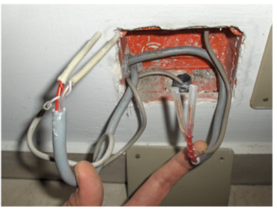
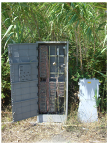
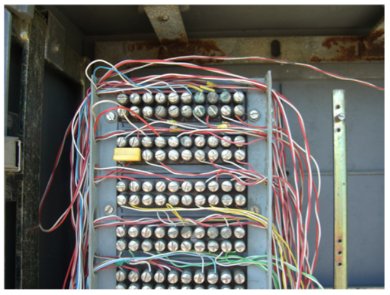

In questa prima unità vengono analizzati i **principi fondamentali** dell’informatica forense e il **ruolo centrale del consulente tecnico** nel processo giudiziario.  
L’obiettivo è comprendere come il **dato informatico**, pur essendo una fonte di informazione preziosa, presenti numerose **criticità**: può essere facilmente alterato, duplicato o cancellato, e richiede quindi un trattamento rigoroso per mantenere **valore probatorio**.

Si riflette sulla distinzione tra **dato, informazione e prova**, e sul perché la **metodologia forense** debba garantire integrità, tracciabilità e ripetibilità di ogni operazione.  
Questa unità introduce dunque il **cuore concettuale della disciplina**, ponendo le basi per affrontare in modo consapevole le fasi pratiche di acquisizione e analisi dei reperti digitali.

---

## **Lezione 1: Elementi, ruolo e criticità dell’informatica forense**

### **1. Che cos’è l’informatica forense**

L’**informatica forense** è la disciplina che studia i processi, le tecniche e gli strumenti necessari per **individuare, conservare, analizzare e interpretare i dati digitali** affinché possano essere utilizzati come **prove** in sede giudiziaria.  
Essa si occupa quindi di tutte le attività di **identificazione, protezione, estrazione e documentazione** del dato memorizzato su un qualsiasi supporto informatico, fisico o digitale.

Lo scopo è duplice: da un lato garantire **l’attendibilità tecnica** del dato, dall’altro assicurarne **l’utilizzabilità giuridica** nel processo.  
Per questo l’informatica forense unisce competenze di **informatica, sicurezza e diritto processuale**, applicando metodi scientifici al trattamento del dato probatorio.

---

### **2. L’approccio metodologico**

Il punto centrale dell’attività forense è l’**approccio metodologico**.  
Un consulente tecnico non può limitarsi a “cercare prove”, ma deve costruire un **percorso rigoroso e tracciabile** che consenta a chiunque di verificare i risultati ottenuti.  
Solo così le sue conclusioni potranno superare la cosiddetta **prova di resistenza giudiziaria**, cioè la verifica critica svolta dal giudice o dalle parti in contraddittorio.

L’informatico forense deve quindi:

- documentare ogni operazione (data, ora, strumenti, ambiente di lavoro);
    
- evitare qualsiasi alterazione dei reperti originali;
    
- garantire la **ripetibilità** dell’indagine da parte di altri esperti;
    
- mantenere la **neutralità tecnica**, senza invadere il campo dell’autorità giudiziaria.
    

Il CTU di informatica forense sarà il chiodo, martellato puntualmente da almeno una parte, quella il cui accertamento tecnico non andrà bene. Capita però che le parti che martellano siano molteplici.

---

### **3. Il ruolo del consulente tecnico**

Nell'immaginario collettivo, il consulente tecnico di informatica forense potrebbe essere pensato come uno di quei personaggi "alla CSI", ma così non è!

Nel procedimento giudiziario, il **consulente tecnico** (CTU o CTP) è la figura chiamata ad applicare la metodologia forense per **accertare i fatti digitali**.

Ergo, nella realtà dei fatti è spesso un professionista che svolge la propria attività professionale all'interno delle aule di giustizia, dove si trova a illustrare gli esiti dei propri accertamenti tecnici o ad essere comunque una figura di supporto per il giurista.

Il suo compito è tradurre il linguaggio tecnico dei sistemi informatici in un linguaggio **comprensibile al giudice** e giuridicamente rilevante.

Tuttavia, il consulente non deve mai sostituirsi all’investigatore o al magistrato.  
Il suo ruolo è quello del **tecnico esperto**, che fornisce analisi oggettive e verificabili: l’investigatore resta il **dominus dell’indagine**, mentre il consulente mette le **tecnologie forensi** al servizio dell’indagine come strumenti di ausilio, non come soluzioni assolute.

**MAI SOSTITUIRSI AL GIURISTA O ALL'INVESTIGATORE, E MEN CHE MENO AL GIUDICE!**

---

### **4. Le criticità del dato informatico**

Uno dei grandi problemi dell’informatica forense è la **fragilità e manipolabilità del dato digitale**.  
A differenza della prova materiale, il dato informatico può essere **alterato, cancellato o creato artificiosamente** in modo estremamente semplice e invisibile.

Le principali criticità sono:

- **alterazione dei reperti** (modifiche involontarie o dolose);
    
- **facile creazione di prove false**;
    
- **difficoltà nel ricondurre un reperto a un autore certo**;
    
- **volatilità dei dati**, che possono scomparire al semplice spegnimento del dispositivo.
    

Per questo motivo il consulente deve mantenere un atteggiamento di **diffidenza e autocritica costante**, ricercando **elementi di riscontro indipendenti** e verificando ogni informazione con più fonti.  
Il dato informatico, per sua natura, è **ingannevole** e deve essere trattato con la stessa cautela riservata a un reperto biologico in laboratorio.

---

### **5. L’effimero valore probatorio del bit**

Il **bit** rappresenta l’unità minima dell’informazione digitale, ma proprio la sua immaterialità lo rende **estremamente fragile come prova**.  
In qualsiasi momento della sua esistenza — dalla generazione alla memorizzazione — può essere modificato, anche in modo impercettibile, anche su supporti non scrivibili!
Analizzando un supporto informatico, non è quasi mai possibile dimostrare con certezza **se i bit siano stati alterati in precedenza** o se abbiano assunto altri valori.

Da questa consapevolezza nasce il principio della **presunzione di ripudio del dato informatico**:  
un’informazione digitale deve essere **considerata potenzialmente alterata**, finché chi la presenta non dimostri in modo tecnico e documentato la sua **autenticità e integrità**.

Questo principio è fondamentale nel diritto probatorio moderno:  
chi introduce in giudizio una prova digitale deve fornire anche **la dimostrazione della sua attendibilità** attraverso hash, log, copie forensi certificate e una catena di custodia ininterrotta.

---

### **6. Perché l’indirizzo IP è un indizio, non una prova**

Con l'obbiettivo di rappresentare le criticità dell'informatica forense, ora illustriamo un primo esempio di inaffidabilità o di incertezza/inattendibilità dei dati informatici, e soprattutto su come un CTU debba essere estremamente critico e paranoico su quelle che potrebbero essere conclusioni affrettate oppure anche attendibili ma non certe

In teoria, un indirizzo IP identifica in modo univoco un dispositivo in rete in un preciso istante. Nella declinazione forense, questa informazione viene interpretata così: _“Un certo IP pubblico era assegnato a un determinato contratto telefonico, quindi a un certo intestatario”_.  
Sulla carta sembra tutto lineare: l’IP → il provider → il contratto → l’intestatario.

Ma nella pratica reale questo percorso è molto più fragile di quanto si immagini. L’IP non rappresenta la **persona**, rappresenta **l’utenza**. E l’utenza, nella vita reale, può essere manipolata, condivisa, “rubata” o deviata.

---

#### **Caso 1 – L’IP “innocente”: chi usa davvero quel contratto telefonico?**

In questa immagine vediamo un quadro di distribuzione condominiale: fili intrecciati, collegamenti manuali...

Il problema è evidente:

- Il contratto telefonico è intestato a una persona.
    
- Ma qualcuno, fisicamente, ha collegato _altri_ appartamenti alla stessa linea tramite un semplice incrocio di fili.
    
- Questo significa che più persone possono usare la stessa utenza senza che il provider ne sia consapevole.
    

Risultato forense:

> L’indirizzo IP effettivamente utilizzato potrebbe appartenere non all’intestatario del contratto, ma a chi materialmente ha “dirottato” la linea.

E il CTU, se vuole risalire a chi stava usando davvero quella linea, deve _letteralmente seguire i fili nel condominio_.

---

#### **Il secondo esempio: la centralina di collettazione**

La seconda immagine mostra una centralina che raccoglie **tutte le linee telefoniche di un’intera area geografica**.  

Qui convergono i cablaggi di centinaia o migliaia di utenti.

Questo significa che:

- Il punto di consegna della rete non è direttamente l’appartamento dell’utente,
    
- ma un nodo condiviso,
    
- nel quale tecnici (autorizzati o intrusi) possono fare collegamenti, deviazioni, doppi innesti, oppure semplici errori umani.
    

> Un errore o un collegamento male assortito in quel nodo può far risultare attività internet attribuite a un soggetto completamente estraneo.

---

Se zoommiamo si vede un dettaglio ancora più eloquente:  

alcuni doppini possono essere collegati ad altri manualmente, con clip o morsetti.

Questo consente a chiunque abbia accesso fisico a quel punto di rete di:

- utilizzare la linea di un altro,
    
- fare telefonate con utenza altrui,
    
- andare su Internet usando un IP che, documentalmente, risulta assegnato a un altro utente,
    
- deviare o condividere la linea senza alcuna traccia digitale immediatamente riconducibile alla manipolazione.
    

---

Il messaggio è cruciale:

#### **Un CTU non può mai “accusare un IP”. Un CTU analizza persone, contesti e infrastrutture.**

L’IP è un indizio, non una prova.  
Un indizio che può essere:

- corretto ma incompleto,
    
- corretto ma riferito a un’intestazione sbagliata,
    
- corretto ma riferito a un’utenza manipolata,
    
- o semplicemente fallace perché la rete fisica è stata manomessa.
    

Per questo un CTU deve essere **critico, diffidente e quasi paranoico**:

- mai dare per scontato che l’intestatario sia l’autore di un’azione,
    
- mai basare conclusioni solo sul matching IP → contratto,
    
- sempre cercare ulteriori elementi: apparecchi, log locali, comportamenti, compatibilità orarie, abitudini digitali, evidenze fisiche o logiche che confermino davvero la paternità di un’azione.
    

E soprattutto:

> Se la rete fisica non è integra, l’IP non attribuisce nulla.  
> Attribuisce solo un sospetto, che va confermato con indagini più profonde.

---

### **7. Due casi reali del 1994: quando la data di un file diventa un falso alibi (o un vero riscontro)**

Nel 1994 vennero affrontati due casi giudiziari molto interessanti per l’informatica forense. Entrambi ruotavano attorno allo stesso tema: **quanto è affidabile la data e l’ora associate a un file informatico?**  
Sebbene le situazioni fossero simili, le conclusioni furono completamente diverse. Vediamole.

---

#### **1. Il dischetto usato come “alibi informatico”**

Nel primo caso, un imputato di violenza sessuale consegnò agli investigatori un **dischetto** che avrebbe dovuto provare la sua innocenza. Sosteneva infatti che, nel momento del reato, si trovasse altrove a scrivere una relazione tecnica con il programma **OliText**, un processore di testi **DOS** molto diffuso negli uffici italiani negli anni ’80 e ’90 e sviluppato da Olivetti, e che quel documento fosse stato salvato proprio in quell’orario.

Il **perito informatico** incaricato dal giudice analizzò il dischetto.  
Effettivamente, **data e ora del file** coincidevano perfettamente con l’alibi dell’imputato.

Tuttavia, la perizia mise in luce un punto fondamentale:  
**la data e l’ora di un file possono essere facilmente modificate da qualsiasi utente**, con semplici operazioni disponibili su qualunque computer dell’epoca.

Non servivano competenze particolari, né strumenti professionali. Era sufficiente cambiare la data del sistema o usare funzioni del software per alterare i metadati.

Conclusione del perito:  
**quel dischetto non costituiva una prova affidabile**, perché la data del file poteva essere stata manipolata dall’imputato stesso.  
L’alibi informatico crollò.

---

#### **2. Il caso del notaio smemorato e la scrittura privata**

Sempre nel 1994 si presentò un secondo caso, questa volta relativo a un **omicidio**.  
L’imputato dichiarava di trovarsi lontano dal luogo del delitto perché, proprio in quell’orario, si trovava **presso un notaio** per firmare una scrittura privata.

Il notaio, però, non era in grado di ricordare con certezza quel giorno: non poteva confermare né smentire.  
Come riscontro, fu portato il **documento informatico** utilizzato per stampare la scrittura privata: la data e l’ora di modifica sembravano compatibili con l’alibi.

Anche qui fu nominato un **perito informatico**, che analizzò:

- il computer del notaio,
    
- eventuali copie di backup presenti nello studio,
    
- e la coerenza interna dei metadati.
    

Questa volta, però, emerse un elemento decisivo:  
**l’imputato non aveva alcuna possibilità di accedere al computer del notaio o di modificarne la data di sistema.**

Il perito verificò inoltre che i vari file di backup presenti nello studio riportavano **date coerenti** tra loro e compatibili con la normale attività del professionista.

Conclusione del perito:  
in questo caso **la data e l’ora del documento erano attendibili**, perché l’imputato non aveva strumenti né possibilità materiali di manometterle.

Dunque, con ragionevole certezza:

- il documento era stato effettivamente redatto nel giorno indicato,
    
- la scrittura privata risultava realmente firmata in quell’orario,
    
- **l’alibi poteva essere considerato credibile**.
    

---

#### **Perché questi due casi sono così importanti**

Questi due esempi, pur essendo simili nella forma, mostrano due situazioni opposte:

1. **Quando l’utente può manipolare data e ora**, la prova informatica **non è attendibile**.
    
2. **Quando l’utente non può intervenire sul sistema**, e i riscontri tecnici sono coerenti, la prova può essere considerata **affidabile**.
    

In informatica forense questo principio è essenziale:  
**la data di un file non è una prova “forte” di per sé. Diventa affidabile solo se il contesto tecnico esclude la possibilità di manipolazioni.**

---

### **8. Un esempio emblematico: il caso “Vierika”**

Allego il pdf per chi volesse consultarlo:

vi basta andare nella cartella imgs di questa unità e cercare 8_sentenzaVierika.pdf

Un caso storico della giurisprudenza italiana (Tribunale di Bologna, 2005) mostra quanto sia delicato il tema del **metodo forense**.  
Nel cosiddetto **caso “Vierika”**, un consulente informatico sviluppò e diffuse un _worm_ scritto in Visual Basic, capace di auto-replicarsi tramite e-mail e modificare i parametri di sicurezza dei sistemi Windows.

L’indagine giudiziaria si concentrò non solo sull’accertamento tecnico del codice, ma soprattutto sulla **correttezza del metodo utilizzato** per acquisire e analizzare i dati.  
Il Tribunale stabilì che un risultato tecnico non può essere rifiutato solo perché non segue la “migliore pratica scientifica”, a meno che non sia provato che il metodo abbia **concretamente alterato i dati**.  
Ciò conferma che **la validità della prova digitale dipende dal metodo**: più è scientifico e documentato, maggiore è la sua forza probatoria.

Il caso dimostrò anche come le **misure di sicurezza** di un sistema (come i livelli di protezione del browser) costituiscano veri e propri **limiti giuridici di accesso**, la cui violazione integra i reati di **accesso abusivo a sistema informatico (art. 615-ter c.p.)** e **diffusione di programmi dannosi (art. 615-quinquies c.p.)**.

---

### **9. Sintesi finale**

In questa lezione abbiamo compreso che:

- L’informatica forense è una **scienza del metodo**: ogni prova deve essere tracciabile, ripetibile e verificabile.
    
- Il **consulente tecnico** opera come ponte tra mondo informatico e giudiziario, ma non può sostituirsi al giudice o all’investigatore.
    
- Il **dato informatico** è fragile, mutevole e deve essere trattato con estrema cautela.
    
- Il **bit** ha un valore probatorio effimero: solo un metodo rigoroso può garantirne l’autenticità.
    
- La **presunzione di ripudio** impone a chi introduce una prova digitale di dimostrarne la genuinità.
    
- Il **caso Vierika** ha segnato un punto di svolta, chiarendo l’importanza del metodo e del corretto rapporto tra tecnica e diritto.