## **Lezione 2: Attendibilità del dato informatico (parte 1)**

### **1. La natura del dato informatico**

Il **dato informatico** è una **successione di bit**, cioè di 0 e 1, registrata su un qualsiasi dispositivo di memorizzazione digitale.  
Ogni informazione digitale – testo, immagine, video o suono – è rappresentata da sequenze binarie che descrivono, in modo convenzionale, i contenuti che un computer può interpretare.

Esempio: la parola “Ciao” corrisponde, in codice ASCII, alla sequenza:

```
C   i   a   o
01000011 01101001 01100001 01101111
```

Tale rappresentazione binaria mostra che **il dato informatico non è mai qualcosa di stabile o “naturale”**, ma una configurazione temporanea di bit scritti in un supporto elettronico che può essere modificato in qualunque momento.

---

### **2. La mutabilità del dato digitale

Un aspetto cruciale dell’informatica forense è la **consapevolezza che il dato informatico non è intrinsecamente affidabile**.  
Ogni volta che un operatore o un processo impartisce un comando, lo stato del dispositivo di memorizzazione può cambiare.  
Di conseguenza, una sequenza di bit che oggi leggiamo come “Ciao” potrebbe in passato essere stata diversa, e nulla nel dato stesso ci consente di saperlo con certezza.

Questo porta a una conclusione fondamentale:

> Analizzando un dato informatico, **non è possibile accertare** se esso sia stato modificato, quante volte, da chi, o in quale momento.

In termini probatori, ciò significa che il **dato informatico è per sua natura potenzialmente inattendibile**, finché non ne venga dimostrata l’integrità tramite strumenti forensi certificati.

---

### **3. L’attendibilità: un esempio pratico

Immaginiamo un dipendente che, lasciando un’azienda, restituisca il proprio computer.  
Senza un’adeguata analisi forense, non potremo mai sapere **se e quando siano stati creati, modificati o cancellati file**, né se le date di sistema siano state manipolate.

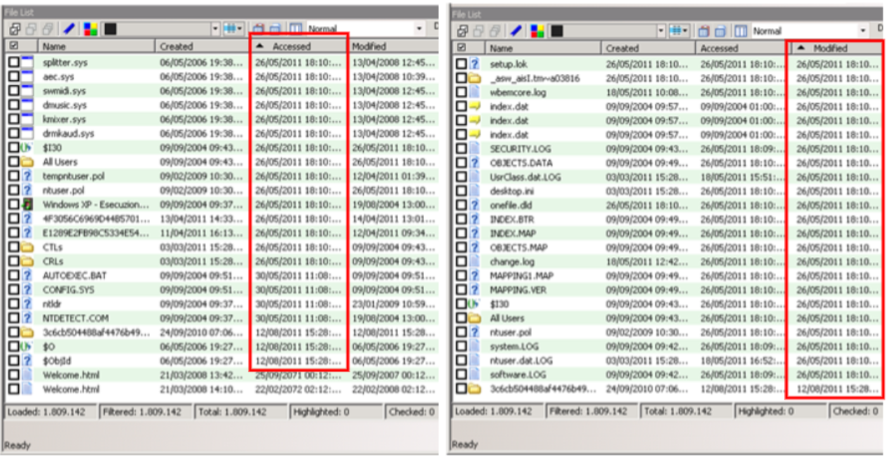

Così come anche i riferimenti temporali del sistema sono facilmente modificabili:


E quindi poi si può andare a modificare i metadati di un file con il vantaggio di essere "andati indietro nel tempo":

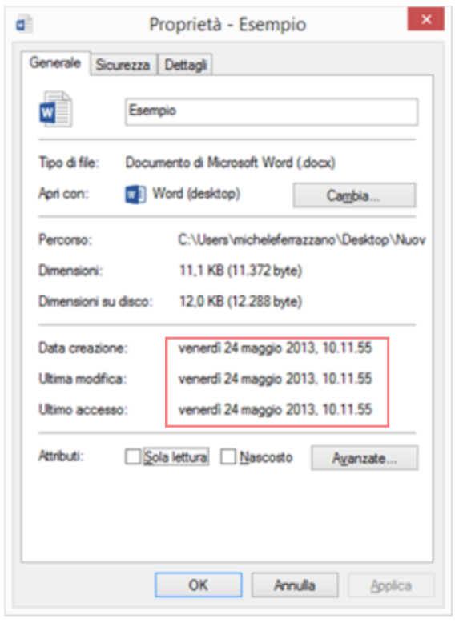

E quindi l'imputato può sostenere che quel file non lo ha minimamente toccato in quanto l'ultimo accesso/modifica risale a quando non aveva ancora comprato il computer, giusto per intenderci.
Però questo è solo un rudimentale modo di falsificare dati informatici.

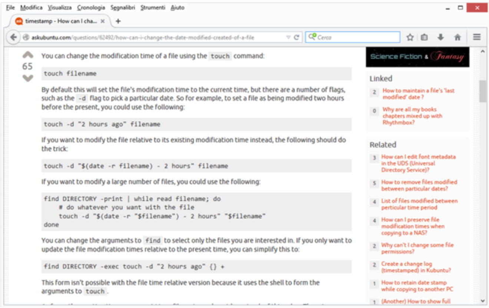

Attraverso comandi come `touch` (in ambiente Unix/Linux o macOS), è possibile modificare arbitrariamente le **date di creazione, ultimo accesso e ultima modifica** di un file, rendendo completamente inaffidabili i metadati che solitamente consideriamo prova temporale.

Esempio:

```
touch -a -m -c -t 201305241011.55 Esempio.docx
```

Questo semplice comando imposta artificialmente le tre date del file al **24 maggio 2013, ore 10:11:55**, senza lasciare tracce evidenti.  
Ne deriva che, se un file viene prodotto in giudizio come prova, le sue **informazioni temporali** non possono essere accettate come autentiche senza ulteriori verifiche tecniche.

---

### **4. Conseguenze giuridiche

Dal punto di vista forense, il problema dell’attendibilità del dato informatico ha riflessi diretti sulla **validità della prova digitale**.  
Un file, un log o un’e-mail **non sono automaticamente credibili**: la loro autenticità deve essere dimostrata con strumenti di verifica oggettivi (hash, firma digitale, marca temporale, PEC).

Di conseguenza, il consulente tecnico o il giudice non possono considerare “veri” i contenuti digitali basandosi solo sul loro aspetto esteriore.  
Serve un procedimento metodologico che accerti:

1. **L’integrità** del dato → non è stato alterato dal momento dell’acquisizione;
    
2. **L’autenticità** → proviene effettivamente dalla fonte dichiarata;
    
3. **La legittimità** dell’acquisizione → il reperto è stato ottenuto rispettando le norme processuali.
    

Solo rispettando queste tre condizioni un dato digitale può assumere **valore probatorio effettivo**.

---

### **5. L’inattendibilità nella pratica: l’esempio dell’e-mail

Analoghe considerazioni a quelle fatte per i file presenti su un file system possono essere estese anche ad altre tipologie di dati informatici.  
Finora abbiamo visto documenti e file salvati sul disco; ora consideriamo un’altra categoria molto delicata: **le e-mail**.

Le e-mail, infatti, godono dello stesso livello di fragilità e scarsa attendibilità **quando si trovano nella disponibilità della persona che ha interesse a produrle come prova**.  
Se ho io stesso la possibilità materiale di accedere al messaggio, salvarlo, modificarlo e poi stamparlo o produrlo, allora anche quel dato rischia di essere stato alterato.

Per chiarire questo aspetto, il professore ha mostrato un esempio pratico: un’e-mail inviata da “Cleopatra” ad “Antonio” contenente un invito.  
Questa e-mail può essere alterata con estrema semplicità.

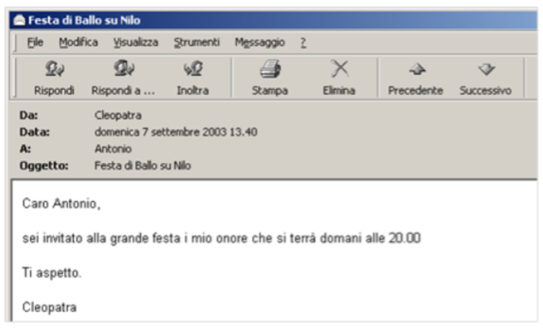

#### **Come si può creare o falsificare un’e-mail?**

L’operazione mostrata dal prof è molto semplice:

1. Con un comune client di posta elettronica si crea un nuovo messaggio.

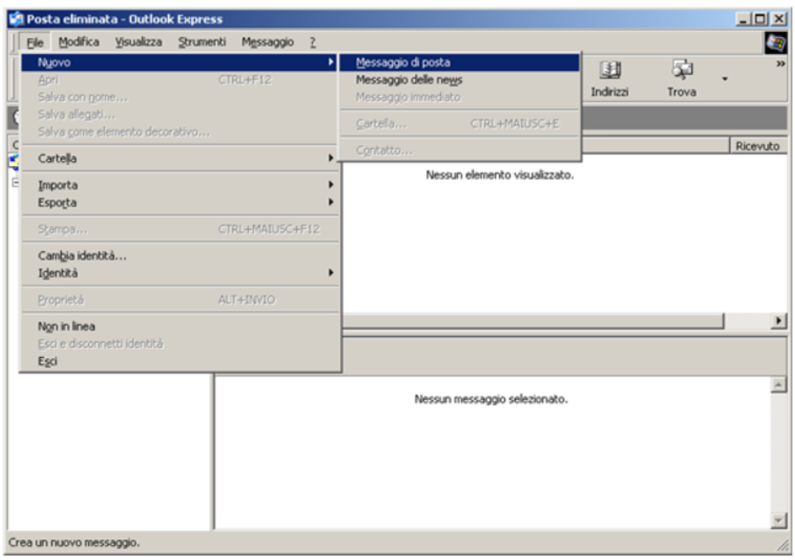

2. Si inserisce il testo desiderato e lo si salva.

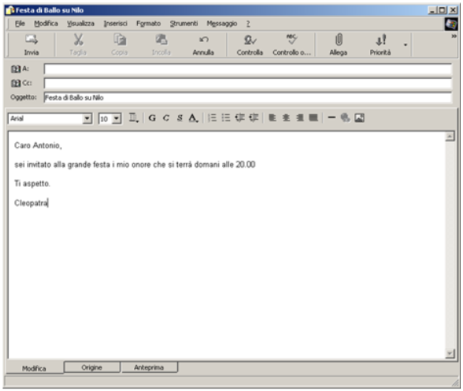

3. Successivamente, si apre quel file con un semplice editor come **Blocco Note**

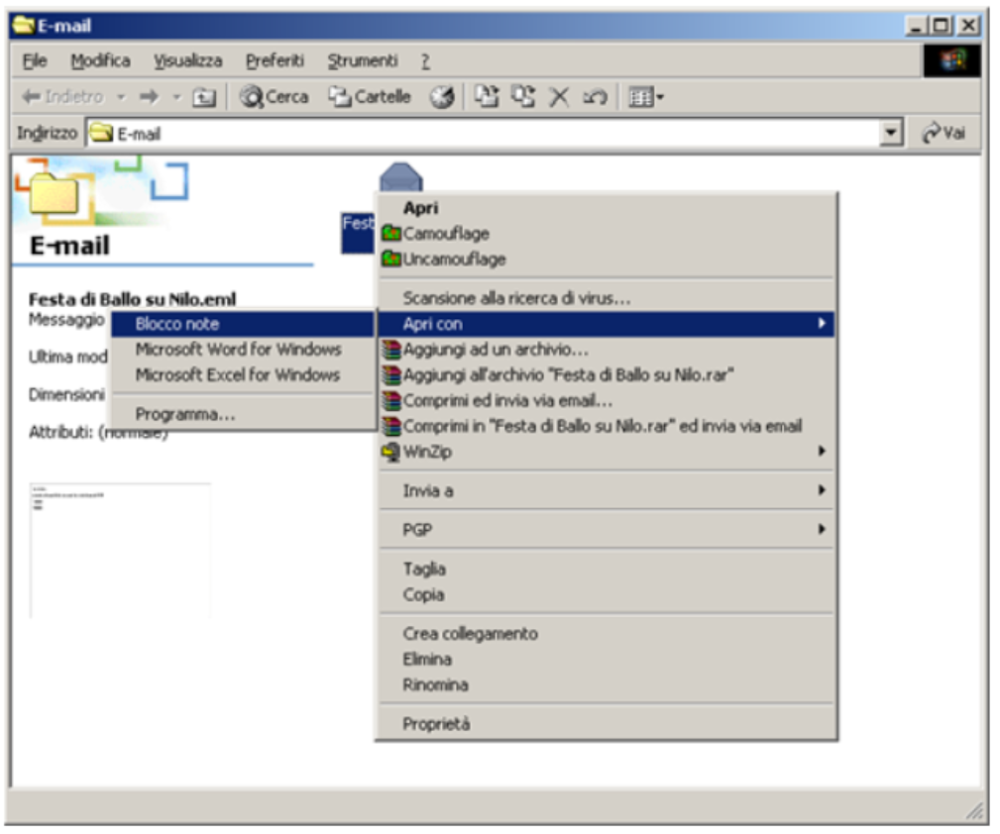
e si interviene direttamente sui dati presenti negli **header** dell’e-mail (i campi tecnici che la compongono).

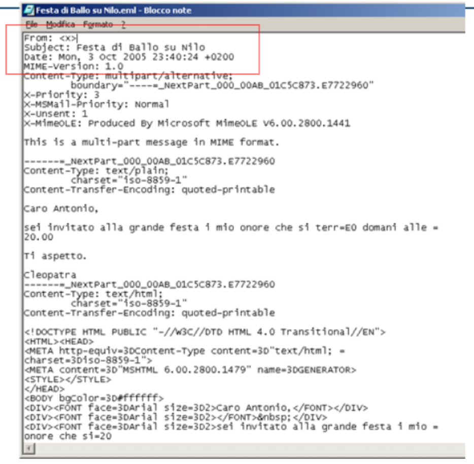

    
5. In questo modo si possono modificare a piacimento:
    
    - il campo **From:** (ad esempio impostandolo su _[cleopatra@egitto.it](mailto:cleopatra@egitto.it)_),
        
    - il campo **To:** (ad esempio _[antonio@impero.it](mailto:antonio@impero.it)_),
        
    - e altri metadati.
        
6. Una volta effettuate le modifiche, il file così alterato viene importato (trascinato) dentro il client di posta, ad esempio **Outlook Express**, collocandolo nella cartella “Posta inviata”.

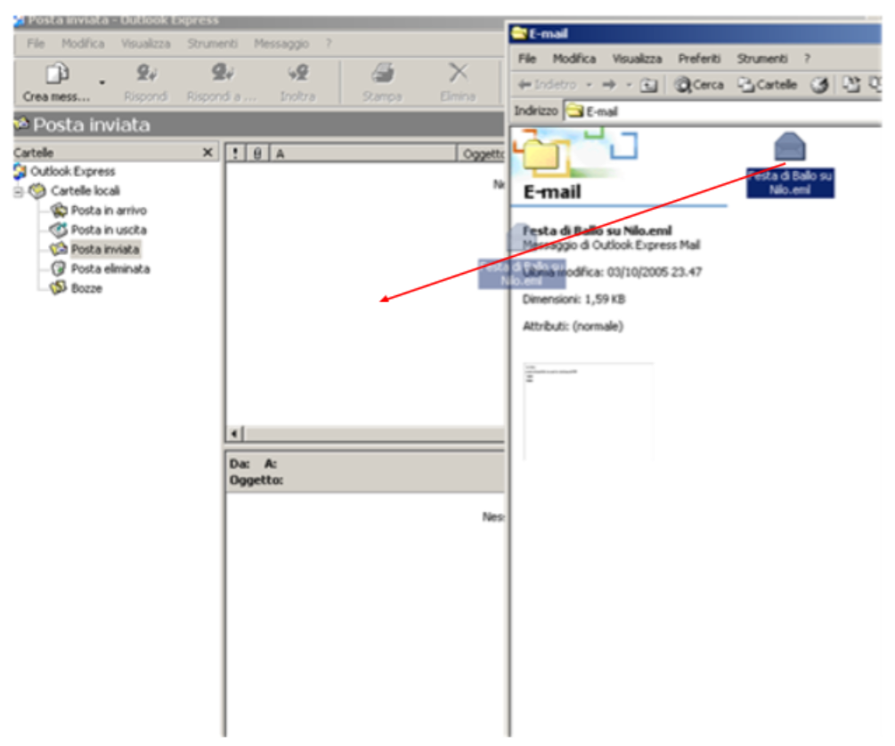

Il risultato?  
Dal punto di vista del client di posta **tutto appare perfettamente autentico**, come se quel messaggio fosse stato realmente inviato da Cleopatra ad Antonio in una data e ora precise. 

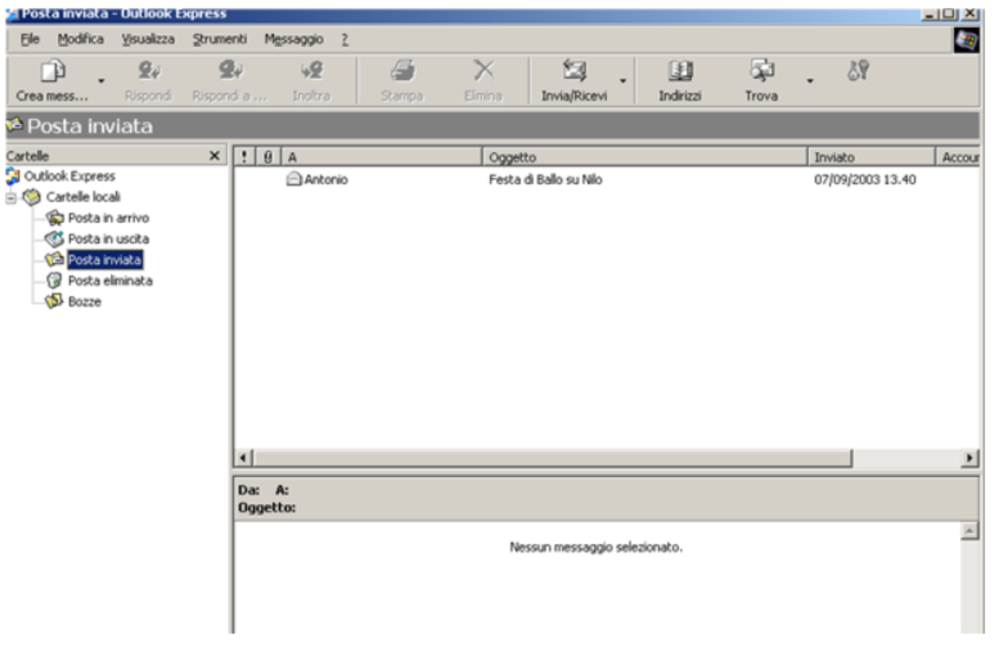

E quando si effettua l’analisi forense di quella casella di posta, l’e-mail sembrerà coerente con un normale messaggio inviato dal computer di Cleopatra.

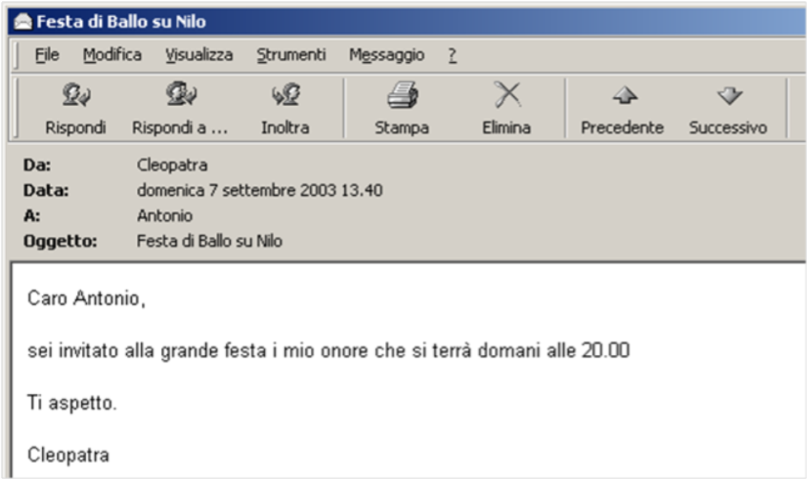

Anche l'analisi degli header sarebbe coerente col messaggio inviato...

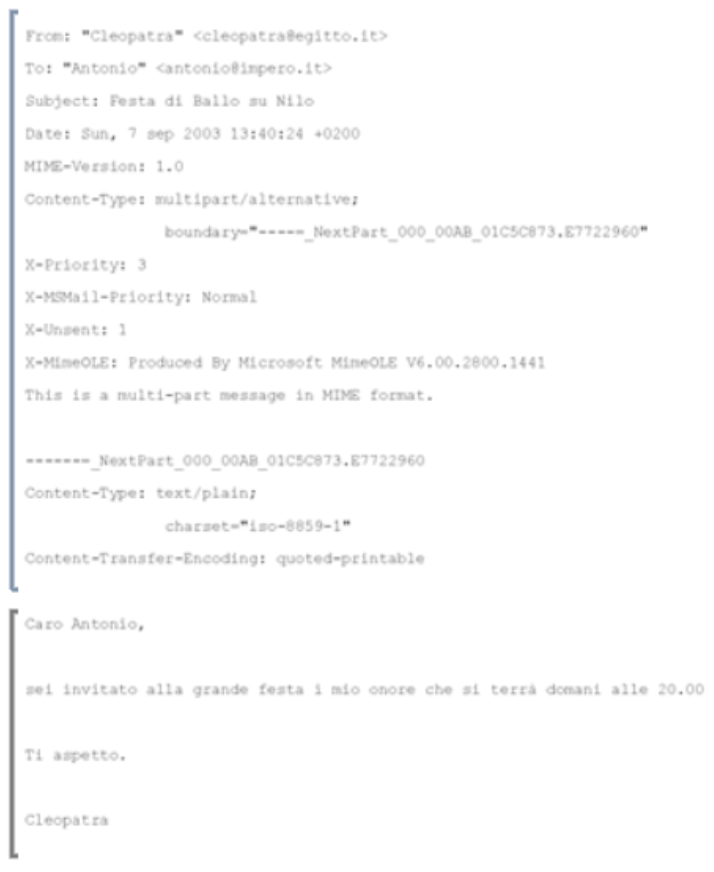

Un consulente tecnico forense sa identificare le manipolazioni, ma **il problema di fondo resta**:  
quando il messaggio si trova **presso chi ha interesse a produrlo**, esso è **presuntivamente inattendibile** fino a prova contraria.

Per considerare attendibile un’e-mail, servono ulteriori verifiche.  
Una di queste consiste nell’individuare **la stessa e-mail su un altro sistema informatico**, diverso e non controllabile da chi la produce come prova.  
Oppure occorre analizzare elementi tecnici che permettano di escludere che la persona abbia potuto intervenire sul sistema modificandone il contenuto.

---

### **6. La stessa problematica si pone anche per le pagine web**

Un caso analogo riguarda la produzione in giudizio di **pagine web**.


Capita spesso che una parte produca una pagina web che oggi non è più disponibile online (per esempio una pagina diffamatoria), presentandone la stampa o esportandola in formato HTML.  
Ma se quella pagina proviene dal computer di chi la produce, non può essere ritenuta automaticamente attendibile.

Il motivo è semplice:  
prima di stamparla o salvarla sul supporto informatico, **la persona avrebbe potuto modificarla** in qualunque sua parte.  
E la pagina HTML, una volta salvata, può essere aperta da un editor di testo e alterata senza lasciare tracce evidenti.

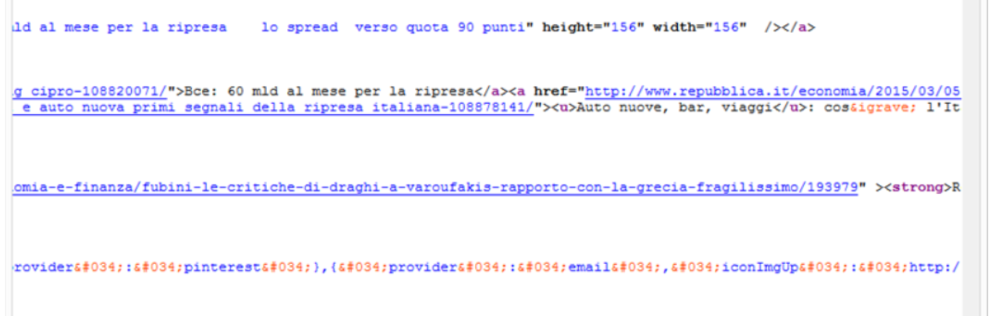

Quando poi la pagina viene stampata su carta o prodotta come file HTML, il risultato può apparire perfettamente coerente con l’originale pubblicato su Internet, anche se in realtà è stato manipolato.


Per questo, anche nel caso delle pagine web, la stampa o il file HTML prodotto **dal soggetto interessato** non può essere considerato attendibile.

---

### **7. Allora il dato informatico è sempre inattendibile? No.**

A questo punto sembrerebbe che il dato informatico **sia sempre manipolabile** e quindi privo di valore probatorio.  
Ma non è così.

Le casistiche illustrate non servono a svalutare il dato informatico, bensì a ricordare al consulente tecnico che **deve sempre considerare la possibilità che i dati siano stati alterati prima dell’acquisizione**, sia:

- **dolorosamente** (alterazioni volontarie per creare un falso elemento probatorio),
    
- **colposamente** (manipolazioni accidentali o inconsapevoli).
    

Tuttavia, ci sono molte situazioni in cui il dato informatico può essere considerato **pienamente attendibile**.

### **8. Quando il dato informatico è attendibile?**

Un dato è affidabile quando è protetto da strumenti che garantiscono la sua integrità:

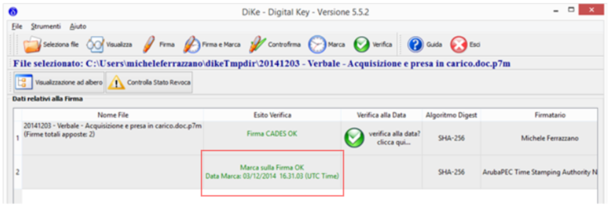

- **Firma digitale** → garantisce identità dell’autore e integrità del contenuto.
    
- **Marca temporale** → attribuisce data e ora certa, opponibile a terzi.
    
- **PEC (Posta Elettronica Certificata)** → certifica invio, ricezione e contenuto del messaggio.
    

Questi strumenti consentono di documentare con elevato grado di certezza:

- la **data** di formazione del documento,
    
- la **paternità**,
    
- l’**integrità** del contenuto.
    

Il consulente tecnico li usa anche per documentare le proprie operazioni: ad esempio, in un verbale di acquisizione, può applicare una marca temporale o calcolare hash (MD5, SHA-1) dei reperti informatici, così da dimostrare in futuro che quei file, in quella data, avevano esattamente quel contenuto.

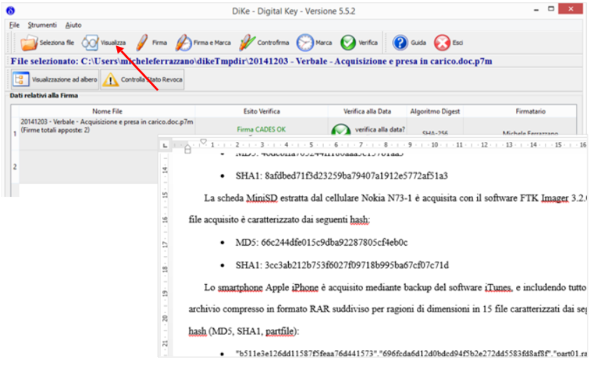

---

### **9. L’importanza della catena di custodia**

Sulla base di tutto ciò, diventa fondamentale valutare **come** il reperto informatico è stato consegnato e **soprattutto da chi** è stato detenuto prima dell’acquisizione.

Casi tipici in cui la cautela è essenziale:

- quando il reperto è consegnato **dallo stesso imputato** per sostenere un proprio alibi, e l'esempio più noto è un caso di cronaca nera indelebile per l'Italia: Garlasco;
    
- quando il reperto è consegnato **dal datore di lavoro** in un contenzioso contro un dipendente che utilizzava quel computer.
    

In tali situazioni, il consulente tecnico non deve limitarsi a rispondere al quesito del giudice, ma deve anche:

- valutare l’attendibilità del reperto,
    
- segnalare criticità,
    
- verificare se le operazioni precedenti l’acquisizione siano state legittime,
    
- considerare possibili scenari compatibili con i dati trovati.
    

---

### **10. Conclusione**

Il dato informatico **può essere alterato**, falsificato o inquinato.  
Proprio per questo, il consulente tecnico deve sempre verificare attentamente **integrità** e **autenticità** del reperto.

Ma, quando sono presenti adeguate garanzie tecniche (firma digitale, PEC, marca temporale, hash, corretta catena di custodia), il dato informatico può assumere un **elevatissimo valore probatorio**.

---
