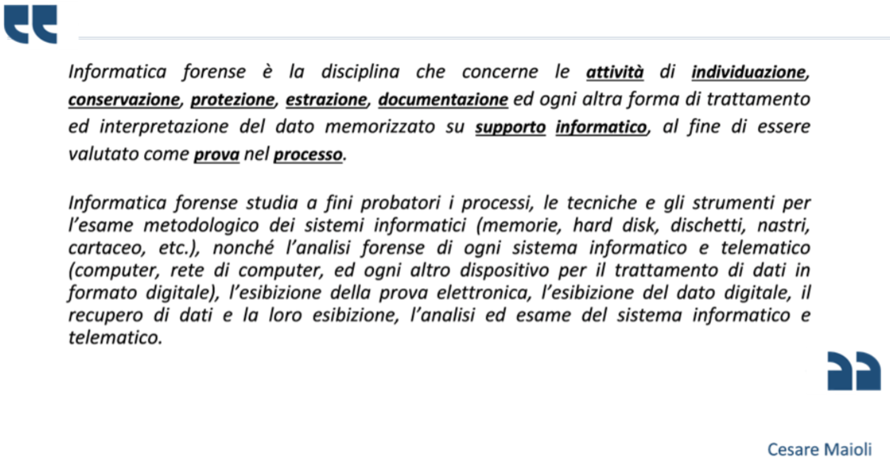
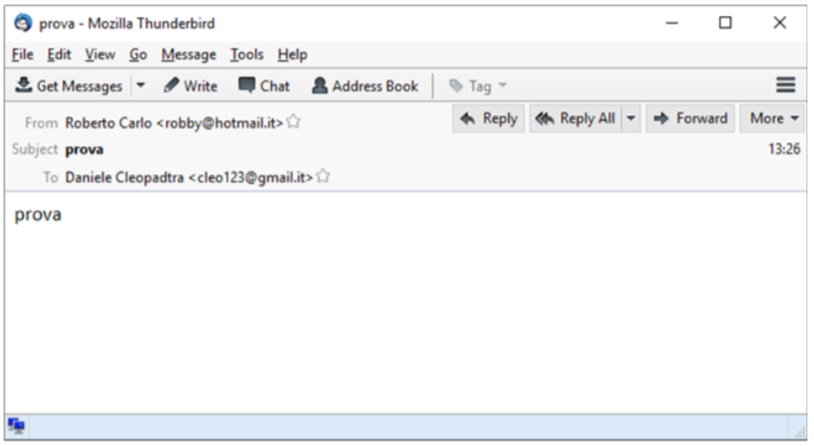
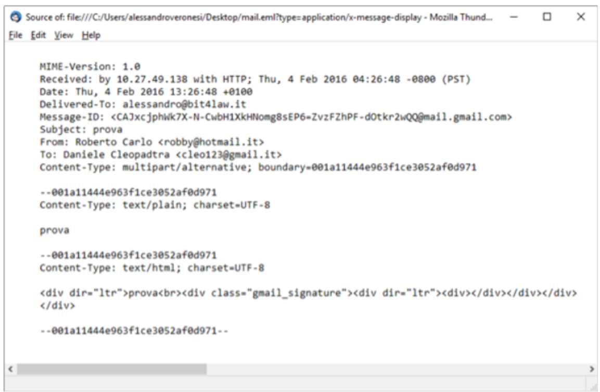
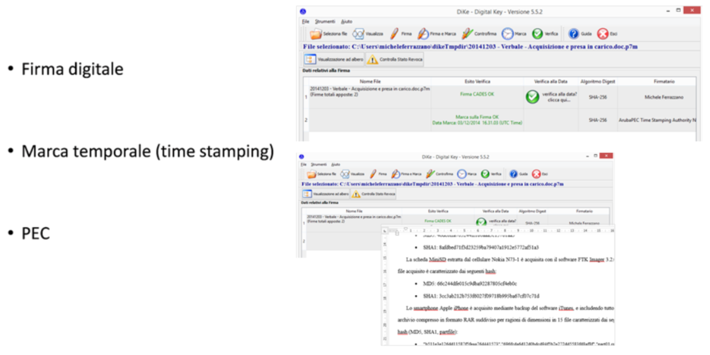
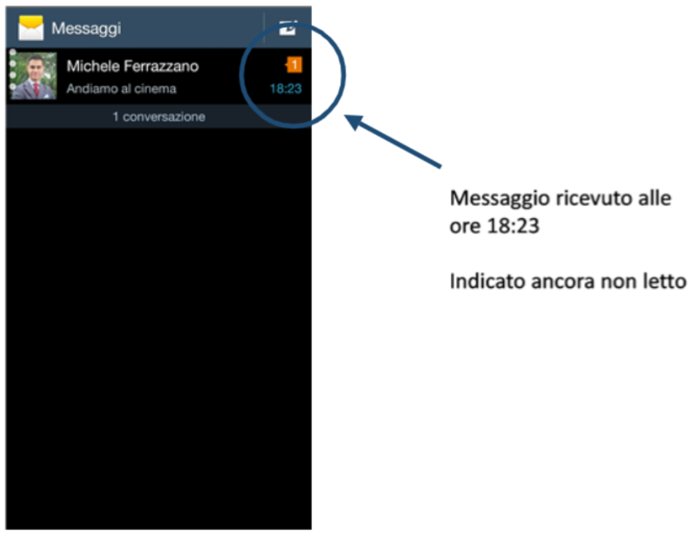
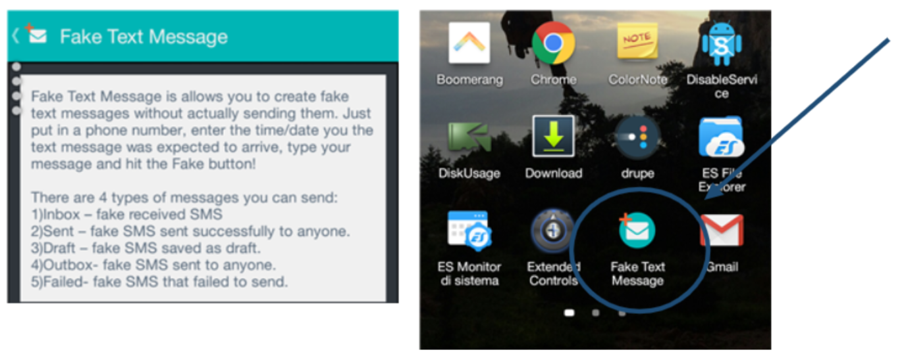
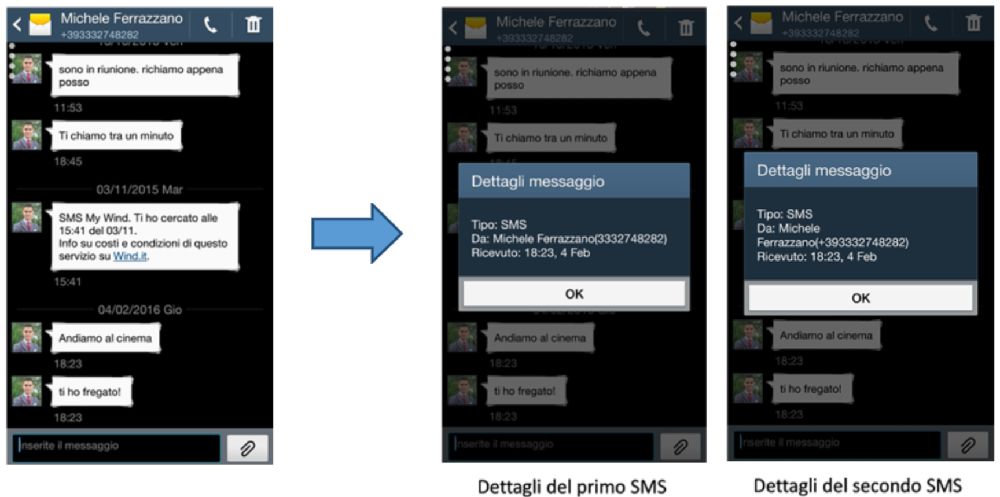
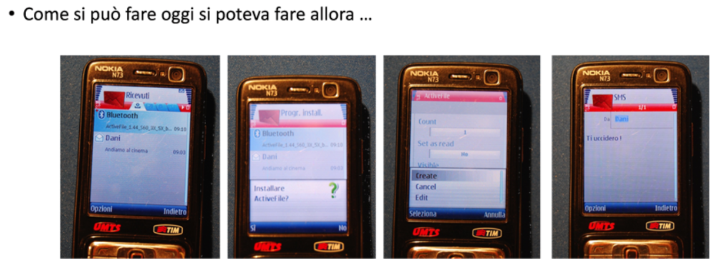
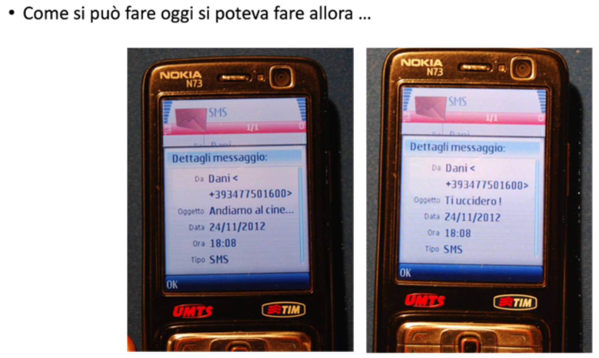
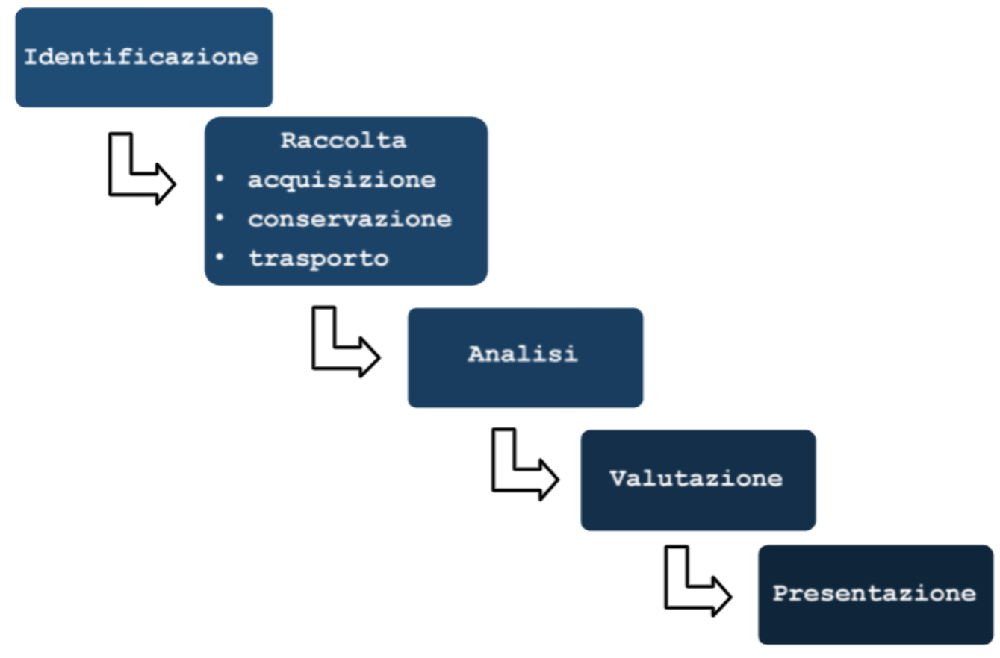

## **Lezione 3: L’approccio metodologico nell’informatica forense**

Prima di iniziare, rivediamo la definizione:

### **1. Il valore del metodo nella ricerca della verità**

Questa frase riassume perfettamente la filosofia dell’**informatica forense**: i dati, da soli, non bastano.  
Ciò che conferisce valore giuridico a una prova digitale non è la sua semplice esistenza, ma il **modo in cui essa viene trattata, analizzata e presentata**.

Nell’attività forense, il dato grezzo equivale a un “fatto” privo di senso.  
Solo attraverso un **percorso metodologico rigoroso**, documentato e ripetibile, il consulente tecnico può trasformarlo in **prova scientifica**.  
Questo percorso deve essere in grado di resistere alla **“prova di resistenza giudiziaria”**, ovvero alle contestazioni delle parti e al controllo del giudice.

---

### **2. La prova di resistenza**

La **prova di resistenza** è il banco di prova della solidità del metodo.  
Essa richiede che ogni operazione compiuta dal consulente sia:

- **documentata** nei minimi dettagli (data, ora, strumenti, ambiente operativo);
    
- **ripetibile** da un altro esperto con gli stessi risultati;
    
- **trasparente** e verificabile in contraddittorio.
    

Solo se l’intero processo di acquisizione e analisi segue queste regole, il consulente può difendere in aula le proprie conclusioni senza che vengano invalidate.  
In sintesi: **il metodo è la prova**, e la prova vale solo se il metodo regge.

---

### **3. I limiti dell’informatica forense**

Nonostante l’evoluzione tecnologica, l’informatica forense resta una scienza esposta a molte criticità.  
Tra i principali **limiti operativi** vi sono:

- la **facile, estremamente facile, alterazione dei reperti**, anche involontaria;
    
- la **possibilità di creazione artificiale di prove digitali**;
    
- la **difficile attribuzione certa** di un’azione a un autore specifico;
    
- la necessità di una costante **autocritica professionale**;
    
- la consapevolezza che **il reperto informatico è ingannevole** e necessita di una verifica “paranoica” di riscontro. Ricercare in maniera paranoica elementi di riscontro è il minimo!
    

L’esperto forense deve dunque mantenere un atteggiamento di **diffidenza metodologica**: non dare mai nulla per certo, nemmeno ciò che sembra evidente, **ANCHE SU CIO' CHE E' GIA' STATO ACCERTATO!**

---

### **4. La valutazione del reperto informatico**

Entriamo ora nel merito della **valutazione del reperto informatico**, una delle attività più delicate nella consulenza tecnica forense.

Un primo elemento che il consulente tecnico deve considerare riguarda la **legittimità delle operazioni di acquisizione** dei reperti informatici.  
Questa verifica è fondamentale in due situazioni:

1. **Quando egli stesso sta per acquisire il reperto**, e quindi deve assicurarsi, prima dell’acquisizione, che le modalità siano corrette e rispettose delle procedure.
    
2. **Quando, più spesso, il consulente non analizza direttamente il reperto grezzo ma analizza criticamente il lavoro svolto da un altro collega**.
    

È infatti molto frequente che il consulente tecnico venga chiamato non tanto a eseguire nuove acquisizioni, quanto a valutare criticamente **il modo in cui un altro tecnico ha eseguito l'analisi**, verificando se la sua condotta sia stata tecnicamente corretta e se le operazioni da lui svolte siano state effettuate nel rispetto delle garanzie procedurali.

Questa riflessione richiama il concetto discusso nelle lezioni precedenti di **prova di resistenza**: il dato informatico, per essere attendibile, deve “resistere” alla verifica critica delle modalità con cui è stato raccolto.

Per questo, nella fase di valutazione del reperto informatico, è necessario verificare **anche le operazioni di acquisizione svolte sul reperto**, siano esse state eseguite dal consulente stesso (prima dell’analisi) oppure da un collega (e quindi da valutare successivamente).

L’obiettivo del consulente tecnico è quindi quello di **rilevare elementi utili** affinché l’autorità giudiziaria possa esprimere un giudizio sulla:

- **attendibilità del reperto** e dell'accertamento stesso
    
- **integrità** (cioè che i dati non siano stati alterati),
    
- **autenticità** (ovvero la possibilità di attribuire i dati rinvenuti a una specifica persona).
    

---

### **5. Importanza di documentare accuratamente l’acquisizione**

L’acquisizione del reperto deve essere **descritta nei minimi dettagli**.  
Questo significa:

- indicare **le modalità esatte** con cui l’acquisizione è stata effettuata;
    
- documentare **ogni operazione tecnica** svolta;
    
- specificare **gli strumenti software e hardware utilizzati**.
    

Questa trasparenza è essenziale, perché una cattiva documentazione apre la porta a contestazioni sulla correttezza dell'acquisizione e quindi sulla stessa affidabilità del reperto.

---

### **6. Il caso dell’acquisizione live: un esempio di criticità**

Quando l’acquisizione riguarda dati **estremamente volatili**, come la **RAM**, si procede con una modalità detta _live acquisition_.  
Tuttavia, se questa operazione avviene **senza la presenza della controparte**, l’acquisizione diventa facilmente contestabile.

La controparte, non avendo potuto assistere alla procedura, potrà legittimamente sostenere che:

- alcuni dati non siano stati acquisiti,
    
- oppure che la loro manipolazione (volontaria o involontaria) abbia compromesso informazioni potenzialmente decisive per la difesa.
    

Ecco perché l’acquisizione di dati così volatili **dovrebbe avvenire in contraddittorio**, o comunque il consulente deve aspettarsi **fortissime critiche** qualora utilizzi tali dati in giudizio senza che la controparte abbia potuto verificarne la correttezza.

---

### **7. Criticità: produzione di e-mail prive di metadati**

Un altro esempio ricorrente riguarda i casi in cui vengono prodotte in giudizio **e-mail** senza che sia possibile verificarne i **metadati** (dal latino *datum*, informazione, ergo descrizione di un insieme di dati) cioè:

- gli header completi,
    
- il percorso attraverso i server,
    
- le tracce tecniche di inoltro.
    

Questi metadati sono essenziali:  
permettono di capire se l’e-mail è autentica o se si tratta di un documento artificiale, costruito con un semplice editor di testo.

Infatti, come visto nelle lezioni precedenti, **un’e-mail può essere creata o modificata ad arte**:

- si scrive il contenuto,

    
- si salvano gli header manipolati,

- la si importa nel client di posta nella cartella “posta inviata”.
    

Senza i metadati originali, la controparte può sostenere — a ragione — che il proprio diritto di difesa è stato compresso, perché non può verificare:

- l’autenticità dell’e-mail,
    
- il reale mittente,
    
- il percorso attraverso i server,
    
- la data e l’ora effettive di invio.
    

---

### **8. Ma attenzione: non tutti i reperti sono così fragili**

Quando il consulente analizza reperti che:

- hanno **firma digitale**,
    
- hanno una **marca temporale**,
    
- sono **PEC** (posta elettronica certificata),
    

l’integrità e l’autenticità del dato sono molto elevate.  
In questi casi, la possibilità di manipolazione è estremamente ridotta, e il reperto gode di un’attendibilità tecnica molto robusta.

---

### **9. Ulteriori attività cruciali per la valutazione del reperto**

Oltre a quanto detto, la valutazione dell’attendibilità passa attraverso una serie di attività tecniche:

#### **a. Analisi dei file di log, anche su sistemi diversi**

I log sono fondamentali per ricostruire cosa è successo, quando e come.

#### **b. Ricerca di file temporanei creati dai programmi**

Ad esempio:

- file temporanei di Microsoft Word,
    
- file generati automaticamente dai software,
    
- dati residui nascosti.
    

#### **c. Analisi degli slack space del supporto**

Lo slack contiene dati residui potenzialmente utili per capire se qualcosa è stato modificato.

#### **d. Analisi della successione temporale degli eventi**

Ricostruire la linea del tempo è essenziale.

Una timeline ben ricostruita, se incoerente, evidenzia possibili manipolazioni.  
Al contrario, una timeline coerente è un elemento forte a sostegno dell’attendibilità del reperto.

#### **e. Correlazione degli eventi tra più sistemi**

Si tratta di una vera “analisi paranoica”:

- confrontare event log di diversi dispositivi;
    
- verificare la coerenza tra sistemi differenti;
    
- correlare tempi, azioni, connessioni.
    

È un lavoro complesso ma indispensabile quando si devono validare elementi probatori informatici.

---

### **9. Il caso dei falsi SMS: un esempio molto istruttivo**

Passiamo ora a un esempio particolarmente significativo: la creazione artificiale di **falsi SMS**.

Molti avvocati — erroneamente — considerano gli SMS trovati su un telefono come dati altamente attendibili.  
In realtà, esistono da anni programmi gratuiti che permettono di **creare falsi SMS** su qualunque cellulare, scegliendo:

- mittente,
    
- destinatario,
    
- testo,
    
- orario,
    
- e la cartella di destinazione (inviati, ricevuti, bozze).

Il tabulato telefonico **non permette di accorgersi del falso**, perché se il messaggio alterato viene sovrascritto al posto di un messaggio realmente inviato, la rete continuerà a registrare il traffico del messaggio originale, rendendo impossibile rilevare la manipolazione tramite i tabulati.

Un caso reale, e per niente recente...

Queste foto sono state ricavate da una relazione tecnica dove si era evidenziato che i messaggi presenti su un cellulare potevano essere stati pacificamente falsificati dalla persona che ha lamentato la presenza di minacce attraverso gli SMS.
Ma alla base ci fu un errore metodologico...

la polizia giudiziaria aveva analizzato solo:

- i tabulati,
    
- e i messaggi presenti sul telefono della persona che denunciava minacce.
    

L’errore metodologico fu **non verificare il telefono del presunto mittente**.  
Solo l’analisi di entrambi i dispositivi avrebbe potuto confermare al di sopra di ogni ragionevole dubbio l’avvenuto invio dei messaggi.

Questa mancanza consentì alla difesa di sostenere — con piena legittimità processuale — che quei messaggi _potevano_ essere stati creati ad arte.  
E nel processo penale, **il dubbio ragionevole porta all’assoluzione**.

La relazione tecnica mostrava chiaramente che gli SMS “di minaccia” sul telefono della querelante **non avevano alcun valore di attendibilità**.

---

### **10. Conclusione e anticipazione**

Per concludere, il professore anticipa che nelle prossime lezioni verranno analizzate in dettaglio le **cinque fasi del trattamento del reperto informatico**, trattandole una per una:

---
