# **UD2 – Fasi del trattamento del reperto informatico**

### **Introduzione**

Questa seconda unità approfondisce le **fasi operative** che compongono il trattamento del reperto informatico, cuore del metodo forense.  
Dopo aver compreso i principi teorici di attendibilità, integrità e autenticità, lo studente impara qui **come applicarli concretamente**, seguendo un percorso strutturato e rigoroso.

L’obiettivo è acquisire la piena padronanza dell’**approccio metodologico dell’informatica forense**, comprendendo come un semplice dato digitale diventi una **prova giudiziaria valida** solo se trattato con procedure corrette e documentate.

Le fasi analizzate – **identificazione, acquisizione, conservazione, analisi, valutazione e presentazione** – costituiscono la **spina dorsale del metodo forense**, garantendo la continuità della catena di custodia e la difendibilità tecnica del lavoro in sede giudiziaria.

## **Lezione 1: Fase di Individuazione**

### **1. Il significato della fase di individuazione**

Come preannunciato, le fasi del trattamento del dato informatico sono 5:

La fase di **individuazione** rappresenta il **primo passo operativo** nel trattamento di un reperto informatico.  
Il suo obiettivo è **riconoscere e localizzare tutte le possibili fonti di dati digitali o digitalizzati** che potrebbero contenere informazioni utili all’indagine.  
Si tratta di un momento cruciale, perché una **mancata individuazione** può comportare la **perdita irreversibile di prove** o l’incompletezza dell’analisi.

L’individuazione deve essere **esaustiva**, cioè estendersi a **tutti i dispositivi, luoghi fisici e virtuali** nei quali dati di interesse possono trovarsi.  
In questa fase, l’esperto forense agisce con un approccio metodico e sistematico, mantenendo la **paranoia costruttiva** tipica della disciplina: nulla va dato per scontato, ogni possibile sorgente deve essere considerata.

---

### **2. L’esaustività dell’individuazione**

Per essere esaustiva, l’individuazione deve comprendere:

- **Dispositivi fisici**: computer desktop, notebook, hard disk interni ed esterni, SSD, chiavette USB, schede SD, supporti ottici (CD, DVD), fotocamere, videocamere, smartphone, tablet, elettrodomestici connessi, sistemi antifurto, fax, stampanti multifunzione, automobili e qualsiasi apparecchiatura dotata di memoria.
    
- **Sorgenti virtuali**: server remoti, pagine web, account cloud, servizi di posta elettronica, social network, piattaforme di e-commerce, ambienti virtualizzati e macchine remote.
    

Oggi molti dati non risiedono più in un singolo computer, ma sono **replicati e sincronizzati** su diversi dispositivi e ambienti online.  
Pertanto, l’esperto deve **tenere conto della sincronizzazione**: lo stesso dato può essere disponibile in più luoghi, con copie parziali o versioni diverse.

---

### **3. La molteplicità dei luoghi fisici e virtuali**

L’individuazione non si limita all’hardware locale.  
Il mondo digitale è distribuito, e le informazioni possono trovarsi:

- **in locale**, su dispositivi fisicamente accessibili;
    
- **in remoto**, su server o servizi cloud situati anche in altri Paesi;
    
- **in ambienti virtualizzati**, come macchine virtuali o sandbox.
    

Questa **molteplicità di ambienti** introduce notevoli difficoltà di accesso, anche di natura giuridica, come le problematiche legate alla **giurisdizione internazionale dei dati**.

Un esempio tipico è la presenza di **sincronizzazioni automatiche** tra smartphone e servizi cloud, dove messaggi, fotografie o cronologie vengono copiati senza che l’utente ne sia pienamente consapevole.  
Tralasciare questi ambienti significherebbe escludere potenziali prove fondamentali.

Va evidenziato come nel contenzioso civile è estremamente importante poter individuare sin dall'inizio del contenzioso la collocazione di un server, perché nel momento in cui viene disposto l'accertamento tecnico su un server presente fisicamente in un luogo, l'ufficiale giudiziario/consulente tecnico potrà andare solo nel luogo indicato dalla parte e non liberamente recarsi altrove. Ecco perché per quest'ulteriore aspetto l'individuazione è estremamente delicata ed importante, anche per l'ovvia considerazione che un reperto informatico NON INDIVIDUATO non sarà affatto oggetto di analisi successiva. Viene a mancare la consapevolezza della sua esistenza, quindi sarà totalmente assente dal contenzioso civile o giudiziario che sia.

Inutile immaginare come possa essere complicata e complessa l'individuazione di un dato informatico ben preciso all'interno di un datacenter come quello in figura, dove non è presente solo il sistema che deve essere oggetto di individuazione e acquisizione ma anche altri numerosi sistemi che non devono essere oggetto di analisi.

Anche nel caso sottostante l'individuazione non è facile. Spesso, a fronte di un'attività di sequestro di reperti informatici ma anche di semplice individuazione di un reperto, si rende comunque necessaria un'attività di pianificazione e di analisi dell'attività stessa.

---

### **4. Tipologie di dati da individuare**

Durante la fase di individuazione, il consulente deve mappare **tutte le tipologie di dati** potenzialmente rilevanti, tra cui:

- **Dati digitali strutturati**: documenti, fogli di calcolo, presentazioni, database, registri di transazioni e voci di calendario. Insomma, i dati dell'utente ordinario
    
- **Comunicazioni elettroniche**: e-mail, messaggistica istantanea (IM come Whatsapp, Messenger, Telegram...), voicemail, registri delle chiamate, chat e log di conversazioni.
    
- **Attività web**: cronologia di navigazione, cookie, cache e credenziali salvate.
    
- **Contenuti multimediali**: immagini, file audio e video, registrazioni, screenshot.
    
- **Dati di sistema**: artefatti del sistema operativo, utenti, eventi, date di creazione, modifica e accesso dei file, connessioni di dispositivi rimovibili e file cancellati di recente.
    

Ognuno di questi elementi può contenere **tracce digitali** — gli “artefatti” — che rivelano comportamenti, abitudini o eventi, anche quando i file originari sono stati eliminati.

---

### **5. Le nuove fonti di prova digitale**

Nel campo della **computer forensics**, l’individuazione delle fonti di prova digitali è una fase cruciale: consiste nel riconoscere tutti i dispositivi e i sistemi che possono contenere informazioni utili a un’indagine.  
Oggi, la varietà di queste fonti è cresciuta enormemente: non si tratta più solo di computer tradizionali, ma di una vasta rete di strumenti interconnessi, server, dispositivi mobili e multimediali.  
Analizziamole una per una.

---

#### **a. Computer**

I **computer** restano la fonte principale di evidenze digitali.  
Possono essere:

- **Desktop e notebook**, che contengono file, cronologie di navigazione, applicazioni e dati utente.
    
- **Dispositivi rimovibili**, come chiavette USB, hard disk esterni o schede SD, spesso usati per trasferire o nascondere informazioni.
    

Questi supporti sono fondamentali per ricostruire attività, movimenti di file e possibili tentativi di cancellazione o occultamento dei dati.

---

#### **b. Server**

I **server** rappresentano il cuore dei sistemi informativi e offrono una quantità enorme di dati potenzialmente rilevanti.  
Le principali categorie includono:

- **File server**, che gestiscono e archiviano i documenti degli utenti.
    
- **Log server**, dove vengono registrate le attività dei sistemi, degli utenti e delle connessioni.
    
- **Database server**, che contengono dati strutturati di applicazioni, siti web e servizi.
    
- **Server di accesso e autenticazione**, utili per tracciare login, identità e permessi.
    
- **Storage server**, dedicati all’archiviazione massiva di dati, anche in cloud.
    

I log di un server possono rivelare chi si è connesso, da dove, quando e con quali privilegi — informazioni chiave in ogni indagine forense.

---

#### **c. Comunicazioni**

I **dispositivi di comunicazione** sono ormai una delle fonti più ricche e complesse di prove digitali.  
Rientrano in questa categoria:

- **Telefoni cellulari, smartphone e dispositivi portatili (come i tablet o i PDF reader)**, che contengono messaggi, chat, chiamate, cronologie di navigazione, applicazioni di messaggistica e geolocalizzazione.
    
- **Sistemi GPS**, dai quali è possibile ricavare la posizione geografica di un utente o di un veicolo in determinati momenti.
    
- **Dispositivi multifunzione**, come stampanti o fax digitali, che possono memorizzare copie di documenti o file di log delle attività.
    

Queste tecnologie di comunicazione permettono di ricostruire la rete di relazioni e gli spostamenti di un soggetto coinvolto.

---

#### **d. Multimedia**

Infine, un insieme sempre più importante di prove proviene dal mondo **multimediale**.  
Rientrano in questa categoria:

- **iPod e dispositivi di riproduzione musicale**, dove si possono trovare file audio, note vocali o archivi nascosti.
    
- **Console da gaming**, che oggi funzionano come vere e proprie piattaforme online con account, chat e transazioni digitali.
    
- **Registratori video e audio**, inclusi sistemi di sorveglianza, dashcam e bodycam, che forniscono immagini o suoni cruciali per la ricostruzione dei fatti.
    

Anche un semplice file audio o un video possono contenere **metadati** (come data, ora, posizione GPS o dispositivo di origine) che rendono la prova più solida e verificabile.

---

Oggi la raccolta di dati si estende a **fonti non convenzionali**:  
automobili con sistemi di bordo digitali, dispositivi IoT, videocamere di sorveglianza, smartwatch, elettrodomestici intelligenti e sistemi GPS.  
Anche questi strumenti, infatti, **generano e conservano dati** che possono avere valore probatorio (localizzazione, orari, registrazioni audio-video, cronologie di utilizzo).

Analogamente, un numero crescente di informazioni si trova su **piattaforme di rete**:

- **Social network** (Facebook, Instagram, LinkedIn, X/Twitter)
    
- **Content sharing** (YouTube, Google Drive, Dropbox)
    
- **Comunicazioni come Instant Messaging (IM) e VOIP** (Skype, Zoom, Teams)
	VOIP significa **Voice Over IP**, cioè _voce su protocollo Internet_.
		In parole semplici, è la **tecnologia che permette di effettuare chiamate telefoniche usando Internet** invece della rete telefonica tradizionale (PSTN o GSM).
    
- **Servizi di e-commerce e banking** (Amazon, eBay, PayPal)
    

In un’indagine moderna, è essenziale **mappare queste sorgenti online** e comprendere come accedervi legalmente, preservando al contempo la catena di custodia.

Con l’evoluzione delle tecnologie informatiche, l’individuazione delle prove digitali non si limita più ai dispositivi fisici.  
Oggi, le informazioni possono trovarsi **in luoghi fisici e virtuali contemporaneamente**, sincronizzate su più piattaforme, o distribuite su sistemi virtualizzati e cloud.  
Questo rende il lavoro dell’analista forense più complesso e richiede metodi di ricerca e acquisizione sempre più avanzati.

---
### **6. Dove si trovano i dati?**
#### **I. Luoghi fisici e virtuali**

Le prove digitali possono risiedere sia in **luoghi fisici** (come hard disk, smartphone o server aziendali) sia in **spazi virtuali**, cioè ambienti non fisicamente accessibili: ad esempio **cloud storage**, **server remoti**, **macchine virtuali** o **account online**.

L’investigatore deve quindi considerare entrambe le dimensioni:

- il **supporto materiale** che conserva i dati (il “contenitore”),
    
- e lo **spazio logico o remoto** in cui i dati effettivamente si trovano (il “contenuto”).
    

---

#### **II. Sincronizzazione**

La **sincronizzazione automatica** dei dati tra dispositivi e servizi cloud (come Google Drive, OneDrive, iCloud, Dropbox) genera copie identiche o parziali dello stesso contenuto in più luoghi.

Questo significa che un file eliminato da un computer potrebbe ancora esistere:

- su un server remoto del servizio cloud,
    
- su un altro dispositivo collegato allo stesso account,
    
- o in una copia di cache locale.
    

Per la forensics, la sincronizzazione è una **risorsa utile** (perché aumenta le probabilità di recupero dei dati), ma anche una **complicazione**, poiché rende più difficile stabilire _quale copia sia l’originale_ e _dove sia effettivamente conservata_.

---

#### **III. Stessi dati in più luoghi**

A causa della sincronizzazione e dei backup, **lo stesso dato può trovarsi in molteplici punti del sistema informativo**:  
nel computer dell’utente, nei server dell’azienda, nel cloud, nei log di rete o su dispositivi mobili.

Questa **ridondanza** può essere utile per confermare l’autenticità delle prove, ma comporta anche un rischio:  
se i dati vengono modificati in un punto, le modifiche possono propagarsi ovunque, **alterando potenzialmente tutte le copie**.

---

#### **IV. Possibilità di scelta**

Gli utenti moderni hanno una **grande libertà di scelta** su dove salvare o sincronizzare i propri dati:  
possono decidere se conservare file in locale, su un servizio cloud, su un NAS domestico o su piattaforme ibride.

Per gli investigatori, ciò significa dover:

- individuare le **preferenze e le abitudini digitali** del soggetto,
    
- comprendere **quali servizi utilizza**,
    
- e stabilire **in quali ambienti i dati potrebbero essere replicati**.
    

L’indagine forense, quindi, non riguarda più solo un singolo dispositivo, ma **l’ecosistema digitale personale** dell’utente.

---

#### **V. Virtualizzazione**

La **virtualizzazione** introduce un ulteriore livello di complessità: consente di eseguire più sistemi operativi o ambienti isolati sullo stesso hardware fisico (ad esempio tramite **VMware**, **VirtualBox**, **Hyper-V**, **Docker**, ecc.).

In termini forensi, questo significa che:

- un singolo computer può contenere **più macchine virtuali** indipendenti, ognuna con propri file, utenti e log;
    
- è possibile nascondere o isolare dati dentro **ambienti virtualizzati cifrati**;
    
- occorre acquisire anche le **immagini delle macchine virtuali (.vmdk, .vdi, .qcow2, ecc.)** per un’analisi completa.
    

La virtualizzazione è una tecnologia potente, ma può essere usata anche per **eludere controlli e occultare tracce**.

---

#### **VI. Difficoltà di accesso**

Tutte queste innovazioni portano a una conseguenza pratica:  
le **prove digitali sono sempre più difficili da raggiungere**.

Le difficoltà principali riguardano:

- **l’accesso fisico** ai dispositivi (che possono trovarsi in altri paesi o essere cifrati);
    
- **l’accesso logico** ai dati remoti (che può richiedere credenziali, ordini giudiziari o cooperazione internazionale);
    
- la **volatilità** delle informazioni (log temporanei, sessioni cloud, file cancellati o sovrascritti).
    

Per questo, l’individuazione moderna deve basarsi su **strategie sistematiche e strumenti specializzati**, in grado di mappare **tutte le possibili fonti di evidenza**, fisiche e virtuali, prima che vadano perse.

---

Non sempre però l'individuazione presenta aspetti altamente tecnici: in casi più semplici, l'attività risulta molto più operativa, arrivando a richiedere anche guanti di lattice, non tanto per preservare i reperti ma per una questione di igiene e prevenzione infezioni. Nella foto sottostante, si noti come in pochissimo spazio siano presenti vari dispositivi che possono essere oggetto di analisi ed accertamento tecnico prima ancora che venga eseguita l'acquisizione.

![[imgs/3_postazione.png]]

### **7. Email come prova digitale e criteri di attendibilità**

Quando si analizza un’**email come prova digitale**, bisogna ricordare che **non esiste mai un’unica copia** del messaggio.  
Ogni email, infatti, **viaggia attraverso più sistemi** e lascia tracce in ognuno di essi.

---

#### **A. L’email non vive in un solo luogo**

Un messaggio di posta elettronica non si trova solo nel computer o nel server di chi lo invia.  
Appena viene spedita, **ne esistono almeno due copie certe**:

- una sul **sistema del mittente**,
    
- una sul **sistema del destinatario**.
    

Ma non finisce qui:  
durante il percorso, l’email può essere **copiata, registrata o memorizzata temporaneamente** anche da:

- **server intermedi**, come quelli dei provider (Google, Microsoft, ecc.),
    
- **backup automatici**,
    
- **copia cache locali** o **archivi sincronizzati** su dispositivi multipli.
    

Quindi, **la stessa email può trovarsi su molti sistemi diversi**, anche in paesi diversi.

---

#### **B. Implicazioni forensi**

Questa molteplicità è fondamentale nelle indagini, perché permette di **verificare la genuinità** del messaggio.

Se l’email compare:

- **solo sul computer di chi la presenta come prova**, può esserci il dubbio che sia stata alterata o creata ad arte;
    
- **anche su altri sistemi indipendenti**, come il server del destinatario o un backup remoto, allora la prova **diventa molto più credibile**.
    

In altre parole:

> **Più fonti indipendenti confermano la stessa email, maggiore è la sua attendibilità.**

---

#### **C. Il principio del riscontro esterno**

Quando si trova una copia di un’email su un sistema **sul quale la persona interessata non può intervenire o manipolare i dati**, quella copia diventa un **riscontro oggettivo**.  
È una **verifica esterna dell’autenticità** del reperto: se due o più sistemi autonomi mostrano la stessa identica email (stessi header, data, contenuto, allegati), è estremamente improbabile che si tratti di un falso.

Nel caso delle **email**, occorre considerare che esse **non sempre vengono recapitate unicamente al destinatario indicato**. A causa dei meccanismi di **auto-forwarding** (inoltro automatico) e dei **percorsi tecnici** che un messaggio di posta può seguire durante la trasmissione, la stessa email può transitare e permanere **su una molteplicità di sistemi**, sia **server** sia **client**, appartenenti a diversi domini o infrastrutture.

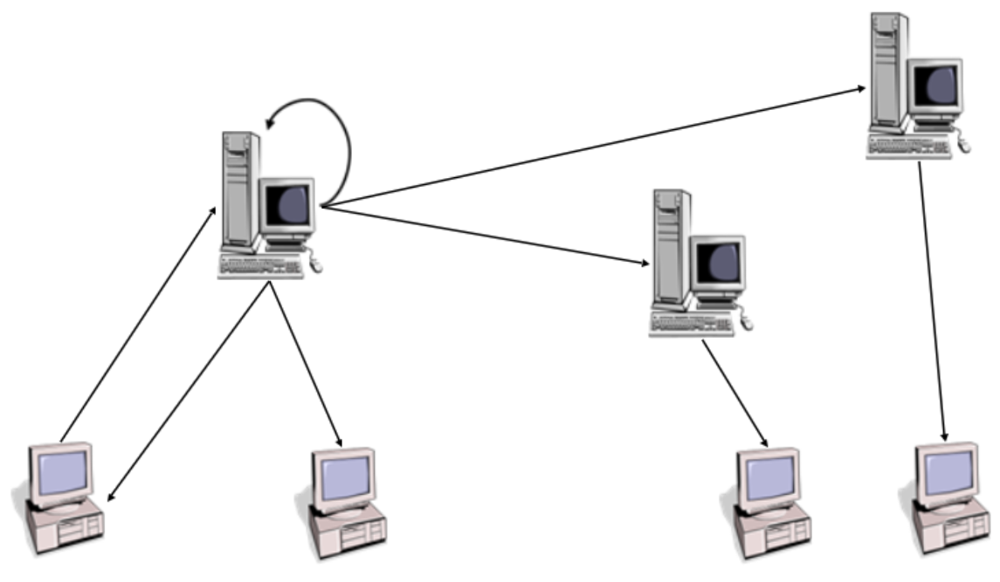

Di conseguenza, nel momento in cui si rende necessaria la ricerca di una specifica comunicazione elettronica nell’ambito di un’indagine forense, è indispensabile **ampliare il più possibile il perimetro dell’individuazione**, estendendo le operazioni non solo al dispositivo del mittente o del destinatario principale, ma anche a tutti i **sistemi potenzialmente coinvolti** nel processo di invio, ricezione, copia o inoltro del messaggio. Questa strategia consente di aumentare le probabilità di reperire copie integre della mail e di **verificarne l’autenticità e la provenienza**, garantendo così una maggiore affidabilità probatoria del reperto digitale.

Nel caso della mail che segue, l'individuazione dei sistemi informatici che sono stati coinvolti nella spedizione della mail si evince dall'analisi degli header:

Ecco:

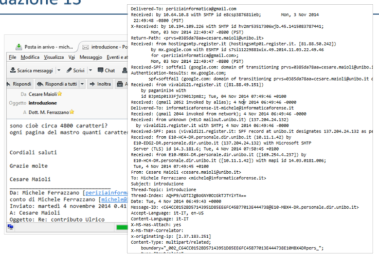

Spedizione e consegna coinvolgono infatti vari sistemi.
Successivamente, attraverso l'analisi degli indirizzi IP è possibile anche andare ad individuare il provider che ospita questi sistemi informatici - o comunque è possibile provvedere ad una geolocalizzazione del sistema stesso.

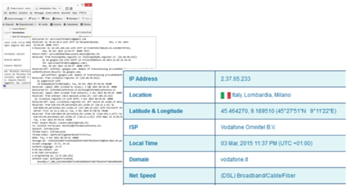

Quindi il percorso metodologico per una corretta individuazione esaustiva di reperti informatici è quella di andare ad individuare:

- tutti i supporti informatici fisici che possono contenere dati informatici rilevanti o pertinenti all'accertamento;
- identificare la provenienza e / o destinazione di un dato informatico pertinente o rilevante;
- identificare il luogo fisico in cui il dato informatico ritenuto rilevante è memorizzato;
- infine, identificare il luogo virtuale in cui il dato informatico ritenuto rilevante è memorizzato;

Ergo, applicare tale metodologia nei luoghi illustrati prima in foto...

---
### **8. Esempio pratico: ECU di un'automobile**

Per comprendere quanto possa essere complessa l’attività di **individuazione di un reperto informatico**, è utile esaminare un caso reale di **accertamento tecnico svolto su un veicolo** dotato di sistemi elettronici avanzati.

Il veicolo in questione manifestava, con **frequenza regolare di circa due settimane**, un **guasto alle sospensioni elettroniche automatiche**. Ogni volta che ciò accadeva, il sistema di controllo entrava in **modalità “safe”**, cioè una modalità di sicurezza che riduceva le funzionalità del veicolo per evitare danni ulteriori, rendendolo di fatto **non pienamente utilizzabile**. L’utilizzatore era così costretto a recarsi periodicamente in officina per poter ripristinare il funzionamento del mezzo.

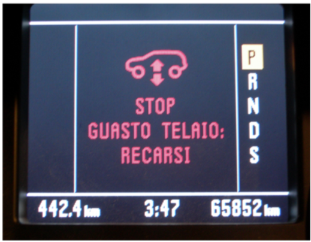

---

Di fronte a un malfunzionamento di questo tipo, è naturale ritenere che i **dati informatici utili all’indagine tecnica** fossero contenuti all’interno della **centralina elettronica** del veicolo.

La **centralina elettronica** (in inglese **ECU – Electronic Control Unit**) è, in sostanza, **un vero e proprio computer di bordo**.  
Essa gestisce e coordina il funzionamento di diversi sottosistemi del veicolo — come motore, trasmissione automatica, sistema ABS, sospensioni e airbag — elaborando in tempo reale le informazioni provenienti da sensori e attuatori.  
Ogni ECU comunica con le altre tramite una rete interna (spesso basata sul protocollo **CAN-Bus**) e conserva **log, codici di errore e parametri di funzionamento** che possono costituire una **fonte preziosa di prova digitale** in caso di guasto o incidente.

Il riepilogo mostrato nella figura allegata rappresenta un esempio tipico dei dati ottenuti da una **scansione diagnostica** della centralina, eseguita tramite appositi dispositivi.  
Le informazioni riportate — come indirizzi dei moduli, protocolli, codici di parte e codifiche — descrivono la configurazione e lo stato dei vari sottosistemi del veicolo.

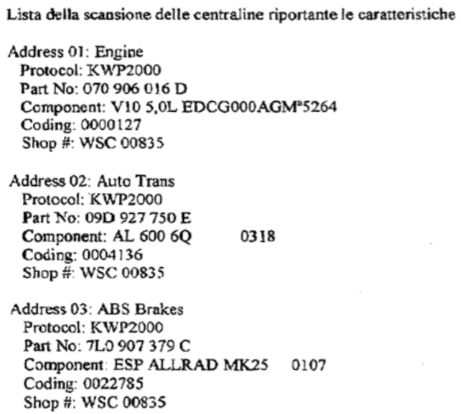

Nel caso in esame, tuttavia, si è verificato un ostacolo significativo di natura **forense e tecnica**:  
ogni volta che il veicolo veniva portato in officina, i meccanici non provvedevano a **salvare lo storico delle segnalazioni di errore**.  
Per tentare di risolvere il malfunzionamento, essi si limitavano a **resettare la centralina**, riportandola alle condizioni iniziali di fabbrica.

Questo comportamento — seppur comprensibile dal punto di vista operativo — ha avuto come conseguenza la **cancellazione completa delle tracce digitali** relative ai guasti precedenti, rendendo impossibile la ricostruzione cronologica e causale del problema.  
In pratica, ad ogni intervento veniva **azzerato il contenuto della memoria volatile e dei log di errore**, privando gli esperti forensi di dati fondamentali per comprendere la dinamica del malfunzionamento.

---

L’attività di **acquisizione dei dati informatici eseguita direttamente all’interno del veicolo** non portava gli esiti sperati, né consentiva una **visione storica completa dei malfunzionamenti**.  
Il motivo principale risiedeva nel fatto che, ad ogni intervento in officina, la centralina veniva resettata, cancellando così lo storico degli errori registrati.

Va comunque precisato che tale modalità di analisi veniva condotta attraverso la cosiddetta **porta OBD-II** (_On Board Diagnostics, versione 2_), un’interfaccia ormai presente in **tutti i veicoli moderni**.  
L’acronimo OBD indica un **sistema di autodiagnosi di bordo** che permette l’accesso ai dati generati dai vari moduli elettronici del veicolo, tra cui il motore, l’ABS, la trasmissione, le sospensioni e i dispositivi di sicurezza.  
La seconda versione dello standard (**OBD-II**), introdotta negli anni ’90 e oggi universalmente adottata, definisce sia **il protocollo di comunicazione** sia **il connettore fisico a 16 pin** utilizzato per collegare strumenti diagnostici esterni.

---

Come illustrato nel sito riportato in figura, tramite la porta OBD-II è possibile acquisire una **grande quantità di informazioni** relative al **funzionamento tecnico del veicolo**.  
Tra i dati comunemente estratti si trovano, ad esempio:

- parametri del motore (giri, temperatura, pressione, consumo, ecc.),
    
- stati dei sistemi elettronici e dei dispositivi di sicurezza,
    
- codici di errore e log di guasto,
    
- cronologie degli interventi o delle anomalie rilevate.
    

Tuttavia, la capacità dell’interfaccia OBD-II non si limita ai soli dati diagnostici.  
A seconda della configurazione del veicolo e del software installato, possono essere **letti e registrati anche dati accessori**, non strettamente legati al funzionamento meccanico.  
Tra questi, ad esempio:

- **dati di navigazione e geolocalizzazione** (derivanti dai sistemi GPS integrati),
    
- **orari e date di accensione o spegnimento del motore**,
    
- **informazioni sullo stile di guida o sull’utilizzo del veicolo**,
    
- dati provenienti dai sensori di bordo relativi a percorsi, frenate o accelerazioni.

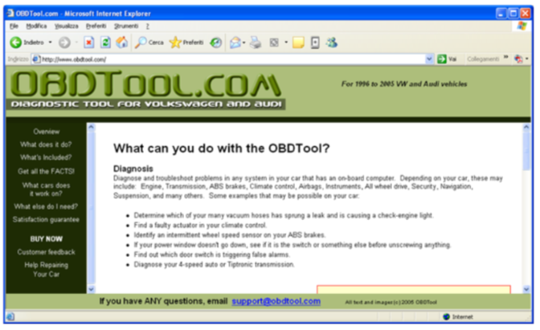

---

Da un punto di vista forense, ciò significa che la **porta OBD-II** non costituisce soltanto uno strumento di diagnostica tecnica, ma anche **una potenziale fonte di prova digitale complessa**, capace di contenere:

- **dati dinamici** legati al funzionamento dei sistemi elettronici,
    
- ma anche **dati contestuali e comportamentali** riferibili all’utilizzo del veicolo.
    

Per questo motivo, in un’indagine informatica su un veicolo, è fondamentale **considerare la portata informativa dell’OBD-II** come punto di accesso privilegiato sia per i **reperti tecnici** (guasti, malfunzionamenti, stati dei sensori), sia per i **reperti accessori**, utili a ricostruire **tempi, luoghi e modalità d’uso del mezzo**.

---

Purtroppo, la **mala prassi** adottata in officina — ossia quella di **resettare la centralina elettronica (ECU)** ad ogni intervento di manutenzione — ha comportato la **totale cancellazione della memoria storica** dei guasti e dei log di funzionamento.  
In questo modo, l’ipotesi iniziale secondo cui i **dati rilevanti ai fini dell’accertamento tecnico** si trovassero **all’interno della ECU** è venuta meno: ogni reset riportava il sistema a uno stato originario, eliminando le informazioni necessarie alla ricostruzione della sequenza dei malfunzionamenti.

Tuttavia, un’analisi più approfondita ha permesso di individuare **un’altra possibile fonte di prova digitale**, esterna al veicolo stesso: la **banca dati dell’importatore**.  
Con il termine _importatore_ si intende il soggetto — spesso coincidente con il produttore o con un suo referente nazionale — che **sviluppa, distribuisce e gestisce i veicoli** di una determinata marca.  
Tale soggetto, per motivi sia tecnici sia amministrativi, **raccoglie e archivia sistematicamente i dati di funzionamento** dei veicoli circolanti, inclusi i **rapporti diagnostici e gli interventi di manutenzione effettuati** presso le officine autorizzate.

---

In particolare, quando un veicolo è ancora **coperto da garanzia**, i costi degli interventi tecnici vengono **addebitati al produttore o all’importatore**.  
Per poter autorizzare e liquidare tali pagamenti, l’importatore **deve disporre di un resoconto tecnico dettagliato**, che documenti in modo preciso:

- la **natura del guasto**,
    
- la **data e la frequenza** dell’anomalia,
    
- le **procedure diagnostiche eseguite**,
    
- e gli **interventi di ripristino effettuati**.
    

Questo implica che, parallelamente ai dati memorizzati localmente nella centralina del veicolo, **copie delle stesse informazioni vengono trasmesse e conservate** anche nei **sistemi centrali dell’importatore**.  
Si tratta dunque di una **fonte di prova alternativa e indipendente**, potenzialmente più completa e storicamente coerente rispetto alla memoria volatile della ECU.

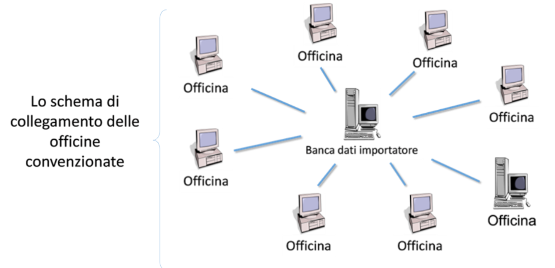

---

Dal punto di vista forense, questa scoperta è estremamente significativa:  
anche quando le **fonti di prova interne al veicolo risultano compromesse o cancellate**, può essere possibile **recuperare i medesimi dati da fonti esterne**, come i **server del produttore o dell’importatore**.

In questo modo si riesce a **ricostruire indirettamente la cronologia dei guasti e degli interventi**, ottenendo un **riscontro oggettivo e verificabile** del comportamento del sistema elettronico, anche in assenza dei log originali della centralina.

---

Alla luce delle considerazioni precedenti, risultava ormai evidente che le **informazioni di funzionamento del veicolo** non dovessero più essere ricercate **all’interno del veicolo stesso** — cioè nelle sue centraline elettroniche — bensì **all’esterno**, all’interno del cosiddetto **data warehouse** dell’azienda produttrice.

Il **data warehouse** (letteralmente _magazzino dati_) rappresenta una **piattaforma informatica centralizzata** nella quale vengono raccolti e organizzati i **dati storici di diagnostica** provenienti dalle officine autorizzate che hanno eseguito interventi di manutenzione o riparazione sui veicoli.  
In altre parole, ogni volta che un’officina effettua una diagnosi o una riprogrammazione su un veicolo, i relativi dati tecnici vengono **acquisiti, aggregati e archiviati** nel sistema centrale del produttore o dell’importatore, costituendo così un archivio storico unificato di tutti i guasti e delle operazioni effettuate.

---

Dal punto di vista informatico, il **data warehouse** può essere definito come una **soluzione software avanzata** che consente di:

- **estrarre dati** da **database relazionali di grandi dimensioni** e da altre sorgenti eterogenee;
    
- **trasferirli e memorizzarli** in una serie di **database secondari interconnessi**, di dimensioni minori, organizzati in modo da **semplificare l’analisi e la consultazione**;
    
- **rendere accessibili i dati storici** a figure aziendali di rilievo (come analisti, responsabili tecnici o decisionali) che possono così **estrarre informazioni di conoscenza** e condurre **analisi sui processi, le anomalie e le opportunità di miglioramento**.
    

Nel contesto del caso analizzato, il data warehouse del produttore costituiva dunque **la vera sorgente informativa forense**, in quanto raccoglieva:

- le **diagnosi storiche inviate dalle officine**,
    
- i **report di guasto e di riparazione**,
    
- e i **metadati** associati a ciascun intervento (date, orari, veicolo, tecnico, esito, ecc.).
    

---

Dal punto di vista della **computer forensics**, il data warehouse assume un’importanza decisiva poiché:

- conserva **copie storiche non manipolabili localmente** dei dati diagnostici;
    
- offre una **visione cronologica e completa** degli eventi, anche se le centraline del veicolo sono state resettate;
    
- garantisce **tracciabilità e integrità** delle informazioni grazie alla loro archiviazione centralizzata e alle procedure di autenticazione dei dati trasmessi dalle officine.
    

L’accesso a tale infrastruttura permette dunque di ricostruire con precisione la **storia tecnica del veicolo**, individuando **quando, come e con quale frequenza** si sono verificati i malfunzionamenti, e verificando la **veridicità delle informazioni** rispetto alle dichiarazioni dei soggetti coinvolti.

---

### **9. La certificazione di qualità e le conseguenze tecniche**

Un ulteriore tema introdotto nella lezione è quello della **certificazione di qualità**.  
Molti sistemi informatici complessi (come i veicoli moderni) contengono **decine di centraline elettroniche** interconnesse tramite bus dati.  
In tali contesti, la certificazione di qualità assicura che l’analisi elettronica e diagnostica del veicolo sia condotta con strumenti e procedure standardizzate, evitando risultati falsati.

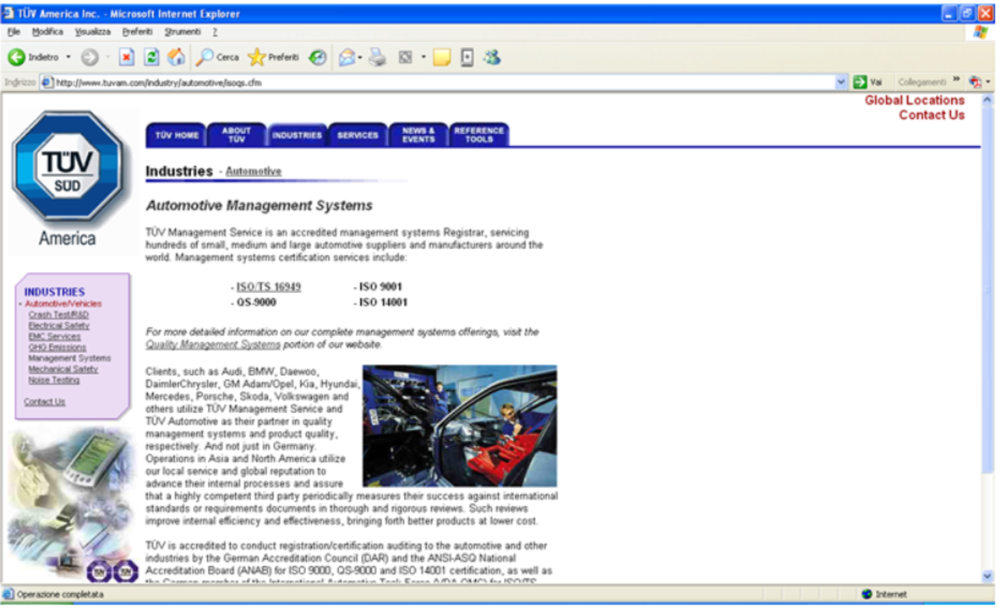

L’officina, in virtù della **certificazione ISO 9000** di cui era titolare, **non poteva dichiarare la non disponibilità dei dati di diagnosi e manutenzione** relativi al veicolo oggetto di accertamento.  
La norma ISO 9000 — che stabilisce i requisiti per un sistema di **gestione della qualità** — impone infatti alle organizzazioni certificate l’obbligo di **tracciare, conservare e rendere disponibili** tutte le informazioni documentali e digitali connesse ai processi svolti, al fine di garantire **trasparenza, rintracciabilità e verificabilità** delle attività tecniche eseguite.

Pertanto, la circostanza che l’officina risultasse **certificata all’epoca dei fatti** costituiva di per sé **una garanzia della disponibilità dei dati**: essa non poteva legittimamente sostenere di non possedere o di non poter fornire i registri elettronici e diagnostici relativi agli interventi eseguiti.  
Di conseguenza, eventuali **dichiarazioni di indisponibilità o di perdita dei dati** non potevano essere considerate giustificate, poiché **in contrasto con gli obblighi derivanti dalla certificazione stessa**, la quale vincola l’organizzazione a conservare e fornire, su richiesta, la documentazione tecnica e operativa prodotta.

Questo aspetto, oltre che tecnico-giuridico, assume anche una **valenza metodologica e deontologica** (ciò che riguarda il comportamento etico e responsabile** che una persona deve mantenere **nell’esercizio della propria professione**) nel lavoro del consulente tecnico (CT).  
Come osservato in precedenza con riferimento alle riflessioni di **Dostoevskij**, si tratta di uno di quei casi in cui **bisogna “sapersi comportare con i fatti”**: non limitarsi alla teoria o alle dichiarazioni di principio, ma **utilizzare il contesto concreto** — in questo caso, la presenza di una certificazione di qualità — per **ottenere il risultato tecnico e probatorio** desiderato.

Un **consulente tecnico di parte** deve quindi essere in grado di **interpretare il contesto operativo e normativo** in cui si muove, riconoscendo quando un soggetto, per sua stessa struttura organizzativa e per le norme cui aderisce, **è obbligato a collaborare** e a rendere accessibili i dati necessari all’accertamento.  
Questo approccio rappresenta un perfetto equilibrio tra **competenza tecnica, consapevolezza del contesto e capacità di azione strategica** — qualità fondamentali nel lavoro forense.

---
Quindi fu poi possibile ottenere tutti i report di diagnostica del veicolo, come quelli di seguito illustrati

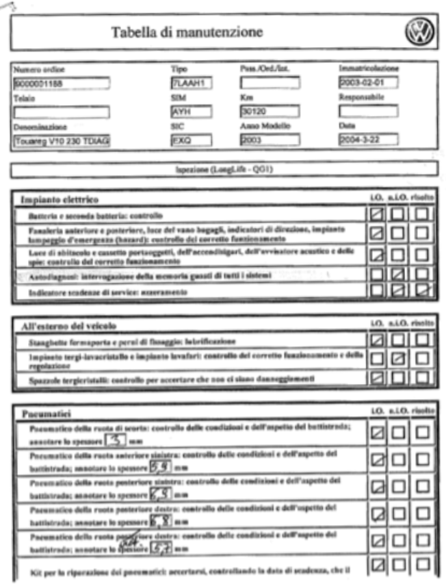

E fu quindi possibile infine diagnosticare che il problema segnalato dalla centralina altro non era che un problema di pessima esecuzione dei cablaggi del veicolo stesso, il che portava ad una svalutazione del veicolo pari a 30000euro.

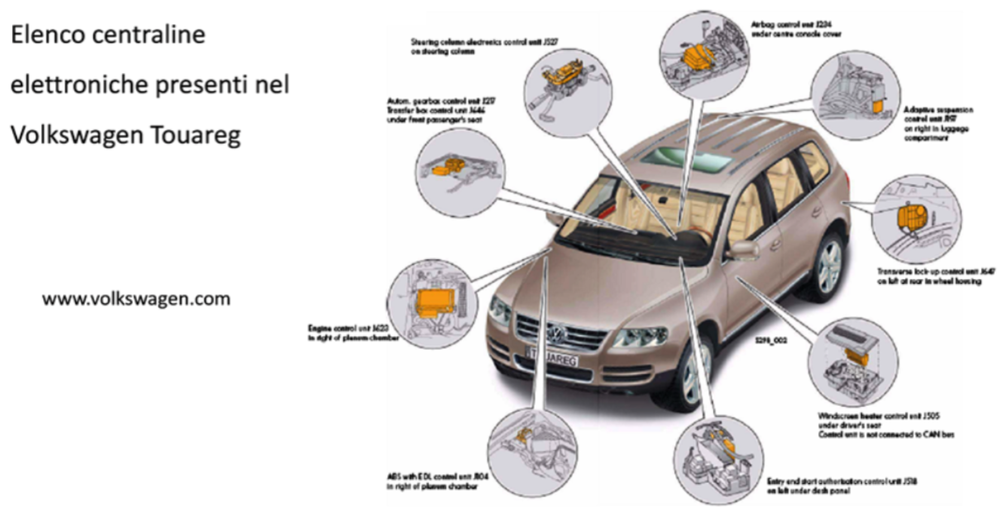

Anche perché le centraline periferiche del veicolo oggetto d'accertamento erano numerosissime:

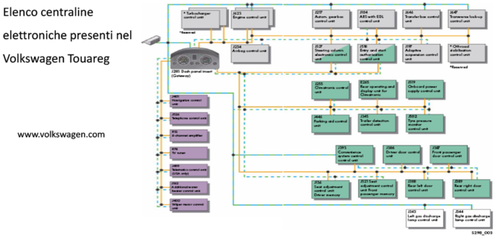

Altro elemento interessante che emerse in quell'accertamento tecnico fu la presenza di un archivio dei richiami messo a disposizione dal ministero delle infrastrutture e dei trasporti che evidenziava ulteriori criticità di funzionamento del veicolo oggetto di accertamento tecnico, che rientrava proprio in quell'insieme dei veicoli indicati dal ministero.

![[imgs/14_auto7.png]]

### **10. Conclusioni**

La lezione si chiude sottolineando che la **fase di individuazione** è il **fondamento di ogni indagine forense**.  
Solo comprendendo **dove si trovano i dati di interesse** e **in quale forma sono conservati**, sarà possibile procedere correttamente alle fasi successive di raccolta, analisi e valutazione.

Non necessariamente sono in un supporto fisicamente disponibile Sempre più disponibili in remoto.

In sintesi:

- L’individuazione deve essere **esaustiva** e metodica;
    
- I dati non sono sempre **fisicamente disponibili**: spesso risiedono in remoto o in ambienti virtuali;
    
- È indispensabile **tenere conto della sincronizzazione e della replica** dei contenuti;
    
- Il perito deve adottare un atteggiamento **“paranoico” e prudente**, assumendo che ogni potenziale sorgente possa contenere elementi utili.
    

> L’individuazione non è solo un punto di partenza, ma la chiave per non perdere la verità digitale nel mare dei dati.

---