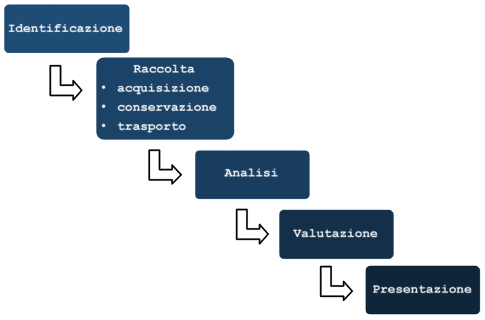
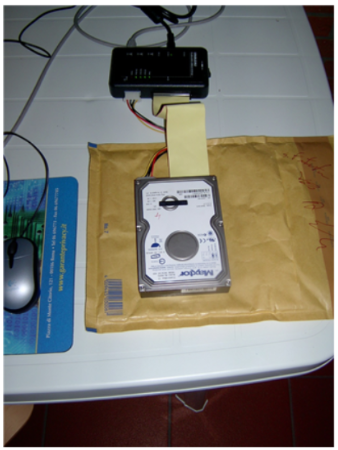
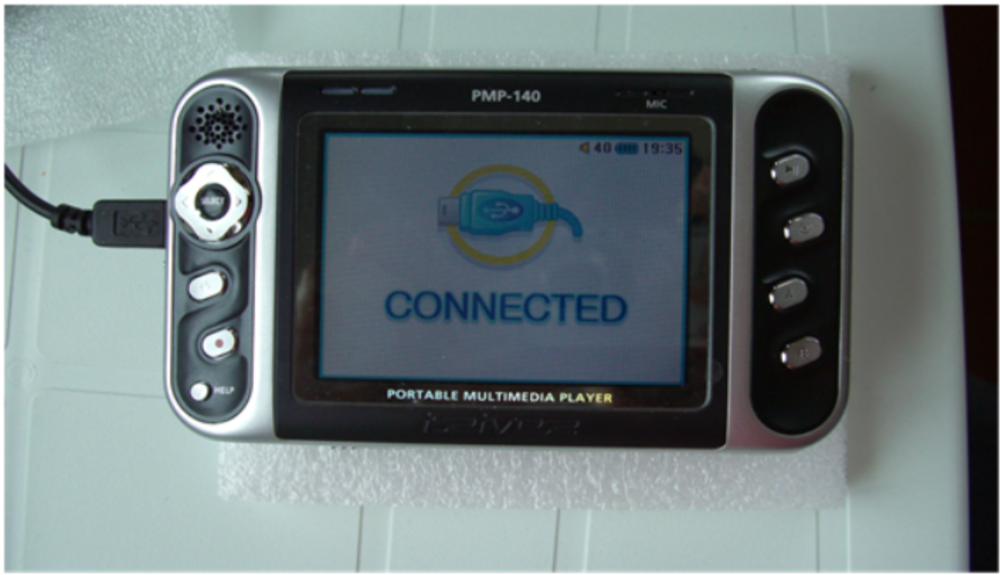
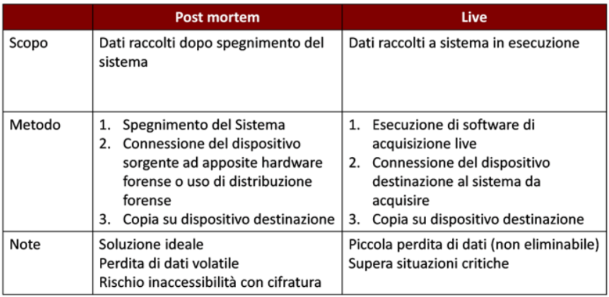

## **Lezione 2: Raccolta, trasporto, acquisizione e conservazione**

### **1. Le fasi del trattamento del dato informatico**

Ripropongo in apertura l'illustrazione delle varie fasi...

Il trattamento forense di un dato digitale segue una sequenza precisa e inderogabile di fasi:

1. **Identificazione** delle fonti di prova.
    
2. **Raccolta**, comprendente:
    
    - **Acquisizione**
        
    - **Conservazione**
        
    - **Trasporto**
        
3. **Analisi** dei reperti.
    
4. **Valutazione** dell’attendibilità e dell’integrità.
    
5. **Presentazione** in sede giudiziaria.
    

Questa lezione approfondisce la **fase di raccolta**, cuore dell’intero processo, poiché da essa dipende la **validità della prova informatica** in tutte le fasi successive.

---

### **2. La raccolta della prova informatica**

Dopo aver individuato le fonti di dati, occorre procedere alla loro **raccolta**, cioè alla **presa in custodia dei supporti contenenti informazioni digitali** rilevanti ai fini dell’indagine.

Contrariamente a quanto si potrebbe pensare, **non è necessario sequestrare l’intero computer**: ciò che conta è acquisire **tutti i singoli bit registrati** sui dispositivi, cioè il contenuto effettivo delle memorie, indipendentemente dall’hardware che li ospita. Ad esempio nel caso di un pc, il disco rigido ed eventualmente alcune componenti della memoria della mainboard.

Successivamente va acquisito tutto il supporto di memorizzazione, inteso come l'intera sequenza di bit conservati all'interno, da qui il termine *bit stream*.

L’obiettivo è **impedire qualsiasi contaminazione**, sia in fase di acquisizione che durante la conservazione, assicurando una **catena di custodia continua e documentata**.

---

### **3. Il trasporto dei supporti informatici**

Una volta raccolti, i reperti digitali devono essere **trasportati in modo sicuro** verso un luogo idoneo alla conservazione e all’analisi.  
Durante il trasporto, il rischio di **danneggiamento fisico, perdita o alterazione dei dati** deve essere minimizzato.

Per questo si adottano:

- **Buste antistatiche e sigillate**, per isolare i dispositivi da campi magnetici e contaminazioni.
    
- **Etichette identificative** numerate, firmate e datate.
    
- **Registri di catena di custodia**, che documentano ogni passaggio del reperto tra operatori e luoghi.
    
- **Valigette protettive** con materiali antiurto e sistemi di blocco.
    

Il trasporto, benché possa sembrare una fase logistica, è in realtà un **atto forense critico**: un errore nella catena di custodia può rendere inutilizzabile l’intero reperto in sede processuale.

---

### **4. L’acquisizione: significato e principi**

L’**acquisizione** è il momento in cui il dato informatico viene **estratto dal supporto originale** per essere analizzato in modo sicuro su una copia.  
In questa fase si realizza una **duplicazione integrale** del contenuto del dispositivo, inteso come sequenza di bit, senza alterare i dati originali.

Durante l’acquisizione, i principi fondamentali da rispettare sono:

- **Completezza** → il supporto deve essere copiato integralmente, non solo i file visibili.
    
- **Non alterabilità** → nessuna scrittura deve essere effettuata sul reperto originale. VA IMPEDITA QUALSIASI FORMA DI CONTAMINAZIONE!
    
- **Tracciabilità** → ogni operazione deve essere documentata.
    
- **Ripetibilità** → la copia deve consentire analisi successive indipendenti con gli stessi risultati.
    

La catena di custodia deve essere garantita, per documentare che i processi di acquisizione siano stati svolti correttamente e documentare anche l'acqusizione di dati volatili e non.

---

### **5. Cosa non è un’acquisizione forense**

Molti errori si commettono ancora oggi nelle indagini, quando vengono prodotte come prove:

- Stampe delle proprietà di un documento Word;
    
- Copie parziali di codice sorgente;
    
- Stampe di e-mail, pagine web o fotografie;
    
- File ottenuti tramite **“copia e incolla”** o **“drag & drop”**.
    

Queste pratiche **non hanno valore forense**, perché non garantiscono l’integrità, la tracciabilità né la conservazione dei metadati.  
Un file copiato manualmente perde gli **spazi non allocati**, i **file cancellati** e gli **elementi residui** che costituiscono parte essenziale del contesto probatorio.

Questo per esempio è uno dei casi in cui è stato prodotto un file di log parziale e dunque incompleto. Non è nemmeno un file di log, bensì una rappresentazione parziale cartacea:

![[UD2 – Fasi del trattamento del reperto informatico/imgs/16_auto9.png]]

---

### **6. La copia forense: bit stream image**

L’unico metodo corretto di acquisizione è la **copia bit a bit** del supporto originale, detta **bit stream image**.  
Essa duplica **ogni singolo bit**, incluso lo spazio non allocato, lo slack space e le aree contenenti frammenti di file cancellati. Non deve inoltre arrecare un'alterazione dei dati temporali del file system, problema che accade facendo drag and drop.

In questo modo, la copia diventa **indistinguibile dall’originale**, e — dal punto di vista forense — **entrambi assumono valore di originale probatorio**.

Ogni operazione di acquisizione deve essere **accuratamente documentata**, preferibilmente con dispositivi e software che **registrino automaticamente le azioni eseguite**, così da produrre un **log di garanzia** allegabile alla relazione tecnica.

---

### **7. Livelli di memorizzazione e implicazioni forensi**

La memorizzazione dei dati avviene su due livelli:

- **Livello fisico**, dove il dato è rappresentato da magnetizzazioni, incisioni o stati elettrici.
    
- **Livello logico**, che organizza i dati in partizioni, tracce e settori gestiti da un file system.
    

I diversi **file system** (FAT, NTFS, EXT, APFS, ecc.) gestiscono lo spazio in modo differente: i dati possono essere **frammentati** su più blocchi non contigui e collegati da **informazioni di indirizzamento**.  
Le modalità con cui un dispositivo gestisce i dati a livello logico ha implicazioni dirette su qualunque analisi forense.
Per questo, un’analisi forense adeguata richiede **strumenti specifici** per ogni tipo di file system, in grado di ricostruire la disposizione logica dei dati originali.

---

### **8. La cancellazione dei dati e la viscosità digitale**

Cancellare un file non significa eliminarlo dal supporto.  
Quando un file viene “cancellato”, il sistema operativo si limita a:

- rinominarlo o spostarlo (ad esempio nel cestino);
    
- modificare la tabella di allocazione, indicando che i settori sono “liberi”;
    
- sovrascrivere in seguito i settori con nuovi dati.
    

Fino a quel momento, i dati **rimangono recuperabili**, totalmente o parzialmente, tramite analisi forense.  
Questo fenomeno prende il nome di **permanenza dei dati**, e la difficoltà di eliminarli completamente viene detta **viscosità digitale**.

Solo il processo di **wiping**, cioè la sovrascrittura multipla dell’intero spazio di memoria, garantisce la cancellazione irreversibile dei dati.

---

### **9. Procedure corrette di acquisizione**

Per garantire la correttezza tecnica e giuridica dell’acquisizione, l’esperto forense deve:

- Utilizzare **write blocker hardware o software**, per impedire scritture involontarie sul reperto originale.
    
- Eseguire la copia su **dischi vergini** precedentemente bonificati (wiped).
    
- Lavorare, se possibile, in **modalità post mortem** (sistema spento). E' infatti buona prassi utilizzare direttamente la macchina oggetto di indagine solo quando è necessario acquisire dati dalla RAM, quindi spegnere immediatamente
    
- Usare **forensic CD o hardware dedicato alla copia** per evitare l’uso di sistemi operativi non controllati come windows
    
- Documentare ogni passaggio con **fotografie, note e registrazioni**.
    

> L’obiettivo è preservare l’integrità del dato: l’originale non deve mai essere toccato, né alterato in alcun modo.

---

### **10. Strumenti tecnici e materiali di supporto**

L’attività di acquisizione forense richiede una dotazione di strumenti specifici, suddivisi in:

- **Hardware informatico**: workstation forense, write blocker, adattatori, dongle, dischi di destinazione precedentemente wipati, copiatori hardware, supporti di boot.
    
- **Materiali di laboratorio**: cacciaviti (o comunque strumenti per smontare il disco rigido), pennarelli e matite (per poter documentare in maniera scritta), buste antistatiche, etichette, guanti, nastro adesivo, fotocamera digitale.
    
- **Strumenti di trasporto**: tutto chiaramente preferibilmente imbottito per un trasporto sicuro: custodie sigillate, contenitori antiurto, valigie rigide, moduli di catena di custodia.
    

Ogni elemento deve contribuire alla **sicurezza, tracciabilità e non contaminazione** del reperto.

---

Da questa foto si può vedere come un disco rigido viene acquisito mediante sistema informatico, ergo non tramite un copiatore hardware bensì attraverso un PC. Il disco è collegato al writeblocker nero in alto, che impedisce la qualsiasi forma di alterazione, e che quindi è una forma di protezione a livello elettronico. Il writeblocker è a sua volta collegato al pc.

Da questa inquadratura più completa vediamo com'è organizzata una stazione di acquisizione forense basata su personal computer. A destra il disco sorgente dunque il reperto originale, con il writeblocker, che mediante una porta usb o comunque una porta dati è collegato al pc, che mediante un software apposito legge dal sorgente. Il pc registra i dati su un disco di destinazione wipato in un formato utile per la copia forense e per la successiva analisi forense. Elemento importante in secondo piano è l'utilizzo di un gruppo di continuità, che permette e dà garanzia che anche in caso di un salto di corrente comunque il reperto e l'acquisizione non verrebbero alterati affatto.
Infine, a sinistra viene utilizzato un software di acquisizione originale protetto da una chiave hardware che si vede sul lato sinistro del pc stesso.

![[imgs/23_acq2.png]]

---

Altri dispositivi writeblocker sono quelli per le chiavette usb o dischi rigidi usb. La logica è la stessa, cambia la porta di collegamento con il reperto:

![[imgs/24_acq3.png]]

In alcuni casi il CT di informatica forense si trova a dover acquisire anche dispositivi di cui non conosce in maniera approfondita la natura:

In questo caso l'approccio metodologico e una valutazione preliminare sono fondamentali. Si tratta di una valutazione costo/benefici, dove il beneficio è la possibilità di reperire in modo completo e corretto possibile il reperto, ma sempre e comunque in un'ottica dibattimentale, cioè sempre tenendo presente che anche dopo molto tempo quelle attività di acquisizione che il tecnico fa in questa fase saranno oggetto di un'attenta attività di analisi e di critiche.

---

### **11. Tipologie di acquisizione**

![[imgs/26tab1.png]]

| Tipo di immagine            | Scopo                                                                                                    | Integrità                    | Note                                             |
| --------------------------- | -------------------------------------------------------------------------------------------------------- | ---------------------------- | ------------------------------------------------ |
| **Immagine forense fisica** | Copia completa di tutti i dati presenti sul dispositivo (inclusi file cancellati e spazio non allocato). | Verificabile tramite hash.   | Soluzione ideale, ma lenta.                      |
| **Immagine forense logica** | Copia solo dei file salvati nel file system.                                                             | Verificabile tramite hash.   | Più veloce, ma comporta perdita di informazioni. |
| **Copia di file**           | Copia selettiva di singoli file o cartelle.                                                              | Non verificabile pienamente. | Rapida ma non forense.                           |

---

### **12. Acquisizione post mortem e live**

|Modalità|Scopo|Metodo|Note|
|---|---|---|---|
|**Post mortem**|Raccolta dei dati dopo lo spegnimento del sistema.|1. Spegnimento del sistema. 2. Connessione del dispositivo a hardware forense o distribuzione dedicata. 3. Copia su supporto di destinazione.|Soluzione ideale: evita alterazioni, ma comporta perdita dei dati volatili (RAM).|
|**Live**|Raccolta di dati a sistema acceso.|1. Esecuzione di software di acquisizione live. 2. Copia su supporto esterno.|Necessaria in caso di cifratura o sistemi attivi; introduce rischio di contaminazione.|

---

### **13. In sintesi**

La lezione ribadisce che l’acquisizione è la **fase più delicata** dell’intero processo forense.  
Ogni errore in questa fase può compromettere la validità della prova digitale.

Riassumendo:

- L’acquisizione deve essere **completa, documentata e ripetibile**.
    
- È necessario **impedire qualsiasi alterazione** del reperto.
    
- Il **dato acquisito deve corrispondere perfettamente all’originale**.
    
- Le procedure devono essere **specifiche per ciascun dispositivo** e condotte da personale qualificato.
    

> In informatica forense, l’acquisizione non è un’operazione tecnica: è un **atto scientifico e giuridico** che trasforma il dato in prova.

---