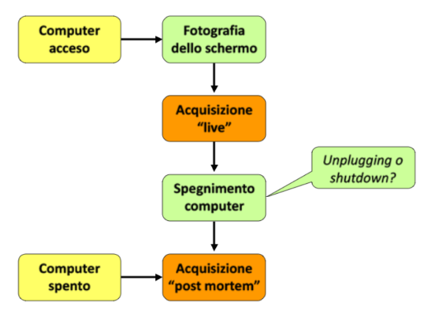
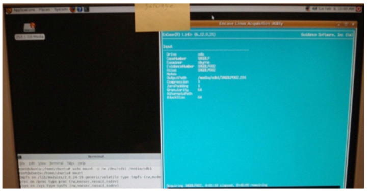
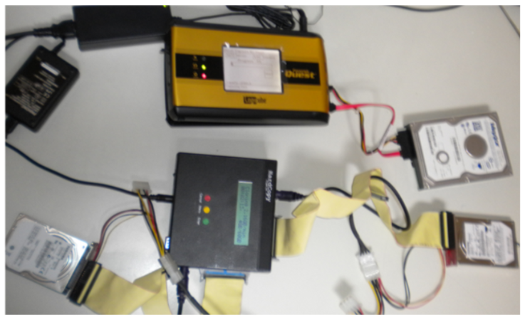
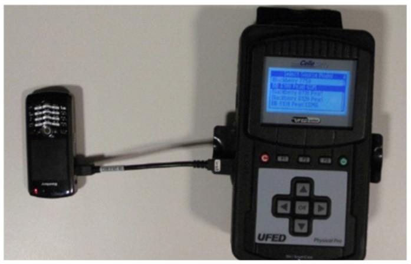
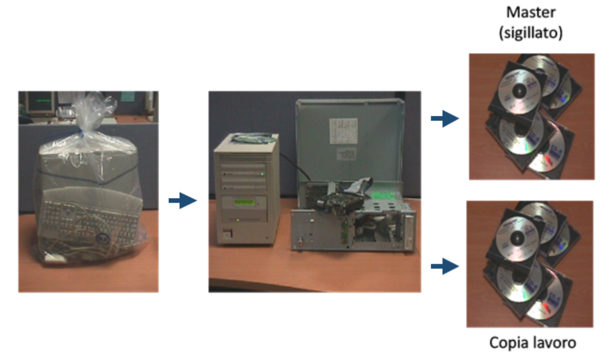
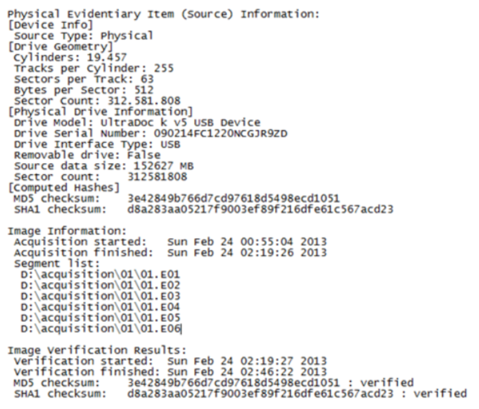
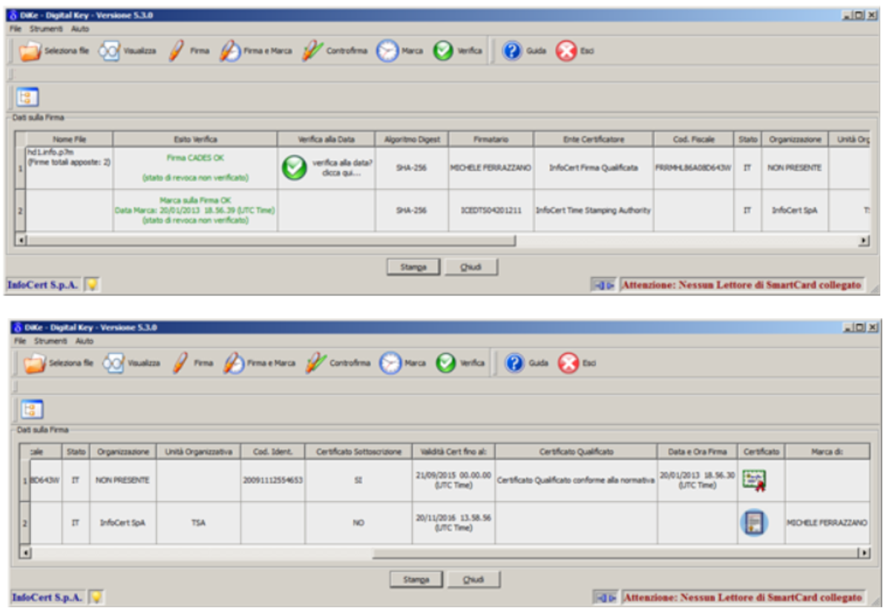
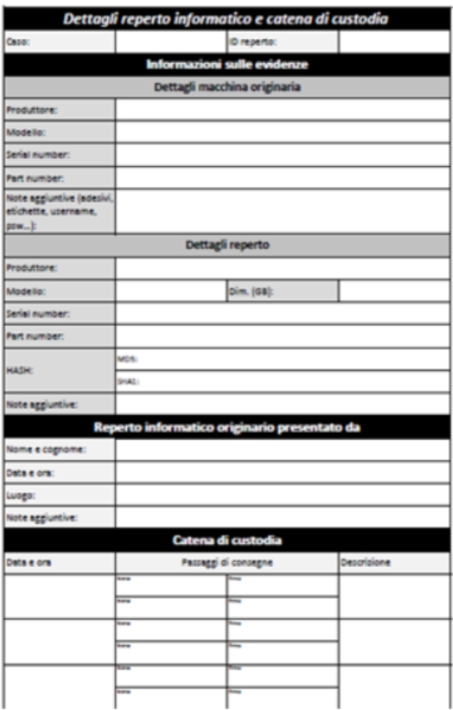

## **Lezione 3: Raccolta, trasporto, acquisizione e conservazione (parte 2)**

### **1. Acquisizione: come, quando e perché**

L’**acquisizione forense** è la fase più delicata del trattamento del dato digitale.  
Si tratta di un’operazione che deve essere eseguita **con metodo, strumenti certificati e piena consapevolezza delle condizioni del sistema**.

L’analista può trovarsi di fronte a due situazioni:

- **Computer acceso** → richiede un’**acquisizione live**, cioè a sistema operativo in esecuzione.
    
- **Computer spento** → permette un’**acquisizione post-mortem**, ossia a sistema disattivato.
    

Nel primo caso è necessario valutare se **procedere allo spegnimento** (rischiando di perdere dati volatili come RAM e processi) o **intervenire immediatamente**, effettuando un dump della memoria e delle connessioni di rete attive.



---

### **2. L’acquisizione live**

L’**acquisizione live** si esegue quando il sistema è acceso e operativo, ed è utile nei casi in cui:

- siano presenti **dati cifrati** che perderebbero accessibilità una volta spento il dispositivo;
    
- occorra catturare **processi attivi**, **connessioni di rete**, **porte aperte** o **registro di sistema**;
    
- sia necessario acquisire il **contenuto della RAM (memory dump)** per individuare chiavi di cifratura, malware in esecuzione o sessioni utente aperte.
    

Le verifiche preliminari devono sempre includere:

1. **Ora di sistema** e fuso orario.
    
2. **Verifica della cifratura attiva** (BitLocker, VeraCrypt, FileVault, ecc.).
    
3. **Registro di sistema e processi in corso**.
    
4. **Connessioni di rete e porte aperte**.
    
5. **Dump completo della memoria RAM**.
    

Tuttavia, l’acquisizione live introduce un rischio intrinseco: l’atto stesso di interagire con il sistema **ne altera lo stato**.  
Per questo, ogni azione va documentata minuziosamente, così da poter spiegare e giustificare in sede giudiziaria eventuali variazioni osservate.

---

### **3. L’acquisizione post-mortem**

L’**acquisizione post-mortem** è la modalità più corretta dal punto di vista forense.  
Siamo davanti a un bivio...

#### 🟦 **a. Copia bit-stream (clone)**

La **copia bit-stream** è una **replica fisica 1:1** del supporto originale **su un altro supporto fisico**.
##### 👉 Che cosa significa?

- Copio **bit per bit** il contenuto di un disco **su un altro disco**.
    
- È quindi **un nuovo supporto fisico** che diventa _identico_ all’originale.
    
- Se l’originale è un hard disk, anche la copia è un hard disk.
    
- Se l’originale contiene settori danneggiati, settori vuoti, file cancellati → **tutto viene copiato così com’è**.
##### 👉 Caratteristiche:

- La copia è avviabile se lo era il disco originale.
    
- Mantiene **geometria, struttura fisica, dimensioni, layout dei settori**.
    
- Serve quando devo **sostituire** un disco o poterlo analizzare come se fosse “il vero disco”.
##### 👉 Differenza da un backup:

- Il backup copia _contenuti logici_ (file, directory) → **non** copia cancellati, slack, metadata nascosti.
    
- La copia bit-stream copia **anche ciò che il sistema operativo non vede**.

---

#### 🟩 **2. Immagine bit-stream (immagine forense, immagine)**

L’**immagine bit-stream** è **un file (o un insieme di file)** che contiene la rappresentazione **bit per bit** dell’intero supporto. Viene detta anche immagine forense

È la stessa informazione del clone, **ma salvata in forma di file**, non su un disco fisico.

##### 👉 Che cosa significa?

- Il disco originale NON viene copiato su un nuovo disco,
    
- ma viene copiato dentro **un file immagine**: ad esempio
    
    - `.dd`
        
    - `.E01` (EnCase)
        
    - `.AFF`
        
    - `.img`
##### 👉 Caratteristiche:

- L’immagine non è un disco, è **una fotografia digitale perfetta del disco**.
    
- È usata in informatica forense per:
    
    - analisi senza rischio di alterare il supporto originale,
        
    - conservazione a lungo termine,
        
    - genere di compressione e hashing integrato (E01).
        
- Può essere montata come disco virtuale su software forense.
##### 👉 Il vantaggio forense:

- L’immagine bit-stream **non altera minimamente** l’originale.
    
- Posso creare più copie dell’immagine per analisi parallele.
    
- Posso allegare **hash MD5/SHA** per verificare integrità nel tempo.

|Caratteristica|Copia bit-stream (clone)|Immagine bit-stream (immagine forense)|
|---|---|---|
|**Forma finale**|Nuovo supporto fisico identico|File o insieme di file|
|**Contenuto**|Bit per bit identico|Bit per bit identico|
|**Finalità tipica**|Sostituire/replicare un disco|Analisi forense, archiviazione|
|**Alterazione dell’originale**|No (ma richiede manipolazione fisica)|No, totalmente sicura|
|**Montaggio**|È un disco vero|Va “montato” come disco virtuale|
|**Geometria disco**|Copiata identica|Rappresentata digitalmente|
|**Hash**|Possibile ma non integrato|Integrato nei formati forensi (E01)|
|**Portabilità**|Bassa (devi portarti un disco intero)|Altissima (file trasportabile/archiviabile)|

---


Spesso si utilizzano **live CD forensi** — sistemi avviabili da supporto esterno — per evitare di caricare software sull’hard disk originale.  



In alternativa, si opera su **copiatori hardware**, che realizzano la clonazione diretta mantenendo l’originale in sola lettura.



 ovviamente anche strumenti per i dispositivi di telefonia mobile:



---

### **4. Il ruolo del write blocker**

Durante l’acquisizione post-mortem, l’uso del **write blocker** è obbligatorio.  
Questo dispositivo impedisce fisicamente ogni **scrittura involontaria** sull’unità sorgente, assicurando che nessun bit venga alterato.

Il flusso operativo tipico è il seguente:

```
Hard disk sorgente  →  Write Blocker  →  Workstation forense
```

La workstation, dotata di software come _EnCase_, esegue la **creazione dell’immagine**, il **calcolo dell’hash** e la **verifica di corrispondenza** tra l’originale e la copia.

> Attenzione: il corretto funzionamento del write blocker dipende anche dal sistema operativo in uso.  
> È fondamentale testare preventivamente la compatibilità e verificarne l’efficacia prima di ogni acquisizione.

---

### **5. Master e copia di lavoro**

Una volta completata la copia del reperto, bisogna provvedere a imballare e conservare il reperto originale, opportunamente sigillato.



Il risultato dell’acquisizione deve sempre produrre **almeno due copie**:

- **Master** → copia ufficiale, sigillata e mai utilizzata per analisi.
    
- **Copia di lavoro** → copia identica, destinata alle attività di esame. Di solito se ne creano almeno due!
    

La copia master rappresenta **l’equivalente digitale dell’originale fisico**, e la sua integrità deve essere dimostrata tramite funzioni di hash e sigilli elettronici.

Si rende necessario, nel caso in cui poi si voglia fare l'analisi di tali dati, copiare ulteriormente tali dati dalle copie di lavoro. 

---

### **6. La funzione di hash come impronta digitale**

Nel momento in cui si acquisisce un reperto, bisogna andare a creare una bitstream image che va a leggere tutti i singoli dati presenti sul reperto stesso. La image va poi congelata utilizzando un programma di hashing.
Il **codice hash** costituisce la **firma matematica** di un insieme di bit.  
È un valore univoco calcolato attraverso un algoritmo (come **MD5**, **SHA-1**, **SHA-256**) che trasforma un file o un intero disco in una stringa di lunghezza fissa chiamata **digest** o **impronta matematica**.

Caratteristiche fondamentali:

- Ogni variazione, anche di un solo bit, **genera un digest completamente diverso**.
    
- L’algoritmo non è invertibile: dal digest non è possibile risalire al contenuto originale.
    
- È teoricamente possibile la presenza di **collisioni**, ma la probabilità è estremamente bassa se si utilizzano algoritmi aggiornati e sicuri (es. SHA-256).
    

Secondo il **DPCM 8 febbraio 1999**, l’hash costituisce l’**impronta digitale del documento informatico**, cioè un identificatore univoco che ne consente la verifica nel tempo.

La buona prassi impone di:

- Eseguire più di una copia integrale, bit per bit, del supporto su un altro dispositivo di memorizzazione  (Copie di riserva)
- Eventuale dissequestro dei supporti (diritto di terzi)
- Copie per la difesa e le altre parti del processuali  (diritto di difesa)

---

### **7. Il sigillo elettronico e la documentazione dell’acquisizione**

A conclusione della copia, si applica il cosiddetto **sigillo elettronico**, che consiste nella generazione e conservazione dei **valori di hash** calcolati sull’immagine forense.  
Tali valori sono poi riportati nei **verbali di sequestro**, nei **registri di catena di custodia** e nei **log di acquisizione**.

Il **log di acquisizione** deve includere:

- nome e versione del software utilizzato;
    
- data, ora e durata dell’operazione;
    
- operatori presenti;
    
- caratteristiche del dispositivo sorgente e di destinazione;
    
- algoritmi di hash impiegati;
    
- esito della verifica di integrità.
    




Come già accennato, il cosiddetto _“sigillo elettronico”_ si ottiene applicando **la firma digitale** e **la marca temporale** al **file di log** generato durante l’attività di copia forense del disco rigido.

In pratica:

1. si esegue la copia forense del disco;
    
2. il software produce un **file di log** che documenta in modo dettagliato tutte le operazioni svolte;
    
3. su questo file di log vengono applicate **prima la firma digitale**, poi la **marca temporale**.
    

In questo modo, sarà possibile dimostrare anche a distanza di anni che:

- il log è **autentico** (grazie alla firma digitale, che garantisce paternità e integrità),
    
- il suo contenuto **non è stato modificato** (perché qualsiasi alterazione invaliderebbe la firma),
    
- e soprattutto che esiste una **data certa e opponibile a terzi** che certifica il momento esatto in cui l’operazione di acquisizione è stata eseguita (grazie alla marca temporale).
    

La marca temporale, quindi, svolge un ruolo essenziale:  
permette di documentare in modo incontrovertibile **quando** è avvenuta l’acquisizione, mentre firma digitale e timestamp insieme rendono il log **immodificabile** e **affidabile a fini probatori**.




---

### **8. Conservazione e catena di custodia**

Dopo l’acquisizione, i reperti e le copie forensi devono essere **conservati in modo sicuro**, evitando qualsiasi forma di contaminazione.  
Le modalità di conservazione variano in base alla tipologia di supporto (magnetico, ottico, SSD, mobile device), ma devono sempre garantire:

1. **Integrità fisica e logica del reperto.**
    
2. **Tracciabilità completa dei passaggi di mano.**
    
3. **Documentazione continua** della custodia e dei movimenti.
    

La **catena di custodia** è lo strumento che certifica la legittimità e l’affidabilità del reperto in sede processuale.  
Può assumere due forme:

- **Single-evidence form** → un documento per ciascun reperto informatico.
    
- **Multi-evidence form** → un documento unico per più reperti appartenenti allo stesso caso.
    

Ogni scheda di catena di custodia deve riportare:

- data e ora del sequestro;
    
- luogo e soggetto da cui è stato prelevato il reperto;
    
- marca, modello e numero di serie;
    
- nominativi e firme di chi raccoglie e riceve il reperto;
    
- descrizione tecnica dettagliata;
    
- valori di hash calcolati;
    
- numerazione interna e classificazione del caso.
    

---

### **9. L’esempio operativo**

Un esempio tipico di catena di custodia prevede:

1. **Sequestro del dispositivo** sul luogo dell’indagine.
    
2. **Inserimento in busta sigillata** e compilazione della documentazione di consegna.
    
3. **Trasporto protetto** presso il laboratorio forense.
    
4. **Verifica visiva** del sigillo e calcolo dell’hash per confermare l’integrità.
    
5. **Analisi esclusivamente sulla copia di lavoro**.
    
6. **Conservazione del master sigillato** in cassaforte o deposito certificato.
    

Questa è una single evidence:



Questo processo assicura la **continuità della custodia** e rende il reperto **difendibile in giudizio**.

---

### **10. Conclusione**

In questa lezione abbiamo completato la fase di **acquisizione e conservazione**, cuore del metodo forense.

Punti chiave:

- Ogni acquisizione deve essere **documentata**, **ripetibile** e **verificabile tramite hash**.
    
- Il reperto originale **non deve mai essere alterato**.
    
- Le **copie forensi** (master e di lavoro) devono essere identiche e certificate.
    
- La **catena di custodia** garantisce la legittimità e la validità del reperto nel tempo.
    

> L’affidabilità di una prova digitale non nasce dal contenuto che mostra, ma dal rigore con cui è stata raccolta, sigillata e conservata.

---