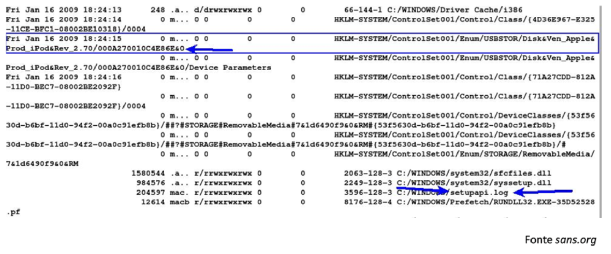
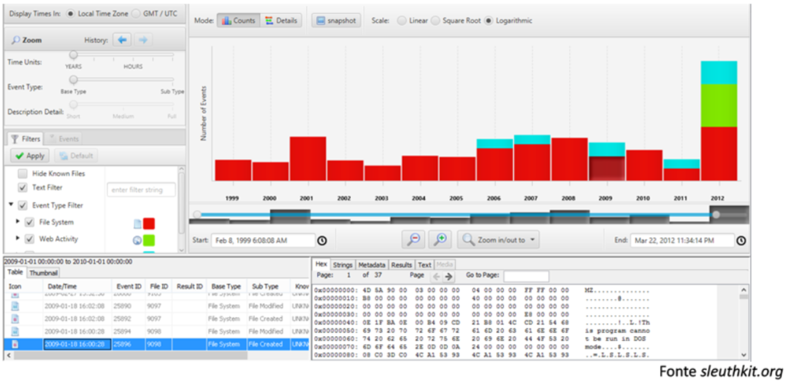
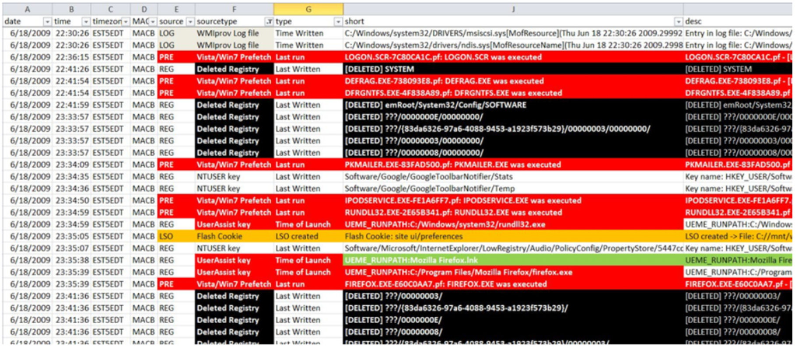

## **Lezione 4: Analisi (parte 1)**

### **1. Analisi: la fase della ricostruzione**

Dopo l’individuazione, l’acquisizione e la conservazione dei reperti, l’informatica forense entra nella sua fase più **intellettuale e interpretativa**: l’**analisi**.  
In questa fase l’esperto forense lavora **esclusivamente sulla copia** del reperto, mai sull’originale, poiché — come stabilito dai principi fondamentali della disciplina — **ogni copia coincide con l’originale** dal punto di vista probatorio, ma solo la copia può essere manipolata senza rischio di contaminazione.

L’analisi è un processo che deve essere **riproducibile**: ogni singola operazione condotta dall’analista deve produrre **sempre lo stesso risultato**, se ripetuta con gli stessi strumenti e parametri.  
La riproducibilità non riguarda le valutazioni soggettive, ma i **risultati oggettivi**: i dati.

---

### **2. Che cos’è l’analisi forense**

L’analisi è la **ricostruzione di eventi passati** attraverso la lettura e l’interpretazione di dati digitali.  
Il suo scopo è rispondere a cinque domande fondamentali — la cosiddetta **regola delle 5W**, adattata al contesto informatico:

- **Who?** → Chi ha compiuto l’azione?
    
- **What?** → Che cosa è successo?
    
- **When?** → Quando è accaduto?
    
- **Where?** → Dove si è verificato?
    
- **Why?** → Perché è accaduto?
    

Questa struttura metodologica guida la ricostruzione logica dei fatti, consentendo di passare dai bit ai comportamenti umani, e quindi alla **dinamica digitale del reato**.

---

### **3. L’obiettivo dell’analisi**

L’analisi forense mira a **individuare e correlare** dati digitali utili a comprendere come si siano svolti gli eventi e chi ne sia stato protagonista. 

"Che cosa è successo e come si è svolto?"

Le principali categorie di tracce analizzate per rispondere includono:

- **Comunicazioni** (e-mail, chat, messaggistica, VOIP).
    
- **Documenti** e loro versioni.
    
- **File di log** di sistema, rete e applicazioni.
    
- **Metadati** contenenti date, orari, utenti e coordinate geografiche.
    
- **Tabulati telefonici** e tracciati di traffico.
    
- **Navigazione web**, cronologie e ricerche effettuate.
    
- **Eventuali cancellazioni di dati** e tentativi di occultamento.
    

L’esperto deve inoltre determinare **se vi sia stata consapevolezza dell’atto**, distinguendo tra cancellazioni volontarie, automatismi di sistema o attività inconsapevoli.

Per rispondere invece a domande del tipo:

- **Chi è coinvolto?**  
    → Tramite credenziali, indirizzi IP, firme digitali o dispositivi associati. Ci si concentra dunque su COMUNICAZIONI E METADATI (date e utenti)
    
- **Quando è accaduto?**  
    → Anche qui sono utili sia comunicazioni che metadati, specie file di log relativi ai sistemi informatici oggetto d'accertamento
    
- **Da dove a dove?**  
    → Tramite l’analisi dei canali di comunicazione o dei percorsi di rete.
	    E' essenziale scandagliare lungo tali canali: documenti, log, metadati (tra cui date, luoghi, coordinate) e TABULATI TELEFONICI
    
- **Quante volte si è verificato?**  
    → Con il confronto di tracce ripetute o schemi ricorrenti, ricavati sempre da comunicazioni, documenti, log e metadati (specie le date)
    
- **C’era consapevolezza?**  
    → Attraverso elementi indiziari come cronologie, ricerche o file nascosti. Ed ecco che bisogna controllare comunicazioni, dati cancellati, documenti, log, metadati - specie date -, ma anche navigazione web e anche le competenze tecniche dell'utente!
    

Queste domande, apparentemente semplici, richiedono una **ricostruzione multidimensionale** del dato, che combini competenze tecniche, logiche e investigative.

---

### **5. Tecniche e strumenti di analisi**

L’attività di analisi si fonda su tre tipologie di operazioni principali:

#### **a. Ricerche mirate**

L’analista può effettuare ricerche:

- per **autore**, **intervallo di date**, **tipo di file**, **parole chiave** o **valori hash**;
    
- per **thread di comunicazione** (es. ricostruzione di conversazioni e-mail);
    
- per **carving**, ossia il recupero di dati cancellati e frammenti di file ancora presenti nello spazio non allocato.

#### **b. Recupero dati**

Dopo la ricerca, l'attività immediata può essere il recupero dei dati cancellati. Tale attività include varie tecniche tra cui quella del carving, che permette di ricostruire anche parzialmente contenuti che sono liberamente presenti all'interno dello spazio disco non cancellato.

#### **c. Interpretazione dei dati e conversione tra formati**

Dopo il recupero, i dati devono essere **letti e decodificati**.  
Bisogna interpretare o trovare spiegazioni in merito alla presenza di alcuni dati suoi reperti stessi.
Spesso è necessario convertire formati, decifrare informazioni, ricostruire strutture complesse o interpretare log binari.  Ciò accade perché non sempre i dati recuperati sono immediatamente leggibili!
L’analista deve quindi padroneggiare gli standard di codifica, i protocolli di rete e i comportamenti dei diversi sistemi operativi.

#### **c. Crack delle password**

In molti casi, file e archivi risultano **protetti da password** (documenti Office, PDF, archivi ZIP, ecc.).  
È possibile tentare l’accesso tramite tecniche di:

- **social engineering** (induzione psicologica dell’utente),
    
- **attacco a dizionario** (parole comuni e ricorrenti),
    
- **brute force** (tentativi sistematici di tutte le combinazioni possibili).
    

#### **d. Artefatti dell'SO**

Durante l’**analisi di un reperto informatico**, l’attenzione non si limita solo ai file evidenti o ai programmi installati, ma si estende anche agli **artefatti del sistema operativo**, cioè a **tutte quelle tracce generate automaticamente dal sistema** nel corso delle sue normali attività.

Gli artefatti sono come le **“impronte digitali” del sistema**, e permettono all’analista di **ricostruire gli eventi accaduti**, anche quando i file principali sono stati cancellati o alterati.
Con “artefatti” si intendono **dati e metadati** che il sistema salva in modo implicito per funzionare correttamente.  
Esempi comuni:

- **File di log** (registrano attività di sistema e applicazioni)
    
- **Cronologia dei file aperti o eseguiti**
    
- **Cache e file temporanei**
    
- **Registro di sistema (Windows Registry)**
    
- **Prefetch e Jump List**
    
- **Event Viewer logs**
    
- **Timestamp dei file (creazione, modifica, accesso)**
    

Analizzando questi artefatti, l’investigatore può **capire gli effetti di determinati eventi** sul sistema operativo e, andando a ritroso, **risalire alla causa originaria**.  
È come analizzare una scena del crimine: anche se l’oggetto principale è sparito, le impronte e i residui possono rivelare cosa è accaduto.
##### **Esempio pratico**

Supponiamo che, in un’indagine, venga trovata un’immagine forense di un PC aziendale compromesso.  
Durante l’analisi si scopre che:

1. Nel **Registro di sistema** ci sono chiavi che indicano l’esecuzione di un file sospetto (`malware.exe`).
    
2. I **file Prefetch** mostrano che `malware.exe` è stato avviato il 12 marzo alle 10:42.
    
3. Nei **log di sistema** si nota che subito dopo quell’orario un processo di rete ha stabilito una connessione verso un IP esterno non autorizzato.
    
4. Nella **cartella temporanea** sono stati creati file con estensioni `.tmp` contenenti frammenti cifrati di dati aziendali.
    

Da questa catena di artefatti si può **dedurre la sequenza causale**:

$$  
\text{Esecuzione malware} \Rightarrow \text{Connessione remota} \Rightarrow \text{Esfiltrazione dati}  
$$

---

### **6. Strumenti e ambienti di analisi**

L’analisi forense impiega strumenti di diversa complessità, sia HW che SW:

- **Tool a riga di comando**, potenti ma adatti a esperti (es. `dd`, `grep`, `strings`, `md5sum`, `autopsy-cli`).
    
- **Tool con interfaccia grafica**, come _EnCase_, _FTK_, _X-Ways Forensics_, _Autopsy_, _Oxygen Forensic Detective_, più intuitivi ma comunque rigorosi.
    
- **Tool distribuiti** per l’elaborazione di grandi quantità di dati (es. cluster Hadoop per big data forensics).
    
- **Tool specifici** per domini particolari: analisi di cellulari, registri di Windows, e-mail, social network, cloud.

- La virtualizzazione dei reperti consiste nel creare ambienti isolati (macchine virtuali o container) che riproducono esattamente il sistema originale, come un laboratorio in vitro: in questo modo è possibile avviare, osservare e sperimentare il comportamento di file, processi e malware senza rischiare di alterare l’evidenza o contaminare altri sistemi; pensala come portare il pezzo di un orologio in laboratorio per vedere come si muove ogni ingranaggio — consente di riprodurre gli eventi, testare ipotesi causali, catturare traffico di rete e log dinamici, e raccogliere artefatti runtime che non esistono più sul disco originale; è una tecnica sempre più usata per isolare, analizzare e documentare le prove in modo ripetibile e sicuro, ma richiede procedure e garanzie processuali specifiche ed è quindi argomento per una trattazione separata.

Negli ultimi anni si è diffuso il concetto di **laboratorio mobile**, ovvero la capacità di eseguire analisi in loco grazie a workstation portatili e tool virtualizzati, senza dover spostare i reperti.

---

### **7. Timeline e SuperTimeline**

Una delle metodologie più efficaci per la **ricostruzione temporale degli eventi digitali** è la costruzione di una **timeline**.  

La timeline soprastante è rudimentale, fatta con autopsy.
Essa consiste nell’ordinare cronologicamente tutti gli eventi significativi (creazione, modifica, accesso, connessione, cancellazione) estratti dai metadati e dai log di sistema. Questo permette di concentrarsi su un intervallo di tempo ben preciso.

Gli strumenti più noti per questa attività sono:

- **The Sleuth Kit / Autopsy**, che consente di generare timeline grafiche.
    
- **Plaso (log2timeline)**, che produce **SuperTimeline**, una versione avanzata che integra in un’unica sequenza **centinaia di fonti eterogenee** (file di sistema, browser, e-mail, cronologie).
    

Grazie a queste tecniche, è possibile visualizzare **in un colpo d’occhio** la dinamica degli eventi, individuando correlazioni, anomalie e tentativi di cancellazione.

La timeline mostrata sotto rappresenta una **serie storica di eventi digitali**, cioè una raccolta cronologica di tutte le attività rilevate sul reperto informatico (come creazione, modifica o accesso ai file, e attività web). Ogni barra del grafico mostra la **frequenza degli eventi in un dato intervallo di tempo**, permettendo di visualizzare **l’andamento dell’attività del sistema nel corso degli anni**.  
In pratica, si tratta di una **visione statistico-temporale** del comportamento del sistema: serve per individuare **picchi anomali, periodi di inattività o correlazioni tra eventi**, e quindi comprendere **quando e in che contesto si sono verificati determinati cambiamenti**.

---

Negli ultimi anni sono stati sviluppati strumenti che permettono di **arricchire la timeline tradizionale** con una quantità molto maggiore di informazioni, dando origine a quella che viene chiamata **super-timeline**.  

Nella timeline classica, infatti, venivano registrati solo tre tipi di eventi principali: **creazione del file**, **ultima modifica** e **ultima lettura o accesso**. La super-timeline, invece, integra anche **eventi derivati dal contenuto stesso dei file** o da **altre fonti di sistema**, come i **registri di Windows**, i **log applicativi** o la **cronologia di esecuzione dei programmi**.

In questo modo l’analisi non si limita più alla semplice sequenza temporale delle modifiche ai file, ma offre una **visione molto più ampia e dettagliata del comportamento del sistema**.  
È possibile, ad esempio, visualizzare nella stessa linea temporale **l’avvio di un’applicazione**, **la connessione a un sito web**, **la creazione di un file temporaneo** o **un’operazione di login**.  
La super-timeline diventa quindi una **timeline tradizionale arricchita**, che consente una **rappresentazione più completa e correlata degli eventi**, permettendo all’analista di **comprendere con maggiore precisione cosa è accaduto in un determinato intervallo di tempo**.

---

### **8. Criticità dell’analisi forense**

L’analisi, pur essendo la fase più affascinante, è anche la più complessa.  
Tra le principali criticità troviamo:

- **Rischio di interpretazioni errate** per mancanza di contesto.
    
- **Difficoltà di correlazione temporale** tra sistemi con orologi non sincronizzati.
    
- **Falsi positivi o negativi** dovuti a processi automatici del sistema operativo.
    
- **Rischio di manipolazione indiretta** dei dati durante il recupero.
    

Per questo motivo, ogni risultato deve essere **verificato e validato**, confrontandolo con altre fonti e replicando le operazioni su copie indipendenti.

---

### **9. Conclusioni**

Questa lezione ha introdotto la logica e le tecniche della fase di **analisi forense**, evidenziando la necessità di un approccio rigoroso, documentato e ripetibile.

Punti essenziali:

- L’analisi deve essere **ripetibile e condotta solo su copie forensi**.
    
- Il suo scopo è **ricostruire gli eventi passati** rispondendo alle cinque domande fondamentali (5W).
    
- L’uso di strumenti appropriati (timeline, hash, carving, tool specifici) consente di **dare forma al racconto digitale** dei fatti.
    
- Ogni passaggio deve essere **documentato e contestualizzato** per garantire la difendibilità tecnica dei risultati.
    

> In informatica forense, l’analisi è il momento in cui i bit diventano indizi e gli indizi diventano prove.  
> Ma senza metodo, ogni conclusione resta solo un’ipotesi.
