## **Lezione 5: Analisi (parte 2)**

### **1. Introduzione**

Dopo aver compreso la logica dell’analisi forense nella lezione precedente, questa seconda parte entra nel **cuore operativo**:  
gli **strumenti software** più utilizzati per condurre l’analisi dei reperti digitali, le **tipologie di artefatti** che si possono esaminare e le **tecniche di correlazione dei dati**, fino alla **link analysis**, che permette di ricostruire le relazioni tra soggetti, eventi e documenti.

---

### **2. Software di analisi forense**

L’analisi dei reperti digitali richiede strumenti specializzati, progettati per operare in modo **non distruttivo**, **tracciabile** e **ripetibile**.  
Ogni software offre funzionalità specifiche: dalla ricostruzione delle attività utente, all’estrazione di metadati, fino al recupero dei file cancellati e alla correlazione tra entità.

#### **Autopsy**

**Autopsy** è un software open-source, basato su _The Sleuth Kit_, che consente di analizzare immagini forensi complete. Si concentra sui dischi rigidi ed è compatibile con più sistemi operativi, potendo dunque leggere vari tipi di filesystem.
Offre un’interfaccia grafica intuitiva per:

- Navigare nei file e nelle partizioni del disco.
    
- Analizzare log di sistema e cronologie web.
    
- Individuare parole chiave e pattern ricorrenti.
    
- Ricostruire timeline cronologiche (SuperTimeline).

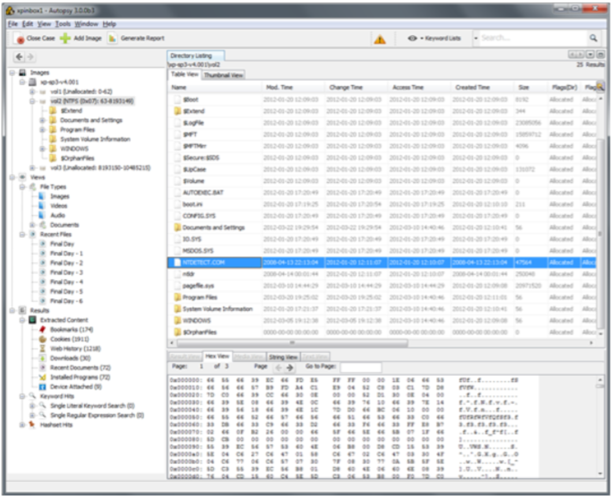

È uno degli strumenti più diffusi nei laboratori universitari e forensi per la sua trasparenza metodologica e la possibilità di verificare il codice sorgente.
**Autopsy** è ovviamente pensato per il **recupero dei file cancellati**, ma include anche la possibilità di effettuare **recuperi più profondi tramite tecniche di file carving**, cioè l’estrazione di frammenti di dati ancora presenti sul disco anche se non più referenziati dal file system.  
Nel complesso si tratta di uno **strumento molto funzionale**, soprattutto considerando che è **gratuito e open source**; tuttavia, alcune operazioni di analisi e ricerca possono risultare **più lente** rispetto a quelle eseguite con software commerciali, che dispongono di motori d’indicizzazione più ottimizzati.

Una delle sue **funzionalità più utili** è la possibilità di **ricostruire la super-timeline**, permettendo così di **contestualizzare con precisione un intervallo temporale specifico**. Questo consente all’analista di **visualizzare e correlare tutti gli eventi rilevanti** accaduti in quel periodo — creazioni, modifiche, accessi, esecuzioni di programmi e attività di rete — fornendo una **visione completa e cronologicamente coerente** dell’accaduto.

---

#### **EnCase**

**EnCase**, sviluppato da Guidance Software, è uno standard industriale nella computer forensics.  
Permette di:

- Acquisire e analizzare immagini bit-stream in ambienti certificati.
    
- Generare rapporti forensi formalmente riconosciuti in sede giudiziaria.
    
- Effettuare ricerche avanzate per hash, metadati, keyword e percorsi logici.
    
- Correlare reperti provenienti da più dispositivi (es. PC, telefoni, server).
    
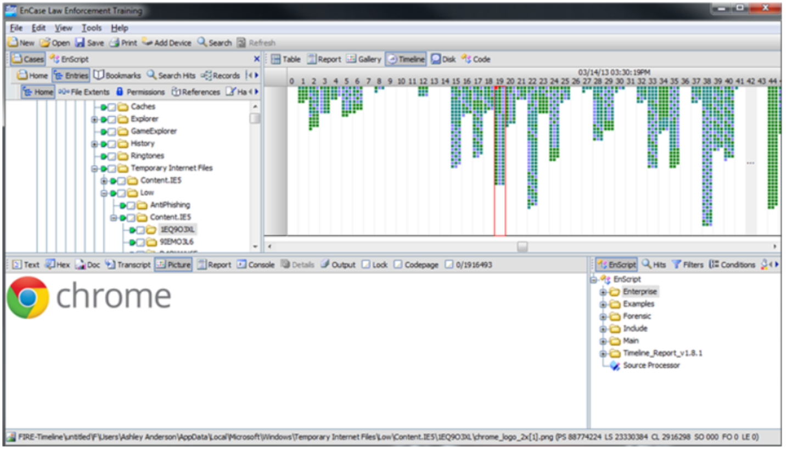

La sua forza è la **struttura modulare** e la capacità di gestire **grandi quantità di dati** con pieno controllo sulla catena di custodia digitale. 
**EnCase** è uno strumento di analisi forense estremamente avanzato, capace di **leggere numerosi tipi di file system** e di gestire in modo efficiente copie forensi di dischi e dispositivi.  
Una delle sue caratteristiche più potenti è la possibilità di **creare e utilizzare script personalizzati**, sfruttando un **vero e proprio linguaggio di programmazione interno** che consente di **automatizzare molte operazioni di analisi**, come la ricerca di pattern sospetti, l’estrazione di metadati o la generazione di report strutturati.

Inoltre, EnCase offre una **funzione di anteprima (preview)** molto utile, che permette di **visualizzare direttamente i contenuti multimediali** — come immagini, video e documenti — **senza alterare la copia forense originale**.  
Questa possibilità di esplorare in sicurezza il contenuto del reperto rende l’attività investigativa **più fluida, veloce e intuitiva**, mantenendo al contempo **l’integrità probatoria** del materiale analizzato.

#### **Internet Evidence Analyzer**

Questo software è specializzato nell’**analisi della navigazione web** e delle attività online.  
Può estrarre e interpretare:

- **Cronologie di navigazione** (browser history).
    
- **Cache**, cioè copie temporanee delle pagine visitate.
    
- **Cookies**, file di testo che tracciano sessioni e preferenze utente.
    

Grazie ai suoi algoritmi, consente di ricostruire **il comportamento dell’utente online**, anche dopo tentativi di cancellazione delle tracce.

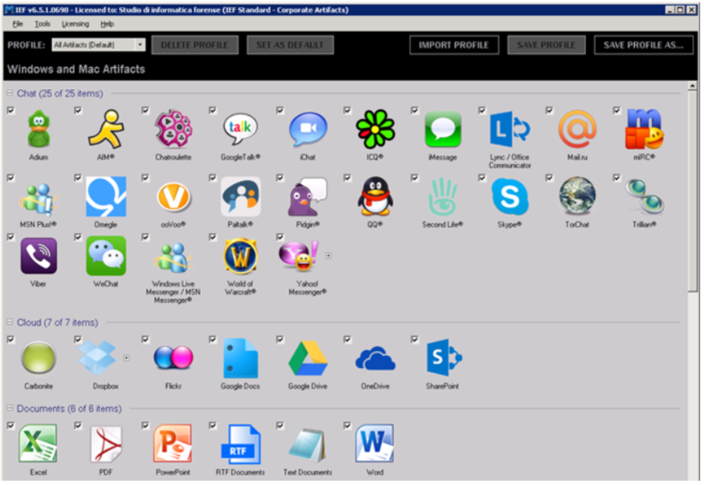

L’immagine sopra mostra un esempio delle funzionalità dello **strumento Internet Evidence Analyzer**, che consente di individuare e ricostruire diverse tipologie di evidenze digitali provenienti da attività online o da documenti locali.

Nella **prima sezione** vengono visualizzate le **chat più diffuse su Internet**, come WhatsApp, Skype, Telegram o Facebook Messenger: il software è in grado di **rilevare le tracce residue di queste conversazioni**, anche se i messaggi sono stati cancellati, e di **riorganizzarle in un report leggibile**, utile in sede di analisi o perizia.

La **seconda sezione** è dedicata ai **servizi cloud**, come **Google Drive, OneDrive e Dropbox**. Qui lo strumento ricerca **artefatti digitali associati a operazioni di sincronizzazione, upload o accesso a file remoti**, consentendo di ricostruire le attività legate allo scambio di dati attraverso piattaforme online.

Infine, la **terza sezione** si concentra sui **metadati dei documenti testuali**, come file **Word, Excel, PDF, PowerPoint, RTF o Blocco Note**. In questa fase l’analizzatore estrae informazioni “nascoste” come autore, data di creazione e modifica, percorso di salvataggio, e altre tracce che permettono di **ricostruire la cronologia e la provenienza dei file**.

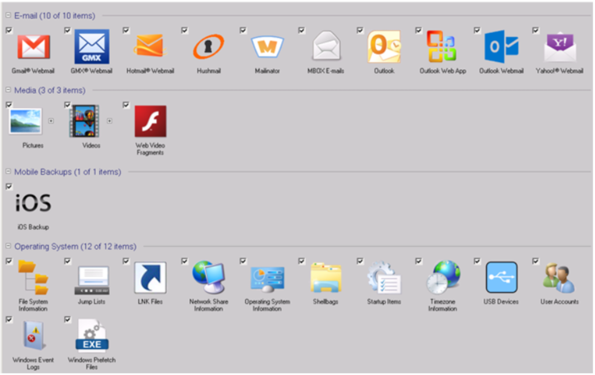

Nella **quarta sezione**, dedicata all’analisi delle **email**, lo strumento non si concentra sulle caselle di posta gestite tramite **client locali** (come Outlook o Thunderbird), ma su quelle **consultate via web**, cioè attraverso le **webmail**.  
In questi casi, Internet Evidence Analyzer analizza i **dati presenti sul reperto** — come cache del browser, cookie, cronologie, file temporanei e sessioni salvate — per **ricostruire le tracce delle email visualizzate o inviate online**.

In pratica, anche se il contenuto delle mail non è più direttamente accessibile, il software può **identificare e documentare l’attività di consultazione**, mostrando ad esempio **quali webmail sono state usate (Gmail, Yahoo, Outlook Web, ecc.)**, **quando sono state aperte** e **quali messaggi risultano visualizzati o gestiti**.  
Questo tipo di analisi è particolarmente utile perché consente di **ricostruire comunicazioni avvenute interamente sul web**, senza la necessità che sul sistema sia installato un programma di posta elettronica.

La **quinta sezione** è dedicata all’**analisi dei supporti multimediali**, e consente di individuare **file video, immagini e frammenti di contenuti web multimediali (web video fragments)** presenti sul reperto. Questi elementi possono includere sia i file originali salvati dall’utente, sia **tracce residue** provenienti da streaming online o da applicazioni che gestiscono contenuti visivi. L’obiettivo è quello di **identificare, catalogare e contestualizzare i materiali multimediali**, anche quando risultano parzialmente cancellati o nascosti all’interno di altri file.

La **sesta sezione**, invece, introduce la possibilità di effettuare **analisi forense sui backup dei dispositivi mobili**, in particolare quelli **iOS**. Queste copie di backup vengono spesso **generate automaticamente o manualmente dall’utente** quando sincronizza il proprio **smartphone con il computer**, e contengono una grande quantità di informazioni sensibili: **rubrica, messaggi, cronologia chiamate, foto, note, impostazioni e dati di app**.  
L’analisi di tali backup permette quindi di **ricostruire il contenuto e le attività del dispositivo mobile** senza accedere direttamente al telefono, offrendo così una **fonte preziosa di prove digitali** perfettamente integrata nell’indagine sul reperto principale.

La settima sezione, non particolarmente ricca di elementi è quella dell'analisi dei sistemi operativi e soprattuto del filesystem.

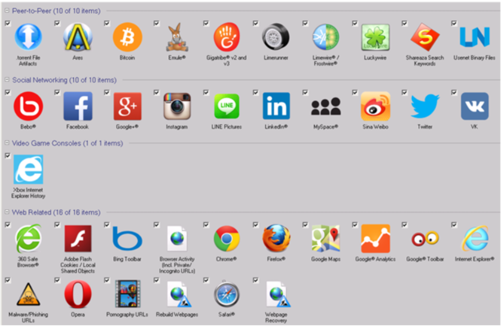

L'ottava sezione raccoglie le tracce relative ai **software di condivisione file** come **BitTorrent, Ares, eMule, LimeWire, GigaTribe** e simili. L’analizzatore è in grado di individuare **file scaricati, condivisi o in coda di download**, oltre a **metadati e log di connessione**. Queste informazioni sono spesso cruciali per verificare attività di **scambio illecito di contenuti o violazioni di copyright**.

---

Nella nona sezione vengono identificati gli artefatti digitali dei principali social network, come Facebook, Instagram, LinkedIn, Twitter, MySpace, Google+ e altri. Lo strumento ricerca cache, cookie, cronologie e dati residui che rivelano accessi, login, interazioni o messaggi anche dopo la cancellazione.  
L’obiettivo è **ricostruire l’attività social dell’utente** e collegarla a specifici periodi temporali o a determinati eventi investigativi.

---

La decima sezione è dedicata all’analisi delle tracce di connessione a console o servizi di gioco online, come nel caso di Xbox Internet Explorer History, utile per verificare l’utilizzo di browser o funzioni web integrate nelle console.  
Permette di **documentare accessi, navigazioni e interazioni digitali** effettuate da dispositivi di intrattenimento che, spesso, vengono trascurati ma possono contenere **dati probatori rilevanti**.

---

L'ultima sezione riguarda tutte le attività connesse alla navigazione su Internet. Include browser come Chrome, Firefox, Opera, Safari, Internet Explorer, ma anche toolbar, cache, cookie, URL visitati (anche in modalità privata o incognito), file temporanei, e perfino ricerche su Google Maps o Analytics.  
Inoltre, lo strumento può rilevare **URL di phishing, pornografia, o malware**, e **ricostruire pagine web visitate**.  
Questa sezione fornisce una **visione dettagliata della cronologia di navigazione**, utile per stabilire **abitudini, interessi o attività sospette dell’utente**.

---
#### **FTK – Forensic Toolkit**

**FTK (AccessData Forensic Toolkit)** è un ambiente integrato per l’analisi forense completa di dischi, immagini, e-mail e database.  

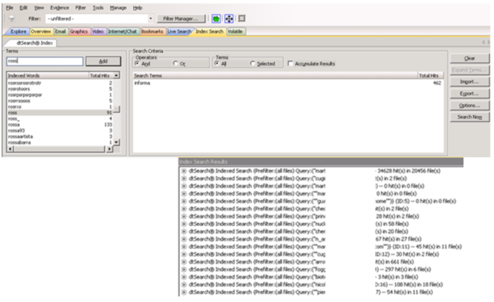

Le sue funzioni principali includono:

- Ricerca full-text e indicizzazione dei contenuti, ergo ricerche per parola chiave molto sofisticate
    
- Decrittazione di archivi protetti e file cifrati.
    
- Estrazione di evidenze da sistemi Windows, macOS e Linux.
    
- Gestione multi-utente con tracciamento di ogni azione.
    

La **rapidità di elaborazione di FTK è dovuta al fatto che, prima di avviare l’analisi vera e propria, il software esegue una fase preliminare di indicizzazione completa dei dati** presenti sul reperto.  
Durante questa fase, FTK **scansiona e cataloga tutti i contenuti** — file, testi, metadati, email, frammenti e parole chiave — costruendo un **indice interno** che funziona come un motore di ricerca forense.

Grazie a questa struttura indicizzata, le successive operazioni di **ricerca, filtraggio e correlazione** avvengono in modo estremamente veloce, poiché il software non deve ogni volta leggere l’intero disco, ma può **interrogare direttamente l’indice** già creato.  

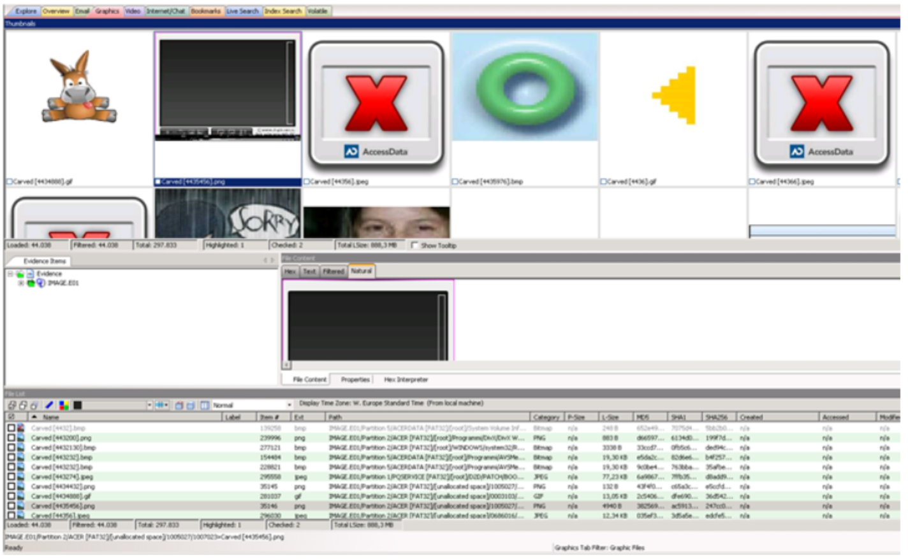

FTK mostra in modo immediato l’**anteprima dei file multimediali** presenti nella copia forense, permettendo di sfogliare immagini e riprodurre video senza toccare l’evidenza originale; questo consente all’analista di identificare rapidamente elementi rilevanti. Inoltre FTK integra tecniche di **file carving**, cioè la scansione del disco alla ricerca di intestazioni e strutture di file non più referenziati dal file system, ricostruendo immagini, video o altri contenuti da frammenti grezzi. In pratica, FTK unisce la comodità di una preview sicura con strumenti di recupero profondo: prima presenta ciò che è ancora accessibile tramite metadati e percorsi, poi tenta di ricostruire ciò che è stato cancellato leggendo direttamente i settori del supporto. Questo approccio rende l’esame multimediale più rapido e completo, mantenendo l’integrità della prova.

---

#### **Oxygen Forensics**

**Oxygen Forensic Suite** è lo strumento di riferimento per l’**analisi dei dispositivi mobili**.  

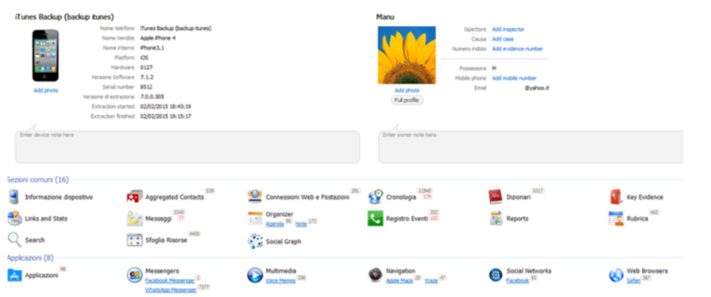

Permette di acquisire e interpretare:

- SMS, MMS, chat, cronologie chiamate e social network.
    
- Dati geolocalizzati, foto, video e registri di rete.
    
- Backup di dispositivi Android e iOS.
    

Offre inoltre la **ricostruzione dei profili sociali** degli utenti, utile in casi di cyberstalking, truffe o pedopornografia digitale. Anch'esso permette di generare timeline.

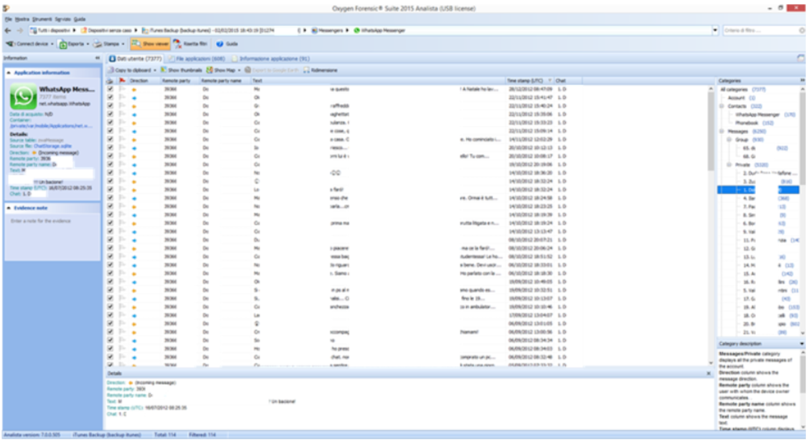

Timeline della messaggistica di whatsapp.
Sotto, invece l'attività di navigazione in internet con la correlazione dei percorsi di maps seguiti dall'utilizzatore del dispositivo:

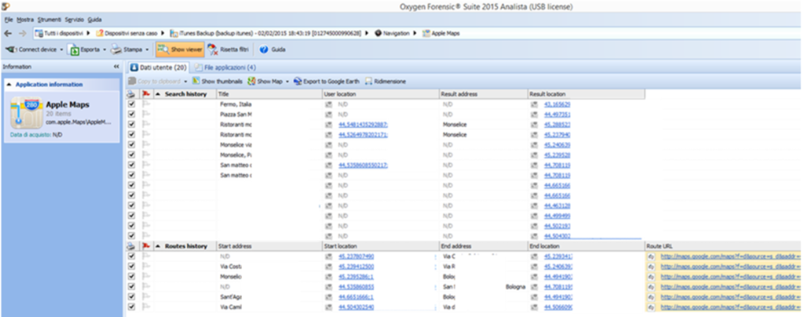

---

**P2C (Paraben's P2 Commander)** è uno strumento progettato per la **gestione e l’analisi di grandi volumi di dati digitali**, tipici delle indagini complesse in ambito forense.  
A differenza dei software focalizzati sul singolo reperto, P2C consente di **organizzare, indicizzare e correlare enormi quantità di informazioni** provenienti da più sorgenti — come dischi, email, backup o database — in un’unica interfaccia centralizzata.

Nel caso mostrato in immagine, P2C analizza un archivio di posta elettronica (ad esempio un file **.pst di Outlook**) permettendo di **navigare tra le cartelle**, **visualizzare le email** e **leggerne i metadati** (mittente, destinatario, data di invio, header SMTP, allegati, ecc.).  
Questo tipo di analisi è particolarmente utile per **ricostruire flussi comunicativi, individuare relazioni tra soggetti e correlare attività sospette**, anche in archivi di grandi dimensioni.

In sintesi, P2C è pensato per **gestire scenari di indagine su larga scala**, dove serve un motore in grado di **estrarre, filtrare e analizzare rapidamente migliaia o milioni di dati digitali**, mantenendo sempre **l’integrità e la tracciabilità della prova**.

---

### **3. Ricerca per parola chiave**

Una parte fondamentale dell’analisi consiste nella **ricerca semantica** di parole chiave o pattern testuali all’interno dei dati.  
L’operatore deve considerare **tutte le varianti possibili** di una stessa parola o espressione, utilizzando operatori logici e regolari.

Esempi:

| Ricerca          | Strategie                                                                                  |
| ---------------- | ------------------------------------------------------------------------------------------ |
| “Bus”            | `"Bus"` OR `"autobus"` OR `"pullman"`                                                      |
| “Anonimo”        | `"anonimo"` OR `"anonimi"` OR `"nascosto"`                                                 |
| Indirizzo IP     | Utilizzo di espressione regolare                                                           |
| “Giovanni Rossi” | `"Giovanni AND Rossi"` OR `"Giovanni Rossi"` OR `"G. Rossi"` OR `"Giovanni NEAR/50 Rossi"` |

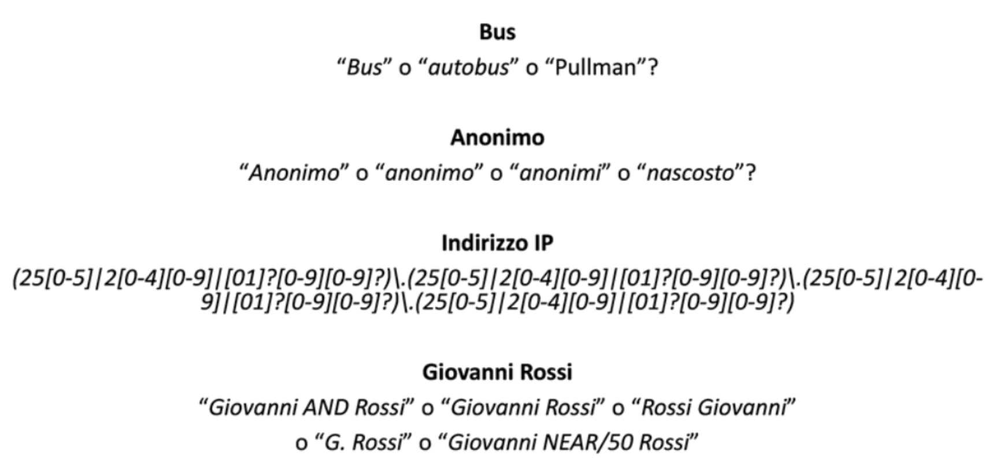

L’uso combinato di operatori logici (**AND, OR, NEAR**) e pattern regex consente di **non perdere occorrenze rilevanti** dovute a variazioni linguistiche o formattazioni differenti.

---

L’**analisi della navigazione web** è una delle attività più frequenti e significative nell’ambito dell’informatica forense, perché consente di **ricostruire il comportamento online dell’utente** e di individuare **tracce digitali** lasciate dai browser durante la navigazione.

Essa si basa principalmente sull’esame di tre categorie di dati:

La **cronologia** registra **l’elenco delle attività e dei siti web visitati** dall’utente, spesso corredati da **data, ora e durata della visita**.  
Analizzandola è possibile determinare **quali pagine sono state consultate**, in che ordine e in quali momenti, fornendo così un **profilo temporale dettagliato della navigazione**.

La **cache** è una **copia temporanea delle pagine web** visitate, salvata localmente dal browser per velocizzare il caricamento dei contenuti.  
Per l’analista forense, rappresenta una **fonte preziosa di dati residui**, poiché può contenere **immagini, testi, script o intere pagine HTML** anche dopo che la cronologia è stata cancellata.  
La cache consente quindi di **recuperare e visualizzare contenuti effettivamente consultati** dall’utente.

I **cookie** sono **file di testo generati dai server web** per **tracciare le attività dell’utente**, mantenere le sessioni di accesso o personalizzare l’esperienza di navigazione.  
Nell’analisi forense, i cookie servono a **identificare accessi a determinati siti**, **riconoscere account o preferenze utente**, e in alcuni casi **collegare l’attività locale con eventi online**.

---

### **4. Analisi degli artefatti di sistema**

I **sistemi operativi moderni** lasciano numerose tracce dell’attività degli utenti.  
L’analista deve conoscere la posizione e la funzione di questi **artefatti**, spesso decisivi per ricostruire i comportamenti.

Principali categorie:

- **Registri (Registry)** → contengono informazioni su configurazioni, installazioni software e dispositivi collegati.
    
- **Cestino** → conserva file cancellati con possibilità di ripristino.
    
- **Log eventi** → registrano attività del sistema, accessi, crash, installazioni.
    
- **Punti di ripristino** → snapshot automatici dello stato del sistema, utili per analizzare versioni precedenti dei file.
    
- **File LNK** → collegamenti a file o cartelle, indicano l’uso e la posizione originaria dei documenti.
    
- **Dispositivi USB collegati** → informazioni su pen-drive, hard disk esterni, smartphone, fotocamere, con dettagli su produttore, modello, numero di serie e ultima connessione.
    

Questi artefatti permettono di **tracciare movimenti, utilizzi e manipolazioni** anche in assenza dei file originali.

---

### **5. Analisi dei dispositivi USB**

Ogni volta che un dispositivo USB viene collegato a un sistema, vengono memorizzate informazioni nel registro e nei log.  
L’analisi di tali dati può rivelare:

- **Tipologia di dispositivo** (archiviazione, fotocamera, smartphone).
    
- **Marca, modello e serial number (S/N)**.
    
- **Data e ora dell’ultima connessione**.
    
- **Lettera di unità assegnata (es. E:, F:)**.
    
- **Eventuali file aperti o copiati** durante la sessione.
    

Questi elementi consentono di determinare **quali dispositivi** sono stati collegati e **quali dati** possono essere stati trasferiti o sottratti.

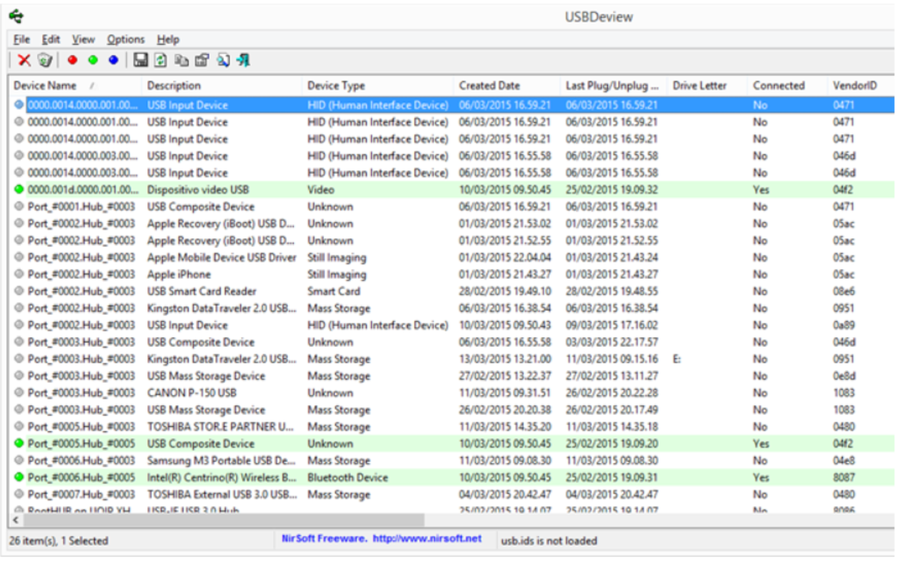

Come si può vedere da questo dettaglio, è possibile ottenere info molto dettagliate del dispositivo utilizzato ed eventualmente, attraverso l'analisi dei link, anche info sui file consultati su tale dispositivo USB:

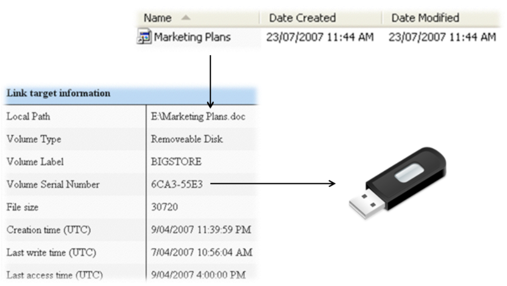

---

### **6. La Link Analysis**

La **Link Analysis** è una tecnica di analisi investigativa utilizzata per **ricostruire e visualizzare le relazioni tra entità, eventi e oggetti digitali**.  
Nasce dall’esigenza di **interpretare grandi quantità di dati**, spesso provenienti da **banche dati non strutturate** o **di difficile interrogazione “fuzzy”**, cioè con ricerche basate su similarità piuttosto che su corrispondenze esatte.

---

La Link Analysis consiste nella **costruzione di una rete di elementi interconnessi nel tempo**, con l’ausilio di software specializzati che permettono di:

- **Formare** e strutturare la rete di relazioni
    
- **Esaminare e modificare** i legami tra entità
    
- **Analizzare** i dati per individuare correlazioni significative
    
- **Cercare e mostrare modelli di comportamento**, soprattutto **illeciti o sospetti**
    

L’obiettivo principale è **rendere visibili e interpretabili i rapporti nascosti** tra persone, organizzazioni, eventi, denaro, file, sistemi informatici e altri oggetti digitali.

---

#### **Oggetti (item) analizzati**

Gli oggetti o “nodi” della rete possono rappresentare qualsiasi entità significativa per l’indagine, ad esempio:

- **Luoghi** fisici o **indirizzi IP di rete**
    
- **Organizzazioni** (aziende, governi, cellule, reparti, gruppi criminali)
    
- **Servizi** (aeroporti, scuole, hotel, magazzini)
    
- **Individui** (con nomi, alias, ID, affiliazioni, cittadinanza, dati anagrafici)
    
- **Documenti** (email, passaporti, patenti, file digitali)
    
- **Prodotti o sostanze** (chimici, droghe, materiali)
    
- **Veicoli** (auto, barche, aerei)
    
- **Denaro e transazioni** (bonifici, contanti, valute elettroniche)
    

Ogni oggetto può includere **dimensioni descrittive aggiuntive** — come età, sesso, provenienza, appartenenze, o dati biometrici — che aumentano la profondità dell’analisi.

---

#### **Eventi e correlazioni**

Per ogni evento analizzato, l’obiettivo è **quantificare e descrivere il comportamento associato**, ad esempio:

- numero di connessioni o comunicazioni effettuate,
    
- quantità di byte trasferiti,
    
- frequenza temporale degli accessi,
    
- presenza di pattern ricorrenti.
    

In questo modo si ottiene una **mappa relazionale dinamica**, dove **ogni collegamento rappresenta una prova o un riscontro** tra entità e azioni.

---

### **Il quadro sinottico delle correlazioni**

Il diagramma mostrato nell’immagine è un esempio di **Link Analysis applicata a un’indagine informatica**.  

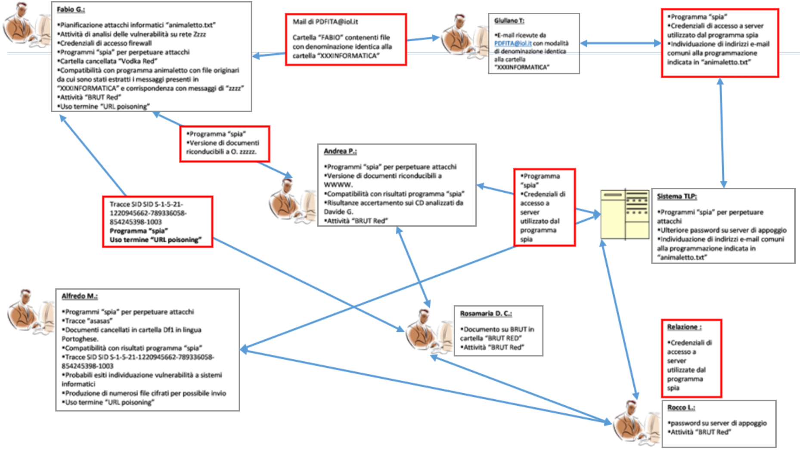

Ogni **riquadro con un nominativo** rappresenta le **risultanze sequestrate** riferite a quella persona, mentre i **riquadri rossi** evidenziano le **relazioni dirette** tra i diversi attori e le **prove comuni**, come:

- programmi “spia” usati per attacchi informatici,
    
- credenziali di accesso a server remoti,
    
- documenti e cartelle condivise,
    
- termini o tecniche comuni (es. _URL poisoning_ o _BRUT Red_).
    

Questa rappresentazione grafica consente di **visualizzare le connessioni logiche e operative** tra i soggetti coinvolti, **ricostruendo la rete di cooperazione o complicità**.

---

### **8. Conclusioni**

In questa lezione abbiamo completato la fase di **analisi** del trattamento del reperto informatico.

Punti fondamentali:

- Gli strumenti forensi (Autopsy, EnCase, FTK, Oxygen, Internet Evidence Analyzer) devono essere utilizzati in modo **scientifico e documentato**.
    
- L’analisi riguarda non solo i file, ma anche gli **artefatti di sistema**, la **navigazione web** e i **dispositivi esterni**.
    
- Le ricerche testuali richiedono **operatori logici e regolari** per essere esaustive.
    
- La **link analysis** permette di passare dai dati ai comportamenti, ricostruendo reti di relazione tra soggetti e azioni.
    

> L’analista forense non si limita a leggere i dati: li collega, li confronta, li fa parlare.  
> Solo così la verità digitale emerge come rete coerente di relazioni verificabili.
