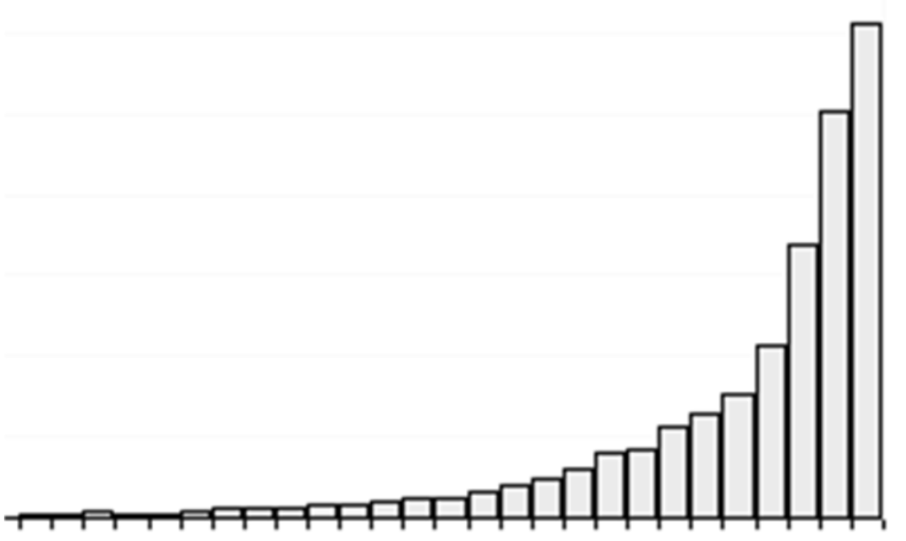
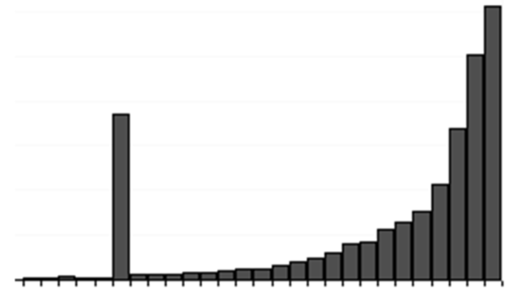
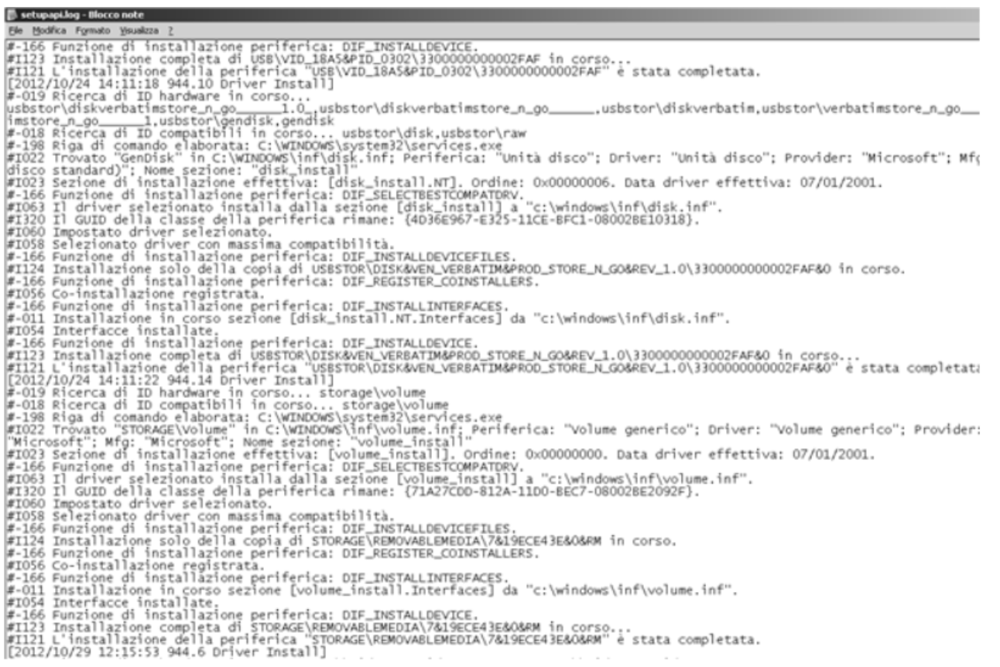

## **Lezione 6: Analisi – Casi pratici**

Con riferimento all'analisi dei reperti informatici, illustriamo un caso di studio che è stato oggetto poi anche di una pubblicazione a firma dei miei due professori di informatica forense.
Lascio il pdf per chi vuole approfondire:

cartella imgs di questa unità didattica -> 53_pdfdocente.pdf

### **1. Introduzione**

Questo studio fa riferimento a un caso reale di analisi di alcuni reperti informatici, dove l'ipotesi plausibile di avvenuta sottrazione/copia abusiva di dati di una multinazionale è stata supportata dallo studio della timeline. Come anticipato sommariamente nelle scorse lezioni, la timeline riporta i timestamp dei file presenti su un filesystem. Tali dati sono solitamente tre...

---

### **2. Identificazione di copia di dati riservati**

L’analisi si concentra su un caso di **duplicazione non autorizzata** di un documento di testo.  
La metodologia impiegata si basa sulla **lettura dei timestamp MAC** (Modification, Access, Creation), cioè i tre indicatori temporali fondamentali che descrivono la storia di un file:

- **M – (ultima) Modification**: momento in cui il file è stato modificato e riscritto su disco.
    
- **A – (ultimo) Access**: ultimo momento in cui il file è stato aperto o visualizzato.
    
- **C – Creation**: momento in cui il file è stato creato nel file system in cui risiede.
    

L’insieme di queste tre informazioni costituisce il **MAC time** di un file.  
Analizzandole in sequenza temporale, è possibile **ricostruire le attività dell’utente** e individuare con precisione se un file sia stato semplicemente letto, modificato o copiato altrove.

---

### **3. Evoluzione temporale del file**

Immaginiamo di creare un file **F1** salvato sul file system **FS1** il **1° gennaio 2011 alle 01:00**.  
In questo momento, tutti e tre i timestamp coincidono:

$$  
C_{F1} = M_{F1} = A_{F1} = \langle 01/01/2011,\ 01:00 \rangle  
$$

In seguito si susseguono diverse operazioni:

1. **2 febbraio 2011 – 02:00:**  
    Il file viene **aperto e chiuso senza modifiche**.  
    Solo l’Access Time cambia:  
    $$  
    C_{F1} = M_{F1} = \langle 01/01/2011,\
    01:00 \rangle
    $$
$$ \quad A_{F1} = \langle 02/02/2011,\ 02:00 \rangle  
    $$
    
2. **3 marzo 2011 – 03:00:**  
    Il file viene **modificato e salvato**.  
    Cambiano i valori di _M_ e _A_:  
    $$  
    C_{F1} = \langle 01/01/2011,\ 01:00 \rangle
    $$
$$ \quad M_{F1} = A_{F1} = \langle 03/03/2011,\ 03:00 \rangle  
    $$
    
3. **4 aprile 2011 – 04:00:**  
    Il file **viene copiato su un altro file system (FS2)**.  
    Il nuovo file, denominato **F2**, eredita parte dei metadati da F1 ma ne genera di nuovi:  
    $$  
    M_{F1} = M_{F2} = \langle 03/03/2011,\ 03:00 \rangle
    $$
$$ \quad A_{F1} = C_{F2} = A_{F2} = \langle 04/04/2011,\ 04:00 \rangle  
    $$
    

Il confronto tra i due file consente quindi di **identificare con precisione l’atto di copia**.

Nel contesto di un’indagine, l’analisi dei timestamp permette di:

- Verificare **se un file sia stato copiato o solo aperto**.
    
- Determinare **quando la copia è avvenuta**, anche se il contenuto è identico.
    
- Identificare **l’ordine temporale** tra creazione, modifica e accesso.
    
- Riconoscere **dispositivi diversi** (FS1 e FS2) attraverso incongruenze nei valori temporali.
    

Questa metodologia si rivela essenziale nei casi di **furto di informazioni aziendali**, **data leakage** e **spionaggio industriale**, dove l’autore potrebbe aver duplicato file sensibili su chiavette USB o dischi esterni.

---

Quindi, alla luce di quanto detto finora, possiamo immaginare che la timeline contenga l'elenco di TUTTI GLI EVENTI di modifica e cancellazione che si sono verificate l'ultima volta per ogni singolo file.
C'è da aspettarsi che su un computer usato con continuità e in maniera ordinaria, il numero di file modificati che hanno accesso allo spazio temporale tende a concentrarsi verso gli ultimi periodi di utilizzo del computer stesso. 

A questo punto, possiamo individuare degli eventi sentinella di eventuali copie massive che sono avvenute nel tempo. Con copia massiva si intende la copia di un numero elevatissimo di file.
Nel momento in cui su un server dovessero venire copiati tutti i dati presenti su un computer, allora c'è da ipotizzare che il giorno in cui tale copia è avvenuta, in un momento ben preciso ci sarà stato un picco nella timeline. **Il picco non è condizione sufficiente, solo necessaria!!!**

A partire dall'evento sentinella, può essere associato e quindi analizzato anche l'eventuale collegamento di un dispositivo USB, poiché di solito il riversamento dei dati avviene verso un disco esterno!!
In concomitanza di una lettura massima va dunque individuata e cercata la prova di tale collegamento, dai file di log...

Questo evento viene intercettato dall'SO, ergo rimane traccia. E se c'è una coincidenza temporale tra inserimento del disco rigido e una contestuale ed immediatamente successiva lettura massiva di file, è lecito ipotizzare e sostenere con ragionevole certezza che i dati siano stati riversati sul disco esterno. Ma anche con 2 eventi sentinella rilevanti, va comunque precisato che sono entrambe condizioni indiziarie ma non permettono di dimostrare con assoluta certezza l'avvenuta copia dei file!

Dall'analisi del file di registro del sistema è possibile verificare anche la natura del dispositivo collegato alla porta USB:

Quindi la contemporaneità dei due eventi permettono di evidenziare come la coincidenza di circostanze sia elemento fortemente indiziario per l'alta probabilità di avvenuta copia.

---

### **4. Analisi di un’e-mail per risalire al mittente**

Un secondo caso pratico riguarda l’**analisi forense di un’e-mail**.  
L’obiettivo è risalire con precisione al **mittente reale**, anche quando il messaggio appare manipolato o proveniente da fonti anonime.

#### **Le componenti dell’e-mail**

1. **Header (intestazione)** → contiene i metadati tecnici:
    
    - indirizzi IP dei server attraversati,
        
    - data e ora di invio e ricezione,
        
    - percorso SMTP,
        
    - identificativi univoci del messaggio.
        
2. **Corpo del messaggio (body)** → contiene il testo, eventuali firme e riferimenti.
    
3. **Allegati** → file che possono contenere metadati interni, codici malevoli o documenti riservati.
    

L’analisi si concentra in particolare sugli **header**, poiché solo essi permettono di ricostruire la **catena dei server** attraversati dal messaggio e di individuare il **punto di origine**.
In alcuni casi è possibile però trovare header scarni e poveri di dati utili.
In casi fortuiti, si può arrivare invece anche all'intestatario di posta elettronica dal quale è stata inviata l'email.
Precisazione importante perché occorre svolgere poi un ulteriore percorso di analisi per arrivare ad identificare il reale autore dell'invio di quella mail sapendo chi era l'intestatario dell'utenza telefonica dalla quale è stata inviata.
Ad esempio: si arriva a scoprire l'appartamento x, con 4 inquilini: si indaga per capire chi dei 4 ha inviato la mail.

Qui sopra si vede l'elenco di tutti gli header presenti all'interno di un'email. Vengono indicati in maniera puntuale tutti i sistemi attraverso i quali l'email è passata nel suo percorso per giungere al destinatario finale. Va evidenziato che ulteriori elementi che rendono gli header utili sono tutt'altra serie di informazioni al di là degli ip dei server, come id del messaggio, client di posta elettronica utilizzato...

---

### **5. OSINT e tracciabilità**

Per supportare l’analisi delle e-mail, si utilizza l’approccio **OSINT** (_Open Source Intelligence_), ovvero la raccolta di informazioni da **fonti pubblicamente accessibili**:  
database WHOIS, social network, forum, motori di ricerca, DNS e archivi di spam.

Combinando i dati OSINT con quelli estratti dall’header, l’investigatore può risalire fino a:

- il **provider di posta** utilizzato;
    
- il **server fisico** di origine;
    
- talvolta perfino **l’utenza telefonica** o il dispositivo connesso.
    

Questa metodologia è ampiamente impiegata nei casi di **diffamazione online**, **minacce informatiche** e **phishing mirato**.

---

### **6. Conclusioni**

Questa lezione chiude la fase dell’**analisi forense** mostrando come i principi teorici trovino applicazione concreta.

Punti chiave:

- I **timestamp MAC** sono strumenti essenziali per rilevare **copie non autorizzate** di dati riservati.
    
- Gli **eventi sentinella** permettono di individuare **comportamenti anomali** nella sequenza temporale delle azioni.
    
- L’**analisi delle e-mail**, unita alle tecniche **OSINT**, consente di **risalire al mittente reale** anche in presenza di tentativi di anonimizzazione.
    
- La **timeline** è la base della verifica di compatibilità tra eventi digitali e fatti reali.
    

> La computer forensics non è solo scienza dei dati, ma scienza dei comportamenti:  
> ogni bit ha un tempo, un luogo e un significato che, ricostruiti con metodo, rivelano la verità digitale.

---

## **Approfondimento: Analisi stocastica ed eventi sentinella (SUNTO DEL PDF)**

### **1. Premessa giuridica e contesto aziendale**

Il documento introduce il problema del **furto di dati aziendali** in ambito informatico, chiarendo che:

- la **mera copia** di file riservati non costituisce _furto_ in senso penale (Cass. Pen. n. 44840/2010),  
    poiché non c’è sottrazione fisica del bene;
    
- ma può configurare il **reato di rivelazione di segreto professionale o industriale (art. 622 c.p.)**  
    se le informazioni vengono utilizzate a vantaggio di un concorrente.
    

Il caso tipico è quello del **dipendente che, prima delle dimissioni, copia documenti riservati** per riutilizzarli altrove.

---

### **2. Tutela e controllo del lavoratore**

- **Art. 4 dello Statuto dei Lavoratori (L. 300/1970):** vieta il controllo a distanza salvo esigenze organizzative o di sicurezza e previo accordo sindacale.
    
- Tuttavia, **la Cassazione (n. 2722/2012)** consente controlli _ex post_ su e-mail e sistemi informatici,  
    quando finalizzati ad accertare **comportamenti illeciti** e non a sorvegliare l’attività lavorativa.
    
- È quindi **legittima un’indagine forense interna**, se serve a proteggere il patrimonio aziendale.
    

Ogni azienda deve fornire un’**informativa preventiva chiara** ai dipendenti (secondo il Garante Privacy, delibera n. 13/2007), indicando:

- modalità di utilizzo degli strumenti informatici;
    
- limiti d’uso personale;
    
- tipologia e durata dei log conservati;
    
- condizioni e finalità dei controlli.
    

---

### **3. Aspetti tecnici dell’indagine forense**

#### **3.1 Timestamp MAC**

Ogni file è associato a tre tempi fondamentali:

$$  
\text{M – Modification, A – Access, C – Creation}  
$$

che descrivono rispettivamente **modifica**, **ultimo accesso** e **creazione** del file nel file system.  
Analizzando i MAC time di più file è possibile **ricostruire sequenze di azioni** e identificare eventi anomali.

#### **3.2 Timeline**

L’ordinamento cronologico di tutti i MAC time consente di creare una **timeline** che mostra:

- la cronologia completa delle operazioni su un sistema;
    
- i picchi di attività (es. “lettura massiva di file”).
    

#### **3.3 Lettura e copia massiva**

Una **copia di file** comporta sempre un’elevata quantità di letture consecutive sul file system sorgente.  
Un **picco di accessi ravvicinati** può quindi costituire un **evento sentinella digitale**, indizio di possibile **esfiltrazione di dati**.

Tuttavia, tali picchi possono anche derivare da:

- scansioni antivirus,
    
- backup non forensi,
    
- ricerche Windows (che leggono i contenuti dei file).
    

È quindi necessaria la **correlazione con altri eventi**.

---

### **4. Eventi sentinella**

#### **a. Eventi sentinella digitali**

Sono tracce registrate nel sistema informatico:

- **connessione di dispositivi USB**,  
    rilevabile nel registro di Windows e nel file `setupapi.log`;
    
- software dedicati come **USB Store Parser (USP)** possono estrarre date e metadati di connessione;
    
- la **coincidenza temporale** tra collegamento USB e picco di letture di file costituisce forte indizio di **copia massiva**.
    

#### **b. Eventi sentinella non digitali**

Sono elementi del mondo reale, come:

- la **restituzione del PC aziendale**,
    
- **testimonianze di colleghi** su comportamenti anomali,
    
- **registri di accesso fisico** o **orari di uscita**.
    

La **correlazione temporale** tra eventi digitali e non digitali rafforza il quadro probatorio.

---

### **5. Acquisizione e integrità delle prove**

Per garantire la validità giuridica dell’analisi:

1. si deve eseguire una **copia forense bit-stream** (1:1, bit per bit);
    
2. si calcola un **hash crittografico** per garantirne l’integrità;
    
3. si applicano **firma digitale e marca temporale**, che fungono da **sigillo elettronico**  
    (art. 260 c.p.p., introdotto dalla L. 48/2008).
    

Solo così la prova è autentica, verificabile e ammissibile in giudizio.

---

### **6. Correlazione finale**

Un esempio operativo:

- **Evento 1:** collegamento USB → 24/10/2012 ore 14:11.
    
- **Evento 2:** lettura di numerosi file consecutivi tra 14:11:43 e 14:11:45.
    
- **Conclusione:** compatibilità elevata con **copia massiva di documenti riservati**.
    

---

### **7. Conclusioni**

La combinazione di:

- **timeline** dei file,
    
- **eventi sentinella digitali e fisici**,
    
- e **analisi stocastica** delle anomalie temporali
    

permette di **ricostruire condotte illecite** anche senza log diretti di copia.  
La metodologia dimostra come la computer forensics possa colmare il vuoto tra **indizio e prova**, fornendo ricostruzioni tecniche coerenti e scientificamente fondate.