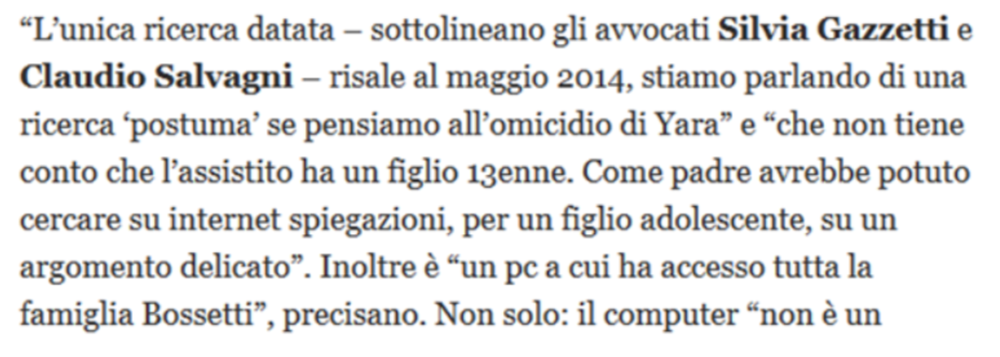
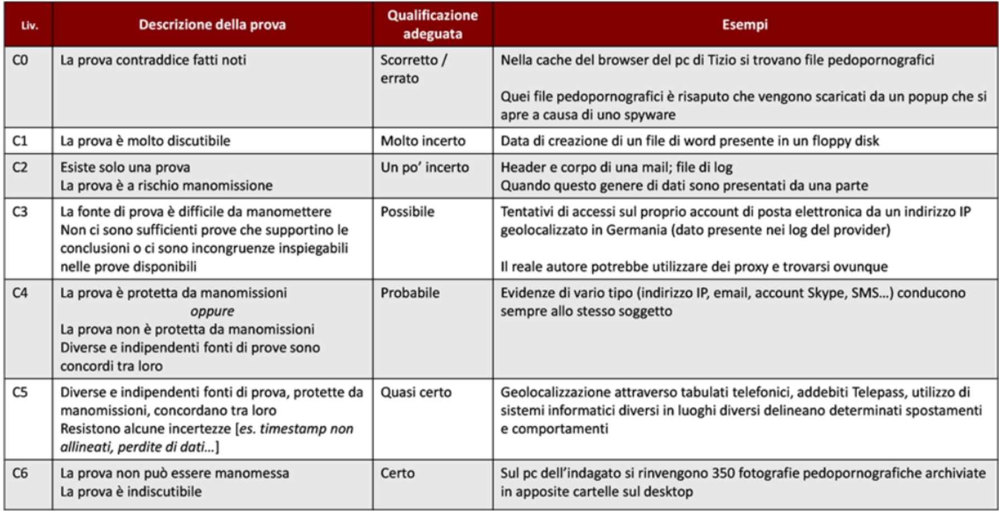

## **Lezione 7: Valutazione e presentazione del reperto informatico**

### **1. Le fasi del trattamento del dato informatico**

Il trattamento del reperto informatico si compone di fasi sequenziali che devono essere condotte con metodo rigoroso e documentato:

1. **Identificazione** delle fonti di prova.
    
2. **Raccolta**, comprendente acquisizione, conservazione e trasporto.
    
3. **Analisi** tecnica dei dati.
    
4. **Valutazione** critica dei risultati.
    
5. **Presentazione** chiara e comprensibile delle conclusioni.
    

Questa lezione affronta proprio le due fasi conclusive: **valutazione** e **presentazione**.

---

### **2. La valutazione: perché è necessaria**

Il reperto informatico, per sua natura, può essere **alterato**, **inquinato** o **contraffatto** con estrema facilità.  
Di conseguenza, è indispensabile che l’esperto effettui una **valutazione critica** non solo del contenuto tecnico dei dati, ma anche della loro **attendibilità, integrità e autenticità**.

Inoltre, è fondamentale verificare **la legittimità delle operazioni di acquisizione**, perché una prova tecnicamente corretta ma acquisita in violazione delle norme procedurali **non è ammissibile** in sede giudiziaria.

---

### **3. Attendibilità, integrità e autenticità**

La valutazione di un reperto informatico si fonda su tre giudizi distinti:

- **Attendibilità** → riguarda la correttezza e trasparenza delle operazioni eseguite.
    
- **Integrità** → indica che il reperto non è stato alterato dal momento della raccolta.
    
- **Autenticità** → garantisce che il dato provenga realmente dalla fonte dichiarata.
    

Solo quando questi tre requisiti sono verificati si può considerare il reperto come **prova scientificamente valida**.

---

### **4. Perché serve la valutazione se i bit sono oggettivi?**

Una delle domande apparentemente più provocatorie poste dal docente è:

> “Se un bit può valere solo 0 o 1, perché serve una valutazione?”

La risposta è che **i bit non parlano da soli**: vanno interpretati.  
Un’analisi forense fornisce **risultati oggettivi**, ma il loro **significato giuridico e comportamentale** non è automatico.

oppure...

---

### **5. Esempio di valutazione dei metadati**

Un esempio concreto:  
Un file presenta i seguenti metadati:

- **Data di ultima lettura:** 3 maggio 2014
    
- **Data di ultima modifica:** 5 aprile 2013
    
- **Data di creazione:** 3 maggio 2014
    

Che cosa significa?

Interpretando correttamente i dati:

- il file è **stato creato nel file system il 3 maggio 2014**, ma **l’ultima modifica del contenuto risale al 2013**;
    
- ciò suggerisce che **non è stato scritto ex novo**, bensì **copiato o importato** da un altro sistema.
    

Questo tipo di analisi dimostra che la valutazione **non si limita ai dati**, ma riguarda la **loro interpretazione logica e temporale**.

---

### **6. Esempi pratici: la necessità dell’interpretazione**

Richiamiamo alcuni casi di cronaca relativi all’omicidio di Yara Gambirasio, per mostrare **come i giornali possano facilmente strumentalizzare** informazioni tecniche incomplete o male interpretate, soprattutto quando si parla di informatica forense.

Nelle slide sono riportati vari titoli di giornale che affermano, ad esempio, che _«Bossetti accedeva a siti pedopornografici»_ oppure che avrebbe _«cercato tredicenni»_ su Internet.  
Questi titoli mostrano bene come elementi tecnici complessi vengano spesso semplificati in maniera sensazionalistica, generando conclusioni affrettate e potenzialmente fuorvianti.

Gli avvocati della difesa, infatti, fecero notare che:

- l’unica ricerca “datata” era del **maggio 2014**, quindi **successiva** ai fatti dell’omicidio (definita “postuma”),
    
- nel sistema informatico utilizzato **avevano accesso diversi membri della famiglia**,
    
- e l’assistito aveva un **figlio tredicenne**, per cui una ricerca su argomenti legati all’adolescenza non poteva automaticamente essere attribuita al solo Bossetti.
    

In altre dichiarazioni, la difesa fece notare che una delle ricerche contestate poteva derivare da un **pop-up pubblicitario**, e non da un’azione volontaria dell’utente. Questo è un esempio di quanto sia fragile il dato informatico quando viene interpretato senza un’adeguata analisi tecnica.

> spesso i media estrapolano una singola evidenza tecnica, la semplificano, la amplificano e la usano per costruire una narrativa colpevolistica o scandalistica, senza considerare gli elementi di contesto e le alternative tecniche possibili.

Queste distorsioni dimostrano quanto sia importante la figura del consulente tecnico, che deve analizzare il dato informatico con rigore, evitando interpretazioni affrettate e spiegando correttamente:

- cosa può significare davvero una ricerca nel browser,
    
- cosa può generare contenuti automatici (pop-up, adware, siti malevoli),
    
- quali utenti avevano accesso al computer,
    
- e se il dato è attribuibile con certezza a una persona specifica.
    

IN SINTESI: Una notizia che sembra clamorosa e compromettente a livello mediatico può, in realtà, poggiare su basi tecniche molto più deboli, equivoche o facilmente contestabili.  
L’informatica forense richiede sempre prudenza, metodo e contestualizzazione, mentre i media tendono spesso a privilegiare l’impatto emotivo a scapito della precisione tecnica.

Un secondo esempio banale ma chiaro per mostrare la cosiddetta PRESUNZIONE DI COLPEVOLEZZA

> “come far eccitare una ragazzina di 12 anni” in cronologia

Una tale evidenza, se isolata, può indurre a **una presunzione di colpevolezza**.  

Ma in realtà è solo Sheldon Cooper che non sa usare il browser adeguatamente.

Questo esempio mostra che **la valutazione forense richiede contesto**.  
Un dato, per quanto oggettivo, **può essere fuorviante** se non interpretato nel suo ambiente di origine.

---

### **7. L’importanza del contesto e della “voglia di capire”**

Ogni analista deve considerare:

- il **significato reale del dato**;
    
- il **livello di certezza raggiungibile**;
    
- il grado di **affidabilità della fonte**;
    
- la propria **esperienza, formazione e “pignoleria professionale”**.
    

La valutazione non è mai un atto puramente tecnico: è un **processo logico-deduttivo** fondato su conoscenza, cautela e capacità di interpretare il contesto.

---

### **8. La scala di certezza di Casey**

Valutare l’attendibilità delle prove informatiche è un’operazione complessa.  
I sistemi informatici, infatti, possono introdurre errori o risultare inaffidabili per una serie di motivi.

#### **a. Possibili errori dei sistemi informatici**

Un computer può generare dati sbagliati a causa di:

- **malfunzionamenti hardware** (dischi danneggiati, RAM difettosa, problemi elettrici),
    
- **input errati** forniti dall’utente o dal software,
    
- **errori di progettazione** nei programmi,
    
- **difetti dei sistemi operativi o delle applicazioni**.
    

Tutti questi fattori possono incidere sulla qualità e sulla precisione della prova digitale.

#### **b. Possibili inaffidabilità delle prove digitali**

Oltre agli errori tecnici involontari, va considerato anche il rischio di **manomissioni volontarie**:

- gli interessati possono creare **falsi dati**,
    
- oppure alterare file, log, timestamp e contenuti per costruire prove a proprio vantaggio.
    

La prova digitale, quindi, non è automaticamente affidabile solo perché “proviene da un computer”.

#### **c. Le reti rendono tutto più complesso (ma anche più ricco)**

Quando un dato passa attraverso una rete di computer, la valutazione dell’affidabilità diventa ancora più articolata:

- sono coinvolti **più sistemi**, ciascuno con potenziali fonti di errore;
    
- aumenta la probabilità complessiva di imprecisioni o manipolazioni;
    
- ma allo stesso tempo cresce anche la possibilità di **incrociare i dati** e verificare coerenze o incongruenze tra più sorgenti.
    

Le reti, quindi, **complicano** l’analisi, ma **offrono anche più punti di controllo**.

## **4. La Scala di Certezza di Casey**

Per aiutare l’esperto a esprimere un giudizio sul **livello di affidabilità delle prove digitali**, Eoghan Casey, uno dei massimi esperti internazionali di computer forensics, ha proposto la **“Scala di certezza”**.

La Scala di Casey è descritta nel testo:

> **E. Casey, _Digital Evidence and Computer Crime_, Academic Press**

e rappresenta uno dei principali strumenti di riferimento per giudicare:

- quanto un dato digitale sia credibile,
    
- quanto sia supportato da altri elementi,
    
- e quanto sia robusto dal punto di vista tecnico-forense.
    

---

|Livello|Descrizione|Grado di certezza|Esempio|
|---|---|---|---|
|**C0**|La prova contraddice fatti noti.|Scorretto / errato|File pedopornografici trovati nella cache: si scopre che derivano da popup generati da spyware.|
|**C1**|La prova è molto discutibile.|Molto incerto|Data di creazione di un file Word su floppy disk: facilmente alterabile.|
|**C2**|Esiste una sola prova, suscettibile di manomissione.|Un po’ incerto|Header e corpo di una mail presentati da una sola parte processuale.|
|**C3**|La fonte è difficile da manomettere, ma le prove sono incomplete o incoerenti.|Possibile|Tentativi di accesso all’account e-mail da IP tedesco, ma l’autore può usare proxy.|
|**C4**|Fonti diverse, indipendenti e coerenti tra loro.|Probabile|Indirizzo IP, account Skype ed SMS conducono allo stesso soggetto.|
|**C5**|Diverse fonti indipendenti e protette da manomissione concordano.|Quasi certo|Geolocalizzazioni e tabulati telefonici confermano spostamenti coerenti.|
|**C6**|La prova è indiscutibile e non può essere manomessa.|Certezza|350 file pedopornografici trovati su desktop, in cartelle dedicate.|

Questa scala non è un dogma, ma un **criterio di riferimento** che aiuta il consulente a esprimere la **forza probatoria complessiva** di quanto ha trovato.

---

### **9. Presentazione del reperto informatico**

La fase di **presentazione** è quella in cui il consulente comunica i risultati della propria attività al giudice o al committente (pubblico ministero, difesa, parte civile).  
Deve essere eseguita in due modalità complementari:

#### **a. Relazione scritta**

- Deve essere **chiara, ordinata e leggibile anche da non tecnici**.
    
- Scritta **per chi legge, non per chi scrive**.
    
- Evitare eccessiva terminologia specialistica, ma spiegare ogni termine tecnico usato.
    
- Includere **appendici e allegati** con log, hash, screenshot e dati tecnici, per alleggerire il corpo principale.
    

#### **b. Presentazione orale**

- Si effettua in sede di **dibattimento** o **perizia**.
    
- Richiede **capacità comunicativa e sintesi**, frutto di esperienza.
    
- L’obiettivo non è “dimostrare di sapere”, ma **far comprendere** al giudice e alle parti il significato tecnico delle evidenze.
    

L’arte del consulente è quella di “**rendere chiaro l’invisibile**”. Il CT deve rimanere preparato e pronto alle provocazioni eventuali che potrebbero venire dalle parti che hanno interesse a screditarlo...

Il CT è un chiodo martellato da tutti, specie il perito del giudice. La situazione va gestita con serenità per evitare personalismi e per non abboccare a provocazioni che giuristi o avvocati maliziosi ed esperti potrebbero tentare per squalificare e screditare.

---

### **10. In sintesi**

- La valutazione trasforma i dati tecnici in **conclusioni giuridicamente rilevanti**.
    
- Serve a garantire **attendibilità, integrità e autenticità** del reperto.
    
- Nessuna prova digitale è autoesplicativa: richiede **interpretazione contestuale**.
    
- La **scala di Casey** fornisce un criterio oggettivo di certezza.
    
- La **relazione scritta e orale** devono essere comprensibili, verificabili e documentate.
    

> “Una buona consulenza forense non è quella che dimostra di sapere tutto,  
> ma quella che convince chi non sa nulla.”

---
