Questo modulo introduce l’analisi forense dei **dispositivi di memorizzazione digitale**, cuore operativo dell’informatica forense applicata.  
L’obiettivo è comprendere e padroneggiare le **tecniche di acquisizione, interpretazione e ricostruzione dei dati** presenti su supporti come hard disk, SSD, pendrive e schede di memoria, anche quando i file risultano cancellati o frammentati.

La **disk forensics** studia il comportamento dei file system, i meccanismi di allocazione e i metodi per individuare tracce residue invisibili all’utente.  
Attraverso strumenti dedicati e procedure rigorose, l’analista impara a **ricostruire cronologie, recuperare informazioni cancellate** e verificare la presenza di attività illecite o tentativi di occultamento.

Il modulo rappresenta il passaggio dalla teoria metodologica alla **pratica di laboratorio**, dove la precisione tecnica diventa la garanzia dell’integrità e dell’attendibilità della prova digitale.

---

# **UD1 – File system**

In questa unità ci focalizzeremo sui **file system**, che costituiscono il livello strutturale fondamentale su cui si basano tutte le operazioni di memorizzazione digitale. Per poter condurre un’analisi forense efficace, è indispensabile comprendere come i dati vengono organizzati, dove si trovano i metadati critici (come timestamp, inodes, master file table, slack space), e come le diverse soluzioni (NTFS, FAT32, Ext4, ecc.) influiscano sull’estrazione e sull’interpretazione delle tracce digitali.

Attraverso questa unità acquisirai le basi necessarie per entrare nel vivo della “disk forensics”: capire cosa succede **dietro le quinte** di un dispositivo di memorizzazione, identificare le parti del file system che contengono **evidenze rilevanti**, e prepararti ad operare sull’immagine forense con consapevolezza metodologica.

---

## **Lezione 1: Le caratteristiche dei file system**

Prima ancora di partire, è bene fare un passo indietro: cos'è un file?

### **0. Definizione di file (con inclinazione all’informatica forense)**

Un **file** è un insieme organizzato di dati memorizzati su un dispositivo digitale (come hard disk, SSD, chiavetta USB, memoria del telefono), identificato da un **nome** e da un **percorso**, e gestito dal **file system** del sistema operativo. In informatica forense, un file non è solo ciò che l’utente vede: è un’unità di informazione composta sia dal contenuto vero e proprio (i **data**) sia dai metadati che lo descrivono.

Dal punto di vista forense, un file è quindi:

#### **a. Un contenitore di dati**

Può contenere testo, immagini, video, codice, configurazioni, documenti, database ecc. Il contenuto viene interpretato tramite un _formato_ (PDF, JPG, DOCX, MP4…), riconosciuto anche dall’header (le prime firme di byte).

#### **b. Un oggetto gestito da un file system**

Il file esiste all’interno di una struttura logica che lo colloca, lo indicizza e ne permette il recupero. I file system più comuni (NTFS, FAT32, exFAT, APFS, EXT4) determinano **come** i file vengono salvati, modificati e cancellati.

#### **c. Un insieme di metadati**

In forense i metadati sono cruciali:

- **MAC times**: _Modified, Accessed, Created_
    
- **Dimensione**
    
- **Percorso assoluto**
    
- **Permessi e proprietà**
    
- **Allocazione su disco**
    

Questi elementi permettono di ricostruire attività dell’utente, cronologie e potenziali manipolazioni.

#### **d. Un oggetto che può lasciare tracce anche dopo la cancellazione**

Dal punto di vista dell’informatica forense, un file **non sparisce** quando viene cancellato:

- il contenuto rimane spesso nello _spazio non allocato_ (unallocated space);
    
- le sue directory entries possono rimanere;
    
- frammenti del file possono essere recuperati tramite carving;
    
- i journal del file system (es. USN Journal in NTFS) possono conservare traccia delle sue modifiche.
    

#### **e. Un artefatto digitale utilizzabile come prova**

In un’indagine, un file può essere:

- un documento prodotto dall’utente;
    
- un file di log;
    
- la cache di un browser;
    
- un’immagine cancellata;
    
- un file di sistema manipolato da malware.
    

La sua **integrità** viene verificata tramite hash (MD5, SHA-1, SHA-256) e la sua **catena di custodia** garantisce il valore probatorio.

---

### **Definizione sintetica “pronta all’orale”**

> _Un file è un insieme strutturato di dati memorizzato in un dispositivo digitale e gestito da un file system. In informatica forense, un file non è solo il contenuto visibile, ma comprende anche metadati, firme interne e tracce residue che possono rimanere anche dopo la cancellazione, rendendolo un importante artefatto probatorio._

---

### **1. Introduzione**

Il **file system** è il meccanismo attraverso cui i dati vengono **organizzati, memorizzati e gestiti** all’interno di un dispositivo di archiviazione, come un disco rigido, un SSD, una memoria USB o un CD-ROM.  
In altre parole, è la **struttura logica** che consente a un sistema operativo di trasformare una sequenza di bit in **file e directory** leggibili e manipolabili dall’utente.

Dal punto di vista tecnico, un file system rappresenta un **insieme di tipi di dati astratti** e regole che permettono:

- la **scrittura** e la **lettura** dei file;
    
- la loro **organizzazione gerarchica**;
    
- la **navigazione** nelle directory;
    
- l’**accesso controllato** e la **manipolazione** dei contenuti.
    

---

### **2. Tipologie di file system**

Nel tempo, diversi sistemi operativi hanno introdotto le proprie versioni di file system, ciascuna con caratteristiche specifiche.  
Di seguito uno screenshot con un'elencazione non esaustiva:

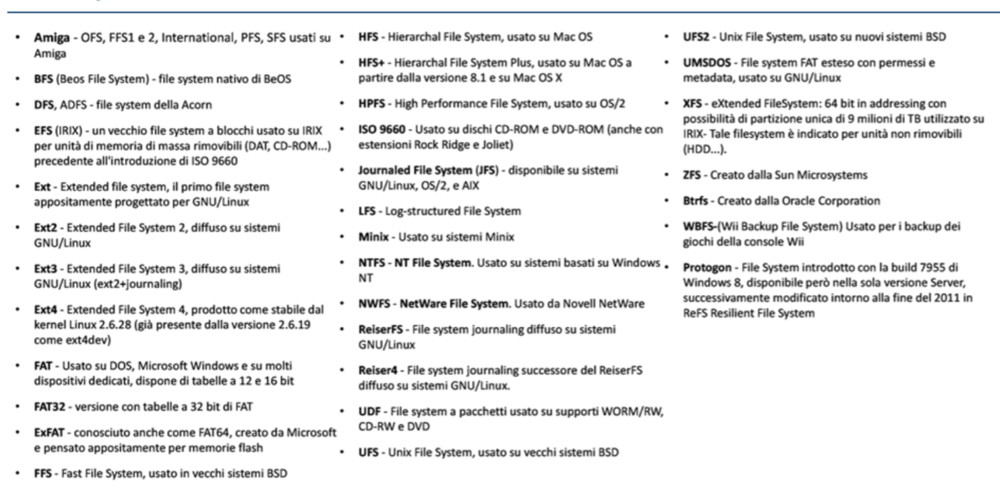

Ecco i principali:

- **FAT, FAT32, exFAT** → introdotti da Microsoft, semplici e ampiamente compatibili, usati su DOS, Windows e dispositivi mobili. // IMPORTANTE!!
    
- **NTFS (New Technology File System)** → utilizzato nei sistemi Windows moderni, con supporto al journaling, alla compressione e ai permessi utente. // IMPORTANTE!!
    
- **EXT2, EXT3, EXT4** → tipici dei sistemi GNU/Linux; EXT4 è l’evoluzione stabile con journaling e supporto a volumi fino a 1 EiB. // IMPORTANTE!!
    
- **HFS, HFS+ (Hierarchical File System)** → impiegati su macOS; HFS+ introduce allocazione a 32 bit e journaling. // IMPORTANTE!!
    
- **ReiserFS, XFS, JFS** → file system journaling per Linux, progettati per alta affidabilità e performance.
    
- **UFS, UFS2, FFS (Unix File System, Fast File System)** → utilizzati nei sistemi BSD e UNIX.
    
- **ZFS (Sun Microsystems)** e **Btrfs (Oracle)** → file system avanzati con controllo d’integrità e supporto a snapshot.
    
- **ISO 9660** → standard per CD-ROM e DVD-ROM, con estensioni Rock Ridge e Joliet. // IMPORTANTE!!
    
- **UDF (Universal Disk Format)** → usato per supporti riscrivibili (CD-RW, DVD-RW).
    
- **WBFS** → utilizzato nelle console Wii.
    
- **ReFS (Resilient File System)** → evoluzione di NTFS introdotta in Windows Server, ottimizzata per fault-tolerance e grandi volumi.
    

> I sistemi operativi moderni sono in grado di accedere a file system diversi installando semplicemente **driver specifici** o **moduli kernel dedicati**, rendendo possibile la lettura di dischi provenienti da ambienti eterogenei.

---

### **3. Tipologie di file all’interno di un file system**

Quando un sistema operativo gestisce i file, non vede tutti gli oggetti come “documenti” o “foto”: per lui esistono **diversi tipi di file**, ognuno con un ruolo preciso. È come avere vari tipi di scatole dentro un enorme magazzino.

---

#### **a. File regolari**

Sono le **scatole normali**, quelle in cui metti le tue cose.  
Dentro ci può essere **di tutto**: testo, immagini, musica, codice, appunti.  
Questi sono i file che l’utente apre ogni giorno: un `.txt`, un `.jpg`, un `.pdf`, un `.mp4`.  
Il file system li tratta come contenitori con un contenuto interno.

---

#### **b. Directory (cartelle)**

Le directory sono **scatole speciali che contengono altre scatole**.  
Non hanno un “contenuto” come un documento: contengono l’elenco dei nomi dei file e delle altre cartelle che stanno dentro di loro.  
Servono per tenere tutto in ordine, come i cassetti dentro un armadio.

---

#### **c. File speciali a blocchi**

Questi file “rappresentano” dispositivi che lavorano **a blocchi di dati**, come gli hard disk o le pendrive e più in generale tutti i dispositivi di I/O che giovano di una trasposizione astratta per non dover operare direttamente sull'hardware.
Il sistema operativo li vede come file, ma in realtà dietro c’è un pezzo di hardware.  
Sono come grandi contenitori che ti permettono di leggere pezzi interi di informazioni alla volta, non un byte per volta.

---

#### **d. File speciali a caratteri**

Questi invece “rappresentano” dispositivi che mandano e ricevono dati **uno per uno**, come un rubinetto che fa uscire gocce.  
Sono usati per device come la tastiera, il mouse, uno schermo o una stampante.  
Il sistema non legge blocchi interi: riceve un carattere, poi un altro, poi un altro.

---

#### **e. Altri file speciali (pipe, socket, ecc.)**

Questi sono file che **non contengono dati fissi**, ma servono per far parlare tra loro i programmi.

- Una **pipe** è come un tubicino: un programma mette dati da una parte, un altro li prende dall’altra.
    
- Un **socket** è come un telefono: permette a programmi anche lontani (in rete) di comunicare.
    

Sono strumenti usati dal sistema operativo per far scorrere le informazioni tra processi.

---

### **4. Strutture logiche dei file**

I file possono essere memorizzati in diversi modi a seconda del file system:

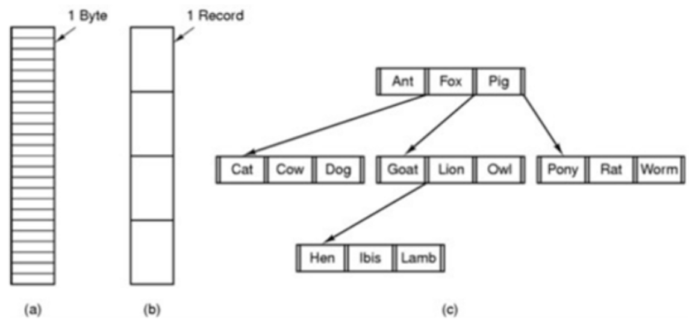

- **Sequenze di byte** → struttura più semplice e flessibile.
    
- **Sequenze di record logici** → usata in sistemi con gestione strutturata dei dati.
    
- **File indicizzati (ad albero)** → consente accesso rapido tramite strutture come B-tree o inodes.
    

---

### **5. Il problema dell’allocazione**

Dal punto di vista dell’hardware, il disco è visto come un insieme di **blocchi di dati di dimensione fissa**.  
Il file system deve quindi stabilire **come assegnare i blocchi** a ciascun file e come **collegarli** per formarne la struttura complessiva.

Le principali **strategie di allocazione** sono:

1. **Contigua** → i blocchi del file sono consecutivi sul disco; veloce, ma soggetta a frammentazione.
    
2. **Concatenata (linked)** → i blocchi sono collegati da puntatori; riduce la frammentazione ma rallenta l’accesso casuale.
    
3. **FAT (File Allocation Table)** → utilizza una tabella che indica la posizione di ciascun blocco; ampiamente usata nei sistemi Windows.
    
4. **Indicizzata (UNIX)** → impiega indici o inode per mappare i blocchi, consentendo accessi diretti e flessibili.
    
5. **Lista concatenata (ibrida)** → combina vantaggi delle due precedenti tecniche.
    

---

### **6. Il modello FAT**

Nel file system FAT, introdotto con MS-DOS, i blocchi del disco vengono rappresentati tramite una **tabella ordinata di puntatori**, la **File Allocation Table**.  
Ogni voce della FAT corrisponde a un blocco del disco e contiene l’indirizzo del blocco successivo che appartiene allo stesso file.

Esempio:  
Un file composto da tre blocchi potrebbe avere in FAT la sequenza:

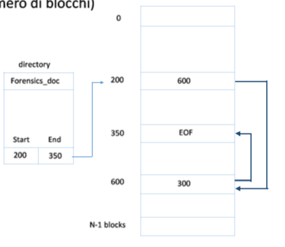

**Vantaggi:**

- Semplicità di implementazione.
    
- Tutti i blocchi sono dedicati ai dati.
    

**Svantaggi:**

- La scansione richiede anche la lettura della FAT.
    
- La tabella cresce proporzionalmente alla dimensione del disco.
    

---

### **7. Il file system EXT4**

L’**EXT4 (Extended File System 4)**, evoluzione di EXT3, è oggi lo standard Linux.  
Supporta:

- indirizzamento a **48 bit**, con file fino a **16 TiB** e file system fino a **1 EiB (10¹⁸ byte)**;
    
- **journaling** integrato, che mantiene un log delle modifiche in corso, prevenendo inconsistenze in caso di interruzione improvvisa;
    
- retrocompatibilità con le versioni precedenti (ext2, ext3).
    

> Alcuni sistemi consentono di disattivare il journaling per ridurre l’overhead, ma ciò riduce la resilienza in caso di crash.

---

### **8. Il file system HFS+**

L’**HFS Plus** è il file system nativo dei computer **Macintosh**.  
Utilizza una **mappa di allocazione a 32 bit** e blocchi da **512 byte**.  
È ottimizzato per la gestione di file multimediali e supporta **metadata estesi** e **journaling** per mantenere la coerenza dei dati.

---

### **9. Allocazione e slack space**

Entriamo ora nel merito di come viene eseguita l'allocazione di un file all'interno di un filesystem.
Senza scendere troppo in tecnicismi, in genere abbiamo un indice dei file, aka una sorta di tabella dove sono indicate le denominazioni dei file, e dei settori dove vengono registrati i dati contenuti in suddetti file.
Come si può vedere, nel momento in cui scriviamo il primo file denominato A, 
di $grandezza = 2sect$, i settori 1 e 2 vengono occupati ed utilizzati per registrare i dati contenuti nel file. 

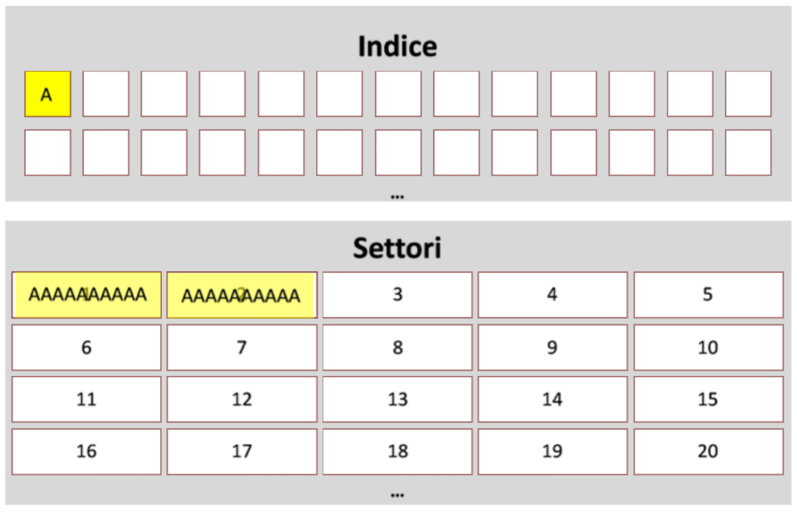

Andando poi a scrivere un file B, di $grandezza = 3,7sect$ , il sistema operativo/il software/driver che gestiscono il disco rigido vanno ad allocare ulteriori settori.
E' da tenere presente che il quarto settore non è completamente riempito, ergo rimane spazio libero che però non viene sfruttato.

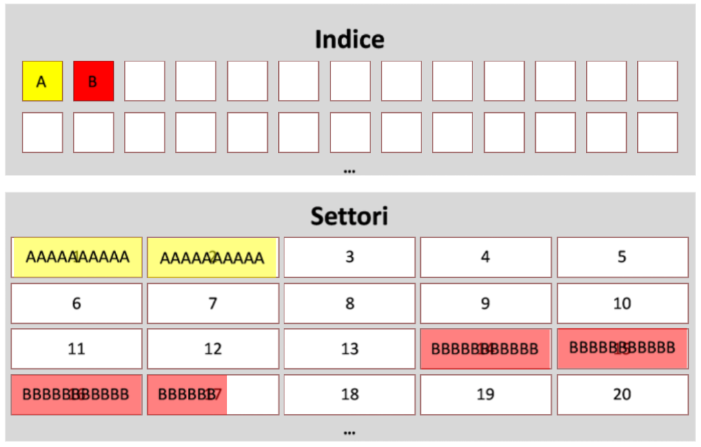

Andando poi a cancellare il file A, i settori 1 e 2 vengono resi disponibili per l'utilizzo, quindi non vengono sovrascritti ma vengono messi in uno stato di disponibilità per la scrittura di dati di un altro file.

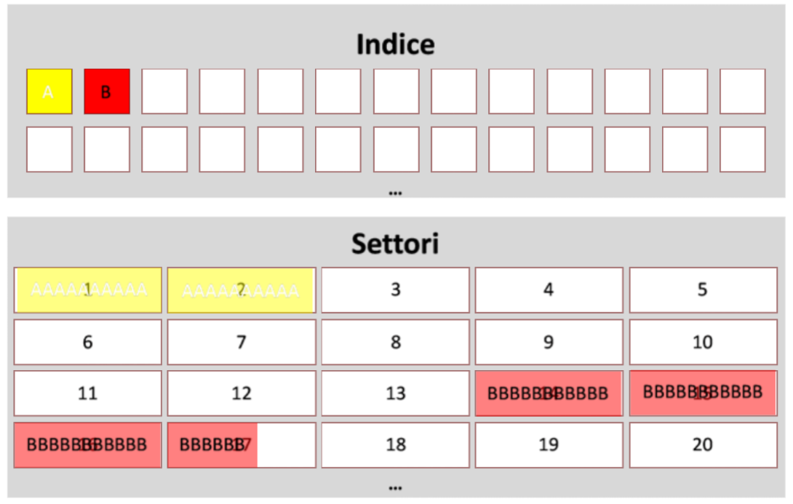

Ecco perché, quando decidiamo di scrivere nel filesystem il file C, il SO riciclerà lo spazio presente nei primi due settore, e poiché - cosa che capita - il file C è più piccolo del file A, nel settore 2 rimane una parte non sovrascritta.

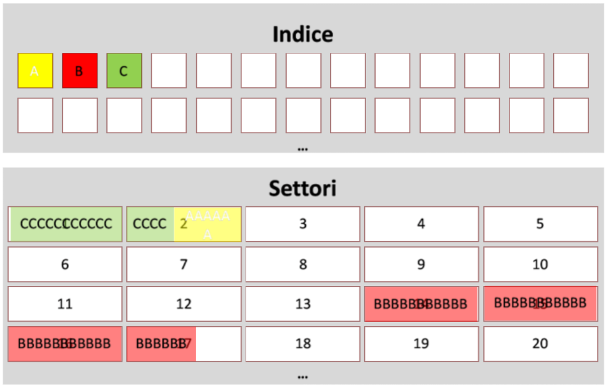

Analogamente, cancellando il file B, i settori del file B vengono resi disponibili per un uso successivo.

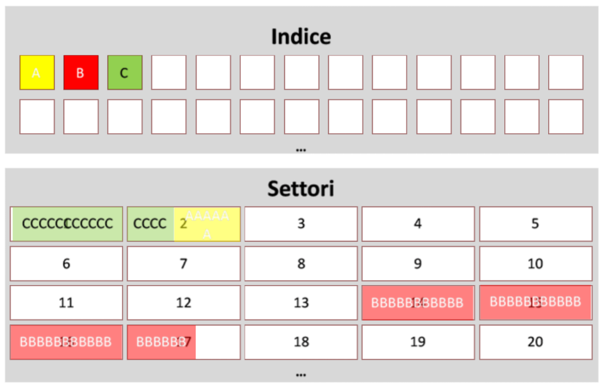

Quando scriviamo sul filesystem il file D, esso, sempre seguendo logiche legate al SO - quindi allo sfruttamento e anche all'ottimizzazione del sistema stesso - verrà scritto in settori liberi e quindi potrebbe finire in alcuni settori precedentemente occupati dal file B.

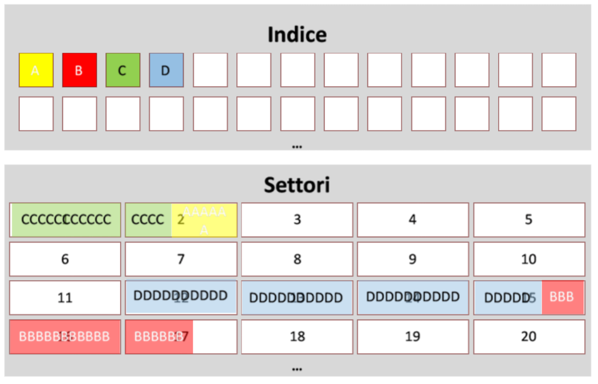

Alla luce di questa breve simulazione di funzionamento di un filesystem possiamo vedere quella che è la situazione riportata in figura del disco rigido, ovviamente sotto un'ottica forense.
Vediamo quali sono i settori allocati - parzialmente sovrascritti dai file C e D, atteso che A e B sono stati cancellati.

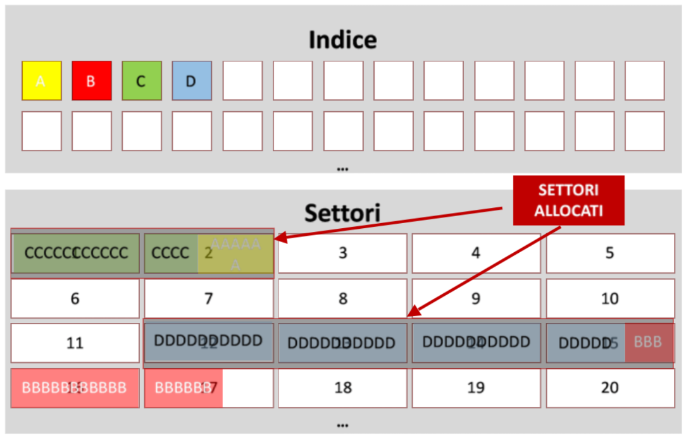

$$Settori \ Allocati = 1, 2, 12, 13, 14, 15$$

Individuiamo anche i settori non allocati, ovvero quelli che non contengono alcun dato né di C né di D:

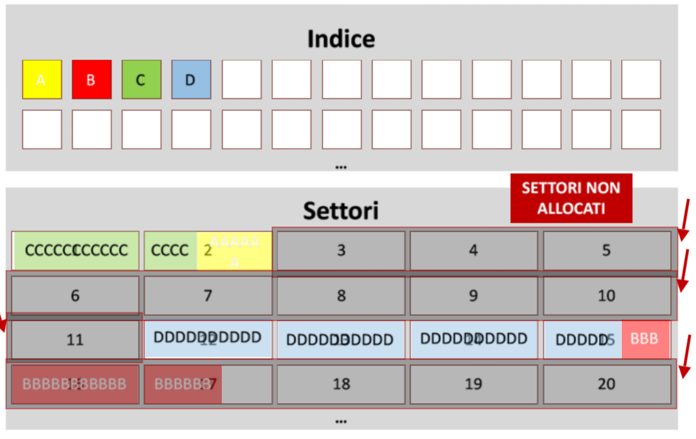

Evidenziamo che anche il settore 16 e 17 NON SONO ALLOCATI, nonostante non contengano dati veri e propri di file attualmente presenti.

Altro aspetto importante è che un file raramente occupa un numero esatto di blocchi: lo spazio rimanente nel blocco finale è detto **slack space**.

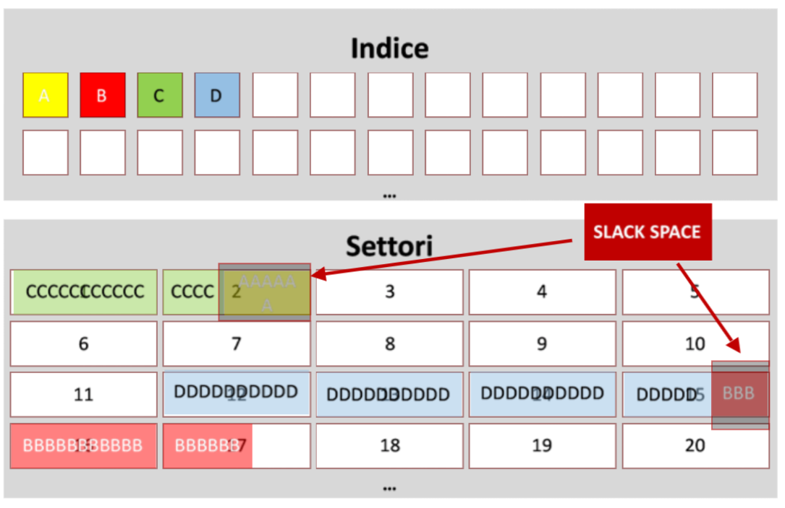

Questo spazio residuo può contenere **frammenti di dati precedenti**, non sovrascritti, e ha **grande valore forense**, perché può rivelare:

- porzioni di file cancellati;
    
- frammenti di testi o immagini sensibili;
    
- resti di attività pregresse.
    

---

Vediamo ora la gestione di indici e settori da un punto di vista diverso.
Immaginiamo di avere in indice un file denominato Promessi sposi.txt
Tale file avrà assegnati vari settori che contengono il romanzo.
Così come il file denominato Il Cinque Maggio.txt a sua volta ha alcuni settori dedicati dove sono registrate le frasi della poesia.

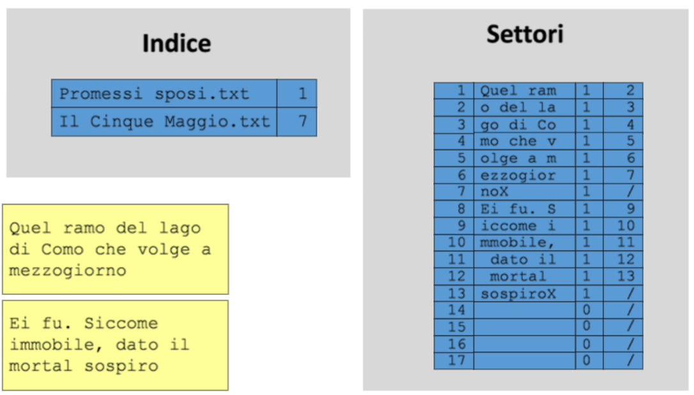

Nel momento in cui cancelliamo il primo file dei due, i settori presenti sul disco rigido che contenevano le parole del romanzo vengono considerati utilizzabili e vengono quindi liberati. Come si vede, il SO, per sapere che quei settori sono disponibili e non più allocati, li indica con uno 0 in un'opportuna tabella. 

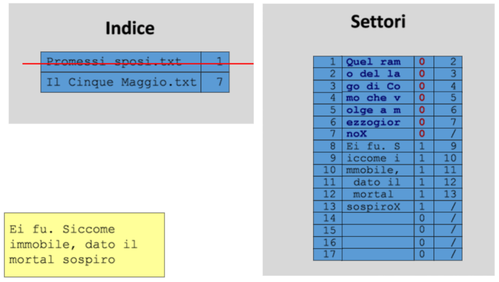

Se poi al posto del file precedentemente cancellato viene scritto il file Divina commedia.txt quel che potrebbe accadere è che alcuni settori del romanzo vengono sovrascritti, ma non tutti e non totalmente!

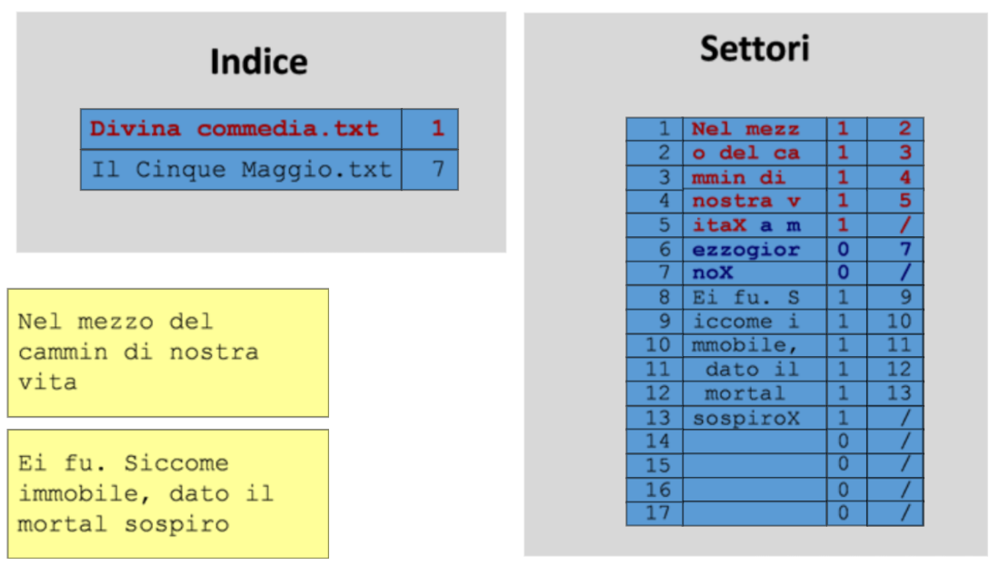

Si evidenzia qui sotto lo slack space:

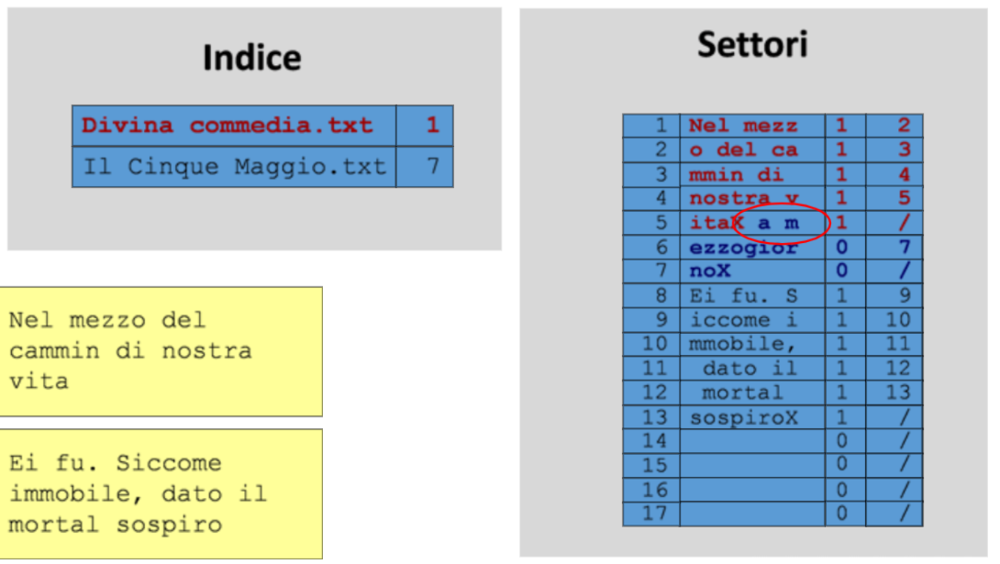

Queste modalità di funzionamento del filesystem sono estremamente importanti:
solo conoscendo il funzionamento del filesystem poi è possibile successivamente eseguire un'analisi dello stesso e poterne interpretare i riscontri che vengono individuati su di esso.

### **10. Formattazione e wiping**

- **Cancellazione logica:** il file viene rimosso dall’indice, ma i dati restano sul disco finché non vengono sovrascritti.
    
- **Formattazione:** rimuove la struttura del file system, ma non necessariamente i dati fisici. Questo vuol dire che eseguire la formattazione comporta che tutti i settori vengono liberati, ovvero resi disponibili per l'utilizzo. Va dunque tenuto presente - importante - che non va a cancellare i dati dei vari settori, ma libera solo gli indici e informa il sistema operativo che tali sono disponibili!

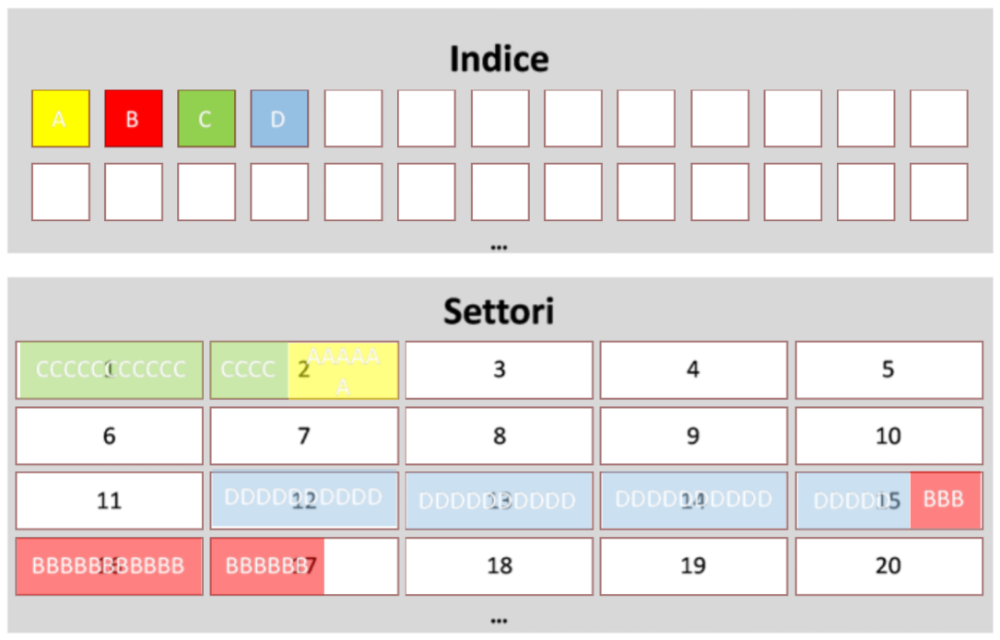

    
- **Wiping (bonifica):** sovrascrive ogni settore del disco con dati casuali o pattern fissi, rendendo irrecuperabile il contenuto precedente. E' l'unica modalità che si rende necessaria per la cancellazione completa di tutti i dati presenti sul filesystem. Non è solo una scrittura sul filesystem che sostanzialmente rende disponibili tutti i settori presenti sul disco rigido, bensì è quell'attività di scrittura che sistematicamente, settore per settore, sovrascrive tutti i dati presenti sulla superficie del disco rigido

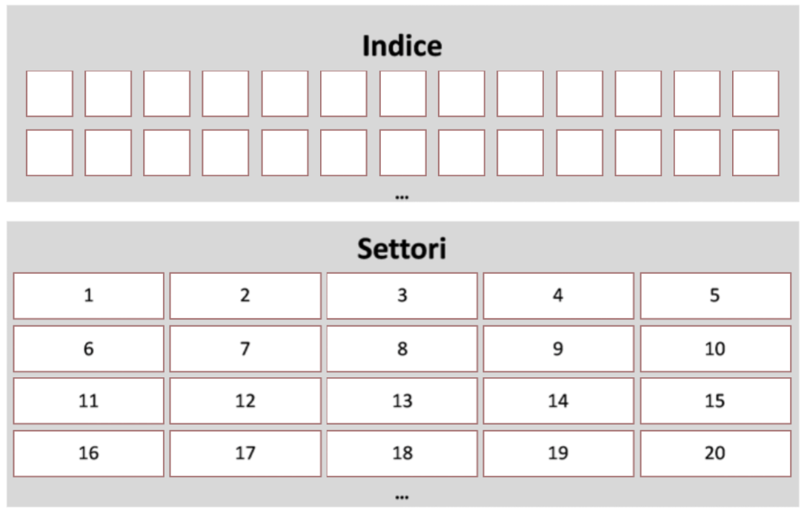

Dal punto di vista forense, la distinzione è cruciale:  
solo il **wiping** distrugge realmente i dati, mentre la **formattazione** e la **cancellazione logica** lasciano tracce analizzabili.

---

### **11. Conclusione**

In questa lezione abbiamo esplorato:

- le **caratteristiche principali dei file system** e la loro varietà;
    
- le **modalità di allocazione dei dati**;
    
- il significato forense di concetti come **slack space**, **formattazione** e **wiping**.
    

Comprendere la struttura logica dei file system è il primo passo per poter eseguire **analisi di disk forensics** affidabili, capaci di distinguere tra **ciò che è visibile all’utente** e ciò che **rimane nascosto nei settori del disco**.

> In informatica forense, ciò che non si vede è spesso ciò che conta di più.

---