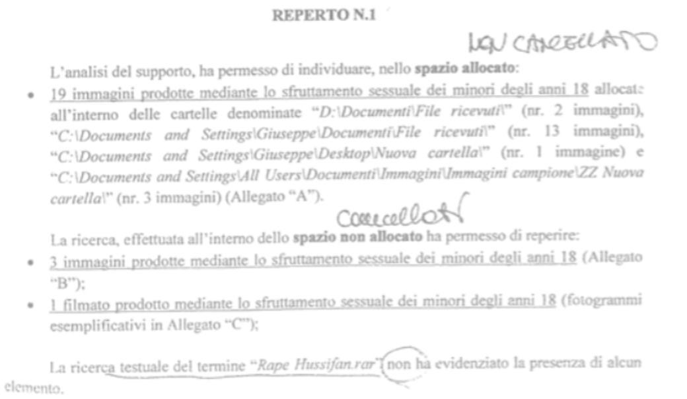
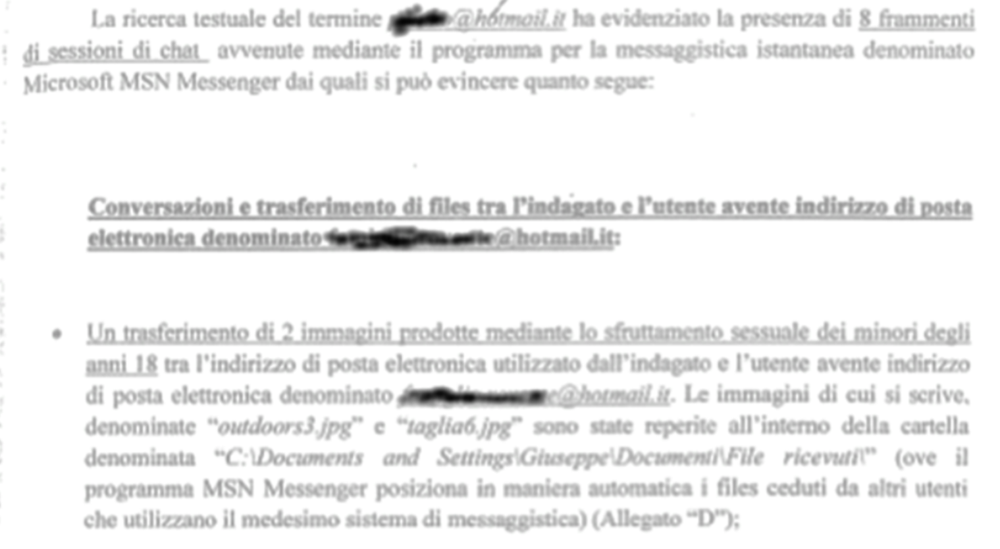
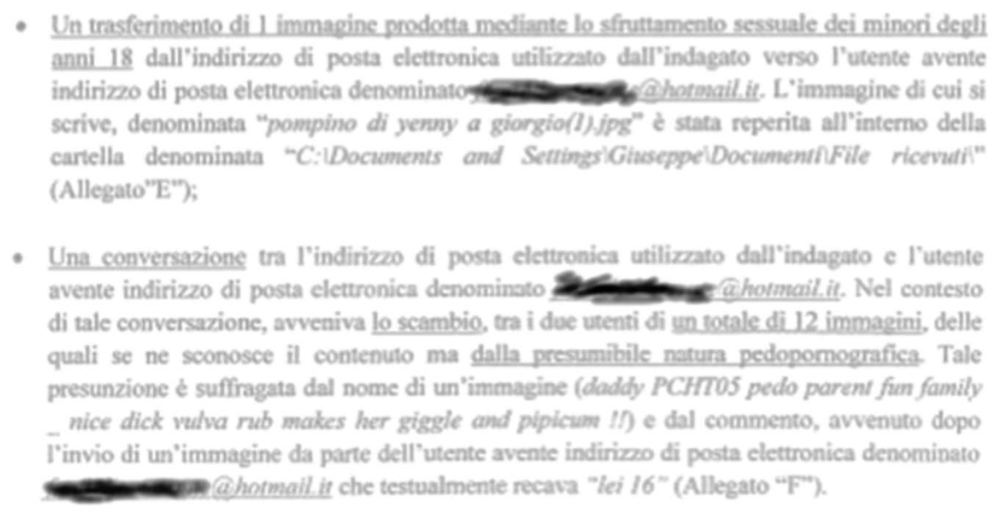
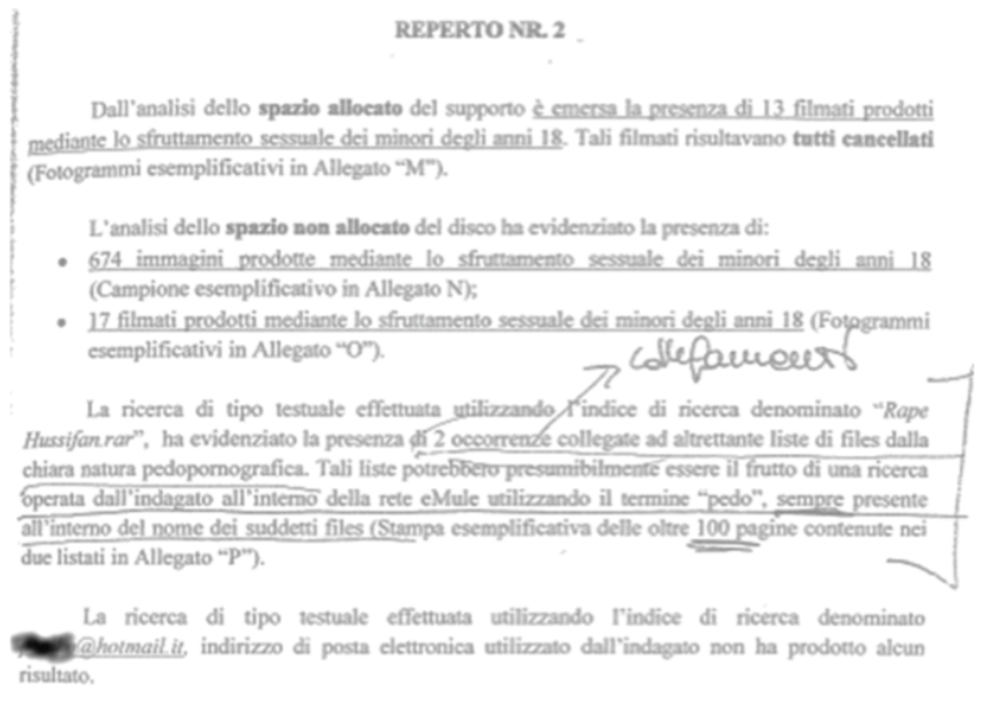
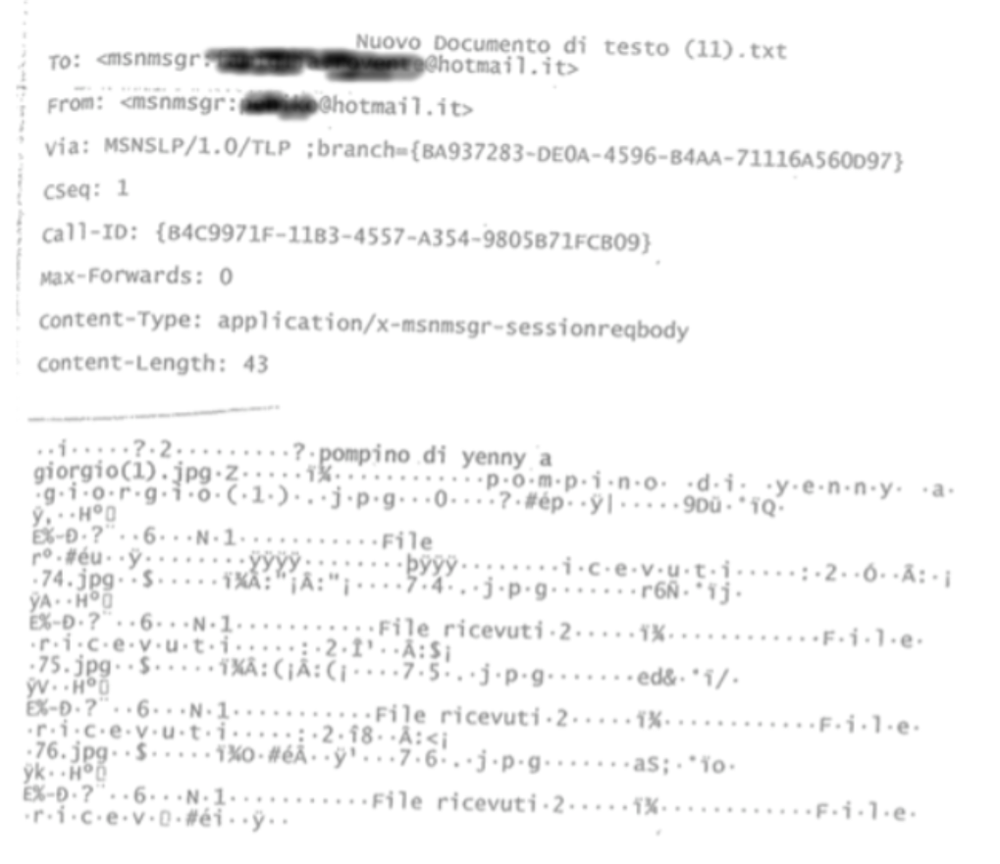
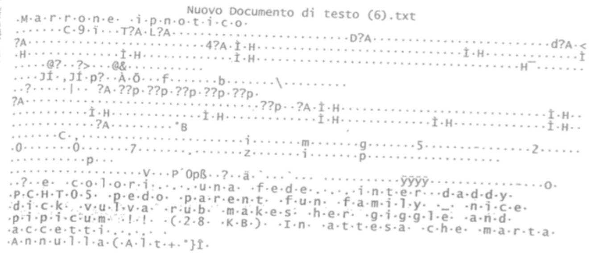
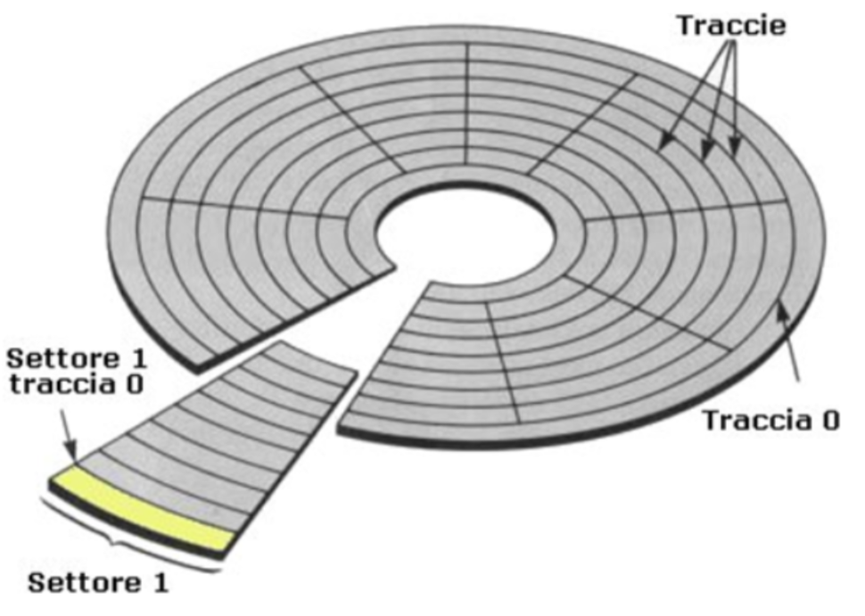
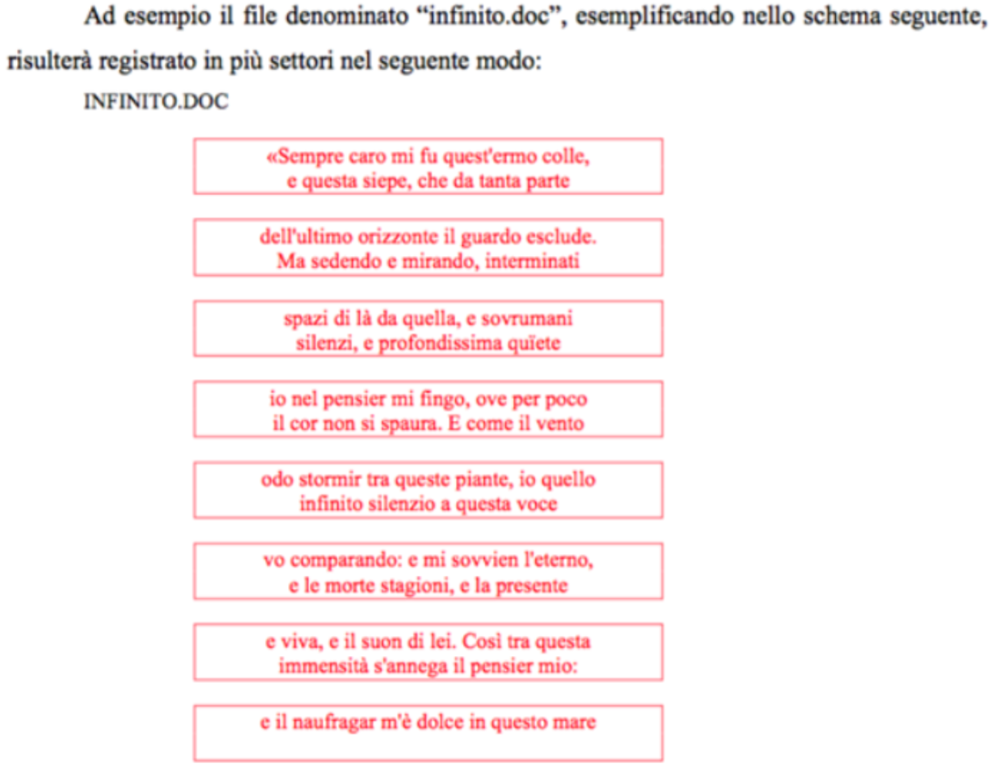
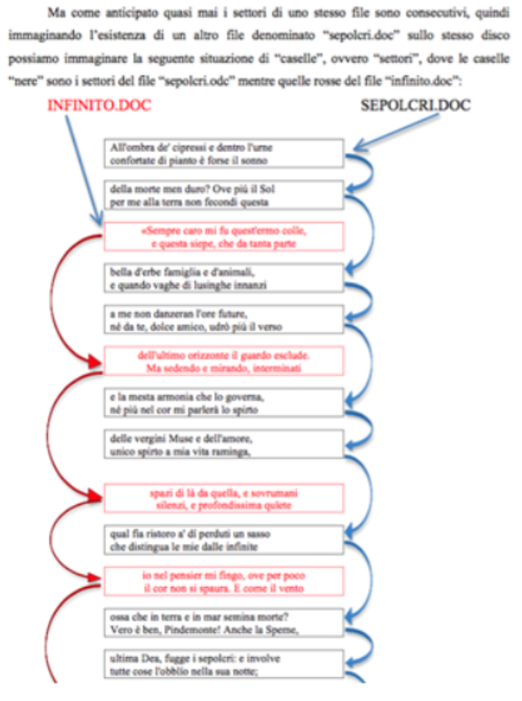
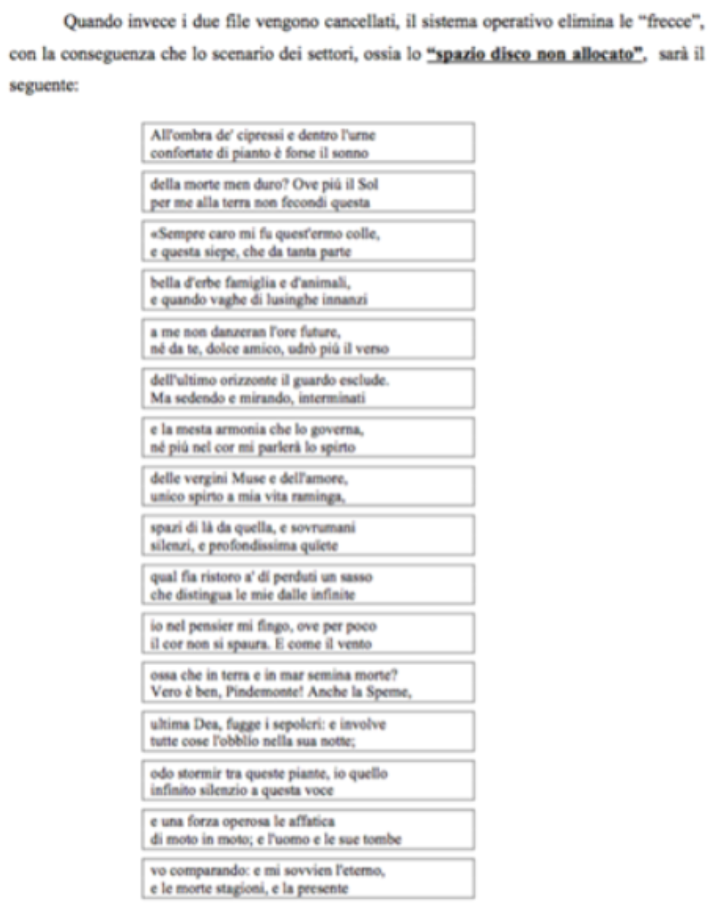

## **Lezione 2 - File System e InfoForense: un caso reale

Dopo aver illustrato il funzionamento dei sistemi informatici e le peculiarità che assumono quando vengono analizzati in ambito forense, il professore introduce ora **un caso reale**: una **relazione tecnica difensiva** redatta nell’ambito di un procedimento penale riguardante accertamenti su dischi rigidi.

L’indagato, nel caso in questione, era accusato di **detenzione di materiale pedopornografico** e di **divulgazione** dello stesso.  
La polizia giudiziaria aveva eseguito un accertamento tecnico sui computer sequestrati, ma le conclusioni a cui era giunta erano, secondo la difesa, **poco precise**, **metodologicamente carenti** e decisamente **approssimative**.

La relazione tecnica difensiva era strutturata in **due fasi**, secondo un modello classico della consulenza contro-tecnica:

---

### 🔹 **1. Fase _destruens_**

Questa prima parte ha lo scopo di **demolire**, criticare e smontare passo dopo passo le analisi svolte dalla controparte (in questo caso la PG).

La consulenza evidenziava:

#### **a) Carenze metodologiche**

Come visto nelle lezioni precedenti, quando manca un metodo rigoroso l’intera analisi perde affidabilità.  
La PG aveva applicato un approccio non documentato, non verificabile e privo di quelle garanzie minime richieste in ambito forense.

#### **b) Analisi incompleta e sbilanciata**

Il consulente della PG si era concentrato **solo sugli elementi utili a sostenere la tesi accusatoria**, ignorando del tutto altri dati potenzialmente decisivi per una valutazione equilibrata.

Le foto riportano proprio frammenti della relazione della PG: lunghe liste di porzioni di file, spezzoni di immagini e filmati cancellati rinvenuti sul disco.  
Tuttavia la PG non aveva analizzato nel merito **la reale consultabilità** del materiale da parte dell’indagato, né si era interrogata **sulla natura forense del dato**.

---

### 🔹 **2. Fase _costruens_**

Dopo aver criticato l’analisi della controparte, la consulenza deve proporre **una nuova interpretazione**, scientificamente solida, ragionevole e favorevole all’indagato.

La difesa ha quindi dimostrato che:

#### **a) Il materiale trovato non era effettivamente “nella disponibilità” dell’indagato**

I file rinvenuti erano:

- **cancellati**,
    
- **in stato parziale o frammentato**,
    
- **non più ricostruibili**,
    
- e riconoscibili solo tramite tecniche forensi avanzate.
    

L’indagato, privo di competenze tecniche specialistiche, **non avrebbe mai potuto recuperare o visionare** quel materiale.  
Di conseguenza, sul piano probatorio, **era come se quel materiale non esistesse**: non era utilizzabile, non era accessibile e non era consultabile.

#### **b) L’ipotesi della divulgazione era costruita male**

Gli elementi su cui la PG basava la tesi della divulgazione derivavano:

- da alcune cartelle rinvenute sul disco,
    
- e da uno stralcio di settori di memoria interpretati in modo affrettato.

Secondo la PG, quei settori dimostravano uno scambio di file tra l’indagato e un altro soggetto.  
La difesa ha evidenziato invece che:

- quei settori non erano riconducibili **con certezza** a un unico file,
    
- la PG aveva interpretato come “messaggio inviato” ciò che era in realtà **una sequenza di frammenti di origine incerta**,
    
- i settori erano **non allocati**, quindi non attribuibili con sicurezza a un file preciso.
    

---

### ⭐ **3. Come la consulenza costruitiva ha ribaltato l’interpretazione della PG**

Per spiegare al giudice — che non ha competenze tecniche — come funzioni un file system, la difesa ha usato un approccio **divulgativo e metaforico**, basato su analogie semplici e intuitive.

#### 🔸 **Il disco come un casellario**

Il consulente ha rappresentato il disco rigido come uno schedario pieno di cassettini (i settori).

#### 🔸 **I file come “poesie a pezzi”**

Per far capire il concetto di frammentazione, la consulenza ha mostrato due poesie spezzettate e distribuite nei vari cassetti, spiegando che:

- le frasi non sono in ordine fisico;
    
- pezzi di poesie diverse possono trovarsi uno accanto all’altro;
    
- la cancellazione di un file equivale a togliere l’etichetta dal cassetto, **non a svuotarlo**.
    

Da questa metafora deriva il punto chiave:

> due settori contigui NON appartengono necessariamente allo stesso file.

Quindi lo stralcio trovato dalla PG, che sembrava appartenere a un unico testo, in realtà era **un mosaico artificiale** composto da frammenti di file differenti.

La PG aveva interpretato superficialmente l’adiacenza fisica come appartenenza logica, commettendo un errore metodologico grave.

---

### ⭐ **4. La conclusione tecnica della difesa**

Dopo aver demolito le interpretazioni della PG (fase _destruens_), la difesa ha mostrato al giudice che:

- i reperti digitali non permettevano di dimostrare né la detenzione consapevole,
    
- né la consultabilità materiale del contenuto,
    
- né tantomeno la divulgazione.
    

I riscontri della PG non supportavano **necessariamente** la loro tesi:  
potevano essere spiegati **ragionevolmente** tramite un’interpretazione più coerente con il funzionamento del file system e con lo stato reale dei settori.

La consulenza difensiva, dunque, ha dimostrato che:

- il metodo della PG era superficiale,
    
- il percorso logico era fallace,
    
- la ricostruzione probatoria non era unica,
    
- e un’interpretazione alternativa era non solo possibile, ma addirittura più plausibile.
    

---

### ⭐ **5. Il significato didattico della lezione**

Il professore conclude evidenziando che una buona consulenza tecnica deve:

#### **1. Avere una fase _destruens_**

Smontare criticamente:

- la metodologia della controparte,
    
- il suo percorso logico,
    
- la correttezza tecnica delle operazioni.
    

#### **2. Avere una fase _costruens_**

Proporre un’interpretazione alternativa dei dati:

- ragionevole,
    
- tecnicamente fondata,
    
- compatibile con i reperti,
    
- e favorevole alla tesi difensiva.
    

#### **3. Essere divulgativa**

Una relazione tecnica deve essere comprensibile al giudice:

- linguaggio semplice,
    
- metafore concrete,
    
- schemi chiari,
    
- nessun tecnicismo inutile.
    

---

### 🏁 **Frase finale**

> Una consulenza tecnica non deve solo criticare: deve anche ricostruire.  
> Solo così il giurista può comprendere il funzionamento dei reperti e valutare correttamente il peso probatorio dei dati digitali.
