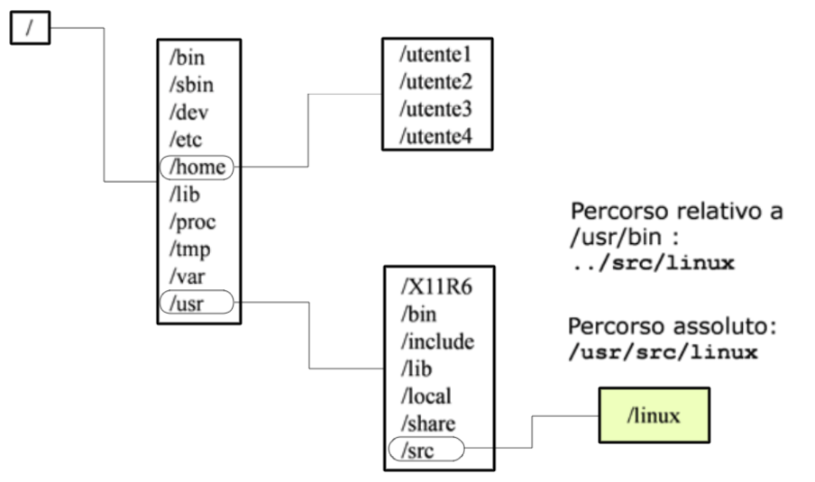
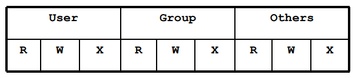
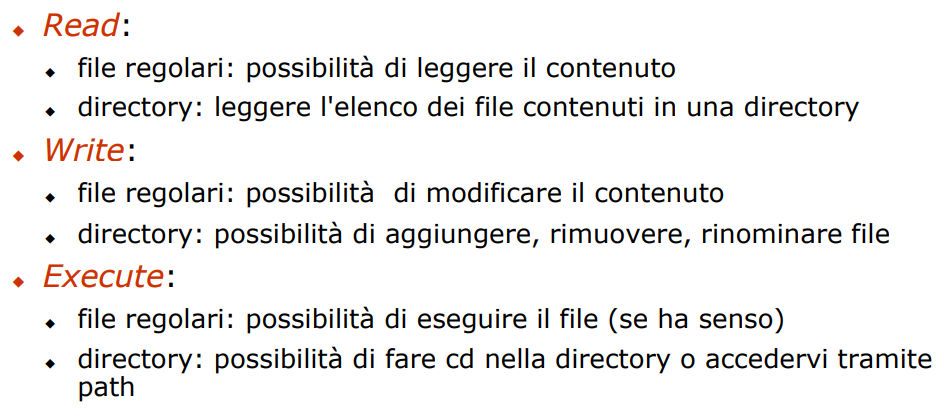

# **UD2 – Comandi Linux e Shell Scripting**

Questa unità didattica introduce l’utilizzo dei **comandi Linux** e delle **tecniche di shell scripting** come strumenti fondamentali per l’**analisi forense dei file system**.  
L’analista forense, infatti, deve saper operare **direttamente dal terminale**, padroneggiando i comandi che consentono di **esplorare, filtrare e correlare** grandi quantità di dati digitali in modo efficiente e documentabile.

Attraverso l’uso della **Bash (Bourne Again Shell)**, verranno mostrati i principali comandi di sistema per la gestione dei file, l’analisi dei metadati, la ricerca di stringhe e pattern, la generazione di log e la creazione di **script automatizzati** per velocizzare attività ripetitive.

L’obiettivo finale è acquisire la capacità di **tradurre le operazioni forensi in procedure riproducibili**, combinando rigore metodologico e potenza operativa: la shell come laboratorio forense in sé.

---

## **Lezione 1: Introduzione alla shell di Linux**

### **1. Introduzione**

La **shell di Linux** è il principale strumento di interazione tra l’utente e il sistema operativo.  
Attraverso di essa, l’utente può impartire comandi, eseguire programmi, gestire file e directory, oppure automatizzare procedure complesse tramite **script**.

Lo studio della shell è fondamentale in **informatica forense**, perché permette di:

- analizzare e manipolare file system in modo diretto;
    
- estrarre informazioni da log e metadati;
    
- eseguire operazioni ripetitive in forma automatizzata e riproducibile.
    

Imparare a usare la shell significa saper **controllare il sistema a basso livello**, condizione essenziale per qualsiasi analisi tecnica e per la creazione di **tool personalizzati** in fase di perizia.

---

### **2. Perché imparare la shell scripting**

Un **linguaggio di shell scripting** consente di scrivere programmi testuali che racchiudono **sequenze di comandi**, automatizzando attività ripetitive.  
Questa capacità è utile in diversi contesti:

- **Amministrazione di sistema**: automatizzare backup, aggiornamenti, monitoraggi.
    
- **Elaborazione di dati forensi**: analizzare directory, estrarre hash, filtrare log.
    
- **Riproducibilità delle operazioni**: garantire che ogni step sia documentato e replicabile.
    

Il linguaggio di shell è **una delle tante cose che l’informatico forense deve saper leggere e capire**

---

### **3. Cos’è una shell**

La **shell** è un **programma intermedio tra l’utente e il kernel** del sistema operativo.  
Offre un **prompt** — il cursore lampeggiante dove si digitano comandi — e interpreta ogni istruzione digitata, passando la richiesta al sistema operativo.

Oltre alla modalità interattiva, la shell può **eseguire file di testo contenenti comandi**: questi sono gli **script**.

#### **Esempio di script**

```bash
#!/bin/bash
# Script di configurazione di rete (estratto da /etc/rc.d/init.d/network)

if [ "$NETWORKING_IPV6" = "yes" ]; then
    alias=`modprobe -c | awk '/^alias net-pf-10 / { print $3 }'`
    if [ "$alias" != "ipv6" -a ! -f /proc/net/if_inet6 ]; then
        echo "alias net-pf-10 ipv6" >> /etc/modules.conf
    fi
fi
```

Questo esempio mostra come, tramite la shell, sia possibile **controllare parametri di rete, moduli del kernel e file di configurazione**: operazioni impensabili da interfaccia grafica.

---

### **4. Struttura generale di un comando**

Ogni comando UNIX ha una **struttura formale**:

```
comando [opzioni] [argomenti]
```

- Le **opzioni** — solitamente precedute da `-` o `--` — modificano il comportamento del comando (un trattino quando l'opzione ha una sola lettera, -- altrimenti)
    
- Gli **argomenti** specificano su cosa agire (file, directory, processo, ecc.).
    

nel mondo dell’informatica:

- **Unix è il modello concettuale di riferimento** (processi, permessi, file system, shell, pipeline…)
    
- i sistemi moderni (Linux, macOS, Android, BSD) sono tutti derivati Unix
    
- moltissime tecnologie della cybersecurity e della forense **assumono un sistema Unix-like**
    

Windows ha un modello diverso, ma **la semantica di base non cambia**:  
scrivi un comando → interpreter/terminal → OS avvia il programma.

#### **Esempi**

```bash
ls -l /home
grep "error" /var/log/syslog
chmod 755 script.sh
```

I comandi possono essere:

- **built-in**, cioè interni alla shell (es. `cd`, `echo`, `alias`);
    
- **script interpretati** (file `.sh`);
    
- **codice oggetto compilato**, come eseguibili binari (`ls`, `cp`, `mv`), derivati da un linguaggio di alto livello come il C o il Java
    

---

### **5. Tasti di controllo nella shell**

Durante l’uso del terminale, alcuni tasti hanno funzioni di controllo essenziali:

|Combinazione|Funzione|
|---|---|
|`CTRL + S`|sospende temporaneamente la visualizzazione|
|`CTRL + Q`|riattiva la visualizzazione|
|`CTRL + C`|interrompe un comando in esecuzione|
|`CTRL + D`|segnala “fine input” (end-of-line)|
|`CTRL + V`|interpreta il carattere successivo come testo normale|

Queste combinazioni permettono di **gestire il flusso di esecuzione** e **interrompere operazioni potenzialmente dannose**, competenza indispensabile in laboratorio forense.

---

### **6. Ottenere aiuto e documentazione**

Linux fornisce un sistema completo di documentazione consultabile da terminale:

- `man comando` → manuale tecnico (es. `man ls`)
    
- `man man` → guida sul funzionamento del manuale stesso
    
- `info comando` → documentazione alternativa più descrittiva
    
- `apropos keyword` → ricerca per parola chiave nei manuali
    

La capacità di leggere documentazione da linea di comando è fondamentale per l’autonomia dell’analista forense: ogni tool o comando va **compreso nella sua interezza** prima di essere utilizzato in fase di indagine.

---

### **7. Il file system in Linux**

In ambiente Linux, il termine **file system** può assumere tre significati distinti:

1. L’**insieme dei file e directory** accessibili alla macchina.
    
2. L’**organizzazione logica** che il SO adotta per gestire i file in memoria secondaria.
    
3. Una **specifica unità di memoria** (nel caso dei sistemi Windows è facile trovare in "risorse del computer" un disco C e un disco D - non per forza sono due dischi separati ma di sicuro sono file system separati).


Tutti i file system di Linux seguono una **struttura ad albero** (in realtà in alcuni casi potrebbero essere dei cicli, vedremo in dettaglio con *link*), con:

- directory e sottodirectory che costituiscono i **nodi**;
    
- i file che rappresentano le **foglie**;
    
- la directory **root (`/`)** come radice dell’intero albero.
    

---

### **8. Gerarchia del file system**

Ecco le directory principali secondo lo **Standard FHS (Filesystem Hierarchy Standard)**:



### **/bin → Binary**

- **Significato:** abbreviazione di _binary_.
    
- **Origine:** nei primi UNIX, i programmi eseguibili erano chiamati “binary programs” perché erano file compilati (cioè in formato binario, non testo).
    
- **Funzione:** contiene i **comandi base** eseguibili da tutti gli utenti, come `ls`, `cp`, `mv`, `cat`, `bash` ecc.
    

---

### **/sbin → System Binary**

- **Significato:** _system binary_.
    
- **Origine:** simile a `/bin`, ma pensata per i **comandi amministrativi** del sistema, quindi riservata a _root_ (es. `ifconfig`, `reboot`, `fsck`).
    
- **Funzione:** contiene i binari che gestiscono l’avvio, la rete, i file system, ecc.
    

---

### **/dev → Devices**

- **Significato:** abbreviazione di _devices_.
    
- **Origine:** in UNIX tutto è rappresentato come un file, anche le periferiche hardware.
    
- **Funzione:** contiene i **file di dispositivo**, che permettono l’accesso a dischi, tastiere, porte USB ecc. (es. `/dev/sda`, `/dev/null`).
    

---

### **/etc → Et Cetera**

- **Significato:** letteralmente _et cetera_.
    
- **Origine:** nei primi UNIX indicava “altri file del sistema”, poi è diventata la cartella **ufficiale per i file di configurazione**.
    
- **Funzione:** contiene file testuali che configurano il comportamento del sistema e dei servizi (es. `/etc/passwd`, `/etc/fstab`).
    

---

### **/home → Home Directory**

- **Significato:** “casa” degli utenti.
    
- **Origine:** designata per contenere le cartelle personali, come il “profilo utente” di Windows.
    
- **Funzione:** ogni utente ha una sottocartella (es. `/home/samu`) con i propri file, preferenze e documenti.
    

---

### **/lib → Library**

- **Significato:** abbreviazione di _library_.
    
- **Origine:** le “librerie condivise” contengono codice riutilizzabile (funzioni comuni ai programmi).
    
- **Funzione:** contiene le **librerie di sistema** necessarie ai binari in `/bin` e `/sbin` (es. `libc.so`, `ld-linux.so`).
    

---

### **/tmp → Temporary**

- **Significato:** abbreviazione di _temporary_.
    
- **Origine:** area temporanea condivisa tra utenti e processi.
    
- **Funzione:** memorizza **file temporanei**, cancellati automaticamente al riavvio o dopo un certo tempo.
    

---

### **/var → Variable**

- **Significato:** abbreviazione di _variable_.
    
- **Origine:** serve per i dati che **cambiano nel tempo** (a differenza dei file statici di `/usr`).
    
- **Funzione:** contiene log, cache, spool di stampa, database temporanei ecc. (es. `/var/log/syslog`).
    

---

### **/usr → Unix System Resources**

- **Significato storico:** _Unix System Resources_ (inizialmente “user” nel senso di “programmi per gli utenti”).
    
- **Origine:** inizialmente conteneva i file personali degli utenti, poi divenne lo spazio per **programmi e librerie aggiuntive** non essenziali al boot.
    
- **Funzione:** contiene programmi, librerie, manuali, sorgenti (es. `/usr/bin`, `/usr/lib`, `/usr/share`).
    

---

### **/proc → Process**

- **Significato:** abbreviazione di _process_.
    
- **Origine:** non è una directory “reale”: è un **file system virtuale** creato dal kernel.
    
- **Funzione:** mostra in tempo reale lo stato dei processi e del kernel (es. `/proc/cpuinfo`, `/proc/1234/` per il PID 1234).
    

---

### **9. Percorsi assoluti e relativi**

- **Percorso assoluto:** indica la posizione partendo dalla root `/`.  
    Esempio:
    
    ```
    /usr/src/linux
    ```
    
- **Percorso relativo:** espresso rispetto alla directory corrente.  
    Esempio (da `/usr/bin`):
    
    ```
    ../src/linux
    ```
    

In forensics, questa distinzione è cruciale per ricostruire **l’origine dei file e dei log**, specialmente durante l’analisi di script o malware.

---

### **10. Proprietari, gruppi e permessi**

Ogni file o directory in Linux è associato a due entità:

- un **utente proprietario (owner)**
    
- un **gruppo** (insieme di utenti) con diritti specifici.
    

Gli utenti e i gruppi sono identificati da:

- **UID (User ID, valore intero, Unix Internals)** e **username** (stringa);
    
- **GID (Group ID, valore intero, Unix Internals)** e **groupname** (stringa).
    

Nel momento in cui un utente crea un file, tale file viene associato al suo user ID.
Il proprietario può essere modificato tramite *change owner*:

```bash
chown nuovoUtente file(s)
```

Analogamente esiste un change group:


```bash
chgrp nuovoGruppo file(s)
```


---

### **11. Permessi di accesso**

Ogni file è dotato di **9 flag di permesso**, suddivisi in tre categorie (utente, gruppo, altri):





Questi **9 caratteri** descrivono cosa possono fare:

- **User (u)** → il proprietario del file
    
- **Group (g)** → gli utenti del gruppo associato al file
    
- **Others (o)** → chiunque altro nel sistema
    

---

#### 🚦 **I tre permessi fondamentali: r, w, x**

Ogni tripletta ha sempre gli **stessi tre “bit”**:

```
r = read     → leggere
w = write    → scrivere/modificare
x = execute  → eseguire (o entrare nella directory)
```

Sono letteralmente **bit**, cioè valori binari:

- r → 1
    
- w → 1
    
- x → 1
    
- se un permesso NON è concesso → 0 → e appare come `-` TRATTINO
    

Esempio:

```
rwx → 111 → tutti permessi attivi
rw- → 110 → execute NON attivo
r-- → 100 → solo read
--x → 001 → solo execute
--- → 000 → nessun permesso
```

Quindi il trattino è **un bit “spento”**.

---

#### 🧮 **Come si passa da `rwx` ai numeri da 0 a 7**

Ogni tripletta è _in realtà_ un numero binario di 3 bit:

```
r w x
4 2 1
```

La logica è questa:

- **r = 4** perché è il bit più significativo
    
- **w = 2**
    
- **x = 1**
    

Esempio numerico:

```
rwx = 111 = 4+2+1 = 7
rw- = 110 = 4+2+0 = 6
r-x = 101 = 4+0+1 = 5
r-- = 100 = 4+0+0 = 4
--x = 001 = 1
--- = 000 = 0
```

Per questo **ogni tripletta può andare solo da 0 a 7**.

---

# 🎯 **Il risultato finale: rappresentazione ottale**

I permessi finali si scrivono come **tre numeri ottali**:

```
rwxr-xr--  
│  │  │
│  │  └─ Others  → r-- → 4
│  └──── Group   → r-x → 5
└──────── User    → rwx → 7
```

Quindi:

```
rwxr-xr-- = 754
```


---

### **12. Conclusione**

In questa lezione abbiamo introdotto:

- la **shell di Linux** come interfaccia e strumento di automazione;
    
- i **comandi fondamentali** e la loro struttura;
    
- la **gerarchia del file system** e la gestione dei permessi.
    

Tutti questi concetti costituiscono la **base operativa della digital forensics su Linux**, dove l’interazione diretta con la shell consente di:

- esplorare i file system in modo trasparente;
    
- documentare ogni comando;
    
- riprodurre in modo fedele e verificabile ogni passaggio analitico.
    

> La shell è il microscopio dell’informatico forense: amplifica, isola e rivela i dettagli nascosti del sistema.
