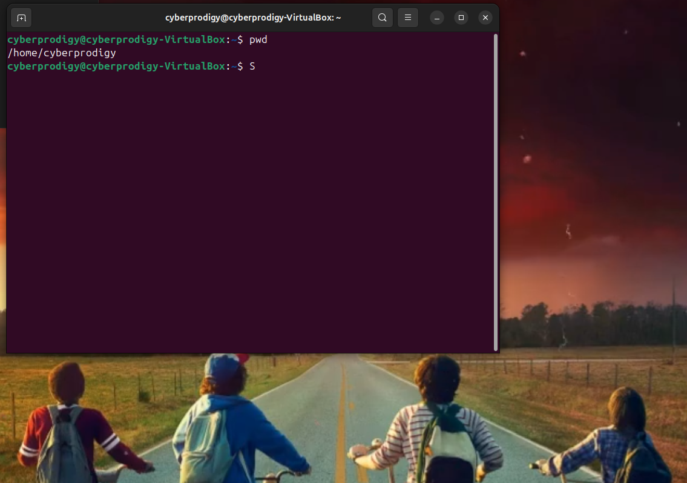
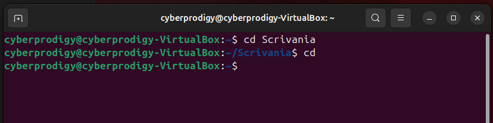
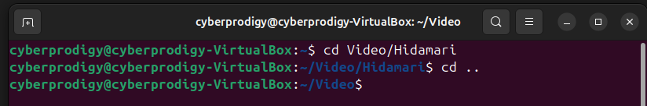
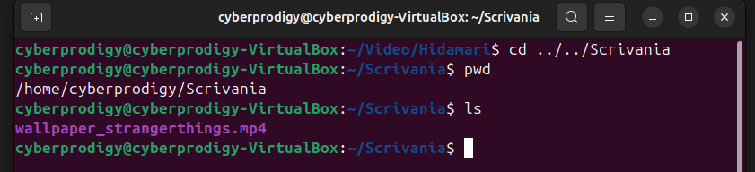
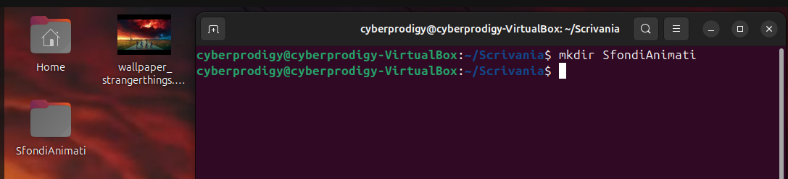
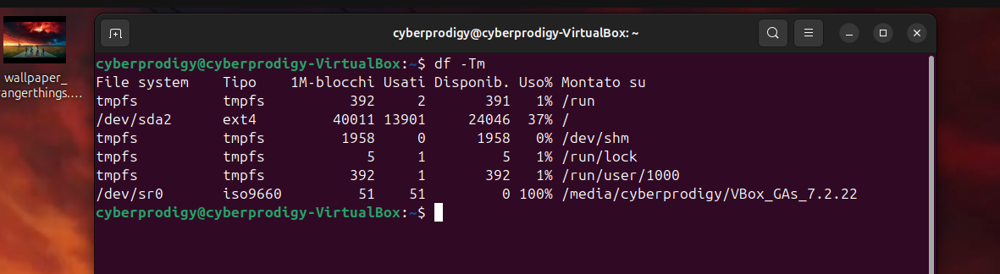
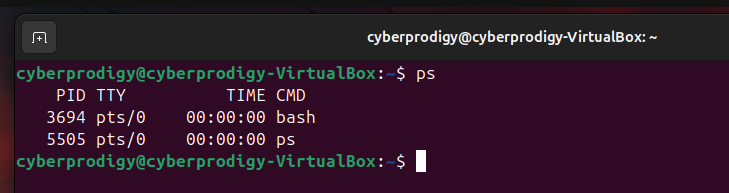
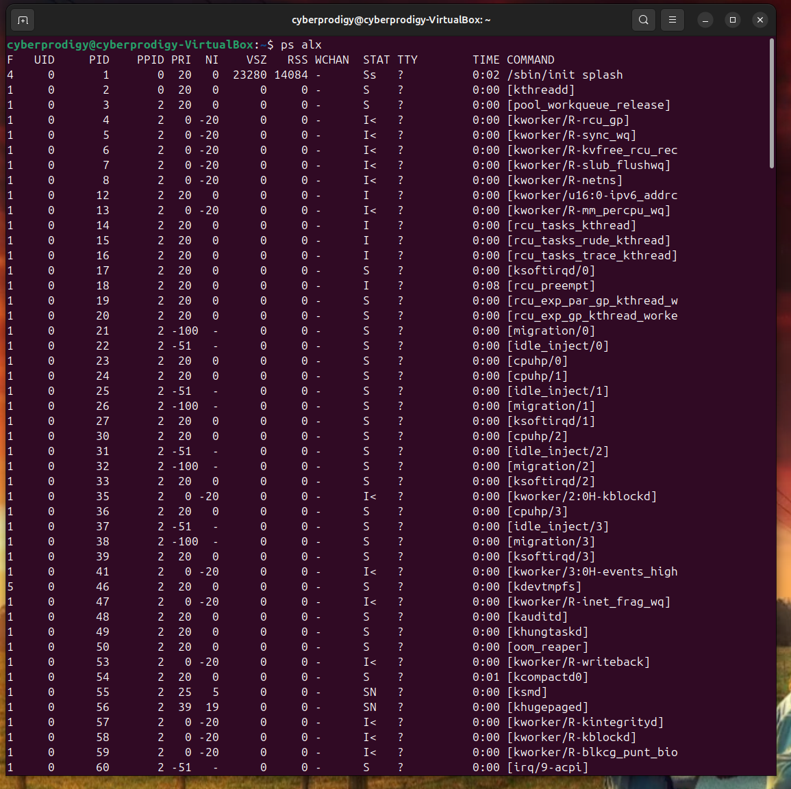

## **Lezione 2: Comandi fondamentali della shell di Linux**

### **1. Introduzione**

Questa lezione approfondisce i **comandi fondamentali della shell di Linux**, strumenti indispensabili per l’amministrazione del sistema e per l’analisi forense del file system.  
Saper utilizzare questi comandi significa poter **navigare nei file**, **controllare i permessi**, **monitorare i processi** e **gestire i collegamenti logici e fisici** tra file e directory — tutte operazioni centrali nella **disk forensics**.

---

### **2. Navigazione nel file system**

Linux organizza i file in una struttura ad **albero gerarchico**, con la directory **root `/`** come punto di partenza.  
Per muoversi tra le directory e visualizzarne il contenuto, vengono usati alcuni comandi essenziali:

#### **A. Print Working Directory**  

Mostra la directory corrente.

```bash
pwd
```



Su macOS, come su Linucd e Windows (con PowerShell), quando apri un nuovo terminale **la directory iniziale è quasi sempre la tua home**.
##### 👇 Esempio su macOS

Se il tuo utente si chiama `cybersamu`, la home è:

`/Users/cybersamu`

E all’apertura del terminale vedresti qualcosa tipo:

`cybersamu@Mac ~ %`

Il simbolo `~` significa proprio **home directory**.

---
##### 🔍 Come verificare subito?

Nel terminale digita:

`pwd`

Ti risponderà con il percorso della cartella corrente.

Se sei nella home, otterrai:

`/Users/cybersamu`

---

##### 📂 Come aprire la home da qualunque punto

Puoi sempre tornare alla home con:

`cd ~` **PER LA TILDE: ALTGR + ì SU LINUX, ALT + 126 SU WIN/LINUX, OPTION + 5 SU MAC**

oppure semplicemente:

`cd`



---

#### **B. Change Directory**  

Permette di spostarsi all’interno del file system.
E' il navigatore vero e proprio!

```bash
cd [directory]
```


`cd` è il comando che ti permette di **muoverti dentro il file system**, proprio come fai cliccando nelle cartelle del File Manager, ma con la tastiera.

Prima di tutto, devi capire **dove sei** e **come ti muovi**.

---


Dopo il comando, nel terminale vedi:

```
cyberprodigy@cyberprodigy-VirtualBox:~/Video/Hidamari$
```

Questa riga ti dice due cose:

 **1️⃣ Il tuo utente → cyberprodigy**

 **2️⃣ La cartella in cui ti trovi ora → ~/Video/Hidamari**

`~` significa:

```
/home/cyberprodigy
```

Quindi in realtà sei qui, espandendo l'abbreviazione:

```
/home/cyberprodigy/Video/Hidamari
```

---

La distinzione tra i path è fondamentale quando si naviga con la shell
##### **Percorso Assoluto**

È il percorso completo, che parte sempre da `/` (la radice del file system):

Esempi:

```
/home/cyberprodigy
/home/cyberprodigy/Video/Hidamari
/var/log
/usr/bin
```

Un percorso assoluto **non dipende da dove ti trovi**.  
È sempre valido.

---

##### **Percorso Relativo**

Parte dalla **cartella in cui ti trovi adesso**.

Esempio (dalla tua posizione attuale `~/Video/Hidamari`):

Vai alla cartella superiore

```
cd ..
```

Perché `..` significa:

```
la directory subito sopra
```

Infatti:



Oppure potremmo saltare due directory più in alto e poi scendere nel Desktop:



---

##### ▶ **Torna nella cartella degli sfondi animati di Hidamari usando percorso assoluto**

```
cd /home/cyberprodigy/Video/Hidamari
```

---

##### ▶ **Torna in Hidamari usando percorso relativo**

Da `~/Video`, ti basta:

```
cd Hidamari
```

perché è figlio diretto.

---

##### **Cosa succede se sbagli una sola lettera?**

Se scrivi:

```
cd HIdamari
```

ma la cartella si chiama:

```
Hidamari
```

Linux risponde:

```
bash: cd: HIdamari: No such file or directory
```

Perché **Linux distingue tra maiuscole e minuscole**  
(`Hidamari` ≠ `HIdamari`).

---

##### **Riassunto essenziale da ricordare**

###### **Muoversi**

```
cd nomecartella
cd ..
cd ~
cd /
```

###### **Assoluto**

```
/home/cyberprodigy/Video/Hidamari
```

###### **Relativo (dipende da dove sei)**

```
cd Hidamari
cd ../Download
```

###### **Shortcuts importanti**

- `~` = home
    
- `..` = cartella sopra
    
- `.` = cartella corrente
    

---

#### **C. Make Directory**  

Crea una nuova directory.

```bash
mkdir [directory]
```



Per creare i file invece vedremo più avanti...

#### **D. Remove Directory**  

`rmdir` **rimuove solo directory vuote**, sempre e solo vuote. 
Sintassi:

```bash
rmdir [directory]
```

Se la directory contiene **anche un solo file**, dà errore.

Esempio di errore classico:

```bash
rmdir cartella
rmdir: failed to remove 'cartella': Directory not empty
```

---

#### **E. List Directory**  

Elenca i file contenuti in una directory.  

```bash
ls [OPZIONI] [FILE|DIR]
```
`
Vediamone le tre flags di opzioni principali:

##### 1) `-a` (“all”)

Mostra _anche i file nascosti_ (quelli che iniziano con `.`).

**Perché serve al forense?**  
Perché _qualunque dato nascosto_ può essere potenzialmente rilevante (directory `.config`, `.cache`, file `.bash_history`, ecc.).

---

##### 2) `-l` (“long format”)

Mostra l’elenco in **formato lungo**, cioè:

- permessi
    
- numero link
    
- owner
    
- gruppo
    
- dimensione
    
- timestamp
    
- nome del file
    

**Perché serve al forense?**  
Perché questo è il formato che usa **metadati leggibili**. Quando analizzi un file devi vedere:

- chi è il proprietario
    
- in che gruppo sta
    
- che permessi ha
    
- quando è stato modificato, cambiato o letto
    
- quanto è grande
    

È _il formato base_ con cui si lavora nei report tecnici.

---

##### 3) `-g`

Come `-l`, ma **non mostra il proprietario**, soltanto il gruppo.

Perché **a volte il gruppo è più significativo dell’owner**, ad esempio quando un sistema ha owner generici (come `root`) e la discriminante è nel gruppo (“adm”, “www-data”, “disk”, ecc.).

Per la forense, spesso interessa **capire a quale gruppo apparteneva il file**, per ragioni di accessibilità e privilegi.

Il corso è:

- introduttivo
    
- focalizzato sulla **lettura dei metadati**
    
- orientato a capire _chi ha accesso a cosa_
    
- utile per analizzare **tracce, timeline, permessi, gruppi, utenti**
    

Per fare questo, basta:

`ls -al`

oppure, quando vuoi isolare i gruppi:

`ls -ag`

Le altre opzioni (`-X`, `--quoting-style`, `-p`, `--si`, `--dired`, ecc.) sono totalmente **irrilevanti** per la forense e non le vedrai mai all’esame.

---

##### 📌 Perché il prof mette SOLO queste tre?

Perché nel flusso base di analisi forense il tecnico deve:

1. **Vedere tutto** → `-a`
    
2. **Vedere i metadati completi** → `-l`
    
3. **Concentrarsi sui gruppi quando serve** → `-g`
    

Fine. Non serve altro.

---

### **3. Visualizzare attributi e metadati dei file**

Per ottenere una **descrizione completa di un file**, si utilizza:

```bash
ls -lgsF nomefile
```

Spoiler: _non è casuale_, ma è un **preset tipico da analisi forense base**.
Significa:

- `-l` → formato lungo (**permessi, link, owner, gruppo, dimensione, data, nome**)
    
- `-g` → come `-l` ma **non mostra il proprietario**, lasciando solo il gruppo  
    (oppure, più precisamente: “mostra tutto come `-l` ma omette il campo owner”)
    
- `-s` → mostra **la dimensione in blocchi** _prima_ del nome
    
- `-F` → classifica il tipo di file **aggiungendo un simbolo finale**
    
    - `/` → directory
        
    - `*` → eseguibile
        
    - `@` → link simbolico
        
    - `|` → FIFO
        
    - `=` → socket
        

Combinati tutti, producono un output _molto ricco_ per un singolo file.

Esempio sulla mia VM:

![[imgs/9_lgsF.png]]

Questo risultato mostra:

- Numero di **blocchi utilizzati** dal file (di solito da 1024 byte ciascuno);
    
- Tipo e **permessi** del file;
    
- Numero di **hard link**;
    
- **Utente** e **gruppo** proprietari;
    
- **Dimensione** in byte;
    
- **Data e ora di ultima modifica**;
    
- **Nome** del file.
    

Queste informazioni sono **cruciali in ambito forense**, perché consentono di determinare **chi ha creato o modificato un file**, **quando** e **con quali diritti di accesso**.

---

### **4. Gestione dei gruppi e dei permessi**

Ogni utente appartiene ad almeno un **gruppo**, e i file sono associati a un **utente** e a un **gruppo di appartenenza**.

Per visualizzare i gruppi a cui un utente appartiene...

```bash
groups [username]
```


![[imgs/10_groups.png]]

Questo significa che l’utente **cyberprodigy** appartiene **automaticamente** a tutti questi gruppi.  
È **normalissimo**: Ubuntu _di default_ mette gli utenti in vari gruppi per poter usare il sistema in modo normale.

### **Facoltativo: i vari gruppi che si vedono in foto...**

Ora ti spiego **uno per uno** cosa significano e perché ci sei dentro senza aver fatto nulla.
#### **1. cyberprodigy**

È il _gruppo primario_.  
Ubuntu crea **un gruppo con lo stesso nome dell’utente**, sempre.

---

#### **2. adm**

Gruppo che permette di leggere molti **log di sistema**, esempio:

- `/var/log/auth.log`
    
- `/var/log/syslog`
    

Ubuntu mette quasi sempre il primo utente creato in questo gruppo.

---

#### **3. cdrom**

Serve per montare CD/DVD e ISO.

Non concede privilegi pericolosi, è un gruppo “safe”.

---

#### **4. sudo**

**Il più importante.**  
Significa che **puoi usare `sudo`**, cioè:

- diventare root temporaneamente
    
- fare amministrazione di sistema
    

Il primo utente creato in Ubuntu _è sempre_ aggiunto al gruppo `sudo`.

---

#### **5. dip**

Sta per **Dial-up IP** (vecchia eredità UNIX).

Oggi permette:

- gestione di collegamenti di rete automatizzati
    
- certe operazioni di rete legacy
    

È normale che il primo utente ce l’abbia.

---

#### **6. plugdev**

Permette di gestire dispositivi **plug-and-play**, tipo:

- USB
    
- dischi esterni
    
- fotocamere ecc.
    

Serve per montare e smontare device senza password.

---

#### **7. users**

Gruppo generico di utenti normali.  
Utile per permessi condivisi su certi file o programmi.

---

#### **8. lpadmin**

Permette di amministrare stampanti:

- aggiungere stampanti
    
- configurarle
    
- gestire code di stampa
    

Fa parte dei privilegi desktop standard.

Ubuntu **aggiunge automaticamente** l’utente ai gruppi necessari per:

- amministrazione di base
    
- gestione dispositivi
    
- funzionamento desktop completo
    
- compatibilità software
    

Se non ti mettesse in questi gruppi, avresti un sistema **mezzo rotto**, incapace di:

- installare software
    
- montare USB
    
- leggere log importanti
    
- gestire stampanti
    
- eseguire comandi amministrativi

---


Per cambiare gruppo corrente:

```bash
newgrp <groupname>
```

Per modificare il gruppo associato a un file:

```bash
chgrp <groupname> <file>
```

Questi comandi consentono di gestire la **proprietà logica** dei file, un’informazione essenziale per determinare **chi aveva accesso** a un determinato dato digitale.

---

### **5. Modifica dei permessi dei file**

Il comando `chmod` consente di cambiare i permessi di lettura, scrittura ed esecuzione.

#### **Modalità simbolica (relativa)**

```bash
chmod [ugo][+-][rwxX] file
```

Dove:

- `u` = user
    
- `g` = group
    
- `o` = others
    
esiste anche *a* per all...
**SE NON SPECIFICATO NIENTE, u è il default**
Esempi:

```bash
chmod u+x script.sh
```

→ aggiunge il diritto di esecuzione al proprietario per il file passato come argomento

---

```bash
chmod -R ug+rwX src/*
```

Questo comando:

- **applica ricorsivamente** (`-R`) i permessi a tutto ciò che si trova dentro `src/`
    
- **aggiunge** (`+`) a **utente (u)** e **gruppo (g)** i permessi:
    
    - **r** → lettura
        
    - **w** → scrittura
        
    - **X** → esecuzione _solo_ per le directory **o** per i file che hanno già almeno un bit di esecuzione attivo
        

In pratica:

- **tutte le directory** diventano attraversabili/eseguibili (necessario per entrarci con `cd`)
    
- **tutti i file** ottengono lettura e scrittura
    
- **i file non eseguibili** **non** diventano eseguibili per errore
    
- **solo i file già eseguibili** mantengono il bit di esecuzione


---

```bash
chmod -R o-rwx $HOME
```

Questo comando:

- applica i cambiamenti **ricorsivamente** (`-R`) a tutta la tua home
    
- **rimuove** (`-`) a **others** (`o`, cioè _tutti gli utenti che non sono né tu né il tuo gruppo_) i permessi:
    
    - **r** → lettura
        
    - **w** → scrittura
        
    - **x** → esecuzione / attraversamento directory
        

In pratica:

- gli **altri utenti del sistema** non possono più:
    
    - leggere file o elencare directory della tua home
        
    - modificarli o crearne di nuovi
        
    - accedere alle directory interne (niente `cd`)
        

È una misura di **privacy e sicurezza** molto comune nei sistemi multi-utente.

---

#### **Modalità numerica (assoluta)**

Ogni permesso è rappresentato da un valore:

- **r = 4**, **w = 2**, **x = 1**
    

Esempi:

```bash
chmod 755 public_html
```

→ utente: lettura/scrittura/esecuzione; gruppo e altri: lettura/esecuzione.

```bash
chmod 644 .procmailrc
```

→ utente: lettura/scrittura; gruppo e altri: sola lettura.

> L’uso corretto dei permessi è fondamentale in un’analisi forense, poiché consente di comprendere **chi poteva accedere o modificare** un determinato file.

---

### **6. Comandi per la gestione dello spazio**

Per analizzare l’uso della memoria e la struttura delle directory:

#### **A. Disk Free**

Mostra lo spazio libero e occupato sui dischi, indicando il tipo di file system. Sintassi base:

```bash
df [options] [directory]
```

Una configurazione usata spesso è:

```bash
df -Tm
```



Questa combinazione:

- `-T` → mostra anche il **tipo di file system** (ext4, xfs, tmpfs, ecc.)
    
- `-m` → visualizza tutte le dimensioni in **megabyte**, semplificando la lettura
    

Insieme, producono una tabella che riporta per ogni file system:

- tipo
    
- dimensione totale
    
- spazio usato
    
- spazio libero
    
- percentuale di utilizzo
    
- punto di mount
    

È una configurazione molto comoda per avere **subito un quadro sintetico e leggibile** dell’occupazione dei dischi.


---

####  **B. Disk Usage**

Serve a misurare **quanto spazio occupano realmente** directory e file all’interno del file system.

La sintassi generale è:

`du [options] [directory]`

Vediamo le 4 forme principali:

---

##### 1) `du`

Lanciato da solo, senza argomenti:

`du`

→ mostra lo spazio occupato **da tutte le directory** a partire dalla directory corrente, **ricorsivamente**

Esempio (semplificato):

`4      ./docs 12     ./src 20     .`

Visualizza TUTTE le sottocartelle e la dimensione totale.

---

##### 2) `du directory`

Specifichi la directory di cui vuoi vedere il contenuto:

`du directory`

→ come sopra, ma **limitato** a quella directory.  
Racconta lo spazio occupato **da ogni sottocartella** al suo interno.

Esempio:

`8      directory/sub1 16     directory/sub2 24     directory`

---

##### 3) `du -s directory`

L’opzione **-s** sta per “summary”.

`du -s directory`

→ mostra **solo il totale**, senza elencare le sottocartelle.

Esempio:

`24     directory`

Questa è la forma usata più spesso in forense per avere un numero pulito.

---

##### 4) `du -k directory`

L’opzione **-k** forza l’unità in **kilobyte** (K = 1024 byte).

`du -k directory`

→ mostra le stesse informazioni ricorsive, ma usando **KB** come unità.

Esempio:

`8      directory/sub1 16     directory/sub2 24     directory`

È utile per avere valori coerenti tra varie macchine.


---

### **7. Comandi per la gestione dei files**

```bash
rm [file]
```

Elimina un file. **Attenzione:** la cancellazione logica può rendere difficile ma non impossibile il recupero dei dati.

```bash
cp sorgente destinazione
```

Copia file o directory.

```bash
mv sorgente destinazione
```

Sposta o rinomina un file.

```bash
ln file linkname
```

Crea **collegamenti** (hard o simbolici).

---

### **7. Hard link e link simbolici**

- **Hard link:**  
    Crea una seconda voce di directory che punta allo stesso inode del file.  
    Il numero di link dell’inode viene incrementato di 1.
    
    ```bash
    ln file hlink
    ```
    
- **Link simbolico (soft link):**  
    Crea un file speciale che “punta” al nome di un altro file, non all’inode.
    
    ```bash
    ln -s file slink
    ```
    

Differenze principali:

- Cancellando il file originale, un **hard link** continua a funzionare, mentre un **link simbolico** diventa “spezzato”.
    
- In ambiente Windows, un link simbolico è simile a un **collegamento (LNK)**.
    

> Nei contesti forensi, analizzare i **link** è utile per scoprire **collegamenti logici tra file e directory**, anche quando i file originali sono stati spostati o rimossi.


---


####  **8. `more` e `less`: consultazione del testo nel terminale**

Quando un file di testo è troppo lungo per essere mostrato tutto in una schermata, si usano comandi che permettono di **scorrerlo pagina per pagina**.

I due storici strumenti sono:

```
more
less
```

Entrambi servono a leggere file di testo, ma **less è nettamente superiore**.

---

##### ✔ `more`

Sintassi:

```bash
more file
```

Caratteristiche:

- mostra il file **pagina per pagina**
    
- avanza premendo **spazio**
    
- non permette di **tornare indietro** (limite principale)
    
- comandi disponibili:
    
    - `Spazio` → avanti una pagina
        
    - `Invio` → avanti una riga
        
    - `q` → esci
        

`more` è uno strumento **vecchio**, molto basilare.

---

##### ✔ `less`

Sintassi:

```bash
less file
```

Caratteristiche:

- puoi **muoverti avanti e indietro** nel file (questa è la differenza enorme)
    
- load “on demand”: non carica l’intero file in memoria
    
- supporta **ricerca interna**
    
- comandi principali:
    
    - `Spazio` → avanti una pagina
        
    - `b` → indietro una pagina
        
    - `Invio` → avanti una riga
        
    - `/testo` → cerca “testo” nel file
        
    - `n` → trova la successiva occorrenza
        
    - `q` → esci
        

È considerato di fatto il lettore di testo standard nei sistemi Unix.

> `more` scorre solo **in avanti**, mentre `less` permette di scorrere **avanti e indietro** e include funzioni di ricerca: per questo è preferito in qualsiasi analisi seria, anche forense.

##### ✔ Quando servono in forense?

Quando devi leggere:

- log estesi
    
- output lunghi di comandi (`dmesg`, `journalctl`, `ls -lR`)
    
- file di testo da analizzare senza aprire un editor
    

Molti tecnici usano:

```bash
less +F /var/log/syslog
```

per seguire un log in tempo reale (tipo `tail -f`, ma più potente).

---

### **9. Gestione dei processi**

Un **processo** è un programma in esecuzione.  
Può essere avviato in due modalità:

- **Foreground:** controlla il terminale finché termina.
    
- **Background:** viene eseguito senza occupare la sessione corrente.
    

Esempi:

```bash
long_task &
```

→ avvia il processo in background.


---


```bash
^Z
```

→ sospende il processo in foreground.


---


```bash
jobs
```

→ elenca i processi in background.


---


```bash
%n
```

Si riferisce all'ennesimo processo in background: ad esempio...

```bash
kill %1
```

→ termina il processo indicato.


---


```bash
fg %1
```

→ riporta il processo n.1 in foreground.


---


```bash
bg %1
```

→ riattiva in background un processo sospeso.


---

### **9. Informazioni sui processi attivi**

Ogni processo ha un **PID (Process ID)** e un **PPID (Parent Process ID)**.  

In Unix ogni processo:

- ha un **PID** → identificativo univoco
    
- ha un **PPID** → il PID del suo **processo padre**
    
- nasce tramite la chiamata `fork()`
    
- eredita l’ambiente del padre (variabili, directory corrente, ecc.)
    

La **shell** è un processo come tutti gli altri.

Quindi, ad esempio, tutti i comandi lanciati da shell avranno come processo padre l'id del processo shell.

---

### **🚀 10. COSA SONO “nice” E “renice”**

Nel kernel Linux ogni processo ha un valore **“nice”** che indica quanto il processo è “gentile” nel chiedere CPU.

- Valori da **-20 a +19**
    
- **-20 → massima priorità (molto “egoista”)**
    
- **+19 → minima priorità (molto “gentile”)**
    

Più il valore è **basso**, più il processo riceve CPU.  
Più il valore è **alto**, meno CPU riceve.

⚠ **Normal user può SOLO aumentare il valore** (rendere il processo più “gentile”).  
⚠ **Solo root può diminuire il valore** (aumentare la priorità).

---

#### 🟦 **COMANDO `nice`**

Serve per **lanciare un programma con una certa priorità**.

##### ✔ Sintassi base

`nice comando`

→ lancia `comando` con il nice **predefinito** (+10 su molte distro).

##### ✔ Sintassi con valore specifico

`nice -n VALORE comando`

Esempio:

`nice -n 15 ./script.sh`

→ esegue `script.sh` con nice = +15 (bassa priorità).

##### ✔ Opzioni principali

|Opzione|Significato|
|---|---|
|`-n`|imposta il valore di nice|
|`--adjustment`|sinonimo di `-n`|

##### ✔ Cosa puoi fare come utente normale?

✔ Puoi fare:

`nice -n 10 program`

✘ NON puoi fare:

`nice -n -5 program`

→ solo root può abbassare la niceness.

---

#### 🟩 **COMANDO `renice`**

Serve per **modificare la priorità di un processo già in esecuzione**.

##### ✔ Sintassi generale

`renice VALORE -p PID`

Esempio:

`renice 5 -p 1234`

→ imposta nice = 5 al processo con PID 1234.

##### ✔ Altre forme utili

Cambiare priorità **a più PID**:

`renice 10 -p 1234 -p 2222 -p 5555`

Cambiare priorità **per gruppi**:

`renice 10 -g nomegruppo`

Cambiare priorità **a tutti i processi di un utente**:

`renice 15 -u samuele`

---

#### 📌 **Regole dei permessi (importantissime in sicurezza)**

##### Utente normale può:

- **aumentare** il valore (rendere più gentile) → sì
    
- **diminire** il valore (rendere più prioritario) → NO
    

##### Root può:

- modificare **qualsiasi** valore in **qualsiasi** direzione
    

Esempio per root:

`sudo renice -20 -p 1234`

---

#### 🟥 **Esempi pratici (quelli che realmente servono)**

##### 🔹 Eseguire un programma pesante con bassa priorità

`nice -n 19 python script.py`

→ non rallenta il resto del sistema.

##### 🔹 Abbassare la priorità di un processo che sta saturando la CPU

`renice 10 -p $(pidof ffmpeg)`

##### 🔹 Aumentare la priorità di un processo importante (solo root)

`sudo renice -5 -p 2345`

---

#### **🟧 Come vedere il nice dei processi**

`ps -l`

Guarda la colonna **NI** (niceness).

Oppure:

`ps -o pid,ni,cmd`

---
### **🔥 11. COSA E' IL TTY**

**TTY = Teletypewriter (teleprinter)**  
È il nome storico dei terminali UNIX.

Nel mondo moderno significa:

> **Un dispositivo che fornisce un’interfaccia testuale tra l’utente e il sistema.**

Quindi:

- la tua shell
    
- il terminale grafico
    
- le console (Ctrl+Alt+F1–F6)
    
- i terminali remoti (SSH)
    

sono tutti **TTY** (o pseudo-TTY).

---

#### **🔥 PERCHÉ È IMPORTANTE?**

Perché **ogni processo** che lanci da una shell è associato a un _tty_, e questo:

- permette al processo di leggere input (tastiera)
    
- permette di scrivere output (stdout)
    
- permette di gestire segnali interattivi (Ctrl+C, Ctrl+Z, Ctrl+D ecc.)
    

TTY = **il canale di comunicazione** tra te e il processo.

In forense è fondamentale perché:

- un processo con **TTY** è stato lanciato da un utente reale
    
- un processo **senza TTY** è un demone o un servizio
    

---

#### **🔥 IL COMANDO `tty`**

Questo **è un comando vero** (contrariamente a “pid e ppid”).

Serve per sapere **su quale terminale** sei collegato.

##### ✔ Sintassi

```bash
tty
```

##### ✔ Esempio

```bash
/dev/pts/1
```

Significa che sei collegato tramite il terminale pseudo-TTY numero 1.

---

#### 🔥 **TIPI DI TTY**

##### 1) **Console fisica**

```
/dev/tty1
/dev/tty2
...
```

→ schermi testuali di Linux attivabili con Ctrl+Alt+F1…F6.

##### 2) **Terminali grafici**

Quando apri GNOME Terminal, Konsole, ecc., ottieni:

```
/dev/pts/0
/dev/pts/1
```

"pts" = **pseudo terminal slave**

##### 3) **Connessioni remote (SSH)**

Anche via SSH ottieni un `/dev/pts/X`.

---

#### 🔥 **IL TTY NEL COMANDO `ps`**

Come vedremo tra poco, quando si lancia:

```bash
ps alx
```

vedi una colonna chiamata **TTY**.

Esempi:

|PID|TTY|CMD|
|---|---|---|
|2712|pts/0|bash|
|2730|pts/0|ls|
|112|?|systemd|

Interpretazione:

- `pts/0` → processo lanciato dal tuo terminale
    
- `?` → processo **senza TTY** → demone, servizio, processo di sistema
    

**Questa è una distinzione cruciale in forense.**

---

#### 🔥 **USO PRATICO DI `tty`

##### ✔ Sapere da quale console stai operando

```bash
tty
```

##### ✔ Capire se un processo è interattivo o no

```bash
ps -o pid,tty,cmd
```

I processi con `TTY=?` sono tipicamente:

- servizi
    
- demoni
    
- processi di sistema
    
- malware che gira in background


---

### **🔥 12. REAL vs EFFECTIVE (User & Group ID)**

Ogni processo ha **due livelli di identità**:

#### ✔ **REAL USER ID (RUID)**

È **l’utente reale** che ha avviato il processo.

➡️ Questo identifica _chi ha cliccato/eseguito_ il comando.  
È l’identità “storica”.

Esempio:

- Tu lanci `ls`: **RUID = cyberprodigy**
    

---

#### ✔ **EFFECTIVE USER ID (EUID)**

È **l’utente con cui il processo opera realmente**.

➡️ Determina **quali permessi POSSA usare il processo**.

Può essere **diverso** dal real UID — questa è la parte importante.

### Esempio fondamentale:

Il comando `passwd` (per cambiare password):

- è lanciato da te (RUID = cyberprodigy)
    
- ma deve modificare `/etc/shadow`, accessibile solo da root
    
- quindi funziona con **EUID = 0 (root)** grazie al bit SUID
    

Questo è un **meccanismo di privilegi controllati**.

---

#### ✔ **REAL GROUP ID (RGID)**

È il gruppo principale dell’utente che ha lanciato il comando.

Esempio:

- cyberprodigy appartiene al gruppo cyberprodigy  
    → RGID = cyberprodigy
    

---

#### ✔ **EFFECTIVE GROUP ID (EGID)**

Il gruppo usato dal processo per i permessi effettivi.

Può cambiare come l’EUID, ad esempio con il bit SGID.

|Campo|Significato|
|---|---|
|**RUID**|chi ha lanciato il processo|
|**EUID**|con quali permessi il processo opera realmente|
|**RGID**|gruppo primario dell’utente|
|**EGID**|gruppo usato effettivamente per i permessi|

➡️ L’EUID/EGID servono per il controllo dei permessi  
➡️ Il RUID/RGID servono a sapere “chi” è responsabile del processo

Perfetto per la forense.

---


Perché per un **CTU (consulente tecnico)**:

- un processo che gira con EUID “root”  
    **ma RUID = utente normale**  
    significa che ha usato SUID **legittimo** o **abusato**.
    
- un malware spesso si camuffa cambiando EUID  
    → ma il RUID lo smaschera.
    

Capire questa differenza è cruciale per:

- ricostruire attacco
    
- attribuire responsabilità
    
- analizzare escalation di privilegi
    
- controllare SUID/SGID pericolosi
    


---

### **13. Gestione processi: ps**

`ps` = **processes**     //      Va a displayare i processi

#### 🔥 1. Prima differenza: `ps` vs `ps alx`

##### ✔ `ps`

Mostra **solo i processi del tuo terminale**:



Vediamo solo due righe erché **`ps` senza opzioni** mostra:

> 🔹 solo i processi appartenenti al _tuo terminale_ (cioè al tuo TTY)  
> 🔹 solo i processi tuoi (quelli del tuo utente)

In altre parole:

**`ps` → mostra solo quello che è attaccato al tuo “schermo” (pts/0)**

---

###### 🔥 **Significato dell'output*

✔ **3694 → PID** → È il **process ID** della shell `bash` che stai usando.
Quando hai aperto il terminale GNOME/Konsole, il sistema ha lanciato una shell.

✔ **pts/0 → TTY** → È il tuo terminale virtuale.

- “pts” = _pseudo terminal slave_
    
- “0” = numero del terminale

Tutte le sessioni grafiche (Ubuntu Desktop) lavorano con `/dev/pts/*`.
Quindi ogni terminale aperto = un nuovo `pts/N`.

✔ **CMD = bash** → La tua shell.

Nella seconda riga...
- PID 5505 = il processo del comando `ps` stesso
    
- TTY = lo stesso terminale della shell (pts/0)
    
- TIME = 0 perché è leggerissimo e finisce subito
    
- CMD = ps (il comando che hai lanciato)
    

Sì, è normale che `ps` mostri **anche se stesso** mentre sta girando.

È il comportamento standard.

---

###### 🔥 Perché non vedi demoni, kernel, systemd, ecc.?

Perché devi usare:

```
ps aux
```

oppure la sintassi BSD che vediamo tra poco (Berkeley Software Distribution, senza trattini per options, che linux accetta benissimo)

```
ps alx
```

Questi comandi ignorano la restrizione del TTY e mostrano **tutto**.

---

##### ✔ `ps alx`

combina 3 insiemi di opzioni:

- **a** → mostra tutti i processi del sistema (non solo quelli della tua shell)
    
- **l** → formato _long_, cioè più colonne dettagliate
    
- **x** → include anche i processi _senza terminale associato_
    

Risultato: **una panoramica completa di TUTTI i processi del sistema**, inclusi:

- kernel threads
    
- servizi di sistema
    
- demoni
    
- processi utente
    
- processi senza TTY
    
- processi “zombie” se ci sono
    

---

###### 🧩 **Interpretazione delle colonne nello screenshot**



---

###### **F — Flag del processo**

Valore numerico che indica lo stato/funzioni interne del processo.  
Esempi:

- `1` → processo in background o lanciato non interattivamente
    
- `4` → processo è un thread del kernel
    
- `0` → processo normale
    

Tu vedi quasi sempre `1`, perché la maggioranza dei processi mostrati qui sono demoni o kernel worker.

---

###### **UID — User ID**

L’utente proprietario del processo.

Nel tuo caso:

- `0` → root
    
- `1000` → tu (cyberprodigy)
    

Le prime righe sono TUTTE UID 0 → **servizi di sistema**.

---

###### **PID — Process ID**

Identificatore UNICO del processo.

Esempio:

- `1` = systemd/init → il padre di (quasi) tutto ciò che è user-space.
    
- `2` = kthreadd → il padre di TUTTI i kernel threads.
    

**Quasi tutte le righe che vedi sono figli di PID 2 ⇒ thread del kernel.**

---

###### **PPID — Parent Process ID**

Chi ha generato quel processo.

Osserva:

- I kernel threads hanno quasi tutti **PPID = 2** → creati da _kthreadd_.
    
- I tuoi processi lanciati da terminale avrebbero PPID = PID della tua shell (bash).
    

Quindi: **tutti i numeri “2” nella colonna PPID = figli del kernel**.

---

###### **PRI — Priorità interna (priorità assoluta del kernel)**

Numero calcolato dal kernel, più basso = più prioritario.

Processi di sistema importanti hanno:

- 20 → normale
    
- -20 → altissima priorità
    
- valori negativi → usati da kernel workers fondamentali
    

Guarda il tuo screenshot:

- molti thread del kernel hanno **PRI −100 o −51** → alta priorità.
    

---

###### **NI — Nice level (livello di “gentilezza” CPU)**

Questo è quello di cui parlavamo: da −20 (egoista) a +19 (gentile).

Tu vedi quasi sempre:

- `0` → priorità normale
    
- valori negativi sui worker critici
    

---

###### **VSZ — Virtual Memory Size**

Memoria virtuale totale richiesta dal processo.

Spesso 0 nei kernel threads → non è memoria utenti.

---

###### **RSS — Resident Set Size**

Quanta RAM _fisica_ il processo sta usando davvero.

Per i kernel worker → sempre 0 o molto basso.

---

###### **WCHAN — "In quale funzione del kernel il processo sta dormendo"**

Questa è una colonna molto _forense_ e molto interessante.

Esempio nel tuo screenshot:

- `rcu_gp` → thread che gestisce il Read-Copy-Update
    
- `kblkcd` → thread che si occupa della block-I/O completion
    
- `khugepaged` → thread che gestisce le hugepages
    
- `migration` → thread che sposta i processi tra le CPU
    

Se WCHAN ha un nome → il processo **non è attivo**, è in attesa (sleeping) in quella precisa funzione del kernel.

---

###### **STAT — stato del processo**

I simboli qui mostrano lo _stato attuale_.

Esempi che vedi tu:

- `S` → sleeping
    
- `I` → idle thread (tipico dei kernel threads)
    
- `R` → running
    
- `D` → uninterruptible sleep (I/O pesante)
    
- `Ss` → sleeping + session leader (systemd)
    
- `SN` → sleeping + nice modificato
    
- `I<` → idle + priority boosted
    

Gran parte dei tuoi sono `I` → tipico dei kernel worker.

---

###### **TTY — terminale associato**

Il punto importante:  
**i thread del kernel NON hanno terminale → TTY = ?**

Lo vedi chiaramente: tutte le righe = `?`

---

###### **TIME — CPU time usato**

Quasi tutti i kernel thread marcano:

```
0:00
```

perché consumano pochissimo e quasi sempre dormono.

---

###### **COMMAND — nome del processo**

Qui capisci cosa stai guardando.

Qualche esempio del tuo screenshot:

- `[ksoftirqd/0]` → gestore delle soft-IRQ della CPU 0
    
- `[rcu_sched]` → scheduler RCU
    
- `[migration/0]` → bilanciamento dei processi sulla CPU 0
    
- `idle_inject/1` → processo speciale per thermal throttling
    
- `[kworker/0:0H-kblockd]` → worker del kernel per operazioni su blocchi
    
- `[pool_workqueue_release]` → pool di worker generici
    

E il primissimo in cima:

```
/sbin/init splash
```

è **systemd**, PID 1 → il padre di (quasi) tutto.

---

###### 📌 **Interpretazione generale del tuo output**

🔹 È una vista (molto completa) di **tutti i processi del sistema**, non filtrata.  
🔹 La quasi totalità delle righe è formata da **thread del kernel**, generati da kthreadd.
🔹 WCHAN ti dice precisamente “dove dormono” i thread.  
🔹 STAT ti mostra che praticamente tutto è “S” o “I” → il sistema è inattivo, nessun carico.  
🔹 Alcuni thread hanno priorità negative → sono critici.


---

### 🔪 **14. Gestione processi: kill**

`kill` **NON significa “uccidere un processo”**.

`kill` significa:

> **inviare un segnale (signal) a un processo**.

Il segnale può essere:

- una richiesta gentile di terminazione
    
- una richiesta drastica
    
- una richiesta di stop
    
- una richiesta di resume
    
- o anche un segnale personalizzato
    

**Terminarlo è solo UNO dei casi.**

---

#### 🧩 **Sintassi base**

```bash
kill [opzioni] PID
```

oppure:

```bash
kill -SIGNAL PID
```

---

#### 💣 **I segnali più importanti (quelli REALI da sapere)**

##### **1. SIGTERM (15) – terminazione pulita**

È il default.

```bash
kill PID
```

oppure:

```bash
kill -15 PID
```

Significa:

> “Ciao processo, quando puoi, chiudi ordinatamente.  
> Salva quello che devi salvare, rilascia risorse, chiudi file.”

È il segnale **corretto** da mandare per primo.

---

##### **2. SIGKILL (9) – morte immediata**

**Non gestibile, non ignorabile, non intercettabile.**

```bash
kill -9 PID
```

Significa:

> “Vieni TERMINATO ORA. Stop. Fine. Ciao.”

Non fa cleanup → il processo muore, le risorse potrebbero restare sporche.

È la "bomba atomica" dei segnali.

---

##### **3. SIGSTOP – congela un processo**

```bash
kill -STOP PID
```

**Il processo rimane in memoria ma non esegue più nulla.**

---

##### **4. SIGCONT – riavvia un processo stoppato**

```bash
kill -CONT PID
```

---

#### 🎯 **Quando usare quale segnale**

😇 **1. kill (SIGTERM)**  
→ sempre il primo tentativo.

⚠️ **2. kill -9 (SIGKILL)**  
→ solo se il processo IGNORA la terminazione gentile.

⛔ **Mai usare SIGKILL per chiudere servizi o programmi importanti**:  
potresti lasciare:

- file corrotti
    
- lock non rilasciati
    
- memoria non deallocata
    
- processi zombie
    

---

#### 🔍 **Lista completa dei segnali**

Puoi vederla con:

```bash
kill -l
```

Produrrà:

```
1) SIGHUP
2) SIGINT
3) SIGQUIT
4) SIGILL
...
5) SIGKILL
6) SIGTERM
7) SIGSTOP
```

---

#### 🧪 **Esempi pratici (davvero utili)**

##### **Uccidere un processo bloccato**

```bash
kill -15 4231
```

Aspetti qualche secondo…

Se non muore:

```bash
kill -9 4231
```

---

##### **Congelare un processo**

```bash
kill -STOP 1234
```

##### **Riprendere un processo**

```bash
kill -CONT 1234
```

---

##### **Terminare TUTTI i processi con un certo nome**

(meglio usare `pkill`)

```bash
pkill firefox
```

Oppure:

```bash
killall firefox
```

---

#### 🧨 **Cosa succede se killo PID 1 (systemd)?**

Non puoi.  
E se potessi → crash del sistema.  
Linux protegge i PID critici.

---

#### 🔍 **Cosa succede se killo un processo zombie?**

Niente.  
Gli zombie **non sono processi**.  
Sono _voci in tabella processi_ senza corpo.

Non puoi ucciderli, perché sono già morti.  
È il padre che deve fare `wait()` per liberarli (se non lo fa → servono `init` o reparenting).

---

#### 📌 **Riassunto finale (da 10 all'esame)**

- `kill` NON significa uccidere, significa inviare segnali.
    
- Default = SIGTERM (15), che chiede una terminazione pulita.
    
- Per i processi bloccati c’è SIGKILL (9).
    
- SIGSTOP congela, SIGCONT riprende.
    
- `kill -l` mostra tutti i segnali.
    
- `kill` lavora per PID → quindi prima fare `ps`, `top`, `ps aux`, ecc.
    
- Mai usare -9 come primo comando.
    

---

