## **Lezione 3: Comandi avanzati della shell di Linux**

### **1. Introduzione**

In questa lezione vengono approfonditi i **comandi avanzati della shell di Linux**, fondamentali per chi deve lavorare in modo professionale sull’analisi dei sistemi, sulla manipolazione dei file e sull’automazione delle operazioni ripetitive.  
Si tratta di strumenti indispensabili per l’informatico forense, che deve poter **estrarre, filtrare, confrontare e documentare** dati in modo rapido, preciso e riproducibile.

---

### **2. Comandi built-in: alias e vari**

La shell Bash permette di definire **alias**, ovvero abbreviazioni per lunghe sequenze di comandi.

Chi proviene da ambiente windows e non si è ancora abituato a ls, può aliasarlo con dir:
```bash
alias dir="ls -l"
alias rd="rm -r"
```

L’alias consente di risparmiare tempo e ridurre errori di battitura.  
Per rimuovere un alias si utilizza:

```bash
unalias dir
```

E per crearne uno temporaneo, ad esempio per visualizzare gli ultimi 10 comandi:

```bash
alias h="history -r 10"
```

---

### **3. Comandi built-in: input/output**

#### **echo**

Stampa su **stdout** gli argomenti passati:

```bash
echo "Benvenuto"
```

L’opzione `-n` evita l’andata a capo automatica.

Può essere usato con la **command substitution** per assegnare valori:

```bash
a=`echo "HELLO" | tr A-Z a-z`
```

Significa che **stiamo usando l’output di un comando come valore di una variabile**.

La _command substitution_ è una tecnica di shell (bash, zsh, sh) che ti permette di:

> **Eseguire un comando e inserire il suo risultato dentro una variabile.**

Vediamolo PASSO PER PASSO.
I backtick `` ` ... ` `` dicono alla shell:

> Esegui il comando dentro questi due caratteri e usa il suo output.

Quindi viene eseguito:

```bash
echo "HELLO" | tr A-Z a-z
```

##### `echo "HELLO"`

stampa:

```
HELLO
```

##### `| tr A-Z a-z`

pipe → passa l’output a `tr`, che converte tutte le lettere da maiuscole a minuscole.

Risultato finale:

```
hello
```

---

La shell prende quel risultato e lo assegna a `a`
Come se avessi scritto:

```bash
a="hello"
```

---

##### 🔥 **Risultato finale**

La variabile `a` conterrà:

```bash
hello
```

E se fai:

```bash
echo "$a"
```

otterrai:

```
hello
```

---

##### ⭐ VERSIONE MODERNA (preferibile)**

I backtick sono vecchi e scomodi.  
La forma moderna è:

```bash
a=$(echo "HELLO" | tr A-Z a-z)
```

È IDENTICA, ma più leggibile e annidabile.

---

#### **printf**

È una versione più evoluta di `echo`, con sintassi simile al linguaggio C:

```bash
PI=3.14159265358979
PI5=$(printf "%1.5f" $PI)
```

---

### **4. Comandi built-in: gestione delle variabili**

#### **read**

Legge un input da tastiera e lo assegna a una variabile:

```bash
read nomevariabile
```

#### **declare / typeset**

Permettono di **definire proprietà** delle variabili (sono sinonimi):
Sono una debole forma di gestione dei tipi, perché restringono le proprietà di una variabile:

| Opzione | Funzione                               |
| ------- | -------------------------------------- |
| `-r`    | variabile in sola lettura (= costante) |
| `-i`    | variabile intera                       |
| `-a`    | array                                  |
| `-x`    | esporta la variabile nel sottoprocesso |

Esempi equivalenti:

```bash
export PATH   // equivale  a declare -x
readonly VAR  // equivale a declare -r
```

---

### **5. Operazioni aritmetiche e cancellazione**

#### **let**

Esegue operazioni aritmetiche sulle variabili:

```bash
let a=11
let "a <<= 3"   # shift a sinistra di tre posizioni
let "a /= 4"    # divisione
let "a -= 5"    # sottrazione (forme compatte)
```

#### **unset**

Cancella il contenuto di una variabile:

```bash
unset nomeVariabile
```

---

### **6. Altri comandi built-in utili**

| Comando      | Funzione                                               |
| ------------ | ------------------------------------------------------ |
| `true`       | restituisce sempre exit status 0 (successo)            |
| `false`      | restituisce sempre exit status 1 (errore)              |
| `type [cmd]` | mostra se un comando è una keyword, built-in o esterno |
| `history`    | elenca i comandi recentemente eseguiti                 |

Questi strumenti sono molto usati per **test logici negli script** o per **debug delle attività di shell**.

---

### **7. Il comando `find`**

`find` è uno degli strumenti più potenti di Linux per cercare file in modo ricorsivo.
vengono analizzati ricorsivamente i path contenuti in pathlist e l'espressione viene applicata ad ogni file trovato:

```bash
find pathlist expression
```

Esempi di espressioni comuni:

- `-name pattern` → ricerca per nome, con metacaratteri della shell (`*`, `[ ]`, `?`)

-  `print` → stampa il pathname del file e ritorna true
    
- `-atime`, `-mtime`, `-ctime` → ricerca per tempi di accesso/modifica
    
- `-ls` → stampa attributi del file e ritorna true
    
- `-exec comando` → esegue un comando su ogni file trovato
- E molti altri...

#### **Esempio 1**

Data la cartella sulla scrivania:


che al suo interno...

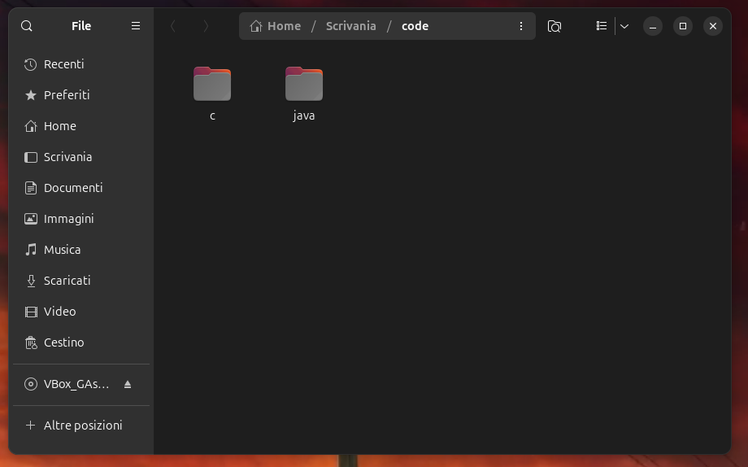

e che ancora, dentro a c:

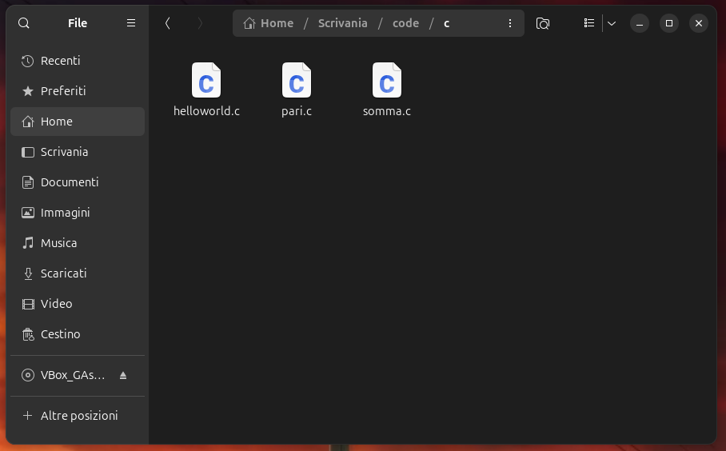

Supponiamo di volerli trovare tutti quanti velocemente, perché non vogliamo usare UI:
il comando find mediante nome, metacaratteri e una print può aiutarci!

Prima ci posizioniamo sulla scrivania con cd, così possiamo mettere "." per indicare che va scandagliata la directory corrente e tutti i suoi sottopath. Il pattern è una stringa, vogliamo tutti i file .c quindi anteponiamo l'asterisco che generalizza. E infine stampiamo.

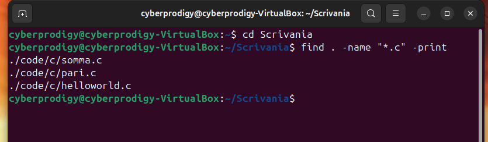

Risultato → elenca tutti i file sorgente C nella directory corrente e sottodirectory.

---
#### **Esempio 2**

Ora vogliamo trovare **tutti i file del sistema** che sono stati **modificati negli ultimi 14 giorni**, senza usare interfacce grafiche o cercare cartella per cartella.  
Il comando `find` permette anche ricerche basate sul **tempo** di modifica, grazie all’opzione `-mtime`.

Scriviamo:

```bash
find / -mtime -14 -ls
```

1. `/`  
    È la directory **root** dell’intero filesystem.  
    Significa: “scansiona tutto il sistema, da / verso il basso”, quindi _tutte_ le directory e sottodirectory (bin, usr, home, var, ecc.).
    
2. `-mtime -14`  
    `mtime` indica il **modification time**, cioè la data dell’ultima modifica del file.  
    L’opzione `-14` significa:
    
    - “cerca i file modificati **meno di 14 giorni fa**”.
        
    
    In `find`, i valori di `mtime` funzionano così:

| Sintassi     | Significato              |
| ------------ | ------------------------ |
| `-mtime -14` | meno di 14 giorni fa     |
| `-mtime 14`  | esattamente 14 giorni fa |
| `-mtime +14` | più di 14 giorni fa      |

3. `-ls`  
    Stampa per ogni file trovato una **riga dettagliata** in stile `ls -l`, con:
    
    - permessi
        
    - proprietario
        
    - gruppo
        
    - dimensione
        
    - data modifica
        
    - path completo
        

##### **Risultato**

Guardate la scrollbar: il risultato è sorprendentemente ampio, dal momento che partiamo dalla root!

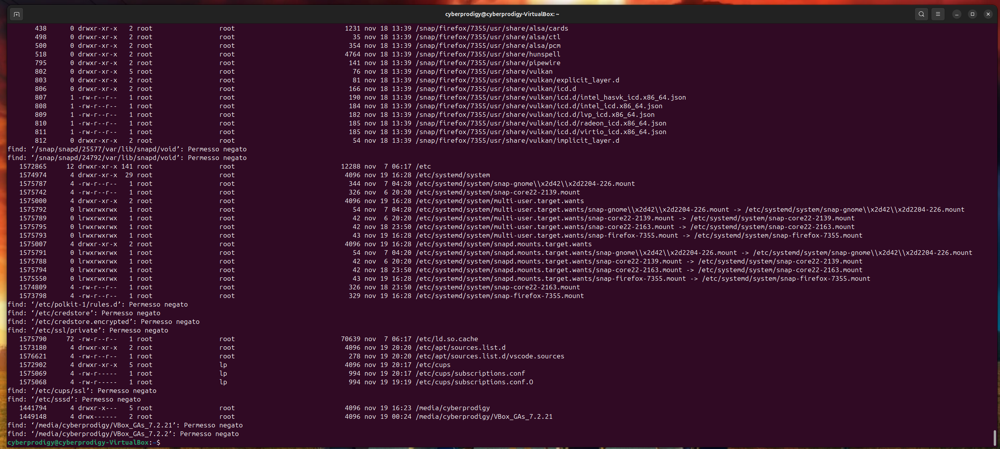

> **“Scansiona ricorsivamente _ogni_ directory e _ogni_ file esistente nel sistema.”**

Il risultato è un numero di linee enorme → **migliaia e migliaia**, ed è normale.

La tua VM Ubuntu avrà almeno:

- directory reali
    
- directory virtuali di sistema (es. `/proc`)
    
- directory montate dalle snap
    
- device
    
- mount point di VirtualBox
    
- directory del sistema package manager (`/var/lib/dpkg`)
    
- file delle librerie
    
- configurazioni (`/etc`)
    
- file temporanei (`/tmp`, `/run`)
    
- home degli utenti
    

…tutto viene elencato.

Per questo vedi la scrollbar immensa: **stai scorrendo l’universo del filesystem**.

---

##### 🔥 **Perché compaiono tanti “Permesso negato”?**

Perché sei un utente normale e molte directory richiedono permessi **root**.

`find` tenta comunque di entrarci → se non può, stampa:

`find: '/etc/cups/ssl': Permesso negato find: '/root': Permesso negato find: '/snap/...': Permesso negato find: '/var/lib/apt/lists/partial': Permesso negato ...`

È normale e voluto.

Se vuoi evitarli devi usare:

###### 🔹 Ignorare gli errori:

`find / 2>/dev/null`

###### 🔹 Oppure lanciare con privilegi:

`sudo find /`

---

##### 🔥 **Perché vedi le directory di Snap?**

La tua VM usa pacchetti Snap (Firefox, Gnome Software ecc.).

Ogni app snap è montata in una specie di “mini root filesystem”:

`/snap/firefox/... /snap/gnome-3-...`

Snap crea **tanti punti di montaggio** (li vedi anche in `mount` o `df`), e `find` li attraversa.

---

##### 🔥 **Perché compaiono directory come `/proc` e `/sys`?**

Sono directory _virtuali_, non reali:

- `/proc` mostra la struttura dei processi
    
- `/sys` contiene info sul kernel e sui dispositivi
    
- `/run` contiene dati runtime
    

Sono directory **auto-generate** dal kernel, non stanno su disco.

`find` le attraversa, ma molte sono protette → di nuovo: _Permesso negato_.

---

##### 🔥 **Perché alcuni file sembrano “strani”, con nomi lunghissimi?**

Tipico dei mount Snap. Es.:

`/etc/systemd/system/snap-gnome...`

stai vedendo i punti di montaggio automaticamente creati per ogni snap installato.

---

##### 🔥 **Perché tutto questo sembra così caotico?**

Perché stai vedendo:

- filesystem reali
    
- link simbolici
    
- file virtuali
    
- mount point
    
- device
    
- directory root
    
- overlay di Snap
    
- iso di VirtualBox montata in `/media/cyberprodigy`
    

È normale che sembri un “wall of text”.

È l’intero Linux… **dentro un unico comando**.

---

##### 🔥 Perché le linee sono così tante?**

Perché anche solo un sistema base Ubuntu ha:

- **+200.000 directory virtuali** in `/proc` e `/sys`
    
- **+100.000 file** sotto `/usr`
    
- **pacchetti snap montati** (ognuno con centinaia di file)
    
- directory di VirtualBox guest additions (`/media/...`)
    
- file di `systemd` (migliaia di unit)
    
- configurazioni varie
    

È **assolutamente tutto**.

---

##### **🔍 Note pratiche**

- Devi lanciare questo comando **con privilegi elevati**, altrimenti alcune directory sistemiche daranno errori di permessi:
    

```bash
sudo find / -mtime -14 -ls
```

- È utilissimo in informatica forense per capire **quali file sono cambiati recentemente**, individuare attività sospette, verificare nuovi file creati da programmi, malware o utenti.
    

---

#### **Esempio 3 – Eliminare tutti i file `.bak`**

```bash
find . -name "*.bak" -ls -exec rm {} \;
```

- `find .`  
    Cerca _a partire dalla directory corrente_.
    
- `-name "*.bak"`  
    Seleziona solo i file che finiscono con `.bak`.
    
- `-ls`  
    Per ogni file trovato, mostra informazioni dettagliate (simile a `ls -l`).
    
- `-exec rm {} \;`  
    Esegue il comando `rm` **su ogni file trovato**.
    
    - `{}` = segnaposto che rappresenta _il file corrente_
        
    - `\;` = chiude il comando `-exec` (va escapato!)
        

##### **Tradotto:**

> “Trova tutti i `.bak` nella directory corrente e sotto-directory, stampali a schermo e cancellali uno per uno.”

---

> In ambito forense, `find` è cruciale per individuare **file nascosti, modifiche recenti o elementi cancellati**.

---

### **8. Il comando `xargs`**

`xargs` costruisce e lancia comandi a partire da una lista di argomenti forniti su **stdin**.

```bash
xargs comando
```

Esempio:

Supponiamo di avere due file di log fatti ad hoc con VSCode...

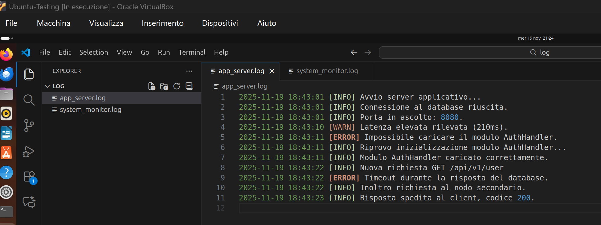

Tali due file sono in una dir specifica:

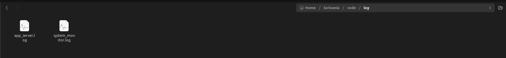

Ora apriamo la shell:
innanzitutto dobbiamo cercare, quindi la prima parte del comando, prima della pipe | è un semplice find come quello di poco fa.
Dopodiché | e mettiamo xargs, seguito dal comando che vogliamo impartire su tutti i risultati della ricerca.

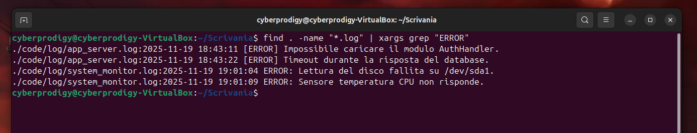


---

### ⭐ **9. Digressione importantissima: pipe, grep e i flussi della shell (stdin e stdout)**

A questo punto conviene fare una **piccola ma fondamentale digressione**, perché nel comando appena eseguito compaiono due elementi che useremo ovunque nella shell:  
la **pipe `|`** e il comando **`grep`**.  
Per capirli bene, è essenziale spiegare come funziona il meccanismo dei **flussi** nella shell Unix.

---

#### 🔥 **stdin e stdout: come viaggia l’informazione nella shell**

Ogni comando della shell produce e riceve dati tramite tre “canali”:

- **stdin** → standard input  
    È il canale da cui il comando _riceve_ i dati.
    
- **stdout** → standard output  
    È il canale su cui il comando _scrive_ il suo output (quello che normalmente vediamo sul terminale).
    
- **stderr** → error output  
    Canale separato per i messaggi di errore.
    

Per ora ci interessano **stdin** e **stdout**, perché sono quelli che la pipe collega.

---

#### 🔥 **La pipe `|` collega stdout del primo comando a stdin del secondo**

Quando scriviamo

```bash
comando1 | comando2
```

accade questo:

- `comando1` genera un output e lo scrive su **stdout**
    
- la pipe `|` intercetta quello stdout
    
- lo passa direttamente come **stdin** a `comando2`
    

In altre parole:

> **La pipe è un “tubo” che collega due comandi senza passare da file intermedi.**

È il concetto più potente dell’intera shell.

---

#### 🔥 **`grep`: il filtro testuale della shell**

Ora inseriamo `grep`.

`grep` è un comando che **filtra righe**, mostrandoti solo quelle che contengono un certo pattern.

Esempio:

```bash
grep "ERROR"
```

Significa:

> “Prendi tutto quello che arriva su stdin e tieni solo le righe che contengono ‘ERROR’.”

Per questo `grep` funziona benissimo nelle pipe.

---

#### 🔥 **La pipeline completa del tuo comando**

Quando hai scritto:

```bash
find . -name "*.log" | xargs grep "ERROR"
```

succede questo:

##### ① `find` produce una lista di file → **stdout**

Esempio:

```
./code/log/app_server.log
./code/log/system_monitor.log
```

##### ② La pipe `|` prende quello stdout → **lo passa come stdin**

##### ③ `xargs` costruisce il comando:

```
grep "ERROR" file1 file2 file3...
```

##### ④ `grep` riceve input (da file) e filtra solo le righe che contengono “ERROR”

Il risultato finale che vedi sul terminale (stdout di grep):

```
./code/log/app_server.log:2025-11-19 18:43:11 [ERROR] Impossibile caricare il modulo AuthHandler.
./code/log/app_server.log:2025-11-19 18:43:22 [ERROR] Timeout durante la risposta del database.
./code/log/system_monitor.log:2025-11-19 19:01:04 ERROR: Lettura del disco fallita su /dev/sda1.
./code/log/system_monitor.log:2025-11-19 19:01:09 ERROR: Sensore temperatura CPU non risponde.
```

---

#### ⭐ **Come funziona l’“ecosistema” find → pipe → xargs → grep**

- `find` → _cerca i file_
    
- `|` → _collega i comandi passando i risultati_
    
- `xargs` → _trasforma la lista in una chiamata multipla a grep_
    
- `grep` → _filtra i contenuti testuali_
    

Tutti comunicano tramite **stdin** e **stdout**.
Grazie alla pipe e a `grep`, comandi semplicissimi diventano catene potentissime capaci di analizzare log, filtrare output, combinare strumenti e automatizzare praticamente qualsiasi controllo testuale nella shell.

---

### **9. Comandi per la gestione del testo**

#### **cat**

`cat` deriva da **concatenate**, cioè _concatenare, mettere uno dopo l’altro_.

In Unix storico veniva usato principalmente per **concatenare** più file e stamparli come un’unica sequenza sullo **standard output** (di solito il terminale). ATTENZIONE PERCHE'...

##### ✔ **Oggi lo usiamo anche per…**

- visualizzare rapidamente un file
    
- creare file redirezionando lo standard input
    
- pipe verso altri comandi (es. `cat file | grep parola`)
    

…ma la radice rimane sempre: **concatenate**.

##### ✔ **Perché continua a chiamarsi `cat` anche se gli passi un solo file?**

Perché **il nome non descrive il caso d’uso moderno**, ma **la funzione originaria** del comando Unix.

`cat` nasce nella primissima Unix come _concatenatore di file_.  
Il suo compito era:

1. prendere più file,
    
2. **fonderli** insieme,
    
3. mandarli sullo standard output come un unico flusso.
    

Il fatto che _oggi_ lo si usi quasi sempre per “visualizzare un file” è un effetto collaterale: è comodo, veloce, semplice da ricordare.

##### ✔ **Se gli passi un solo file, che succede?**

Non concatena nulla, ovviamente, perché c’è un solo input.  
**Ma la definizione generale rimane valida**:

> “Prende l’input e lo manda sullo standard output”.  
> Se l’input è composto da un solo file, fine.

##### ✔ Quindi:

- etimologicamente: **cat = concatenate**
    
- funzionalmente oggi: **view**, “dump”, “print”
    
- tecnicamente: **stream di input → stream di output**
    

Ed è per questo che nonostante molte persone lo usino come “visualizzatore di file”, il nome resta quello originale.

##### **Esempi:**

Partiamo dall'esempio piu facile...
Abbiamo due .txt in una folder qualsiasi sulla Scrivania...

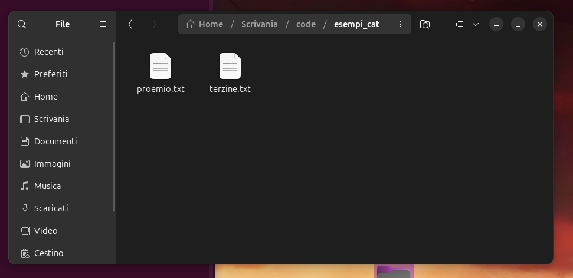

Ma allora da shell basta che ci posizioniamo al medesimo livello e...

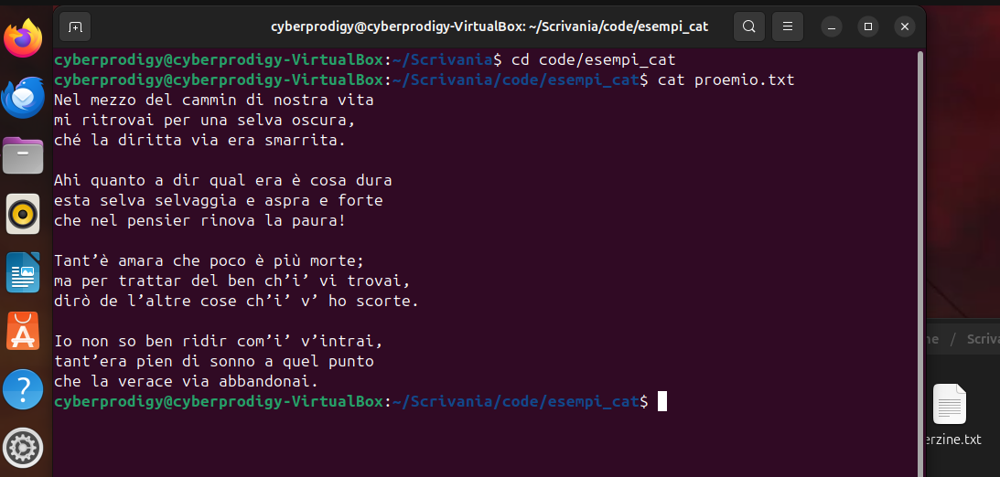

Come vedete è immediato. Possiamo fare di meglio, applicando quanto abbiamo imparato finora per cercarlo a partire dalla scrivania:

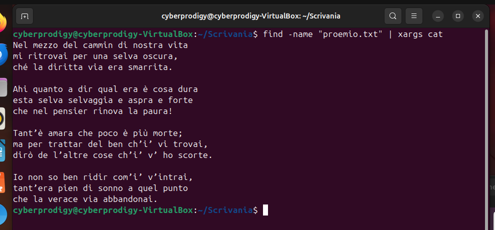

Possiamo fare ancora di meglio: concateniamo entrambi i file:

##### ✔ **Metodo 1 — Concatenazione diretta con redirezione (`>`)**

Dal tuo `~/Scrivania/code/esempi_cat`:

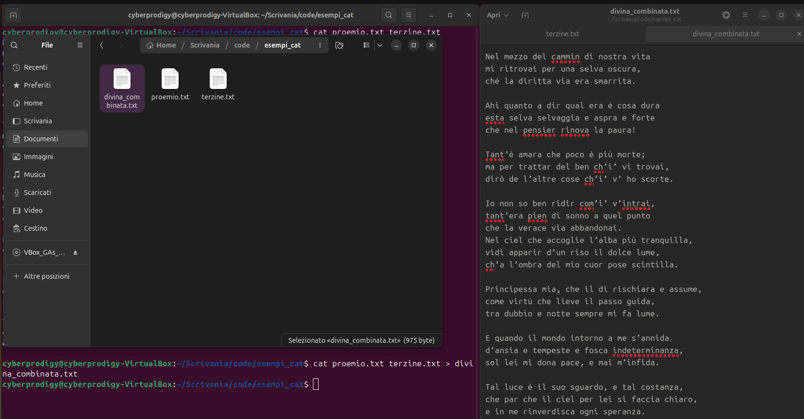

###### ✔ **Cosa fa?**

- `cat` legge **in ordine**:
    
    1. `proemio.txt`
        
    2. `terzine.txt`
        
- li concatena in un unico flusso,
    
- `>` **crea** un file nuovo che contiene quel flusso.
    

###### ✔ **Se il file esiste già?**

`>` lo sovrascrive completamente.

---

##### ✔ **Metodo 2 — Append (aggiungere _dopo_ un file esistente)**

Se vuoi **aggiungere** il contenuto alla fine di un file esistente:

```bash
cat proemio.txt terzine.txt >> divina_combinata.txt
```

###### ***Differenza:***

- `>` → crea/sovrascrive
    
- `>>` → aggiunge (append)
    

---

##### ✔ ***Metodo 3 — Concatenazione trovando i file automaticamente***

Dalla directory superiore:

```bash
find . -name "*.txt" | xargs cat > combinato.txt
```

Conta molto in forense.

---

##### ✔ ***Metodo 4 — Con intestazione per distinguere l’origine***

Utile quando vuoi mantenere tracciabilità:

```bash
(
  echo "===== proemio.txt ====="
  cat proemio.txt
  echo
  echo "===== terzine.txt ====="
  cat terzine.txt
) > divina_annotata.txt
```

---

##### ✔ **Verifica**

Per controllare il risultato:

```bash
cat divina_combinata.txt
```

Un'ultima nota: con cat + pipe + grep possiamo ad esempio individuare quando Dante dice "Selva" nei primi versi...
E' **uno degli usi più potenti** della pipeline Unix.

---

##### ✔ **Metodo 1 — cat + pipe + grep (classico)**

Dal tuo `~/Scrivania/code/esempi_cat`:

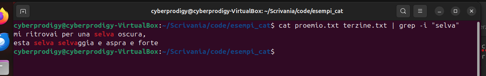
###### ✔ **Cosa succede?**

- `cat` concatena i file in un unico flusso.
    
- `|` (pipe) manda quel flusso a `grep`.
    
- `grep -i "selva"` cerca “selva” ignorando maiuscole/minuscole.
    

---

##### ✔ **Metodo 2 — Senza cat (grep direttamente su più file)**

Unix moderno preferisce:

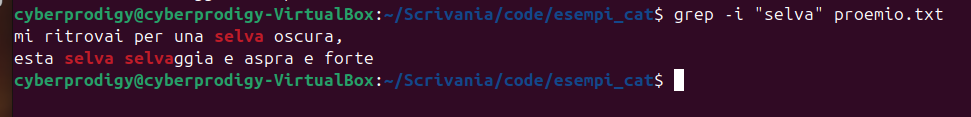

Fa lo stesso lavoro e stampa anche il **nome del file** in caso cerchiamo in più di uno e troviamo corrispondenze in più di uno.

---

##### ✔ **Metodo 3 — Usando find (utile quando i file sono ovunque)**

Dalla Scrivania:

```bash
find . -name "*.txt" -print0 | xargs -0 grep -i "selva"
```

---

##### ✔ **Metodo 4 — Mostrare il numero di riga (utile per analisi testuale)**

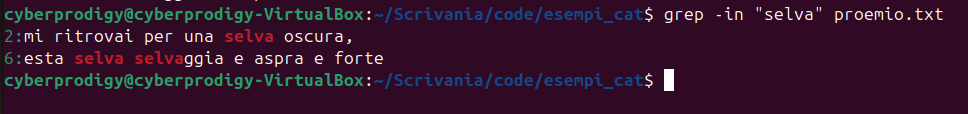

---

##### ✔ **Promemoria didattico (fondamentale per capire la pipe)**

- **stdin → stdout**: `cat` prende input e lo “sputa fuori”.
    
- La pipe `|` aggancia **lo stdout del primo comando allo stdin del secondo**.
    
- `grep` usa quel flusso come se fosse un file.
    

È letteralmente una **catena di processi** che si passano un flusso di testo in tempo reale.

---


#### **tac**

Come `cat`, ma inverte l’ordine delle righe (da ultima a prima).
Non mi dilungo troppo per ora...

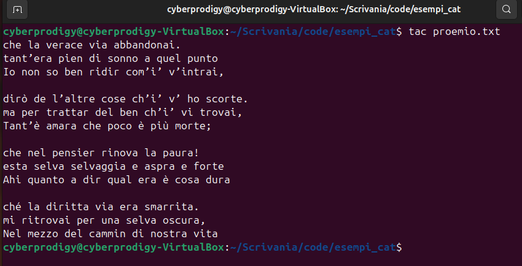


#### **rev**

Inverte i caratteri di ogni riga:

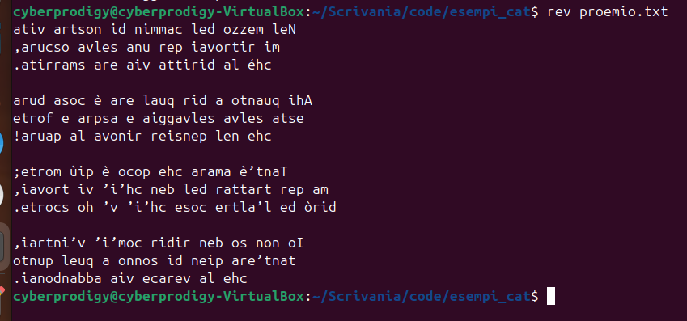

#### **head e tail**

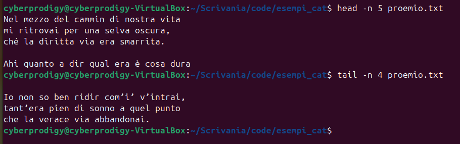

Se non usufruiamo dell'opzione -n:

```bash
head file.txt
```

oppure

```bash
tail file.txt
```

allora:

- `head` mostra **le prime 10 righe**
    
- `tail` mostra **le ultime 10 righe**
    

Il **default è 10**, ed è lo stesso da oltre 40 anni di Unix.

Quindi **non sei obbligato** a usare `-n`.

---

Quando vuoi un numero specifico di righe devi usare:

```bash
head -n 5 file.txt
```


```bash
tail -n 20 file.txt
```

##### **Equivalenti abbreviati (molto usati dagli admin Unix):**

```bash
head -5 file.txt
tail -20 file.txt
```

Quindi `-n` è _opzionale_, ma:

- `-n 5`
    
- `-5`  
    sono la stessa cosa.
    

Esempio concreto:

```bash
head -n 3 proemio.txt
# oppure
head -3 proemio.txt
```

---

##### ✔ **Quando è meglio NON usare il default**

Nella pratica quotidiana, si usa quasi sempre `-n`, perché:

- dà **controllo preciso**,
    
- evita confusione quando ripassi comandi vecchi,
    
- è più leggibile in uno script (“10 linee? o 5?”).
    

Molti admin scrivono sempre:

```bash
head -n 20 file
tail -n 50 file
```

anche quando vogliono proprio 10, perché è esplicito.

---

##### ✔ **Con aggiunte utili, ad esempio per vedere cosa sta succedendo in un log**

```bash
tail -n 50 -f /var/log/syslog
```

- `-n 50` → mostra le ultime 50 righe
    
- `-f` → “segue” in tempo reale, come `tail -f`
    

---


#### **cut**

Estrae colonne o campi da file CSV:

I **file CSV** sono uno dei formati più semplici e universali per memorizzare dati in forma tabellare.  
CSV significa **Comma-Separated Values**, cioè _valori separati da virgola_.  
È un semplice **file di testo** in cui ogni riga rappresenta una riga di una tabella, e i valori dentro una riga sono separati da un carattere (spesso una virgola, a volte un punto e virgola).

Esempio banalissimo di contenuto CSV:

```
Nome,Cognome,Età
Mario,Rossi,25
Elon,Musk,54
Samu,Cyber,22
```

Questo è un CSV: niente magia. Solo testo.
È nato per un motivo preciso: **scambiare dati tra programmi diversi** senza dipendere da formati complessi (Excel, database, applicazioni specifiche ecc.).
Funziona ovunque perché è solo testo.

Un file CSV ha due concetti fondamentali:

##### 1) **Righe**

Ogni riga corrisponde a un record della tabella.  
Es: una persona, un prodotto, un log.

##### 2) **Separatore**

Il carattere che separa i campi.  
Di solito è:

- `,` virgola (standard internazionale)
    
- `;` punto e virgola (molto usato in Italia)
    
- `\t` tabulazione (diventa TSV, Tab-Separated Values)
    

---

##### **Perché CSV è ovunque**

Perché è:

- **universale** (qualsiasi linguaggio lo legge: C, Java, Python…)
    
- **semplice** (solo testo)
    
- **leggero** (non ha formattazioni)
    
- **compatibile con Excel**, Google Sheets, database, strumenti di analisi…
    

---

##### **Usi classici**

- Import/export da **Excel**
    
- Import/export da **database**
    
- Log di sistemi
    
- Dataset per machine learning
    
- Scambio dati tra software diversi
    
- Configurazioni semplici
    

---

##### **Cosa NON è**

- Non è un foglio Excel (nessuna formattazione)
    
- Non supporta colori, celle unite, formule
    
- Non ha tipi di dato (tutto è testo)
    

---

##### **Una cosa importante**

Se un campo contiene una virgola, si mette tra **virgolette**:

```
Nome,Note
"Principessa","Ama la pizza, la musica e il Principe"
```

---

##### 🔥 **Spiegazione ultra-chiara di `cut`**

###### **1) L’opzione `-d`**

`-d` significa **delimiter**, cioè **separatore** dei campi.

Nel CSV i campi sono separati da una **virgola**, quindi scrivi:

```
-d ','
```

Perché gli **apici singoli?**  
Perché nella shell i caratteri speciali è meglio racchiuderli tra apici, così la shell non li interpreta.  
La virgola **non è speciale**, ma si usa per sicurezza e buona pratica.

---

###### **2) L’opzione `-f`**

`-f` significa **fields**, cioè **quali campi vuoi estrarre**.

- `-f 1` → il primo campo
    
- `-f 2` → il secondo
    
- `-f 2,3` → il secondo e il terzo
    
- `-f 1-3` → dal primo al terzo
    
- `-f 2-` → dal secondo all’ultimo
    

💡 _Importante:_ `cut` numera i campi **a partire da 1**, non da 0.

---

###### **3) I numeri dopo `-f`**

Specificano **quali colonne del CSV** vuoi "tagliare" e stampare.

Esempio CSV:

```
ID,Nome,Cognome,Email,Età
```

- `-f 1` → ID
    
- `-f 2` → Nome
    
- `-f 3` → Cognome
    
- `-f 4` → Email
    
- `-f 5` → Età
    

---

###### **4) L’opzione `--complement`**

Significa:  
👉 **prendi tutto tranne i campi indicati**.

Esempio:

```
cut -d ',' -f 1 --complement utenti.csv
```

Vuol dire:  
"Togli il campo 1, e stampa tutti gli altri."

---

##### **ESEMPIO:**

Ecco un **CSV semplice, realistico e perfetto per testare `cut`**.  
Lo puoi copiare-incollare direttamente in un file chiamato ad esempio `utenti.csv`.

```
ID,Nome,Cognome,Email,Età
1,Samuele,Corra,samu@example.com,19
2,Elon,Musk,elon.musk@example.com,54
3,Mario,Rossi,mario.rossi@example.com,25
4,Luca,Bianchi,luca.bianchi@example.com,22
```


###### 1) Estrai solo il Nome

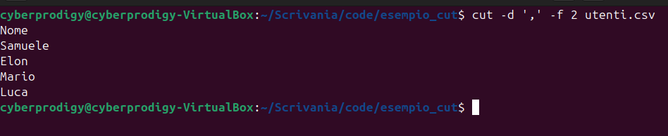

###### 2) Estrai Nome + Cognome

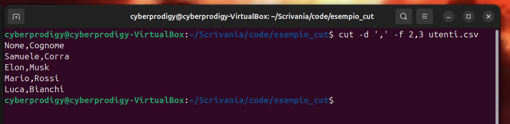

###### 3) Estrai Email

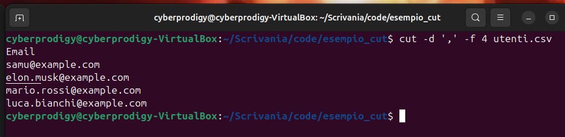

###### 4) Estrai tutto tranne l’ID (con `--complement`)

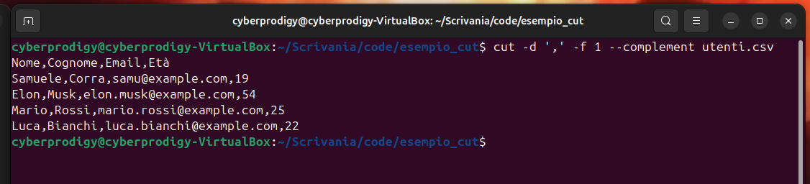

---

#### **expand / unexpand**

Convertitori tra tabulazioni e spazi:

- `expand file` → tab in spazi
    
- `unexpand file` → spazi in tab
    

`expand` e `unexpand` sono **due comandi molto utili** quando lavori con file di testo _strutturati_, soprattutto quando devi mantenere un allineamento perfetto delle colonne.

---

##### 🔥 **A cosa serve _davvero_ `expand`?**

`expand` converte **tabulazioni → spazi**.

Perché farlo?

Perché **tab** non ha larghezza fissa: può valere 4 spazi, 8 spazi, dipende dalla configurazione del terminale o dell’editor.  
Gli spazi invece hanno sempre lo stesso "peso".

👉 **Usalo quando devi avere un allineamento stabile e identico ovunque.**

E' utile in...

###### **1) File di log o output di comandi**

Molti comandi usano tab per separare colonne:

```
PID     USER    COMMAND
1220    root    sshd
1221    samu    bash
```

Se vuoi convertirli in un formato stabile per analisi (grep, cut, awk), fai:

```
expand logs.txt
```

Così ottieni spazi veri e il testo diventa più prevedibile.

---

###### **2) File che devi confrontare con `diff`**

Se due file hanno tab con configurazioni diverse, il confronto risulta confusionario.

`expand` li normalizza e li rende confrontabili.

---

###### **3) File da incollare in editor diversi (nano, vim, vscode, ecc.)**

Ogni editor interpreta il TAB con ampiezze diverse.  
Converti i tab in spazi e ottieni un testo che _non si deforma_.

---

##### 🔥 **A cosa serve _davvero_ `unexpand`?**

`unexpand` fa il contrario:

👉 **spazi → tabulazioni**

In quali casi è utilissimo?

###### **1) Per ridurre le dimensioni di un file enorme**

Un tab = 1 byte  
Quattro spazi = 4 byte  
Su file giganti (log, dataset, ecc.) puoi risparmiare molto.

```
unexpand -a logs.txt > logs_tab.txt
```

---

###### **2) Per ri-formattare codici o file con colonne regolari**

Ad esempio tabelle fatte a mano con spazi:

```
ID    NOME    COGNOME
1     Samu    Corra
2     Jacopo  Lazzarini
```

Puoi convertirle in tab, più pulite e compatte:

```
unexpand -a tabella.txt
```

---

###### **3) Per rendere un file più leggibile al terminale**

L’occhio umano legge meglio colonne separate da tab che da troppi spazi.  
Molti sysadmin preferiscono i tab.

|Comando|Fa cosa?|Serve quando?|
|---|---|---|
|**expand**|TAB → SPAZI|Quando vuoi _allineamento stabile_, usare `cut/awk`, confrontare file, incollare in editor diversi|
|**unexpand**|SPAZI → TAB|Quando vuoi _risparmiare spazio_, alleggerire file grandi, avere colonne leggibili|

---

#### **uniq**

Rimuove righe duplicate consecutive.

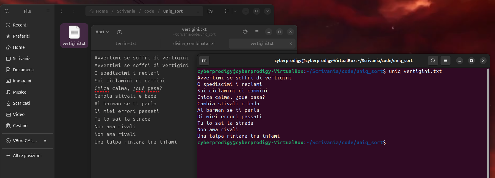
#### **sort**

Ordina righe alfabeticamente o numericamente.

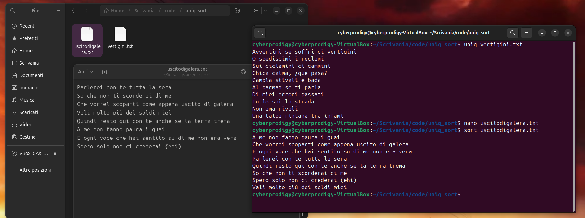

---

`uniq` _da solo_ elimina **solo** le righe duplicate **consecutive**.  
Se le righe duplicate NON sono una attaccata all’altra, `uniq` non le vede proprio.

💡 **La soluzione universale è combinarlo con `sort`.**

---

##### 🔥 **Perché usare `sort` + `uniq`**

- `sort` **riordina tutto il file**, mettendo le righe uguali una di fianco all’altra.
    
- `uniq` può finalmente eliminarle, perché ora sono **consecutive**.
    

È tutto qui.  
Una pipeline semplicissima ed estremamente potente.

---

##### ✔️ **Comando finale**


`sort file.txt | uniq`


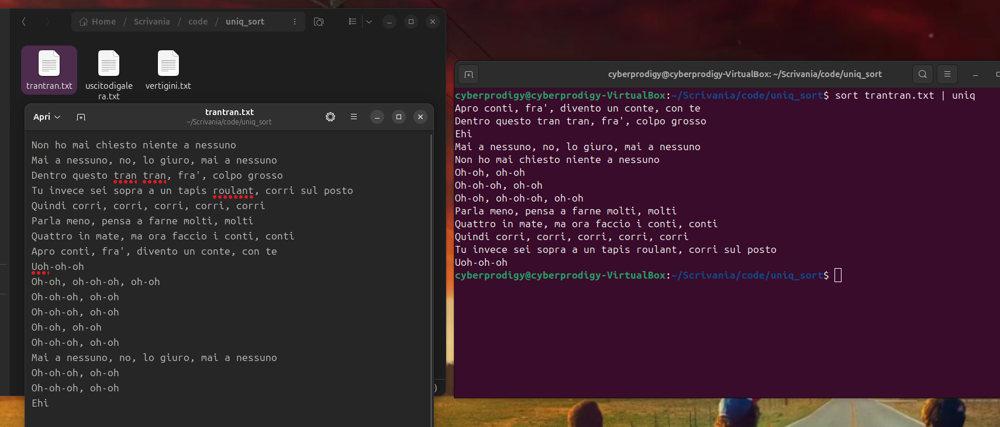

Cosa fa:

1. `sort file.txt` → ordina le righe
    
2. `uniq` → elimina le righe duplicate ora che sono consecutive
    

---

##### 🔥 **Variante più completa: vedere quante volte compaiono**

```
sort nomi.txt | uniq -c
```

Output:

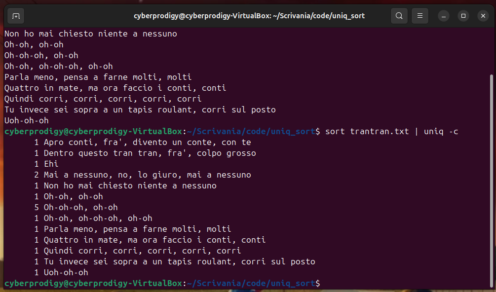

---

##### 🔥 **Variante che mantiene l’ordine originale (avanzata)**

Se vuoi eliminare i duplicati **senza** riordinare alfabeticamente il file:

```
awk '!seen[$0]++' nomi.txt
```

Ma questa è un’altra storia — il classico per l’esame è **sort | uniq**.

---

#### **wc (word count)**

```bash
wc -l | -w | -c file
```

`wc` è un comando che **analizza un file** e ti dice:

- quante **righe** contiene
    
- quante **parole** contiene
    
- quanti **caratteri** contiene
    

È come mandare in missione una squadra di supereroi a fare ricognizione.

La sintassi base:

```
wc -l file   # conta le righe
wc -w file   # conta le parole
wc -c file   # conta i caratteri
```

---

##### 🦸‍♂️ **1) `wc -l`: il Captain America delle righe**

Captain America è disciplinato, ordinato e… conta ogni riga come se fosse una formazione in battaglia.

```
wc -l avengers.txt
```

Output:

```
12 avengers.txt
```

→ Significa: ci sono 12 righe nel file.

---

##### 🦸‍♀️ **2) `wc -w`: Black Widow che individua ogni parola**

Black Widow è precisa, veloce, e analizza ogni parola come se stesse smontando una spia nemica pezzo per pezzo.

```
wc -w avengers.txt
```

Output:

```
48 avengers.txt
```

→ Il file contiene 48 parole totali.

---

##### 🔥 **3) `wc -c`: Iron Man che misura ogni byte**

Iron Man è il genio tecnologico: scansiona il file e ti dice **esattamente quanti byte occupa** (e quindi quanti caratteri).

```
wc -c avengers.txt
```

Output:

```
256 avengers.txt
```

→ Il file contiene 256 caratteri (byte).

---

##### 🛡️ **4) `wc file` — tutta la squadra insieme**

Se lanci `wc` senza opzioni, ti arrivano **tutti i dati insieme**:

```
wc avengers.txt
```

Output esempio:

```
12 48 256 avengers.txt
```

Che significa:

- 12 righe
    
- 48 parole
    
- 256 caratteri
    

---

Immagina un file chiamato `shield_report.txt`:

```
Nick Fury recruits new agents
Black Widow infiltrates Hydra base
Tony upgrades his armor
Thor smashes enemy forces
```


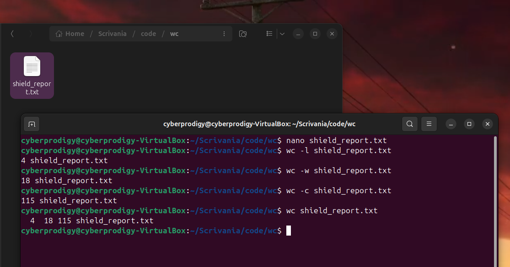

---


#### **tr (translate/transliterate)**

Converte o elimina caratteri in base a ciò che l'utente desidera, ma deve definire le regole che vuole siano rispettate:

```bash
tr A-Z a-z < testo.txt    # minuscole
tr -d 0-9 < testo.txt     # rimuove numeri
```

##### 🔥 **Sintassi generale di `tr`**

La forma base è:

```
tr SET1 SET2
```

Significa:

- prendi i caratteri di **SET1**
    
- trasformali nei corrispondenti caratteri di **SET2**
    

Entrambi i set devono avere **la stessa lunghezza**, perché `tr` sostituisce carattere-per-carattere.

Esempi:

```
tr A-Z a-z     # A→a, B→b, C→c, ... Z→z
tr 0-9 X       # ogni cifra diventa 'X'
```

---

##### 🔥 **Con `< file` o pipe**

`tr` **non prende file come argomenti**.  
Legge **solo dallo stdin**.

Quindi devi usare:

```
tr A-Z a-z < file.txt
```

oppure

```
cat file.txt | tr A-Z a-z
```

oppure inserirci una stringa:

```
echo "CIAO" | tr A-Z a-z
```

---

##### 🔥 **Opzione `-d`: elimina caratteri**

```
tr -d 0-9       # rimuove tutte le cifre
tr -d ' '       # rimuove tutti gli spazi
tr -d 'aeiou'   # rimuove le vocali
```

`-d` = **delete mode**

Quando usi `-d` metti **un solo set**, quello da eliminare.

---

##### 🔥 **Range e classi predefinite**

Puoi usare:

- `A-Z` → tutte le maiuscole
    
- `a-z` → tutte le minuscole
    
- `0-9` → tutte le cifre
    

Oppure le classi POSIX:

- `[:lower:]`
    
- `[:upper:]`
    
- `[:digit:]`
    
- `[:alpha:]`
    
- `[:space:]`
    

Esempio:

```
echo "Principessa 123" | tr -d '[:digit:]'
```

---

##### 🔥 **Perché è utile per rinominare tanti file?**

Perché puoi “pulire” o “trasformare” nomi di file usando `tr` dentro un ciclo.

Esempio: voglio trasformare tutti gli spazi in underscore nei nomi di file:

```
for f in *; do
    mv "$f" "$(echo "$f" | tr ' ' '_')"
done
```

Oppure rendere tutto minuscolo:

```
for f in *; do
    mv "$f" "$(echo "$f" | tr A-Z a-z)"
done
done
```

`tr` diventa un _convertitore_ che ti genera al volo nuovi nomi puliti.


---

### **10. Script d’esempio: filenames-to-lowercase**

Esempio di script per rinominare tutti i file della directory in minuscolo:

```bash
#!/bin/bash
# Cambia ogni filename nella directory corrente in minuscolo.

for filename in * ; do
  fname=`basename $filename`
  n=`echo $fname | tr A-Z a-z` # si noti il tr
  if [ "$fname" != "$n" ] ; then
    mv "$fname" "$n"
  fi
done
exit 0
```

Questo semplice script mostra come **integrare comandi di manipolazione testo e controllo logico** per automatizzare operazioni complesse. Non scandalizzatevi se non lo commento, non siamo ancora pronti ad affrontarlo con cognizione di causa ergo rimando alla vera parte di corso di scripting, qui stiamo ancora passando i rassegna in comandi, procediamo con calma ed ordine...

---

### **11. Confronto di file e directory**

#### **`cmp`**

Confronta due file byte per byte:

```bash
cmp file1 file2
```

Restituisce `true` se identici, `false` se diversi, ovvero ricordiamo code 0 e code 1
Se il contenuto è identico, dalla shell non vediamo nulla:

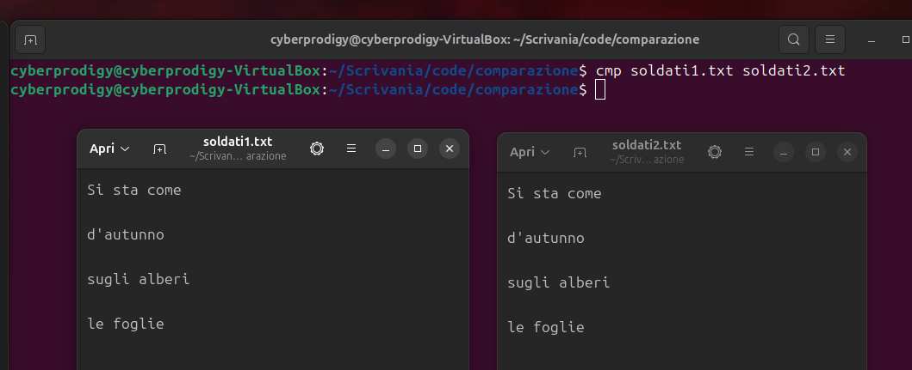

ma allora facciamo `echo $?`, che è **la stampa dell’exit code dell’ultimo comando eseguito**.

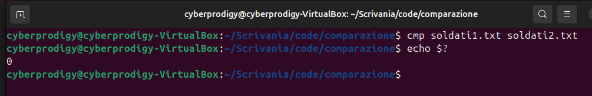

Ci dà 0, che è coerente con l'identicità dei contenuti! TUTTO OK!

Se nel secondo file togliamo anche solo **una lettera** da “foglie”, `cmp`:

- confronta i file **byte per byte**
    
- trova la **prima differenza**
    
- **si ferma subito**
    
- e ti stampa a schermo _esattamente dove_ ha trovato la non-corrispondenza.

Togliamo due lettere:

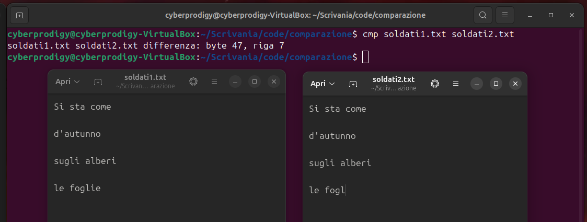

Con -s come flag possiamo evitare la stampa di incongruenza


---

#### **`diff`**

`diff` confronta **due file di testo** e ti dice **in che cosa differiscono**:

```bash
diff file1 file2
```

Non confronta solo “uguali/diversi” come `cmp`, ma ti mostra **le righe cambiate, aggiunte o cancellate**.

Ogni comando in Unix, quando finisce, restituisce un **codice di uscita** (exit status):

- `0` → successo ✅
    
- `!= 0` → qualcosa non va ❌ (errore, differenze, ecc.)

Nel nostro caso:

- **true (exit status 0) se due file sono uguali**
    
- **false (exit status != 0) se i file hanno almeno un bit di differenza**

Tradotto per `diff`:

- Se i file sono **identici**
    
    - `diff file1 file2` **non stampa nulla**
        
    - l’exit status è `0` → quindi il test in shell vede “true”
        
- Se i file sono **diversi**
    
    - `diff file1 file2` **stampa le differenze**
        
    - l’exit status è **diverso da 0** (di solito `1`) → quindi “false” nel senso logico
        

Puoi vedere il codice di uscita con:

```bash
echo $?
```

subito dopo aver lanciato `diff`.

---

##### **Come si legge l’output di `diff` (forma base)**

Quando i file sono diversi, `diff` fa cose del tipo:

```text
1c1
< riga nel primo file
---
> riga nel secondo file
```

- `1c1` = **linea 1 changed linea 1**
    
- le righe che iniziano con `<` sono prese da **file1**
    
- le righe che iniziano con `>` sono prese da **file2**
    
- `---` è solo un separatore visivo
    

---

##### **Esempio con Dante: “Tanto gentile e tanto onesta pare”**

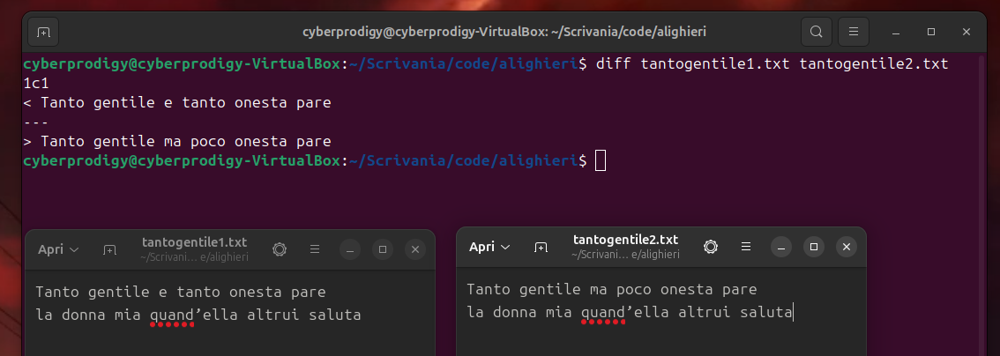

- `1c1` → la **riga 1** del primo file è **cambiata** rispetto alla **riga 1** del secondo
    
- dopo `<` hai la riga del **primo** file
    
- dopo `>` hai la riga del **secondo** file
    
- vedi esattamente _come_ è stata modificata la riga

---

##### **Controlla l’exit status

Subito dopo:

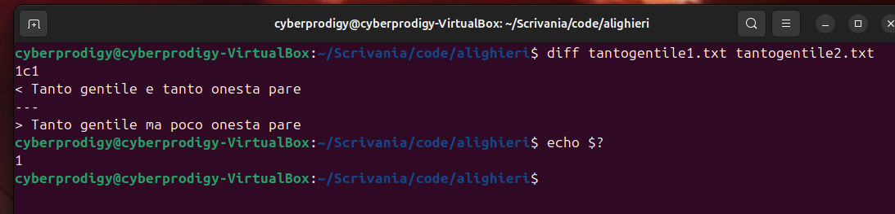

→ i file sono **diversi** (quindi “false”);

---

##### **Caso in cui sono identici**

Se rendi `dante2.txt` **identico** a `dante1.txt` e rilanci:

```bash
diff dante1.txt dante2.txt
```

- **non viene stampato nulla**
    
- poi:
    

```bash
echo $?
```

ti dà:

```text
0
```

→ significa: nessuna differenza trovata (true / successo).

---

##### **diff può confrontare anche directory intere**

Oltre ai file, `diff` può confrontare **due directory**:

```bash
diff dir1 dir2
```

In questo caso:

- controlla **tutti i file** contenuti nelle due directory
    
- confronta le versioni che hanno lo **stesso nome**
    
- **se un file esiste solo in una delle due directory**, lo segnala subito
    

Il risultato è un elenco dei file:

- modificati
    
- aggiunti
    
- mancanti
    
- diversi nel contenuto
    

Esempio tipico:

```text
Only in dir1: appunti.txt
Files dir1/codice.c and dir2/codice.c differ
Only in dir2: esercizio.java
```

---

### **12. Comandi per la gestione dei file**

#### **locate / slocate / updatedb**

In Linux esistono due modi per cercare file:

1. **Modo lento ma sempre aggiornato** → `find` (cerca davvero dentro il disco, ogni volta).
    
2. **Modo super-veloce** → `locate` (non cerca sul disco, ma legge un **database** già pronto).

Vediamo ora i modi veloci!

---

##### 🔧 **1. `updatedb` – Il costruttore del “libro magico”**

`updatedb` è il comando che **costruisce** o **aggiorna** un grande elenco di tutti i file presenti sul sistema.

Immagina che il tuo computer abbia:

- milioni di file
    
- in migliaia di cartelle
    

Per cercarli velocemente, il sistema crea un **libro-indice** che elenca:  
**“File x si trova nella cartella Y”**.

Quando usi `locate`, questo comando **non va sul disco**:  
apre semplicemente questo **libro-indice** e guarda dentro.

Ma il libro deve essere aggiornato… quindi lo aggiorna **updatedb**.
###### 👉 **Come funziona nella pratica?**

```bash
sudo updatedb
```

Questo:

- scansiona il filesystem
    
- registra tutti i percorsi
    
- li salva nel file `/var/lib/mlocate/mlocate.db` (o simili, dipende dalla distro)

---

##### 🔎 **2. `locate` – Il cercatore velocissimo che usa il libro**

`locate` è un comando che **cerca dentro il database** creato da `updatedb`.

Non esplora il disco.  
Non analizza directory reali.

Apre il database → cerca la stringa → stampa il risultato.

###### 👉 **Conseguenza:**

È **istantaneo**.  
A differenza di `find`, che può impiegare secondi o minuti.

###### 👉 **Esempio semplice:**

```bash
locate foto.jpg
```

Questo cerca nel database tutte le stringhe che contengono “foto.jpg”.

###### **👉 ATTENZIONE:**

Se il file è stato creato _da pochi minuti_ e `updatedb` non è stato ancora lanciato…  
**locate non lo vede**.

---

##### 🛡️ **3. `slocate` – Il vecchio papà di `locate`, più attento alla sicurezza**

`slocate` è una versione più vecchia e più sicura del comando `locate`.

Il suo scopo:  
impedire che un utente senza permessi veda file che **non dovrebbe vedere**.

###### **👉 Problema iniziale**

La versione antica di `locate` mostrava qualsiasi percorso anche se l’utente non aveva permessi → problema di sicurezza.

###### 👉 **Soluzione**

Arriva **slocate**:  
quando cerchi, ti mostra solo i file:

- che effettivamente esistono
    
- a cui l’utente ha accesso
    

###### 👉 **Oggi?**

Quasi tutte le distro moderne hanno unificato le due cose in **mlocate**, che combina:

- velocità di locate
    
- sicurezza di slocate
    

Quindi oggi vedi questi comandi:

- `updatedb` (di mlocate)
    
- `locate` (di mlocate)
    

`slocate` ormai è storico.

---

##### 🌐 **Cos’è _mlocate_ (modern locate)**

**mlocate** significa _Merger Locate_.

È il **successore moderno** dei vecchi `locate` e `slocate`.

La sua idea è molto semplice ma geniale:

> **Unisce la velocità del vecchio `locate` con la sicurezza di `slocate`**,  
> mantenendo un database piccolo, aggiornabile e accessibile a tutti gli utenti del sistema.

---

Prima esistevano due mondi:

- `locate`: velocissimo, ma poco sicuro → un utente vedeva percorsi che non dovrebbe.
    
- `slocate`: sicuro, ma il database diventava pesante e l’aggiornamento era più lento.
    

**mlocate** ha risolto entrambi i problemi.

---
###### 1. **C’è un database centrale**

Per funzionare, mlocate si affida a un database, il cui file principale è:

```
/var/lib/mlocate/mlocate.db
```

Questo file contiene:

- l’elenco dei percorsi dei file del sistema
    
- aggiornato periodicamente
    
- filtrato secondo i permessi

###### 2. **Il database è aggiornato da `updatedb`**

`updatedb` scansiona il filesystem e aggiorna il database.

Nelle distribuzioni moderne, il comando `updatedb` è proprio quello di _mlocate_.

Esempio:

```bash
sudo updatedb
```

###### 3. **`locate` usa quel database**

Il comando `locate` non cerca sul disco, ma apre il database e cerca letteralmente una _stringa_.

Esempio:

```bash
locate pippo.txt
```

Risultato in millesimi di secondo.

---

###### 🛡️ **Sicurezza: la caratteristica fondamentale di mlocate**

`mlocate` mostra all’utente **solo i file che può realmente vedere**.

Se nel database c’è:

```
/root/segretissimo/passwords.txt
```

un utente normale **non lo vedrà**, anche se la stringa esiste nel database.

Questo perché `mlocate` controlla i permessi del filesystem **al momento della consultazione**.

---

###### ⚡ **Vantaggi rispetto ai vecchi locate/slocate**

|Funzione|locate|slocate|mlocate|
|---|---|---|---|
|Cerca velocemente|✔️|✔️|✔️|
|Filtra in base ai permessi|❌|✔️|✔️|
|Database più leggero|❌|❌|✔️|
|Aggiornamento efficiente|❌ (scansiona tutto!)|❌|✔️ (merging intelligente)|

**mlocate** fa un “merge” intelligente del database precedente con la nuova scansione.  
Quindi:

- è più veloce
    
- consuma meno risorse
    
- aggiorna solo ciò che è cambiato
    

---

###### 🧩 **Perché si chiama _Merger locate_?**

Perché non ricostruisce il database da zero ogni volta.

Fa così:

1. legge il vecchio database
    
2. confronta con ciò che trova sul sistema
    
3. aggiorna soltanto ciò che è cambiato
    

Questo processo si chiama **merge**.

---

#### 🧠 `file`

Il comando **`file`** guarda dentro un file e ti dice **che tipo di file è**, indipendentemente dall’estensione.

Tu puoi avere:

- `foto.jpg`
    
- `documento.pdf`
    
- `script.sh`
    
- `video.mp4`
    
- `immagine.docx`
    

Anche se rinomini `foto.jpg` in `pippo.txt`, il comando `file` lo riconosce comunque come **JPEG**.

---

##### 🔍 **Come fa a riconoscerlo? Con il “magic number”**

Ogni tipo di file (JPEG, PDF, ZIP, PNG, ELF, ecc.) inizia con una **firma binaria speciale**, cioè una sequenza di byte specifica, tipica di quel formato.

Questa sequenza si chiama:

> **Magic number**

È come un “codice segreto” che sta all’inizio del file e dice:  
**“Ehi, io sono un file PDF!”**  
**“Ehi, io sono un file PNG!”**

---

##### 🧪 **Esempio di magic number**

- PNG inizia sempre con:
    
    ```
    89 50 4E 47 0D 0A 1A 0A
    ```
    
- PDF inizia con:
    
    ```
    25 50 44 46
    ```
    
    (= %PDF)
    
- JPEG inizia con:
    
    ```
    FF D8 FF
    ```
    
- File eseguibile ELF Linux:
    
    ```
    7F 45 4C 46
    ```
    
    (= “ELF”)
    

---

##### 🧰 **Come funziona il comando `file`?**

Quando tu scrivi:

```bash
file pippo.bin
```

il comando:

1. legge i **primi byte** del file
    
2. li confronta con una lista di magic-number presente nel sistema
    
3. capisce a quale tipo appartiene
    
4. stampa il risultato
    

---

##### 📚 **Dove si trova l’elenco dei magic number?**

> “L’elenco dei magic number si trova in `/usr/share/magic` (o altre posizioni)”

In pratica i file principali sono:

```
/usr/share/magic
/usr/share/magic.mgc
/etc/magic
/etc/magic.mgc
```

Contengono **tutte le firme conosciute**:

- firme per immagini
    
- firme per eseguibili
    
- firme per archivi compressi
    
- firme per documenti
    
- firme per formati sconosciuti
    
- firme rare

---

##### 🧠 **Sintassi

```
file {file}*
```

Questo significa:

- il comando può ricevere **uno o più file**
    
- `{file}*` indica “zero o più file”
    

Esempio:

```bash
file foto.jpg documento.pdf script.sh
```

oppure tutti i file nella directory:

```bash
file *
```

---

##### 🎯 **Perché è importante in informatica forense**

Il comando `file` è fondamentale perché:

1. **Rivela file rinominati apposta per nascondere contenuti**  
    Es: `pornografia.mp4` rinominato in `compiti.txt`.
    
2. Mostra se un file è un **binary ELF**, un **malware**, un **eseguibile**.
    
3. Identifica **file corrotti**.
    
4. È usato per ricostruire frammenti di file nelle **carving procedures** (analisi raw di dischi).
    

---

##### 🧨 **Mini esempio reale**

Il criminale ha sul sistema un video pornografico (abbiate pazienza è il primo video che mi è venuto in mente...)


Essendo competente in maniera informatica... va a nascondere rudimentalmente la semantica del nome, soprattutto cambiando l'estensione nel nome per confondere l'investigatore e sviare le indagini...


Ma...

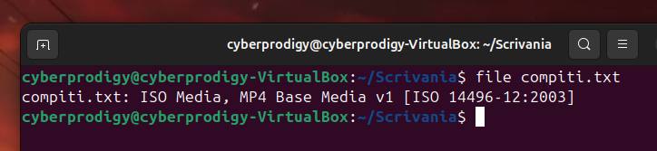

Ergo subito smascherato l'intento di occultare la vera natura del file!

---

##### 📌 **Riassunto ultra-cristallino**

- I **magic number** sono firme binarie presenti all'inizio dei file.
    
- Il comando **`file`** legge queste firme e dice che tipo di file è.
    
- L’elenco delle firme è in `/usr/share/magic` e file correlati.
    
- La sintassi `{file}*` significa che puoi passare **molti file** al comando.
    
- È uno strumento fondamentale anche in forense per identificare file nascosti o camuffati.


---

#### **basename**

Serve per **estrarre il nome finale** di un percorso.

È come dire:  
“Dammi solo _il nome del file_, non tutto il percorso.”

Esempi:

```bash
basename /home/samu/scrivania/code/java/Main.java
```

Output:

```
Main.java
```

Altro esempio:

```bash
basename /etc/passwd
```

Output:

```
passwd
```

---

#### **dirname**

Serve per **estrarre SOLO la directory** che contiene quel file.

È il complementare di basename.

Esempio:

```bash
dirname /home/samu/scrivania/code/java/Main.java
```

Output:

```
/home/samu/scrivania/code/java
```

Altro esempio:

```bash
dirname /etc/passwd
```

Output:

```
/etc
```

---

##### 🟧 **Perché esistono?**

Sono utilissimi quando:

- scrivi script (`bash`)
    
- devi manipolare percorsi in automatico
    
- devi prendere un file e sapere dov’è
    
- devi estrarre nomi di file anche se il path è complicato
    

---

##### 🟨 **Esempi più complessi (super utili)**

###### **Path con slash finale**

```bash
basename /home/samu/code/
```

Output:

```
code
```

###### **Path con estensione rimossa**

Puoi dire a basename di rimuovere un suffisso:

```bash
basename foto.jpeg .jpeg
```

Output:

```
foto
```

---

##### 🟩 **Esempi combinati (proprio come farebbe un programmatore C/Unix)**

###### **Prendere un file qualunque e dividerlo in 2 info:**

```bash
file="/home/samu/code/java/Esercizio1/Main.java"

basename "$file"
dirname  "$file"
```

Output:

```
Main.java
/home/samu/code/java/Esercizio1
```

---

##### 🟦 **COMPITO PRATICO (da fare nella tua cartella code)**

###### 🎯 **Obiettivo**

Lavoriamo su:

```
~/Scrivania/code/
```

###### 📌 **PASSO 1: crea una sottocartella**

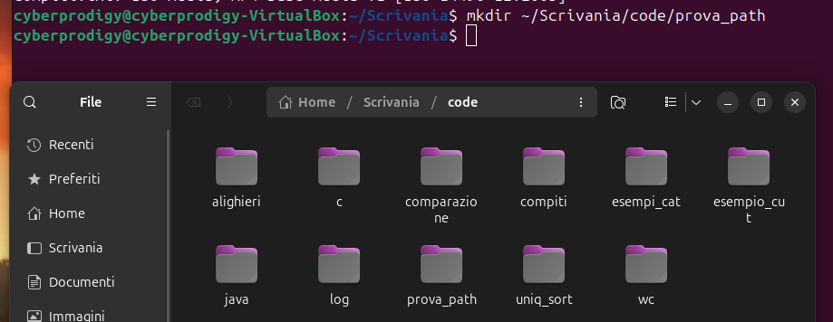

###### 📌 **PASSO 2: crea due file dentro**

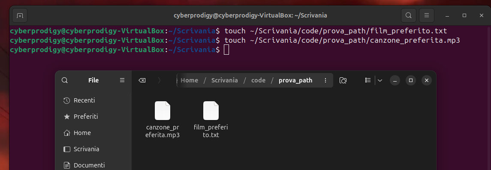

###### 📌 **PASSO 3: usa basename sul primo file**

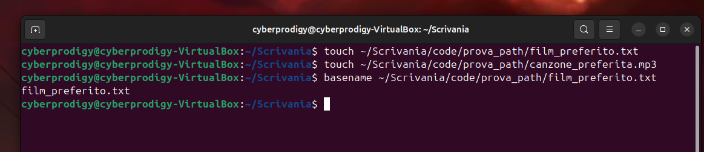

###### 📌 **PASSO 4: usa dirname sul secondo**


---

### **13. Archiviazione e compressione**

#### 🟦 **1. Concetti fondamentali**

##### ⭐ **Archiviazione**

Immagina di avere tanti fogli sparsi sul tavolo.  
Anche se li **metti dentro una cartellina**, la quantità di carta **non cambia**, ma è tutto più ordinato.

Questo è _archiviare_:

- prendo molti file
    
- li infilo dentro **un unico contenitore**
    
- senza schiacciarli, senza ridurli di peso
    
- semplicemente li raggruppo
    

Il formato classico di archiviazione su Unix è **.tar**.

> Tecnicamente, un archivio TAR è una struttura sequenziale che concatena file e metadati (nomi, permessi, timestamp) _senza comprimerli_.

---

##### ⭐ **Compressione**

Ora immagina di prendere quella cartellina piena di fogli, e usare una **pressa** per schiacciare la carta e ridurla di volume.

La compressione fa esattamente questo:

- riduce lo spazio occupato dal file
    
- usando algoritmi matematici di codifica
    
- senza (quasi sempre) perdere informazioni
    

Formati comuni:

- `.gz` (gzip)
    
- `.bz2` (bzip2)
    
- `.Z` (compress)
    

---

##### ⭐ **Decompressione**

È l’operazione inversa:

- prendo il file schiacciato
    
- lo **espando** di nuovo alla forma originale
    
- bit per bit identico a come era prima
    

Gzip ↔ gunzip  
Bzip2 ↔ bunzip2  
Compress ↔ uncompress

---

#### 🟩 **2. Come si uniscono archiviazione + compressione**

TAR archivia.  
Gzip comprime.

Quando li combini ottieni:  
**.tar.gz** (detto anche **.tgz**)

È come dire:

1. “Metto tutti i file dentro una cartellina” → TAR
    
2. “Schiaccio la cartellina per farla occupare meno spazio” → GZIP
    

---

#### 🟧 **3. Spiegazione dei comandi della slide (in modo perfetto)**

##### 🔹 **Archiviazione + Comprimere: `tar zcvf`**

Comando:

```bash
tar zcvf archive-name.tar.gz {file}*
```

Significato delle lettere:

- **z** → usa `gzip` per comprimere
    
- **c** → crea un nuovo archivio
    
- **v** → verbose: mostra cosa sta facendo
    
- **f** → indica che il nome del file che segue è il nome dell'archivio
    

Esempio concreto:

```bash
tar zcvf progetto.tar.gz cartella_sorgente/
```

→ Produce un singolo file `.tar.gz` che contiene TUTTO ciò che c’è dentro `cartella_sorgente`.

---

##### 🔹 **Estrarre: `tar zxvf`**

Comando:

```bash
tar zxvf archive-name.tar.gz
```

Significato:

- **z** → decomprimi tramite gzip
    
- **x** → estrai i contenuti (eXtract)
    
- **v** → verbose
    
- **f** → nome del file da cui estrarre

Esempio:

```bash
tar zxvf progetto.tar.gz
```

→ Ti ritrovi in directory tutti i file contenuti nell’archivio.

---

#### 🟦 **4. Comandi di sola compressione**

Ci sono programmi che **non archiviano**, ma **solo comprimono** un singolo file:

##### 🔸 **compress / uncompress**

Antichissimi, generano estensioni `.Z`

Esempio:

```bash
compress documento.txt
```

Produce:

```
documento.txt.Z
```

Per decomprimere:

```bash
uncompress documento.txt.Z
```

---

##### 🔸 **gzip / gunzip**

Il più usato oggi.

###### Compress:

```bash
gzip foto.png
```

Risultato:

```
foto.png.gz
```

###### Decompress:

```bash
gunzip foto.png.gz
```

---

##### 🔸 **bzip2 / bunzip2**

Più lento ma più efficiente di gzip.

###### Compress:

```bash
bzip2 dati.csv
```

Risultato:

```
dati.csv.bz2
```

###### Decompress:

```bash
bunzip2 dati.csv.bz2
```

---

#### 🟪 **5. Riassunto elegante

- **TAR** archivia
    
- **gzip/bzip2/compress** comprimono
    
- **tar + gzip** → `.tar.gz` (archivio compresso)
    
- **z** = gzip
    
- **c** = create
    
- **x** = extract
    
- **v** = verbose
    
- **f** = file


---

### **14. Comandi per la gestione del tempo**

Perfetto, ti faccio **la lezione definitiva** su `touch`, come sempre in stile _bimbo prodigio di 5 anni_ ma con tono accademico e completo.

---

#### 🟦  **`touch`**

`touch` è uno dei comandi più semplici ma più eleganti di Unix.

Fa due cose:

##### **1) Se il file NON esiste → lo crea vuoto**

È il modo più rapido per generare un file:

```bash
touch prova.txt
```

Risultato:

```
prova.txt   (0 byte)
```

##### **2) Se il file esiste → aggiorna i suoi timestamp**

I _timestamp_ sono:

- `atime` → access time (ultima lettura)
    
- `mtime` → modification time (ultima modifica al contenuto)
    
- `ctime` → change time (ultima modifica ai metadati)
    

`touch` modifica **mtime** e **atime** (di default).

È come dire al sistema:

> “Ehi, considera questo file come appena toccato da me.”

---

##### 🟩 **Perché si chiama “touch”**

Perché “tocca” il file, nel senso metaforico:  
non lo apre, non scrive dentro, **ma aggiorna solo l’orario**.

Da qui il nome: `touch` → “sfiora”.

---

##### 🟧 **Tutte le opzioni fondamentali di `touch`**

###### 🔹 **1) `touch -a` → modifica solo l’access time**

Esempio:

```bash
touch -a documento.txt
```

Aggiorna **solo** `atime`, non `mtime`.

---

###### 🔹 **2) `touch -m` → modifica solo il modification time**

Esempio:

```bash
touch -m script.sh
```

Aggiorna **solo** `mtime`.

---

###### 🔹 **3) `touch -t` → imposta un timestamp personalizzato**

Formato: `[[CC]YY]MMDDhhmm[.ss]`

Esempio:

```bash
touch -t 202407241230 foto.jpg
```

Risultato:

- anno: **2024**
    
- mese: **07**
    
- giorno: **24**
    
- ora: **12**
    
- minuti: **30**
    

Questo è molto utile in informatica forense, scripting, e per ordinare file.

---

###### 🔹 **4) `touch -c` → non creare file**

Di default, se il file non esiste, `touch` lo crea.  
Se vuoi solo aggiornare timestamp _senza creare nulla_:

```bash
touch -c boh.txt
```

Se il file manca, `touch` non fa niente.

---

###### 🔹 **5) `touch -d` → data in linguaggio naturale**

(Versione GNU touch, quindi va bene su Linux)

Puoi usare frasi tipo:

```bash
touch -d "yesterday" note.txt
touch -d "2024-01-01 10:00" report.pdf
touch -d "next monday" app.log
```

È molto più intuitivo e leggibile. **LEGGERE L'APPENDICE A FINE LEZIONE**

---

###### 🔹 **6) `touch -r` → copia la data di un altro file**

Questo è bellissimo.

Esempio:

```bash
touch -r originale.txt copia.txt
```

Ora `copia.txt` ha esattamente gli stessi timestamp di `originale.txt`.

In forense questo si chiama **timestamp cloning**.

---

###### 🔹 **7) `touch -h` (su file symbolic link)**

Se tocchi un link simbolico:

- normalmente aggiorni il file puntato
    
- con `-h` aggiorni il **link**, non il target
    

Esempio:

```bash
touch -h link_a_config
```

---

##### 🟦 **Riepilogo elegante delle flag**

|Flag|Significato|
|---|---|
|`-a`|aggiorna solo access time|
|`-m`|aggiorna solo modification time|
|`-c`|non creare file se non esiste|
|`-t`|usa timestamp manuale|
|`-d`|usa timestamp in linguaggio naturale|
|`-r`|copia timestamp da altro file|
|`-h`|tocca il symlink, non il file reale|

---

##### 🟪 **Esempi reali e utili**

###### 🟣 Creare 10 file vuoti:

```bash
touch file{1..10}.txt
```

---

###### 🟣 Impostare la data di un file ai primi secondi del 2000:

```bash
touch -t 200001010000.00 millennium.txt
```

---

###### 🟣 Dare gli stessi timestamp a tutto un progetto:

```bash
touch -r masterfile.txt src/*.c
```

---

###### 🟣 Impostare data di ieri:

```bash
touch -d "yesterday" log.txt
```

---

#### 🕒 **`date` — il “calendario-orologio” della shell**


`date` **chiede al sistema operativo**:

> “Che giorno è? Che ora è? E in che formato vuoi che te lo dica?”

E poi stampa la risposta sullo **standard output**.

---

##### **Uso base**

```bash
date
```

Esempio di output tipico:

```bash
Thu Nov 20 00:58:31 CET 2025
```

Scomponiamolo:

- `Thu` → giorno della settimana (Thursday)
    
- `Nov` → mese
    
- `20` → giorno del mese
    
- `00:58:31` → ora:minuti:secondi
    
- `CET` → fuso orario (Central European Time)
    
- `2025` → anno
    

Questa è la **forma predefinita**.

---

##### **Formattare l’output (`date "+formato"`)**

La cosa potente di `date` è che puoi dire **esattamente** come vuoi la data.

Sintassi:

```bash
date "+STRINGA_DI_FORMATO"
```

Dentro la stringa di formato usi **specificatori** che iniziano con `%`.

I più importanti:

- `%Y` → anno con 4 cifre (`2025`)
    
- `%y` → anno con 2 cifre (`25`)
    
- `%m` → mese (`01`–`12`)
    
- `%d` → giorno del mese (`01`–`31`)
    
- `%H` → ora (00–23)
    
- `%M` → minuti (00–59)
    
- `%S` → secondi (00–59)
    
- `%F` → scorciatoia per `YYYY-MM-DD`
    
- `%T` → scorciatoia per `HH:MM:SS`
    
- `%a` → giorno della settimana abbreviato (`Mon`, `Tue`, …)
    
- `%A` → giorno della settimana per esteso (`Monday`, …)
    
- `%Z` → nome del fuso (`CET`, `CEST`…)
    

Esempi:

```bash
date "+%Y-%m-%d"
# 2025-11-20

date "+%d/%m/%Y %H:%M"
# 20/11/2025 01:02

date "+Oggi è %A %d %B %Y"
# Oggi è Thursday 20 November 2025 (in inglese di default)
```

---

##### **Date “relative” e assolute (`date -d`)**

Come per `touch -d`, anche `date` può **parlare il linguaggio naturale** (grazie alla stessa libreria di parsing).

```bash
date -d "yesterday"
date -d "tomorrow 18:00"
date -d "next monday"
date -d "2025-12-24 23:59:59"
```

Puoi combinarlo con il formato:

```bash
date -d "next monday" "+%Y-%m-%d"
```

---

##### **Unix timestamp (epoch)**

`date` può mostrare la data come **numero di secondi dal 1/1/1970** (epoch Unix).

```bash
date +%s
# esempio: 1763590254
```

E al contrario, convertire un timestamp in data leggibile:

```bash
date -d @1763590254
```

---

##### **Impostare l’orologio di sistema (di solito NON ti serve)**

Solo per completezza accademica (non farlo sulla VM se non sai perché):

```bash
sudo date -s "2025-12-31 23:59:00"
```

Questo **modifica l’orologio di sistema**, quindi va fatto solo su macchine di test o se sai cosa stai facendo.

---

#### ⏱️ **`time` — il cronometro dei comandi**


`time` risponde alla domanda:

> “Quanto tempo impiega questo comando ad essere eseguito?”

Sintassi:

```bash
time comando argomenti...
```

Esempio dalla slide:

```bash
time find / -name "*.bak" -print
```

Qui:

- esegue **find** che scansiona tutto `/`
    
- poi, **quando finisce**, `time` stampa delle statistiche.
    

---

##### **I tre tempi fondamentali: `real`, `user`, `sys`**

Dopo il comando vedrai qualcosa del tipo:

```bash
real    0m12.345s
user    0m1.234s
sys     0m0.567s
```

Spiegazione:

- **real** → il tempo “da orologio da polso”, quello che percepisci tu.  
    Dall’inizio alla fine del comando.
    
- **user** → quanto tempo la CPU ha passato a eseguire **il codice dell’applicazione** (in modalità utente).
    
- **sys** → quanto tempo la CPU ha passato a eseguire **chiamate di sistema** per conto del comando  
    (accesso a disco, I/O, gestione file, ecc).
    

Esempio interpretativo:

- `real` è grande, `user` e `sys` piccoli → il comando aspetta molto (I/O, rete…).
    
- `user` molto grande → comando CPU-intensive (compressioni, cifrature, calcoli).
    
- `sys` grande → tante chiamate al kernel (molti file, operazioni su filesystem, fork, ecc).
    

---

##### **`time` builtin vs `/usr/bin/time`**

In molte shell (`bash`, `zsh`) esiste **un builtin `time`**.  
Esiste anche un eseguibile esterno `/usr/bin/time` con opzioni più avanzate.

Se fai:

```bash
type time
```

Potresti vedere:

```bash
time is a shell keyword
```

Per forzare quello esterno:

```bash
/usr/bin/time ls
```

L’eseguibile esterno permette formati personalizzati, ad esempio:

```bash
/usr/bin/time -f "real=%E user=%U sys=%S" comando
```

---

##### **Perché è utile `time` (anche per te ora)**

- per capire **quanto costa** un comando pesante (`find`, `grep`, script, programmi C/Java)
    
- per confrontare **due versioni di un programma** (prima/poi un’ottimizzazione)
    
- per capire se un’operazione è CPU-bound o I/O-bound guardando user vs sys vs real
    

---

##### **Mini-esercizi pratici (se vuoi provarli sulla VM)**

1. Cronometra un comando veloce:
    
    ```bash
    time ls
    ```
    
2. Cronometra un comando più pesante:
    
    ```bash
    time find / -maxdepth 5 -name "*.conf" 2>/dev/null
    ```
    
3. Cronometra un ciclo artificiale in bash:
    
    ```bash
    time bash -c 'for i in {1..1000000}; do :; done'
    ```
    
    Qui vedi crescere soprattutto **user**.
    

---

### **15. Conclusione**

Questa lezione ha presentato una panoramica dei **comandi avanzati della shell**, base operativa per qualsiasi analista forense.  
Grazie a essi, è possibile:

- automatizzare indagini complesse;
    
- filtrare e analizzare grandi quantità di dati testuali;
    
- confrontare, archiviare e documentare i risultati in modo scientifico.
    

> “Conoscere la shell significa dominare il sistema:  
> l’informatico forense che non sa usare la shell è come un medico che non sa usare il bisturi.”


---

ALLEGO INFINE...

Una lista introduttiva ma esaustiva (cioè _tutta l'essenza che devi sapere_, senza diventare un manuale infinito) di ciò che la libreria interna di GNU — quella usata da `touch -d`, `date -d`, `at`, ecc. — è in grado di parsare.

Questa libreria è estremamente potente: capisce **quasi tutto ciò che un umano può dire riguardo al tempo**, purché sia espresso in inglese e in un ordine non totalmente caotico.

Di seguito trovi **la lista completa per categorie**, cioè TUTTO ciò che _realmente_ supporta, comprensibile e pronta da studiare.

---

### 🟦 1) **Date assolute (formati completi)**

La libreria comprende:

#### **Formati numerici classici**

- `YYYY-MM-DD`
    
- `YYYY/MM/DD`
    
- `YYYY.MM.DD`
    
- `DD-MM-YYYY`
    
- `DD/MM/YYYY`
    
- `MM/DD/YYYY` (interpreta anche gli americani)
    
- `YYYYMMDD`
    

#### **Formati con tempo**

- `YYYY-MM-DD hh:mm`
    
- `YYYY-MM-DD hh:mm:ss`
    
- `YYYY-MM-DDThh:mm:ss` (ISO 8601)
    
- `YYYY-MM-DD hh:mm:ss TZ`
    

#### **Formati testuali**

- `24 July 2025`
    
- `July 24, 2025`
    
- `24 Jul 2025, 10:30`
    
- `Tuesday, July 24 2025, 3pm`
    

Capisce:

- nomi dei mesi interi
    
- abbreviazioni (`Jul`, `Sep`, `Feb`…)
    
- giorni della settimana
    

---

### 🟦 2) **Date relative semplici**

Questa è la parte più magica:

- `now`
    
- `yesterday`
    
- `today`
    
- `tomorrow`
    

E le versioni con orario:

- `yesterday 14:00`
    
- `tomorrow 23:59:59`
    

---

### 🟦 3) **Offset temporali (relativi)**

Capisce espressioni del tipo:

- `+2 hours`
    
- `-3 minutes`
    
- `+7 days`
    
- `-1 week`
    
- `+1 year`
    
- `-5 months`
    

E le miscele:

- `2 hours ago`
    
- `3 days ago`
    
- `4 weeks ago`
    
- `1 year 2 months ago`
    

---

### 🟦 4) **Regole settimanali e giorni della settimana**

Capisce:

- `next monday`
    
- `last friday`
    
- `this tuesday`
    
- `next week`
    
- `last week`
    

Capisce sia giorni interi:

- `monday`, `tuesday`, …
    

Sia abbreviazioni:

- `mon`, `tue`, `wed`, …
    

---

### 🟦 5) **Punti speciali del giorno**

Riconosce:

- `midnight` → 00:00
    
- `noon` → 12:00
    
- `teatime` → 16:00 (sì, è vero 😂)
    
- `pm` / `am`
    

Esempi:

- `tomorrow noon`
    
- `yesterday midnight`
    
- `next friday 3pm`
    

---

### 🟦 6) **Riferimenti complessi**

Capisce anche frasi del tipo:

#### **“Primo / ultimo giorno del mese”**

- `first day of this month`
    
- `last day of next month`
    
- `first monday of december`
    

#### **“Inizio / fine settimana”**

- `beginning of week`
    
- `end of week`
    

#### **“Ultimo giorno dell’anno”**

- `last day of year`
    

---

### 🟦 7) **Combinazioni di tutto questo**

Ecco dove vedi la potenza vera:

- `next friday 14:00 UTC`
    
- `3 days ago 18:30`
    
- `last monday +2 hours`
    
- `2 weeks ago next friday` (sì, funziona davvero)
    
- `first day of this month 00:00`
    
- `next year january 1 07:00`
    

---

### 🟦 8) **Time zone**

Capisce:

- `UTC`
    
- `GMT`
    
- `CET`, `CEST`
    
- `PST`, `PDT`
    
- `EST`, `EDT`
    
- ecc.
    

Esempi:

- `2024-10-31 10:00 UTC`
    
- `next monday 3pm CET`
    

---

### 🟦 9) **Secondi epoch / timestamp Unix**

Puoi dare direttamente numeri:

- `@1700000000`
    

Che rappresenta un UNIX timestamp.

---

### 🟩 QUINDI: la lista definitiva (corta ma completa) è:

#### **1) Date assolute**

(ISO, numeriche, testuali)

#### **2) Date relative semplici**

(yesterday, tomorrow, now)

#### **3) Offset numerici**

(+2 hours, -3 days, 7 weeks ago)

#### **4) Giorni della settimana**

(next monday, last friday, this tuesday)

#### **5) Punti speciali del giorno**

(noon, midnight, teatime)

#### **6) Regole mensili/annuali**

(first day of month, last day of year)

#### **7) Comandi combinati**

(next friday 14:00 CET, 3 days ago 10:00)

#### **8) Fusi orari**

(UTC, CET…)

#### **9) UNIX epoch**

(@1234567890)
