# Lezioni 3–4–5 — Modelli di Sistema

> **Corso:** Progettazione di Software Sicuro — Prof.ssa Elvinia Riccobene
> **Università degli Studi di Milano — SSRI**

---

## 1. Il documento SRS e la qualità delle specifiche

Come visto nella lezione precedente, il **Software Requirement Specification (SRS)** è la dichiarazione ufficiale di ciò che è richiesto agli sviluppatori. Include sia i requisiti utente che quelli di sistema, e la *Software Design Architecture* (SDA) ne è parte integrante. L'SRS deve descrivere il *cosa*, non il *come*. [p. 3]

Affinché un documento di specifica sia effettivamente utile, deve possedere un insieme di **qualità**: [p. 4]

> [!abstract] Qualità delle specifiche
> - **Chiarezza / Comprensività**: il testo deve essere leggibile e comprensibile.
> - **Non ambiguità**: ogni requisito deve ammettere una sola interpretazione.
> - **Consistenza**: i requisiti non devono contraddirsi tra loro.
> - **Completezza**: tutti i servizi richiesti devono essere descritti.
> - **Comprensibilità**: il documento deve essere accessibile a tutti gli stakeholder.
> - **Verificabilità / Validabilità**: deve essere possibile testare ogni requisito.
> - **Tracciabilità**: ogni requisito deve essere collegabile alla sua origine e ai suoi artefatti derivati.
> - **Modificabilità**: il documento deve permettere cambiamenti senza effetti collaterali incontrollati.
> - **Incrementalità**: deve supportare uno sviluppo iterativo e progressivo.

---

---

## 2. La modellazione del sistema

La **modellazione del sistema** è il processo di sviluppo di **modelli astratti** di un sistema. Un singolo sistema può essere descritto da più modelli, ciascuno dei quali offre una visione o prospettiva diversa. La modellazione aiuta l'analista a comprendere la funzionalità del sistema e i modelli vengono utilizzati per **comunicare con i clienti**. [p. 6]

### 2.1 Modelli per sistemi esistenti e nuovi

I modelli vengono utilizzati durante l'ingegneria dei requisiti sia per sistemi **esistenti** che per sistemi **nuovi**: [p. 7]

- **Sistemi esistenti**: i modelli aiutano a chiarire ciò che il sistema attuale fa e possono essere utilizzati come base per discuterne punti di forza e debolezza. Conducono ai requisiti per il nuovo sistema.
- **Sistemi nuovi**: i modelli aiutano a spiegare i requisiti proposti alle parti interessate, sono usati per discutere le proposte di progettazione e a scopi di documentazione.

In un processo di progettazione **model-driven**, è possibile generare un'implementazione di sistema completa o parziale **direttamente dal modello** di sistema. [p. 7]

---

## 3. Linguaggi per la specifica

I linguaggi utilizzati per scrivere le specifiche si collocano lungo un continuum di rigore formale: [p. 8]

| Livello          | Descrizione                                                | Esempio                                                                                        |
| ---------------- | ---------------------------------------------------------- | ---------------------------------------------------------------------------------------------- |
| **Informale**    | Linguaggio naturale, eventualmente con strutture e tabelle | *"Il valore di x sarà tra 1 e 5, finché diventa 7. Non sarà mai negativo."*                    |
| **Semi-formale** | Notazioni grafiche                                         | Diagrammi UML                                  |
| **Formale**      | Notazioni rigorose / matematiche                           | $\Box\, (1 \leq x \leq 5 \;\mathcal{U}\; x = 7) \;\wedge\; \Box\, x \geq 0$ (logica temporale) |

Un formalismo è una notazione rigorosa e matematica che può essere di tipo **operazionale** o **dichiarativo**. [p. 8]

---

## 4. Formalismi operazionali vs dichiarativi

### 4.1 Formalismi operazionali

I formalismi operazionali definiscono il sistema **descrivendone il comportamento** come se fosse eseguito da una macchina astratta. Forniscono una rappresentazione più **intuitiva**, poiché più simile al modo di ragionare della mente umana. [p. 10]

Vantaggi:
- Facilitano la **prototipazione**.
- Facilitano la **validazione**.

I formalismi operazionali trattati nel corso sono: **FSM di Mealy**, **FSM estese**, **Macchine di comunicazione** e **Macchine di stato UML**. [p. 13]

### 4.2 Formalismi dichiarativi

I formalismi dichiarativi definiscono il sistema **dichiarando le proprietà** che esso deve possedere, senza descrivere *come* vengono raggiunte. Forniscono una rappresentazione che non si presta ad ambiguità, ma è **più difficile da comprendere e sviluppare**. [p. 10, 14]

Vantaggi:
- Facilitano la **verifica** formale.

Il formalismo dichiarativo trattato nel corso è: **Design-by-Contract e JML**. [p. 14]

> [!example] Esempio: definizione di ellisse
> - **Operazionale**: è l'insieme dei punti del piano che si ottiene muovendosi in modo che la somma delle distanze tra il punto e due punti fissi $p_1$ e $p_2$ rimanga invariata. [p. 11]
> - **Dichiarativa**: è l'insieme dei punti del piano che soddisfano l'equazione $ax^2 + by + c = 0$. [p. 11]

> [!example] Esempio: definizione di array ordinato
> - **Operazionale**: sia $a$ un array di $n$ elementi. Il risultato del suo ordinamento è un array $b$ di $n$ elementi tale che il primo elemento di $b$ è il minimo di $a$; il secondo è il minimo dell'array di $n-1$ elementi ottenuto rimuovendo il minimo; e così via. [p. 12]
> - **Dichiarativa**: il risultato dell'ordinamento di un array $a$ è un array $b$ che è una *permutazione* di $a$ ed è *ordinato*. [p. 12]

---

> **Fine del Blocco 1** — [pp. 1–14] ✅

---

## 5. Macchine a Stati Finiti (FSM)

Una **macchina a stati finiti** (*Finite State Machine*, FSM) è una notazione formale che consente la rappresentazione astratta del comportamento di un sistema. Le FSM combinano una rigorosa **definizione matematica** con un'intuitiva **rappresentazione grafica** mediante diagrammi di stato. [p. 16]

### 5.1 Concetti fondamentali

In un diagramma di stato i **nodi** rappresentano gli *stati* del sistema e gli **archi** rappresentano le *transizioni* di stato. Le FSM modellano le configurazioni istantanee di un sistema tramite gli stati e le operazioni del sistema tramite le transizioni. [p. 17–18]

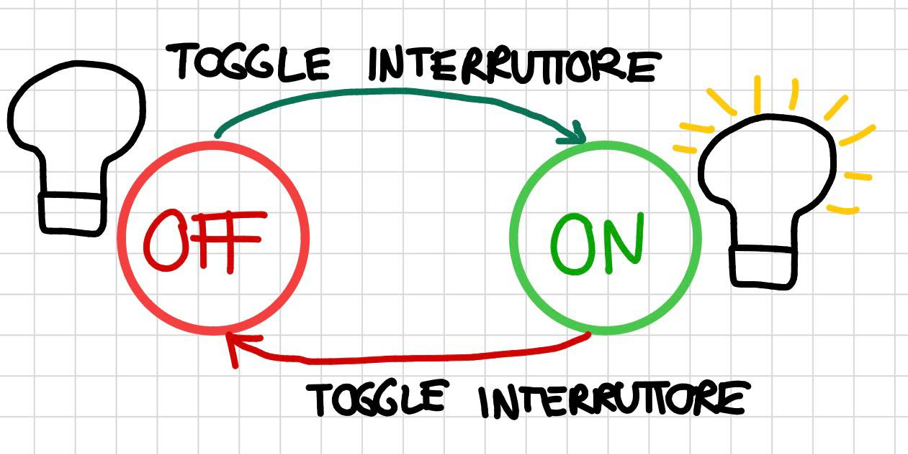

> [!example] Esempio: lampadina
> Una semplice lampadina con un pulsante ha due stati (`On`, `Off`) e un unico input (`Premi pulsante`) che fa commutare tra i due stati. [p. 17]

Le operazioni possono ricevere **input** (FSM di base) ed eventualmente produrre **output** (FSM di Mealy). [p. 18]

### 5.2 Livelli di astrazione

Il modello FSM di un sistema **non è unico**: modelli diversi possono descrivere lo stesso sistema a diversi livelli di astrazione e dettaglio. [p. 20]

> [!example] Esempio: impianto chimico
> Un sistema di controllo per un impianto chimico può essere modellato in modo semplice con tre stati (`On`, `Off`, `Restart`) e due input (*allarme di temperatura pericolosa* e *allarme di pressione pericolosa*) [p. 19]. Un modello più raffinato introduce invece stati intermedi (`Normale`, `Off`, `Azione di diminuzione pressione`, `Azione di diminuzione temperatura`) con input più specifici che includono il *fallimento dell'azione* e il *rientro nei limiti*. [p. 21]

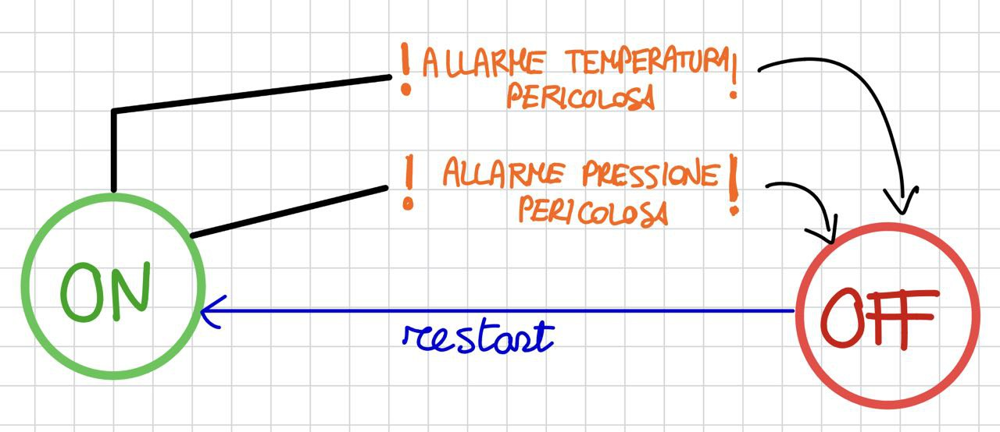

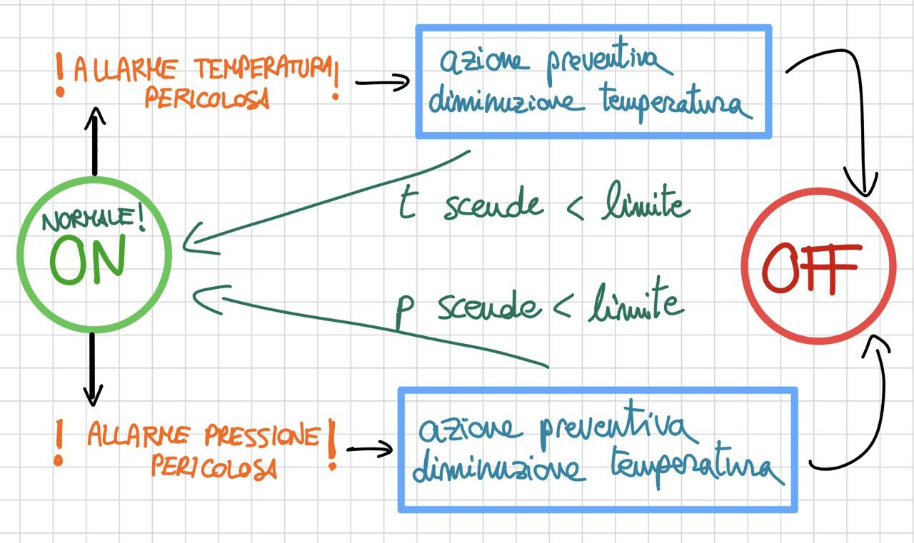

> [!example] Esempio: lampada a tre stati
> Una lampada a tre stati può essere modellata in due modi: (a) l'interruttore può essere girato solo in senso orario, oppure (b) l'interruttore può essere girato in entrambi i sensi (orario e antiorario). Le due varianti generano FSM con transizioni differenti. [p. 22]

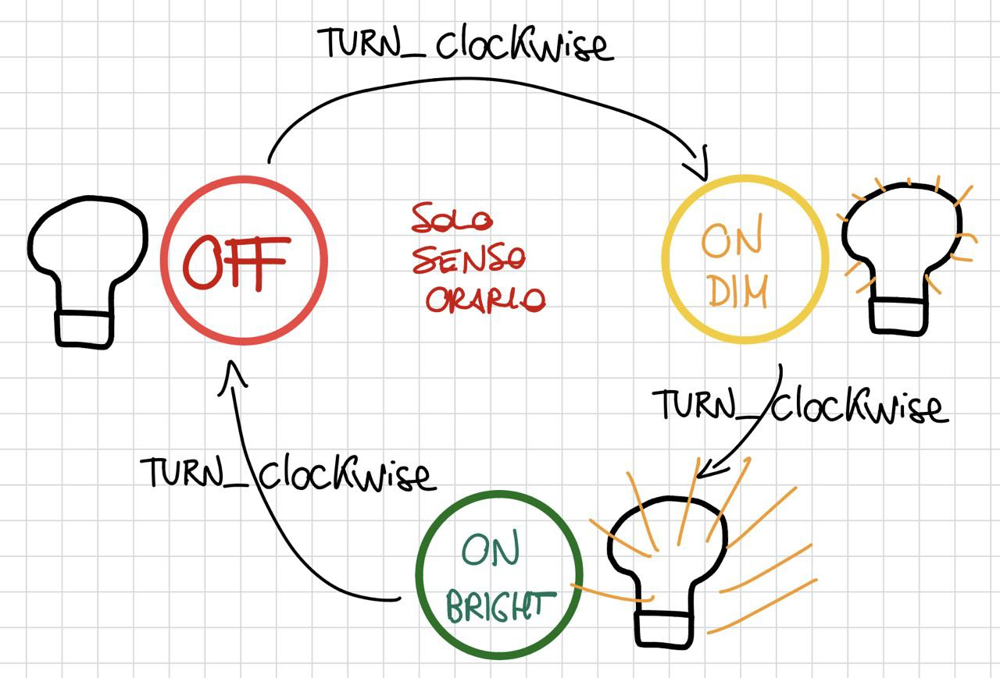

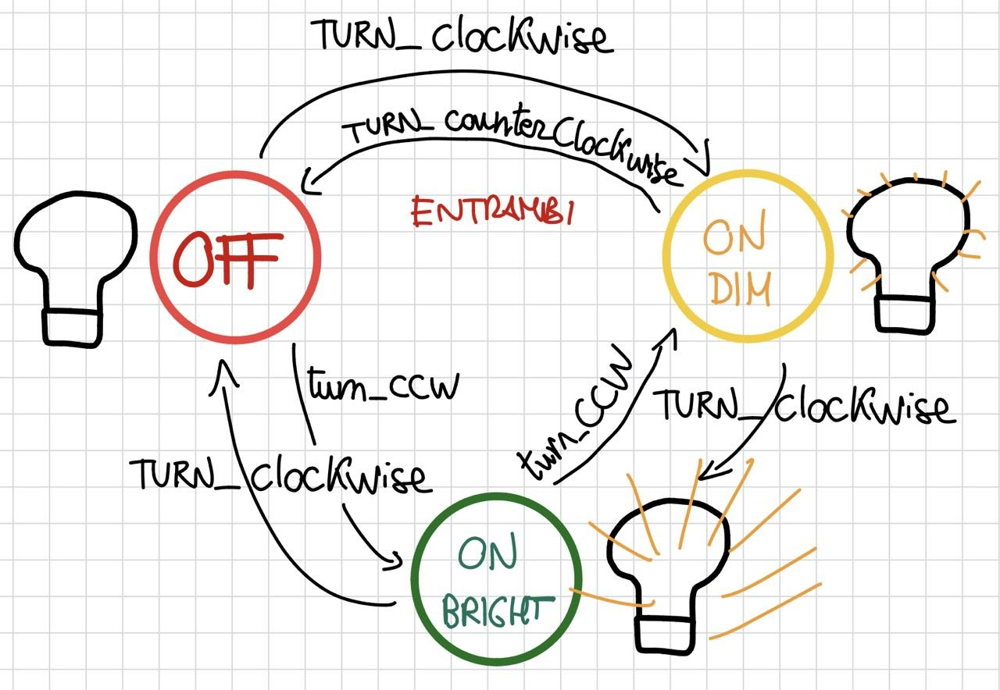

---

## 6. Definizione formale di FSM

> [!info] Definizione: FSM
> Una FSM è una tupla $(S,\, I,\, \delta)$ dove:
> - $S$ è un insieme finito di **stati**
> - $I$ è un insieme finito di **eventi di input**
> - $\delta : S \times I \to S$ è la **funzione di transizione** [p. 23]

Il **diagramma di stato** è un grafo direzionato i cui nodi rappresentano gli stati e i cui archi, etichettati dagli input, rappresentano le transizioni. [p. 24]

> [!example] Esempio con tre stati
> $S = \{s_1, s_2, s_3\}$,
>  $I = \{a, b\}$
> $\delta = \{(s_1, a, s_1),\; (s_1, b, s_2),\; (s_2, a, s_2),\; (s_2, b, s_3),\; (s_3, a, s_3),\; (s_3, b, s_1)\}$
> L'input $a$ mantiene la macchina nello stato corrente, mentre $b$ fa avanzare ciclicamente al prossimo stato. [p. 24]

### 6.1 Esercizi su FSM di base

**Esercizio 1 — Lampada con due bottoni**: si ha una lampada e due bottoni ($b_1$ e $b_2$). Se la lampada è spenta, premere uno dei due tasti la accende; se è accesa, premere uno dei due tasti la spegne. La soluzione è una FSM con $S = \{\text{On}, \text{Off}\}$, $I = \{\text{Premi } b_1, \text{Premi } b_2\}$ e quattro transizioni. [p. 26–27]

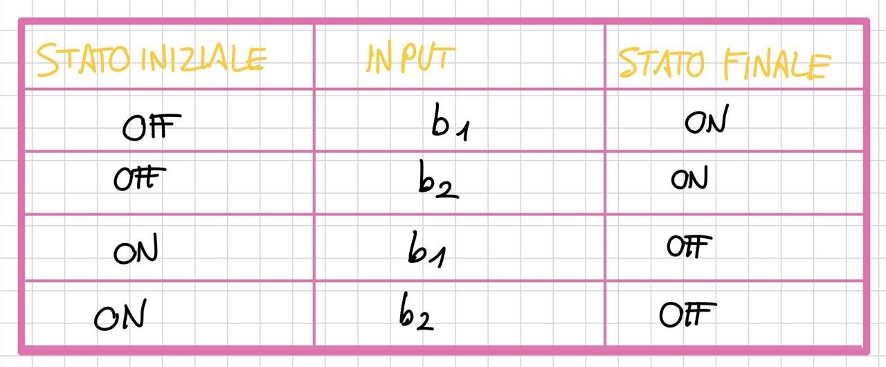

**Esercizio 2 — Due lampade, un bottone**: si hanno due lampade ($L_1$, $L_2$) e un unico bottone. Si parte da entrambe spente; ad ogni pressione la configurazione cambia ciclicamente: $\text{Off} \to L_1\text{On}/L_2\text{Off} \to L_1\text{Off}/L_2\text{On} \to \text{Entrambe On} \to \text{Off}$. La FSM ha quindi **quattro stati**. [p. 28–29]

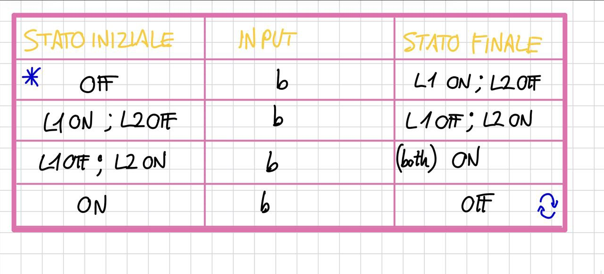

---

## 7. Macchina di Mealy

Una FSM con output che produce un output per ciascuna transizione è detta **macchina di Mealy**. [p. 30]

> [!info] Definizione: Macchina di Mealy
> Una macchina di Mealy è una tupla $(S,\, I,\, O,\, \delta,\, \omega)$ dove:
> - $S$ è un insieme finito di **stati**
> - $I$ è un insieme finito di **eventi di input**
> - $O$ è un insieme finito di **eventi di output**
> - $\delta : S \times I \to S$ è la **funzione di transizione**
> - $\omega : S \times I \to O$ è la **funzione di output**
>
> Spesso viene fissato anche uno **stato iniziale** $s_0 \in S$. [p. 31]

### 7.1 Rappresentazione grafica

Nei diagrammi che rappresentano una FSM di Mealy, ogni arco è etichettato con la notazione $i/o$, dove $i$ è l'evento di input e $o$ è l'evento di output. Un evento di output può anche essere un'**azione** della macchina. [p. 32]

È anche utile vedere una FSM di Mealy come la tupla $(S, I, O, T)$, dove $T$ è un insieme finito di **transizioni**. Ogni transizione è una tupla $(s, i, o, s')$, in cui $s$ è lo stato sorgente, $i$ l'input, $o$ l'output e $s'$ lo stato target. [p. 34]

> [!tip] Convenzione
> Nel seguito del corso, per "FSM" si intenderanno macchine di Mealy e si utilizzerà la definizione come tupla $(S, I, O, T)$. [p. 36]

> [!example] Esempio completo
> $S = \{s_1, s_2, s_3\}$, $I = \{a, b\}$, $O = \{0, 1\}$
> $T = \{(s_1, a, 0, s_1),\; (s_1, b, 1, s_2),\; (s_2, a, 1, s_2),\; (s_2, b, 1, s_3),\; (s_3, a, 0, s_3),\; (s_3, b, 0, s_1)\}$ [p. 35]

Così si compatta la notazione...

---

## 8. Esercizi su FSM di Mealy

### 8.1 Sbarra del parcheggio

Si modella il comportamento di una sbarra per l'accesso/uscita da un parcheggio. Per accedere il semaforo deve essere verde; mentre la sbarra è aperta il semaforo è rosso. Quando l'auto è entrata la sbarra si chiude e il semaforo torna verde. Per uscire l'autista inserisce il biglietto pre-pagato. [p. 37]

Segnali e azioni definiti: [p. 38]
- **Input**: $\text{sem\_verde}$ (segnale dal semaforo), $\text{ins\_biglietto}$ (inserimento biglietto), $\text{men}$ (presenza auto dentro), $\text{mex}$ (presenza auto fuori)
- **Output/Azioni**: $\text{biglietto}$ (emissione biglietto), $\text{verde}$/$\text{rosso}$ (colore semaforo)

La FSM presenta gli stati: `closed`, `entering`, `open`, `exiting`. La transizione $\text{sem\_verde}/\text{biglietto; rosso}$ porta da `closed` a `entering`; $\text{men}$ porta a `open`; $\text{ins\_biglietto}/\text{rosso}$ porta a `exiting`; $\text{mex}/\text{verde}$ riporta a `closed`. [p. 38]

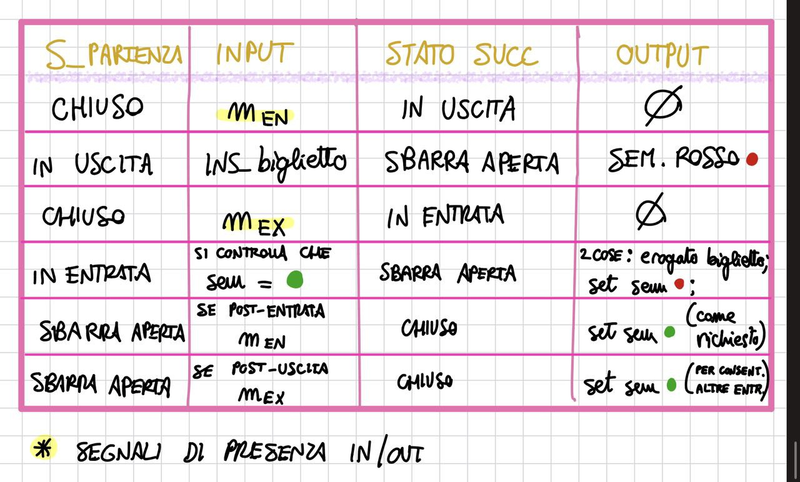

### 8.2 Esercizi proposti

I seguenti esercizi sono proposti come pratica autonoma: [pp. 40–45]

1. **Porta con chiave**: modellare una porta con chiave inserita. Gli eventi sono: aprire ($a$), chiudere ($c$), girare la chiave per aprire ($ga$), girare la chiave per chiudere ($gc$). [p. 40]

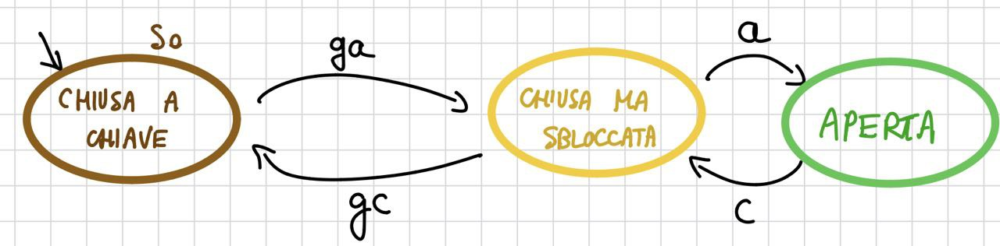

2. **Porta girevole (singolo bottone)**: la porta si apre premendo il bottone; un'ulteriore pressione durante l'apertura la fa chiudere; se si apre del tutto, si chiude automaticamente dopo un timeout di 2 secondi; ulteriore pressione mantiene aperta. [p. 41]
	
	Stati
	
- **S0** = porta **chiusa**
    
- **S1** = porta **in apertura**
    
- **S2** = porta **aperta**
    
- **S3** = porta **in chiusura**
    
Eventi

- **b** = pressione del bottone
    
- **fa** = completamento apertura
    
- **fc** = completamento chiusura
    
- **t** = timeout di 2 secondi

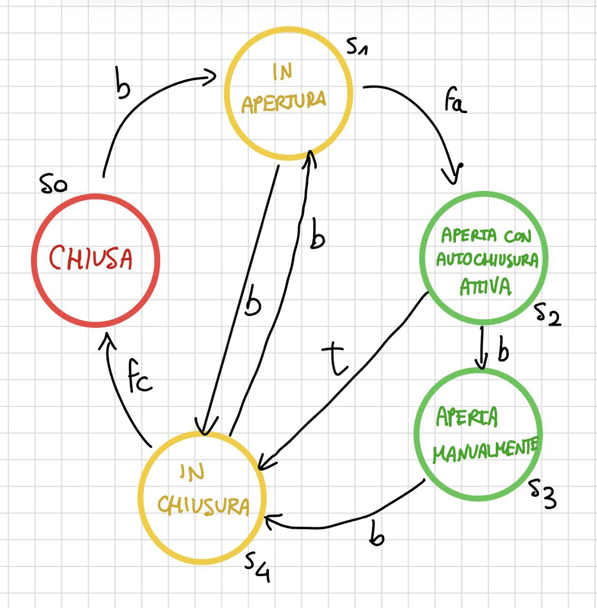

3. **CD-Player**: tre tasti (OPEN/CLOSE, PLAY, STOP); l'utente può mettere o rimuovere un CD; se preme PLAY con CD presente, il player suona. [p. 42]

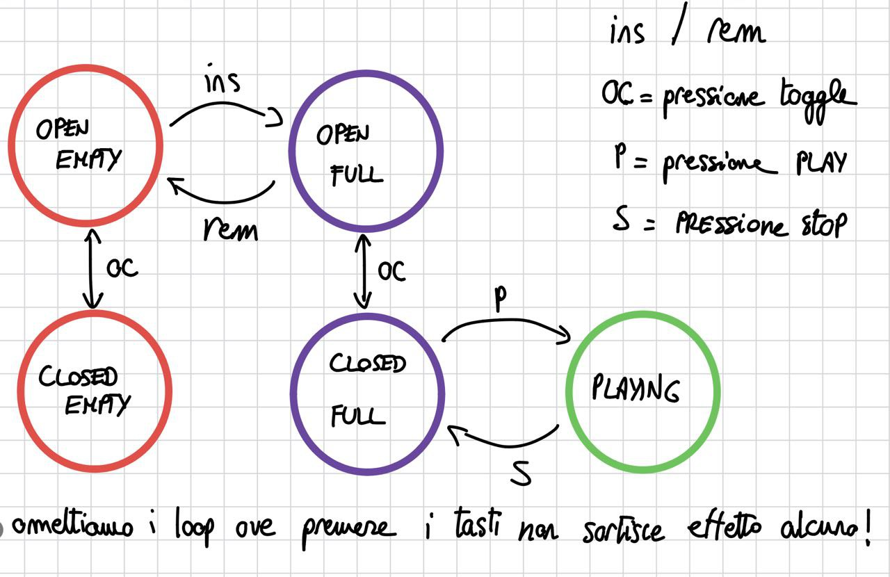

4. **Cambiamonete**: un automa che fornisce monete da 50 centesimi in cambio di monete da 10 e 20 centesimi, senza fornire resto. La soluzione prevede diversi stati corrispondenti all'importo accumulato ($0$, $10$, $20$, $30$, $40$). [pp. 43–44]

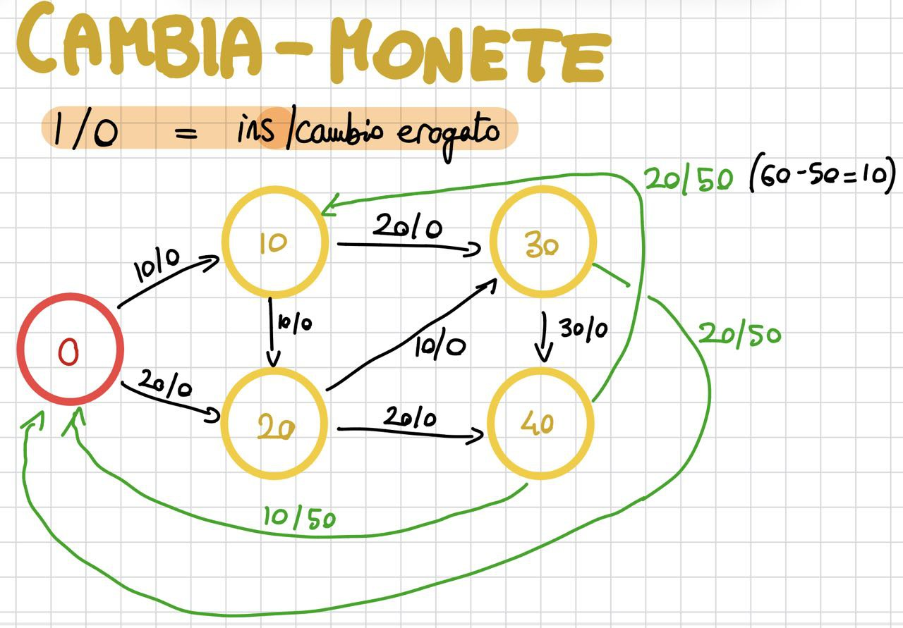

5. **Orologio digitale**: un interruttore ON/OFF accende e spegne l'orologio; il tasto `set` permette di aggiustare l'ora con i tasti `m` (minuti) e `h` (ore); durante l'aggiustamento il display lampeggia; premendo di nuovo `set` si torna in modalità normale. [p. 45]

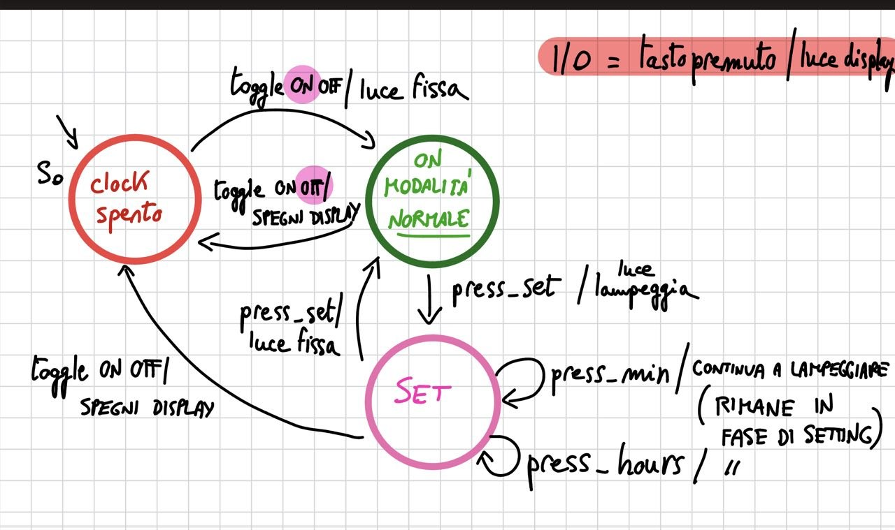

---

## 9. Applicazioni e limiti delle FSM

Le FSM sono utilizzate per modellare molteplici tipi di sistemi: **GUI**, **protocolli di rete**, **pacemaker**, **teller machines**, **applicazioni web**, **software di sicurezza** e **sistemi embedded**. [p. 47]

Tuttavia, **non tutti i requisiti** possono essere specificati con una FSM. Tra i requisiti non specificabili vi sono: [p. 48]

> [!warning] Limiti delle FSM
> - Requisiti **real-time** (vincoli temporali)
> - Requisiti riguardanti la **memoria** della macchina (variabili / dati)
> - Requisiti riguardanti **sotto-computazioni** (composizione / parallelismo)

Per superare tali limiti, si introducono le **FSM estese** (EFSM), le **macchine comunicanti** (CFSM) e le **macchine di stato UML**.

> **Fine del Blocco 2** — [pp. 15–48] ✅

---

## 10. Macchine a Stati Finiti Estese (EFSM)

Le FSM modellano le operazioni di un sistema tramite transizioni che ricevono input e possono produrre output, ma spesso è **indispensabile** poter modellare anche la **memoria interna** di una macchina. Le **EFSM — Extended Finite State Machines** — estendono le FSM con il concetto di **variabile**. [p. 50]

> [!info] Definizione: EFSM
> Una EFSM è una tupla $(S,\, I,\, O,\, V,\, T)$ dove:
> - $S$ è un insieme finito di **stati**
> - $I$ è un insieme finito di **eventi di input**
> - $O$ è un insieme finito di **eventi di output**
> - $V$ è un insieme finito di **variabili**
> - $T$ è un insieme finito di **transizioni**
>
> Ogni transizione è una tupla $(s,\, i,\, o,\, g,\, a,\, s')$:
> - $s$: stato sorgente
> - $i$: evento di input
> - $o$: evento di output
> - $g$: **guardia** — predicato sulle variabili in $V$
> - $a$: **azione** — assegnamento a una variabile in $V$
> - $s'$: stato target [p. 51]

### 10.1 Esempio: Salvadanaio elettronico

Il salvadanaio elettronico illustra l'uso delle EFSM. Inserendo monete (`inc`) il valore della variabile `coin` viene incrementato; emettendo monete (`dec`) il valore viene decrementato. La luce diventa **rossa** quando si inseriscono monete e **blu** quando si richiedono monete. La macchina non restituisce monete quando è vuota. [p. 52]

Formalmente: [p. 53]
- $S = \{\text{empty}, \text{not-empty}\}$
- $I = \{\text{inc}, \text{dec}\}$, $O = \{\text{red}, \text{blue}\}$
- $V = \{\text{coin}\}$
- $T = \{(\text{empty}, \text{inc}, \text{red}, -, \text{coin}:=1, \text{not-empty}),\; (\text{not-empty}, \text{dec}, \text{blue}, [\text{coin}=1], \text{coin}:=0, \text{empty}),\; \ldots\}$

Lo stato `empty` ha una sola transizione in uscita (inserimento, con $\text{coin}:=1$). Lo stato `not-empty` ha transizioni condizionate: se $[\text{coin}=1]$ e si esegue `dec`, si torna a `empty` con $\text{coin}:=0$; se $[\text{coin}>1]$ e si esegue `dec`, si resta in `not-empty` con $\text{coin}:=\text{coin}-1$; se si esegue `inc`, si resta in `not-empty` con $\text{coin}:=\text{coin}+1$.

---

## 11. Stato globale e transizione globale

### 11.1 Stato globale

Per una EFSM $(S, I, O, V, T)$, una coppia $(s,\, \sigma)$ è detta **stato globale** se $s$ è uno stato e $\sigma$ è una **valutazione** sulle variabili in $V$. [p. 54]

> [!example] Esempio
> Per il salvadanaio: $(\text{empty},\, \text{coin}=0)$ e $(\text{not-empty},\, \text{coin}=1)$ sono stati globali. [p. 54]

### 11.2 Transizione globale

Una tupla $((s, \sigma),\, i,\, o,\, (s', \sigma'))$ è detta **transizione globale** se esiste una transizione $(s, i, o, g, a, s')$ in $T$ tale che: [p. 55]
1. $\sigma$ **soddisfa** la guardia $g$
2. $\sigma'(v) = \sigma(\text{exp})$ dove l'azione $a$ è $v := \text{exp}$

> [!example] Esempio
> $((\text{empty}, \text{coin}=0),\, \text{inc},\, \text{red},\, (\text{not-empty}, \text{coin}=1))$ è una transizione globale del salvadanaio. [p. 55]

---

## 12. Grafo di raggiungibilità

Il **grafo di raggiungibilità** di una EFSM $(S, I, O, V, T)$ è un grafo direzionato in cui: [p. 56]
- I **nodi** sono gli stati globali
- Gli **archi** sono le transizioni globali

> [!tip] Proprietà fondamentale
> Se le variabili hanno un **range finito**, il grafo di raggiungibilità di una EFSM è una FSM. [p. 56]

Ad esempio, per il salvadanaio elettronico, se si "srotola" la EFSM considerando valori finiti di `coin` ($0, 1, 2, \ldots$), si ottiene un grafo lineare dove ogni nodo è uno stato globale $(\text{stato}, \text{coin}=n)$ e le transizioni corrispondono a incrementi/decrementi della variabile. [p. 57]

---

## 13. Esercizi su EFSM

### 13.1 Pompa di calore / Condizionatore

Si modella un dispositivo che può funzionare come pompa di calore o come condizionatore. Inizialmente è spento e viene settato in modalità "inverno" o "estate" tramite un tasto. Se spento, il dispositivo memorizza l'ultima modalità. Come pompa di calore la temperatura di default è $20°$; come condizionatore è $24°$. I tasti `plus` e `minus` regolano la temperatura via telecomando. [p. 58]

Il punto chiave è questo: il sistema deve ricordare **due cose diverse**:

1. **se è acceso o spento**
    
2. **in quale modalità si trova**: pompa di calore oppure condizionatore
    
In più deve ricordare anche un dato numerico:

3. **la temperatura impostata**
    
Quindi conviene separare bene:

- la **parte logica discreta** del comportamento → negli **stati**

La soluzione prevede allora quattro stati: `Off_pom`, `Off_cond`, `pompa`, `cond`. Le transizioni `ON` settano la variabile `temp` al valore di default; le transizioni `inv-est` commutano tra le due modalità quando acceso; `plus` e `minus` aggiornano `temp := temp ± 1`. [p. 59]

Le guardie sono sempre true perché non abbiamo particolari valutazioni da fare sulle variabili!

| Stato    | Evento  | Guardia | Update/azione    | Nuovo stato |
| -------- | ------- | ------- | ---------------- | ----------- |
| Off_cond | ON      | true    | temp := 24       | cond        |
| cond     | OFF     | true    | —                | Off_cond    |
| Off_pom  | ON      | true    | temp := 20       | pompa       |
| pompa    | OFF     | true    | —                | Off_pom     |
| cond     | inv-est | true    | temp := 20       | pompa       |
| pompa    | inv-est | true    | temp := 24       | cond        |
| cond     | plus    | true    | temp := temp + 1 | cond        |
| cond     | minus   | true    | temp := temp - 1 | cond        |
| pompa    | plus    | true    | temp := temp + 1 | pompa       |
| pompa    | minus   | true    | temp := temp - 1 | pompa       |

### 13.2 Cambiamonete (versioni EFSM)

L'esercizio del cambiamonete (distribuire 50 centesimi in cambio di monete da 10 e 20, senza resto) può essere risolto in modi diversi a seconda del formalismo scelto: [pp. 60–64]

- **FSM I/O**: la soluzione usa 5 stati corrispondenti all'importo accumulato ($0, 10, 20, 30, 40$ centesimi), con transizioni esplicite per ogni combinazione. L'abbiamo vista poco fa... la riallego per comodità:

- **EFSM soluzione 1**: si usa una variabile `credito` e due stati (`idle`, `attivo`), con guardie sulle transizioni.

- **EFSM soluzione 2**: altra variante con struttura differente ma equivalente.

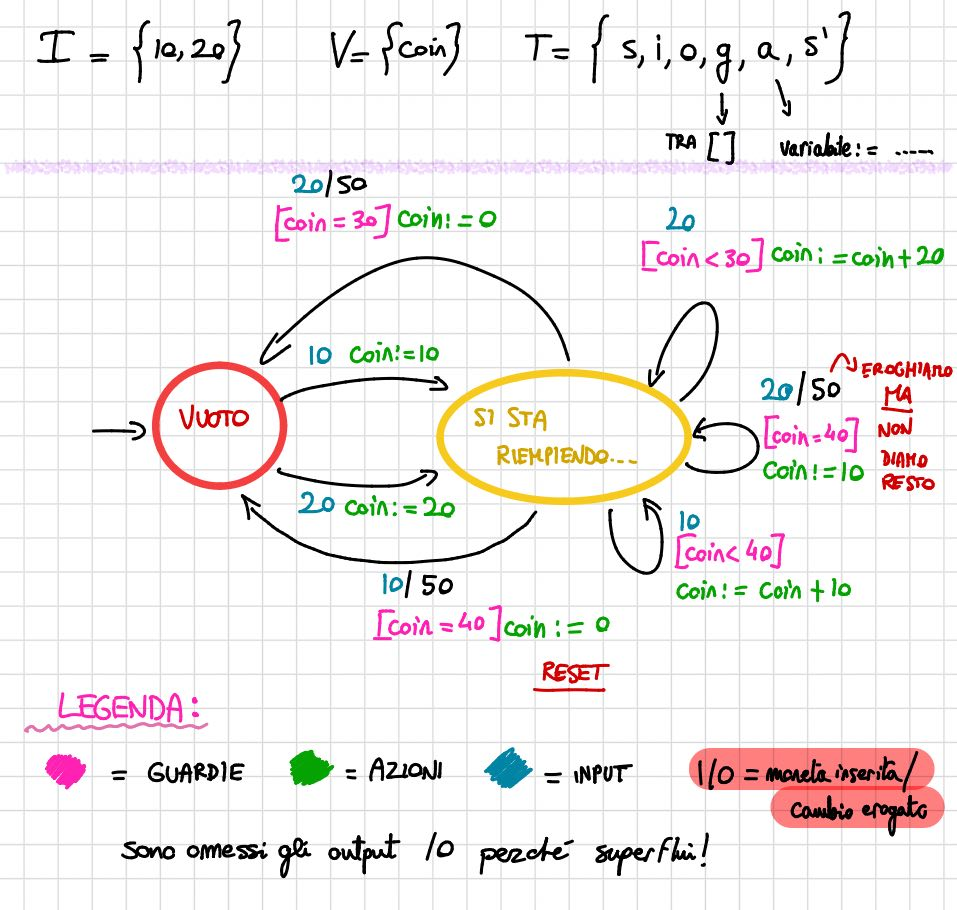

- **Trasformazione EFSM → FSM I/O**: srotolando il grafo di raggiungibilità della EFSM, si riottiene la FSM I/O originale. [p. 64]

### 13.3 Esercizi proposti

**Conto corrente bancario**: modellare il ciclo di vita di un conto in banca con eventi `deposit(m)` e `withdraw(m)`. Il prelievo è possibile finché il bilancio non scende sotto un certo `overdraft_limit`. Se si raggiunge tale limite, o se il bilancio resta negativo per più di 3 mesi, il conto viene "bloccato". [p. 66]

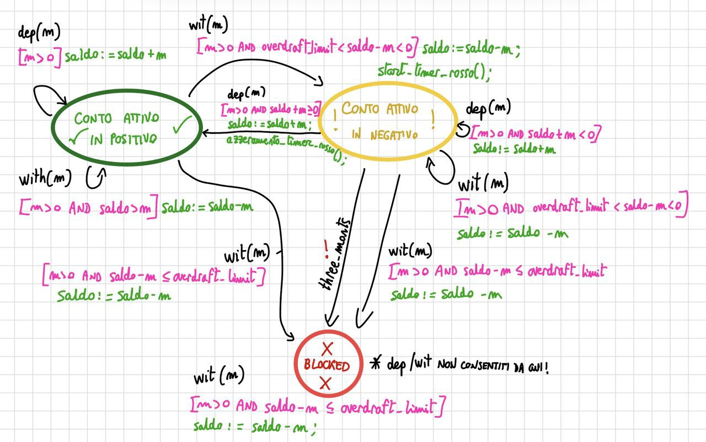

| Stato sorgente   | Evento         | Guardia                                                      | Azione                                                          | Stato destinazione |
| ---------------- | -------------- | ------------------------------------------------------------ | --------------------------------------------------------------- | ------------------ |
| `ActivePositive` | `deposit(m)`   | $m > 0$                                                      | $balance := balance + m$                                        | `ActivePositive`   |
| `ActivePositive` | `withdraw(m)`  | $m > 0 \land balance - m \geq 0$                             | $balance := balance - m$                                        | `ActivePositive`   |
| `ActivePositive` | `withdraw(m)`  | $m > 0 \land overdraft_limit < balance - m < 0$              | $balance := balance - m$ ; avvio conteggio tempo in rosso       | `ActiveNegative`   |
| `ActivePositive` | `withdraw(m)`  | $m > 0 \land balance - m \leq overdraft_limit$               | $balance := balance - m$                                        | `Blocked`          |
| `ActiveNegative` | `deposit(m)`   | $m > 0 \land balance + m \geq 0$                             | $balance := balance + m$ ; azzeramento conteggio tempo in rosso | `ActivePositive`   |
| `ActiveNegative` | `deposit(m)`   | $m > 0 \land balance + m < 0$                                | $balance := balance + m$                                        | `ActiveNegative`   |
| `ActiveNegative` | `withdraw(m)`  | $m > 0 \land overdraft_limit < balance - m < 0$              | $balance := balance - m$                                        | `ActiveNegative`   |
| `ActiveNegative` | `withdraw(m)`  | $m > 0 \land balance - m \leq overdraft_limit$               | $balance := balance - m$                                        | `Blocked`          |
| `ActiveNegative` | `three_months` | saldo negativo mantenuto ininterrottamente per più di 3 mesi | nessuna oppure blocco amministrativo                            | `Blocked`          |
| `Blocked`        | `deposit(m)`   | $m > 0$                                                      | nessuna operazione ammessa oppure operazione rifiutata          | `Blocked`          |
| `Blocked`        | `withdraw(m)`  | $m > 0$                                                      | nessuna operazione ammessa oppure operazione rifiutata          | `Blocked`          |

---

**Coda (Queue)**: modellare una struttura dati "queue" con operazioni `insert_rear` e `delete_front`. Una variabile `size` rappresenta la lunghezza effettiva: vale $0$ quando la coda è vuota e $k$ (costante) quando è piena. [p. 67]

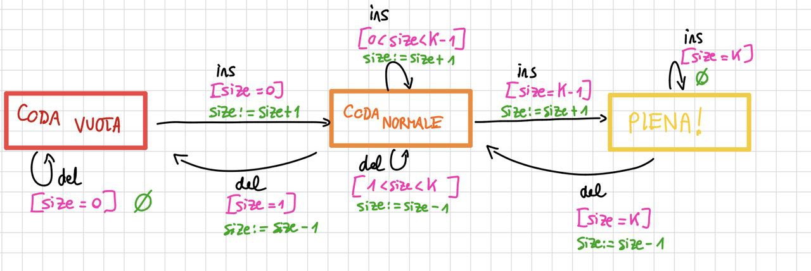

| Stato sorgente | Evento         | Guardia          | Azione                    | Stato destinazione |
| -------------- | -------------- | ---------------- | ------------------------- | ------------------ |
| `Empty`        | `insert_rear`  | $size = 0$       | $size := size + 1$        | `Normal`           |
| `Empty`        | `delete_front` | $size = 0$       | operazione non consentita | `Empty`            |
| `Normal`       | `insert_rear`  | $0 < size < k-1$ | $size := size + 1$        | `Normal`           |
| `Normal`       | `insert_rear`  | $size = k-1$     | $size := size + 1$        | `Full`             |
| `Normal`       | `delete_front` | $1 < size < k$   | $size := size - 1$        | `Normal`           |
| `Normal`       | `delete_front` | $size = 1$       | $size := size - 1$        | `Empty`            |
| `Full`         | `insert_rear`  | $size = k$       | operazione non consentita | `Full`             |
| `Full`         | `delete_front` | $size = k$       | $size := size - 1$        | `Normal`           |

---

**Distributore di bevande**: un distributore automatico consente l'acquisto tramite chiavetta pre-pagata. L'utente seleziona la bevanda digitandone il codice. Se non disponibile, il display mostra un messaggio. Se disponibile, viene mostrato il costo. Se la chiavetta è inserita entro 1 minuto e ha saldo sufficiente, il costo viene sottratto e la bevanda erogata. Se il saldo è insufficiente, viene mostrato un messaggio di errore. Se l'utente non inserisce la chiavetta entro il timeout, la scelta viene annullata. [p. 68]

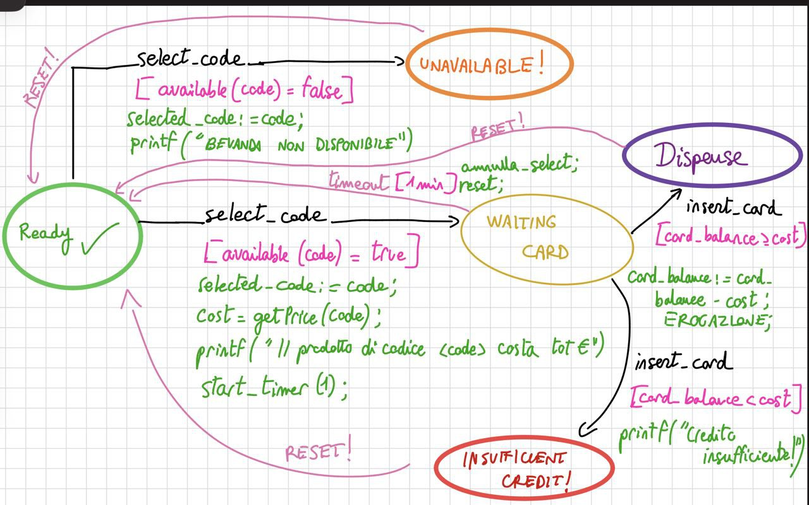

| Stato sorgente       | Evento         | Guardia                                        | Azione                                                                                      | Stato destinazione   |
| -------------------- | -------------- | ---------------------------------------------- | ------------------------------------------------------------------------------------------- | -------------------- |
| `Ready`              | `select(code)` | $available(code) = false$                      | $selected\_code := code$; visualizza messaggio "bevanda non disponibile"                    | `Unavailable`        |
| `Ready`              | `select(code)` | $available(code) = true$                       | $selected\_code := code$; $cost := price(code)$; visualizza $cost$; avvia timer di 1 minuto | `WaitingCard`        |
| `WaitingCard`        | `insert_card`  | $card\_balance \ge cost$                       | $card\_balance := card\_balance - cost$; eroga bevanda                                      | `Dispense`           |
| `WaitingCard`        | `insert_card`  | $card\_balance < cost$                         | visualizza messaggio "credito insufficiente"                                                | `InsufficientCredit` |
| `WaitingCard`        | `timeout`      | trascorso 1 minuto senza inserimento chiavetta | annulla selezione; reset variabili temporanee                                               | `Ready`              |
| `Unavailable`        | $\varepsilon$  | nessuna                                        | reset eventuali variabili temporanee                                                        | `Ready`              |
| `InsufficientCredit` | $\varepsilon$  | nessuna                                        | reset eventuali variabili temporanee                                                        | `Ready`              |
| `Dispense`           | $\varepsilon$  | nessuna                                        | reset eventuali variabili temporanee                                                        | `Ready`              |

> **Fine del Blocco 3** — [pp. 49–68] ✅

---

## 14. Il problema dell'esplosione degli stati

Con le FSM è possibile rappresentare solo un numero finito di stati. Quando si compongono diverse FSM, si incorre nel problema della **esplosione del numero di stati**: dato un insieme di FSM con $k_1, k_2, \ldots, k_n$ stati ciascuna, la loro composizione produce una FSM con $k_1 \times k_2 \times \ldots \times k_n$ stati. Questa crescita è **esponenziale** nel numero di FSM componenti, mentre sarebbe auspicabile una crescita **lineare** — ovvero $k_1 + k_2 + \ldots + k_n$ stati. [p. 71]

> [!example] Esempio: Produttore-Consumatore-Magazzino
> Un sistema composto da un produttore, un consumatore e un magazzino richiede, se modellato come singola FSM composta, un numero di stati pari al prodotto degli stati delle tre componenti. [pp. 72–73]

Sono già 2x2x3 = 12 stati!!!

Per superare questi limiti di composizionalità delle FSM, sono state definite estensioni (tra cui le *Statecharts* di UML) dotate dei concetti di **sottomacchina** e che permettono: **composizione sequenziale**, **composizione parallela** e **modularità**. [p. 74]

---

## 15. Communicating Finite State Machines (CFSM)

Alcuni sistemi possono essere modellati in maniera più semplice con un **insieme di FSM** che operano in modo **concorrente** ed interagiscono **scambiandosi messaggi**, piuttosto che con una singola FSM monolitica. Le CFSM sono particolarmente utilizzate per la specifica di **sistemi embedded** e **protocolli di comunicazione**. [p. 75]

> [!info] Definizione: CFSM
> Una CFSM è una coppia $(C,\, P)$ dove:
> - $C$ è un insieme finito di **canali** (*message queues*)
> - $P$ è un insieme finito di **processi**
>
> Ogni processo è una tupla $(S, I, O, T)$ con:
> - $S$: insieme finito di stati
> - $I$: insieme finito di input
> - $O$: insieme finito di output
> - $T$: insieme finito di transizioni, ciascuna della forma:
>   - $(s,\, \text{null},\, s')$ — transizione interna (senza comunicazione)
>   - $(s,\, c?i,\, s')$ — ricezione dell'input $i$ dal canale $c$
>   - $(s,\, c!o,\, s')$ — invio dell'output $o$ sul canale $c$ [p. 76]

### 15.1 Esempio: Produttore–Consumatore

Un produttore e un consumatore comunicano attraverso un unico canale $c$. [pp. 77–78]

**Producer** $(S, I, O, T)$:
- $S = \{\text{idle}, \text{busy}\}$, $I = \{\}$, $O = \{\text{ready}\}$
- $T = \{(\text{idle}, \text{null}, \text{busy}),\; (\text{busy}, c!\text{ready}, \text{idle})\}$

**Consumer** $(S', I', O', T')$:
- $S' = \{\text{idle}, \text{busy}\}$, $I' = \{\text{ready}\}$, $O' = \{\}$
- $T' = \{(\text{idle}, c?\text{ready}, \text{busy}),\; (\text{busy}, \text{null}, \text{idle})\}$

Il produttore alterna tra elaborazione interna (`idle → busy` con transizione `null`) e invio del messaggio `ready` sul canale $c$ (`busy → idle` con $c!\text{ready}$). Il consumatore attende il messaggio sul canale (`idle → busy` con $c?\text{ready}$) e poi esegue la sua computazione interna (`busy → idle` con `null`).

---

## 16. CFSM estese

Le CFSM possono essere estese con **variabili**, **guardie** e **azioni**, in modo analogo a come le FSM vengono estese in EFSM. [p. 79]

> [!info] Definizione: CFSM estesa
> Una CFSM estesa è una coppia $(C,\, P)$ dove ogni processo è una tupla $(S, I, O, V, T)$ e le transizioni hanno la forma:
> - $(s,\, g,\, a,\, s')$ — transizione interna con guardia $g$ e azione $a$
> - $(s,\, g,\, c?i,\, s')$ — ricezione condizionata
> - $(s,\, g,\, c!o,\, s')$ — invio condizionato
>
> dove $g$ è un predicato sulle variabili e $a$ è un assegnamento. [p. 79]

---

## 17. CFSM temporali

Le CFSM temporali estendono ulteriormente le CFSM estese aggiungendo **informazione temporale** alle transizioni. Le transizioni dei processi possono contenere un **intervallo temporale** $[t_1, t_2]$ che indica entro quanto tempo l'azione può avvenire dopo l'ingresso nello stato sorgente. [p. 80]

La forma delle transizioni diventa: $(s,\, g,\, a|I/O,\, s',\, [t_1, t_2])$, dove $[t_1, t_2]$ specifica i limiti temporali minimi e massimi per l'esecuzione. [p. 80]

---

## 18. Esercizi su CFSM

### 18.1 Producer/Consumer con buffer (CFSM estese)

Si modella un sistema produttore/consumatore con un **buffer di memoria**. Il buffer è un processo che interagisce con il produttore e il consumatore attraverso due canali (`deposit` e `remove`). Il buffer contiene una variabile vettoriale `buf` di capacità limitata da $0$ a $n-1$, usata come **buffer circolare**. La variabile `full` mantiene la lunghezza effettiva; due variabili `in` e `out` fungono da indici: `buf[in]` è l'elemento ricevuto dal produttore, `buf[out]` è l'elemento prodotto per il consumatore. Inizialmente $\text{in} = \text{out} = \text{full} = 0$. [pp. 81–82, 86]

### 18.2 Sistema di controllo sbarre ferroviarie (CFSM temporali)

Una linea tranviaria unidirezionale incrocia una strada. Si modellano **5 macchine**: `Train`, `Entering-Sensor`, `Leaving-Sensor`, `Gate` e `Controller`. Il controller, su segnalazione dell'Entering-Sensor, impiega da **2 a 3 tick** per inviare alla sbarra il segnale di abbassarsi. La sbarra impiega da **2 a 4 tick** per raggiungere la posizione `down`. Dopo il passaggio del treno, il Leaving-Sensor invia il segnale al controller, che impiega da **1 a 2 tick** per ordinare alla sbarra di rialzarsi. La sbarra impiega da **3 a 4 tick** per tornare in posizione `up`. [pp. 83–84]

### 18.3 Sistema di controllo di due sbarre (CFSM temporali)

Un sistema di controllo è costituito da due sbarre collegate a un computer. Il funzionamento segue un ciclo fisso di quattro fasi: **fase 1** (50 s) — entrambe le sbarre in `DOWN`; **fase 2** (100 s) — una sbarra in `UP`, l'altra in `DOWN`; **fase 3** (50 s) — entrambe nuovamente in `DOWN`; **fase 4** (100 s) — la sbarra che era in `UP` va a `DOWN` e viceversa. Il ciclo si ripete. [p. 87]

> **Fine del Blocco 4** — [pp. 69–87] ✅

---

## 19. Macchine di Stato UML

Le macchine di stato UML rappresentano uno dei diagrammi UML che consentono la **modellazione dinamica** del comportamento di un sistema. Ciascuna macchina di stato è associata a una **classe** e descrive il comportamento di un oggetto di quella classe. UML adotta la **notazione di Harel** (*Statecharts*). Graficamente, si tratta di un grafo i cui nodi rappresentano gli stati e i cui archi rappresentano le transizioni. [p. 90]

---

## 20. Stati

Uno stato rappresenta una **condizione di esistenza** dell'oggetto: un'attesa di un evento oppure l'esecuzione di certe azioni o attività. [p. 91]

All'interno di uno stato si distinguono: [p. 91]

- **Azioni**: operazioni **atomiche** e **non interrompibili**
  - `entry/azione` — eseguita entrando nello stato
  - `exit/azione` — eseguita uscendo dallo stato
- **Attività**: operazioni che richiedono un certo tempo
  - `do/attività` — attiva un **thread concorrente** che esegue finché l'attività è completata oppure una transizione di uscita viene abilitata [p. 95]

Il diagramma prevede inoltre uno **stato iniziale** (cerchio pieno) e uno **stato finale** (cerchio pieno racchiuso in un cerchio vuoto).

---

## 21. Transizioni

Una transizione indica un **passaggio di stato** ed è etichettata con: [p. 92]
- L'**evento** che causa il cambiamento di stato
- La **condizione** (*guardia*) sotto cui ha effetto
- Le **azioni** che l'oggetto esegue prima di cambiare stato

La sintassi dell'etichetta è: `evento [condizione] / azione`.

Una transizione scatta quando si verifica un evento — interno o esterno — e l'eventuale guardia sulla transizione è **vera**. In UML si assume che si verifica **una sola istanza di evento** alla volta e che l'istanza di un evento **non ha durata**. [p. 93]

---

## 22. Tipi di evento

UML definisce quattro tipi di evento: [p. 94]

| Tipo | Descrizione | Esempio |
|---|---|---|
| **Call event** | Invocazione di un'operazione propria o di un altro oggetto | `operazione(params)` |
| **Signal event** | Ricezione di un segnale da un altro oggetto | `<<signal>> e` |
| **Time event** | Intervallo temporale, data o clock | `after(10 sec)` |
| **Change event** | Cambiamento di valore di un'espressione booleana | `when(bilancio < 0)` |

Per il *change event*, l'espressione viene controllata quando variano i parametri coinvolti. [p. 94]

---

## 23. Ordine delle azioni (caso 1 — stati semplici)

Quando si effettua una transizione tra due stati semplici, l'ordine di esecuzione delle azioni è il seguente: [p. 96]

1. **Azioni `exit`** dello stato sorgente
2. **Azioni della transizione** stessa
3. **Azioni `entry`** dello stato target

> [!example] Esempio: Lampada On/Off
> Se si è in `LampOn` (con `exit/printf("exiting")`) e si riceve il segnale `off/printf("to off")` verso `LampOff` (con `entry/lamp.off()`), la sequenza è:
> `printf("exiting")` → `printf("to off")` → `lamp.off()` [p. 96]

---

## 24. Branching dinamico condizionale

Lo *choice pseudostate* permette il **branching dinamico condizionale**: le guardie vengono **valutate nell'istante** in cui il punto di decisione è raggiunto. Se più di una guardia è vera, viene selezionata **una transizione a caso** (*random*). Se **nessuna guardia** è vera, il modello è considerato **non corretto**. [p. 99]

> [!example] Esempio: Vendita con offerta
> Dallo stato `inVendita`, alla ricezione di `offerta(val)`:
> - Se $\text{val} < 100$: `/rigetta`
> - Se $100 \leq \text{val} < 200$: `/vende` → `VendutoMale`
> - Se $\text{val} \geq 200$: `/vende` → `VendutoBene` [p. 99]

---

## 25. Stati composti sequenziali

Uno stato può **contenere una macchina di stato** al suo interno, dando origine a uno **stato composto sequenziale**. La macchina annidata (*submachine*) funziona come una FSM all'interno di uno stato contenitore. [p. 101]

> [!example] Esempio: Lampada con flashing
> Lo stato `LampFlashing` contiene due sotto-stati: `FlashOn` (con `entry/lamp.on()`) e `FlashOff` (con `entry/lamp.off()`), collegati da transizioni `after(1 sec)` che alternano l'accensione e lo spegnimento. Lo stato `LampFlashing` è raggiungibile mediante il segnale `<<signal>>flash/` ed è possibile uscirne con `<<signal>>off/` (verso `LampOff`) o `<<signal>>on/` (verso `LampOn`). [p. 101]

### 25.1 Transizione di completamento

Una **transizione di completamento** è attivata da un **completion event**, che viene generato quando una macchina annidata termina oppure un'attività interna (`do/`) termina. Non richiede un evento esplicito: la sola terminazione della sotto-macchina fa scattare la transizione. [p. 103]

> [!example] Esempio: Commit
> Lo stato `Committing` contiene `Phase1` e `Phase2`. Quando la sotto-macchina termina (raggiungendo lo stato finale interno), si genera il completion event e la transizione porta automaticamente a `CommitDone` con `do/Act`. [p. 103]

### 25.2 Ordine delle azioni (caso 2 — stati composti)

Con stati composti, l'ordine di esecuzione delle azioni segue lo stesso approccio del caso 1, applicato ricorsivamente dalla macchina più interna a quella più esterna: [p. 104]

$$\text{exS11} \to \text{exS1} \to \text{actT} \to \text{enS2} \to \text{enS21}$$

Ovvero: prima le `exit` degli stati interni (dal più interno al più esterno), poi l'azione della transizione, poi le `entry` degli stati target (dal più esterno al più interno). [p. 104]

### 25.3 Regole di scatto (firing rules)

Quando due o più transizioni sono abilitate dallo **stesso evento** nello **stesso istante**, hanno la **precedenza le transizioni più interne**. Questo consente allo stato composto di "catturare" determinati eventi a un livello di dettaglio superiore rispetto alla transizione definita sullo stato contenitore. [p. 105]

---

## 26. Esercizi su macchine di stato UML

### 26.1 Settimana Seminario

Una società di formazione offre un seminario a settimana. Lo stato di prenotazione di una `SettimanaSeminario` può essere: `disponibile`, `prenotataProvvisoria` e `prenotataDefinitiva`. Alla creazione, lo stato è `disponibile`. Un cliente prenota con o senza anticipo: se versa un anticipo ottiene una prenotazione definitiva, altrimenti provvisoria. [p. 97]

### 26.2 Applet Java

Si modella il ciclo di vita di un'applet Java. I metodi gestiti dal browser sono: `init()` (caricamento), `start()` (avvio/ripresa da `stopped` a `running`), `stop()` (arresto), `destroy()` (rimozione). [p. 106]

### 26.3 Orologio digitale (UML)

L'orologio digitale (già modellato con FSM) viene ora descritto con una macchina di stato UML. Un interruttore ON/OFF accende e spegne l'orologio (all'accensione il display mostra `00:00`). Il tasto `set` entra in modalità di aggiustamento (display lampeggiante); i tasti `m` e `h` modificano minuti e ore; un secondo `set` riporta in modalità normale (display fisso). [p. 108]

### 26.4 ISPDialer

Un sistema `ISPDialer` può essere connesso, non connesso o in fase di connessione. Durante il tentativo: il modem va in `off-hook`, si attende il `dialtone` (timeout 20 s); se arriva, si esegue `dialISP` e si attende il `carrier` (timeout 20 s). Se il carrier arriva, il sistema è connesso e resta tale finché desidera. In caso di timeout o segnale `cancel`, il modem torna in `hook` e il sistema passa a non connesso. [p. 110]

> **Fine del Blocco 5** — [pp. 88–110] ✅

---

## 27. Stati History

Lo **stato History** ($H^*$) è un meccanismo che fornisce un **punto di ritorno** a stati gerarchici precedentemente visitati. Quando si rientra in uno stato composto che contiene un History, anziché ripartire dallo stato iniziale interno, la macchina riprende dall'ultimo sotto-stato in cui si trovava prima dell'uscita. [p. 111]

> [!example] Esempio: Diagnosi
> Uno stato `InDiagnosi` contiene due sotto-macchine (`Diagnostica1` con `Step11`, `Step12` e `Diagnostica2` con `Step21`, `Step22`). Una transizione `sospendi/` esce dallo stato; la transizione `riprendi/` rientra tramite il punto $H^*$, ripristinando l'ultimo sotto-stato attivo. [p. 111]

> [!example] Esempio: Montacarichi con History
> Un montacarichi si muove su tre piani (`top`, `middle`, `low`) in base a un sensore. Ha un tasto per aprire le porte (se fermo) e un tasto di emergenza che attiva una sirena e mette il sistema "fuori servizio". Al ripristino, il montacarichi riparte dall'**ultima configurazione** lasciata grazie allo stato History. [pp. 112–113]

---

## 28. Stati composti paralleli

Uno stato può contenere **più regioni ortogonali** che osservano lo stesso evento e reagiscono ad esso **simultaneamente**. Le regioni parallele sono separate graficamente da linee tratteggiate all'interno dello stato composto. [p. 114]

---

## 29. Interazione e sincronizzazione tra diagrammi

### 29.1 Sincronizzazione tramite eventi/azioni

La sincronizzazione tra diagrammi in regioni parallele avviene principalmente tramite il meccanismo **eventi/azioni**: le azioni in un componente diventano **eventi** a cui altri componenti devono (o possono) reagire, interpretandoli come *call event*. [p. 115]

### 29.2 Synch state

Gli **stati di sincronizzazione** (*synch state*, indicati con `*`) consentono di coordinare sotto-macchine in regioni parallele. Un'attività in una regione non può procedere oltre il punto di sincronizzazione finché l'attività corrispondente nell'altra regione non ha raggiunto il proprio punto di sync. [p. 116]

> [!example] Esempio: Costruzione di un edificio
> Due regioni parallele — `Ispezione/Fondazioni/Costruzione struttura/Tetto` e `Installazione elettrica (fondamenta/interna/esterna)` — usano synch state per garantire che l'elettricità nelle fondamenta sia installata prima di costruire le mura, e che le mura siano completate prima dell'installazione elettrica interna. [p. 116]

### 29.3 Esempio: Telecomando (TV + VCR)

Una macchina di stato composta modella un **telecomando** che può controllare una televisione (in modalità `ControlloTV`) e un videoregistratore (in modalità `ControlloVCR`). Premendo `Press-Power` in modalità `ControlloTV`, la televisione si accende; in modalità `ControlloVCR`, il videoregistratore si accende. [pp. 117–118]

---

## 30. Esercizi su macchine di stato UML composte

### 30.1 Computer / Telepass / Sbarra

Si modella un sistema di pagamento tramite Telepass al casello autostradale. All'arrivo di un'auto (rilevata da un sensore), un computer invia al sistema Telepass la targa e l'importo. Il Telepass effettua i controlli e risponde con accettazione o rifiuto. In caso di rifiuto, il computer mostra un messaggio sul display; in caso di accettazione, comanda l'apertura della sbarra, che si richiude automaticamente dopo un minuto. [pp. 119–120]

### 30.2 Montacarichi con Controllore (componenti)

Un sistema composto da un **Controllore** e un **Elevatore** (tre posizioni: `Low`, `Middle`, `Top`). Il controllore gestisce i comandi dai pulsanti esterni e interni, inviando istruzioni di spostamento all'elevatore. All'attivazione del pulsante di apertura porte, il controllore invia il comando corrispondente. In caso di emergenza, il sistema va in `Fuori Servizio` con sirena attivata. [p. 121]

### 30.3 Lavatrice comandata via App

Il sistema è composto da App e Lavatrice con due modalità: funzionamento **normale** e **manutenzione**. In modalità normale è possibile attivare/mettere in pausa il lavaggio e attivare/disattivare la centrifuga. Al termine, la lavatrice emette un segnale acustico. In manutenzione, vengono eseguiti in parallelo il controllo degli attuatori e quello dei sensori; terminato il controllo, si torna in modalità normale. [p. 122]

### 30.4 Metropolitana (porte)

L'apertura e chiusura delle porte è controllata da due sensori (`arrived`, `pass_person`) e un controller. Su segnalazione di `arrived`, il controller impiega da **1 a 3 tick** per aprire le porte. Le porte impiegano da **2 a 4 tick** per raggiungere la posizione `open`. Dopo un minuto, il controller comanda la chiusura (2–4 tick). Se il sensore `pass_person` rileva una persona durante la chiusura, la porta si riapre completamente e il controller ricomanda la chiusura. [p. 123]

### 30.5 Annaffiatoio automatico

Un sistema composto da controllore e annaffiatoio. In modalità **inverno**: erogazione ogni 12 ore per 15 minuti. In modalità **estate**: ogni 8 ore per 30 minuti. Un sensore di umidità può sospendere l'erogazione (segnale alto) o estenderla di 5 minuti (segnale basso). La sincronizzazione avviene tramite meccanismo eventi/azioni. [p. 124]

---

## 31. Caso di studio: Tornello della metro

Il caso di studio finale ripercorre la modellazione incrementale del comportamento di un **tornello** di una metropolitana, partendo da un modello semplice e arricchendolo progressivamente. [p. 126]

### 31.1 Comportamento base

Il tornello può essere **bloccato** (`locked`) o **sbloccato** (`unlocked`). Quando è bloccato, inserendo una moneta nello slot il tornello si sblocca. Quando la persona passa, il tornello si blocca nuovamente. [p. 126]

### 31.2 Comportamenti anomali

Due casi anomali vengono considerati: [p. 127]
1. Una persona tenta di passare **senza inserire** la moneta → si attiva il **sistema di allarme**
2. Una persona inserisce una moneta quando il tornello è **già sbloccato** (qualcun altro ha già pagato)

### 31.3 Gestione dell'allarme

In caso di allarme, il sistema passa in una condizione di **violazione** e vi rimane finché il sistema non viene **ripristinato** e l'allarme spento. [p. 128]

### 31.4 Manutenzione

Quando è necessaria la manutenzione, il sistema deve essere **disattivato** e passa in uno **stato di diagnosi**, **congelando** lo stato corrente (grazie allo stato History). [p. 129]

### 31.5 Diagnostica

Durante la fase di diagnostica, i tecnici controllano i **sensori** e tutte le **funzionalità** del dispositivo. Lo stato `InDiagnosi` contiene sotto-macchine per `Diagnostica1` e `Diagnostica2`, ciascuna con i propri step. [p. 130]

### 31.6 Ripristino del sistema

Terminata la fase di diagnostica, il dispositivo viene riattivato in **due modi**: [p. 131]

> [!abstract] Modalità di ripristino
> 1. **Reset**: il sistema viene posto in stato `locked` con allarme spento e luce di cortesia spenta.
> 2. **Ripristino della configurazione**: il sistema torna alla configurazione che aveva al momento dell'ingresso in fase di diagnostica (tramite stato History $H^*$). [pp. 131–132]

---

> **Fine del Blocco 6** — [pp. 111–132] ✅
> **Lezione 3–4–5 completata.** Tutti i 132 slide sono stati trascritti.
